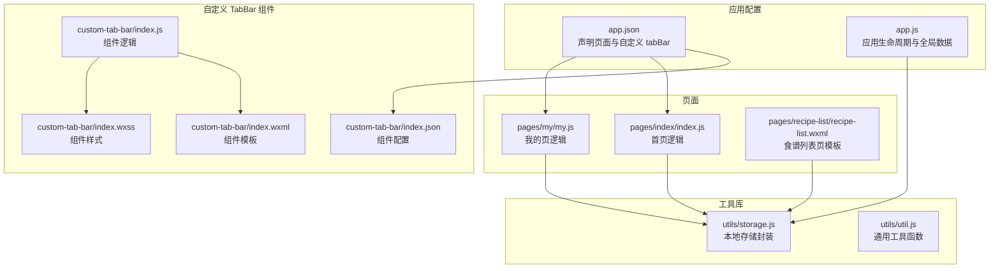
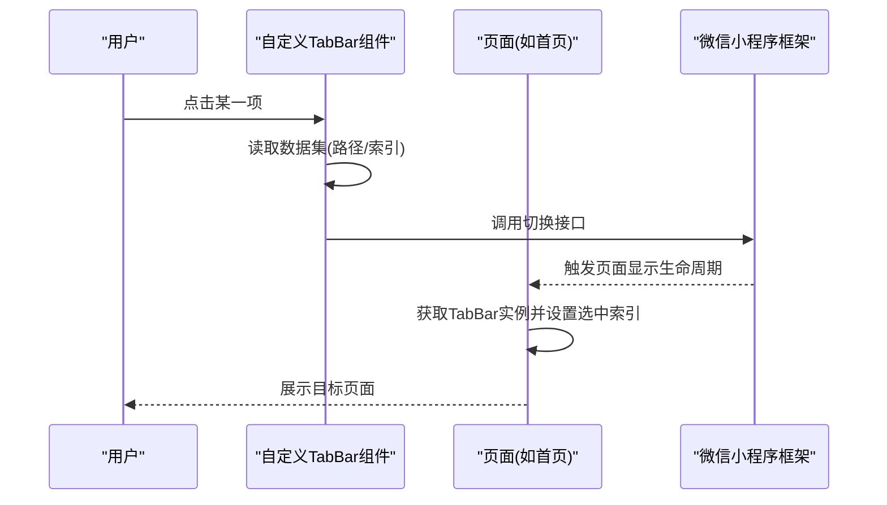
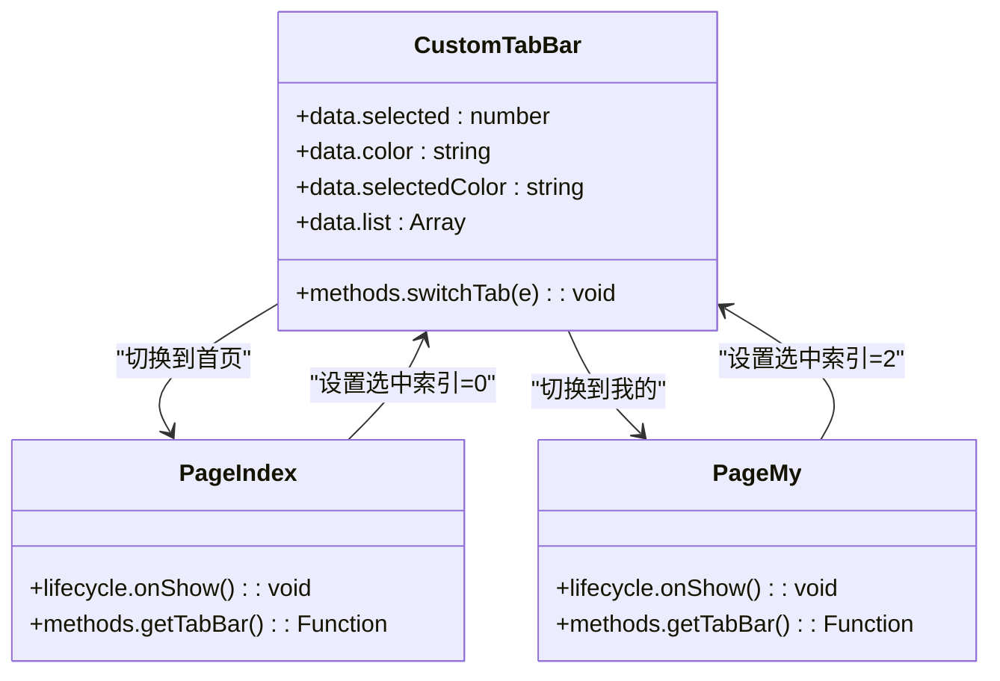
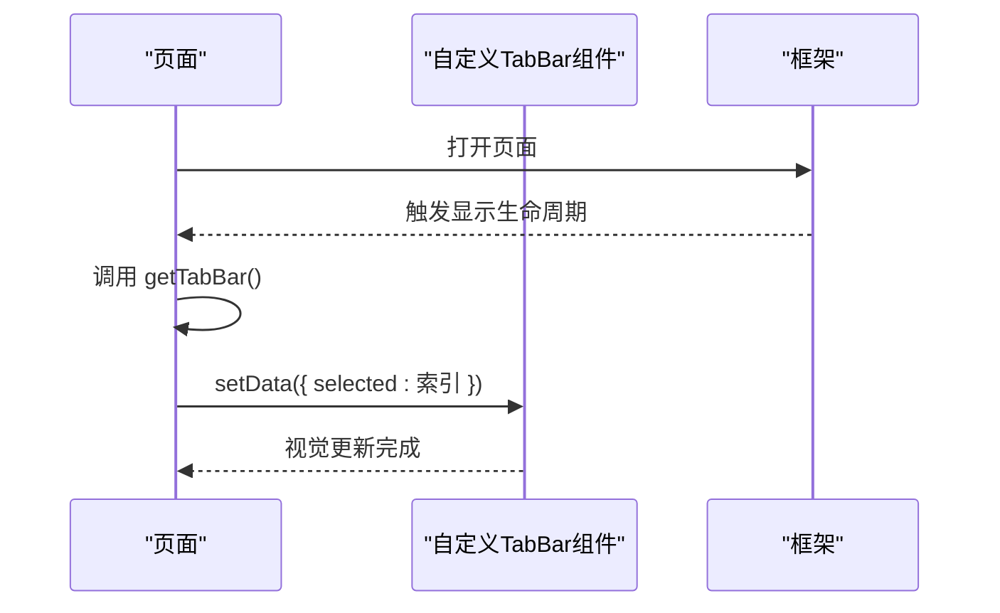
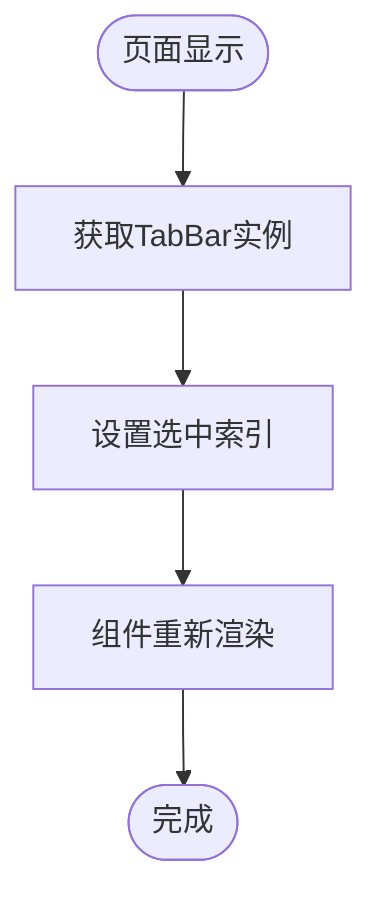
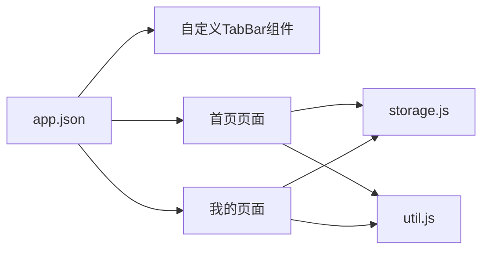

# UI组件系统

<cite>
**本文引用的文件**
- [custom-tab-bar/index.js](file://custom-tab-bar/index.js)
- [custom-tab-bar/index.json](file://custom-tab-bar/index.json)
- [custom-tab-bar/index.wxml](file://custom-tab-bar/index.wxml)
- [custom-tab-bar/index.wxss](file://custom-tab-bar/index.wxss)
- [app.js](file://app.js)
- [app.json](file://app.json)
- [pages/index/index.js](file://pages/index/index.js)
- [pages/index/index.wxml](file://pages/index/index.wxml)
- [pages/index/index.wxss](file://pages/index/index.wxss)
- [pages/my/my.js](file://pages/my/my.js)
- [pages/my/my.wxml](file://pages/my/my.wxml)
- [pages/recipe-list/recipe-list.wxml](file://pages/recipe-list/recipe-list.wxml)
- [utils/storage.js](file://utils/storage.js)
- [utils/util.js](file://utils/util.js)
- [app.wxss](file://app.wxss)
</cite>

## 目录
1. [简介](#简介)
2. [项目结构](#项目结构)
3. [核心组件](#核心组件)
4. [架构总览](#架构总览)
5. [详细组件分析](#详细组件分析)
6. [依赖关系分析](#依赖关系分析)
7. [性能考虑](#性能考虑)
8. [故障排查指南](#故障排查指南)
9. [结论](#结论)
10. [附录](#附录)

## 简介
本文件聚焦 Old-baby 项目的 UI 组件系统，特别是自定义 TabBar 组件的设计与实现。内容涵盖组件结构、样式定义、交互逻辑、小程序组件系统使用方法与最佳实践、组件间通信与数据传递、复用与性能优化、以及响应式设计原则与用户体验提升建议。目标是帮助开发者构建高质量、可维护、可扩展的用户界面。

## 项目结构
项目采用“页面 + 组件 + 工具库”的分层组织方式：
- 自定义 TabBar 放置于 custom-tab-bar 目录，遵循小程序组件规范（wxml/wxss/js/json）。
- 页面位于 pages 目录，每个页面包含对应的 js、json、wxml、wxss 文件。
- 工具库位于 utils 目录，提供存储、通用工具等能力。
- 全局样式在 app.wxss 中定义，页面样式按需覆盖。

图表来源
- [app.json](file://app.json#L1-L41)
- [app.js](file://app.js#L1-L21)
- [custom-tab-bar/index.js](file://custom-tab-bar/index.js#L1-L32)
- [custom-tab-bar/index.wxml](file://custom-tab-bar/index.wxml#L1-L14)
- [custom-tab-bar/index.wxss](file://custom-tab-bar/index.wxss#L1-L36)
- [custom-tab-bar/index.json](file://custom-tab-bar/index.json#L1-L4)
- [pages/index/index.js](file://pages/index/index.js#L1-L80)
- [pages/my/my.js](file://pages/my/my.js#L1-L113)
- [pages/recipe-list/recipe-list.wxml](file://pages/recipe-list/recipe-list.wxml#L1-L112)
- [utils/storage.js](file://utils/storage.js#L1-L155)
- [utils/util.js](file://utils/util.js#L1-L123)

章节来源
- [app.json](file://app.json#L1-L41)
- [app.js](file://app.js#L1-L21)

## 核心组件
本项目的核心 UI 组件为自定义 TabBar，其职责包括：
- 展示底部导航项（图标、文字、路径）。
- 维护当前选中项状态，并根据选中状态切换样式。
- 处理点击事件，调用小程序 API 切换到对应页面。

组件关键点：
- 数据模型：包含默认选中索引、颜色、导航列表。
- 事件处理：通过事件绑定获取目标数据，调用切换接口。
- 样式：固定定位、弹性布局、过渡动画、安全区适配。

章节来源
- [custom-tab-bar/index.js](file://custom-tab-bar/index.js#L1-L32)
- [custom-tab-bar/index.wxml](file://custom-tab-bar/index.wxml#L1-L14)
- [custom-tab-bar/index.wxss](file://custom-tab-bar/index.wxss#L1-L36)
- [custom-tab-bar/index.json](file://custom-tab-bar/index.json#L1-L4)

## 架构总览
自定义 TabBar 与页面之间的交互流程如下：

图表来源
- [custom-tab-bar/index.wxml](file://custom-tab-bar/index.wxml#L6-L8)
- [custom-tab-bar/index.js](file://custom-tab-bar/index.js#L24-L30)
- [pages/index/index.js](file://pages/index/index.js#L15-L23)
- [pages/my/my.js](file://pages/my/my.js#L16-L22)

## 详细组件分析

### 自定义 TabBar 组件
- 结构组成：容器视图、循环渲染导航项、图标与文本、点击事件绑定。
- 样式要点：固定定位、弹性布局、选中态样式、过渡效果、安全区内边距。
- 交互逻辑：点击时从数据集中读取路径，调用切换接口；页面 onShow 时主动设置选中索引以保持一致状态。

图表来源
- [custom-tab-bar/index.js](file://custom-tab-bar/index.js#L1-L32)
- [pages/index/index.js](file://pages/index/index.js#L15-L23)
- [pages/my/my.js](file://pages/my/my.js#L16-L22)

章节来源
- [custom-tab-bar/index.js](file://custom-tab-bar/index.js#L1-L32)
- [custom-tab-bar/index.wxml](file://custom-tab-bar/index.wxml#L1-L14)
- [custom-tab-bar/index.wxss](file://custom-tab-bar/index.wxss#L1-L36)
- [pages/index/index.js](file://pages/index/index.js#L15-L23)
- [pages/my/my.js](file://pages/my/my.js#L16-L22)

### 页面与 TabBar 的通信机制
- 页面通过 getTabBar() 获取组件实例，并调用 setData 设置选中索引，确保视觉状态与实际页面一致。
- 切换动作由 TabBar 内部触发，页面无需直接参与切换逻辑，仅负责同步选中状态。

图表来源
- [pages/index/index.js](file://pages/index/index.js#L15-L23)
- [pages/my/my.js](file://pages/my/my.js#L16-L22)
- [custom-tab-bar/index.js](file://custom-tab-bar/index.js#L24-L30)

章节来源
- [pages/index/index.js](file://pages/index/index.js#L15-L23)
- [pages/my/my.js](file://pages/my/my.js#L16-L22)

### 数据传递与状态管理
- 导航列表与颜色等基础配置来自组件内部数据与 app.json 的 tabBar 配置共同决定。
- 页面状态（如当前选中项）通过页面 onShow 时的实例调用进行同步。
- 全局数据（如用户信息、宠物列表）通过工具库进行统一管理。

图表来源
- [pages/index/index.js](file://pages/index/index.js#L15-L23)
- [pages/my/my.js](file://pages/my/my.js#L16-L22)
- [custom-tab-bar/index.js](file://custom-tab-bar/index.js#L24-L30)

章节来源
- [utils/storage.js](file://utils/storage.js#L1-L155)
- [app.js](file://app.js#L1-L21)

## 依赖关系分析
- 自定义 TabBar 作为独立组件，依赖于页面生命周期与框架提供的切换接口。
- 页面依赖工具库进行数据持久化与通用工具调用。
- app.json 声明页面与自定义 TabBar，决定整体导航结构。

图表来源
- [app.json](file://app.json#L1-L41)
- [custom-tab-bar/index.js](file://custom-tab-bar/index.js#L1-L32)
- [pages/index/index.js](file://pages/index/index.js#L1-L80)
- [pages/my/my.js](file://pages/my/my.js#L1-L113)
- [utils/storage.js](file://utils/storage.js#L1-L155)
- [utils/util.js](file://utils/util.js#L1-L123)

章节来源
- [app.json](file://app.json#L1-L41)

## 性能考虑
- 避免在 TabBar 中进行复杂计算或频繁 setData，保持渲染轻量化。
- 使用 rpx 单位与弹性布局，减少重排与重绘。
- 在页面 onShow 中仅做必要的状态同步，避免重复设置。
- 对长列表或复杂页面，结合分页、懒加载与节流策略（工具库提供防抖函数）降低卡顿风险。
- 合理使用过渡动画，控制动画时长与属性，避免过度消耗性能。

## 故障排查指南
- 选中态不生效：检查页面 onShow 是否正确调用 getTabBar 并设置 selected。
- 切换无效：确认事件绑定的数据集字段与组件读取一致，且路径与 app.json 声明一致。
- 样式异常：检查 rpx 单位与弹性布局是否正确，注意安全区适配。
- 数据不同步：确认工具库存储接口调用成功，必要时增加错误日志与回退逻辑。

章节来源
- [pages/index/index.js](file://pages/index/index.js#L15-L23)
- [pages/my/my.js](file://pages/my/my.js#L16-L22)
- [custom-tab-bar/index.wxml](file://custom-tab-bar/index.wxml#L6-L8)
- [custom-tab-bar/index.js](file://custom-tab-bar/index.js#L24-L30)
- [utils/util.js](file://utils/util.js#L58-L67)

## 结论
自定义 TabBar 组件通过清晰的数据与事件分离、简洁的样式与交互，实现了稳定可靠的底部导航体验。配合页面 onShow 的状态同步、工具库的数据管理与全局样式体系，项目形成了高内聚、低耦合的 UI 组件系统。建议在后续迭代中持续关注性能优化与可访问性，进一步提升用户体验。

## 附录
- 组件开发规范建议
  - 组件内部状态尽量内聚，避免跨组件共享复杂状态。
  - 事件回调中只做最小必要工作，避免阻塞主线程。
  - 使用 rpx、rem 等相对单位，确保多设备适配。
- 样式定制方法
  - 优先使用全局变量与主题色，统一风格。
  - 通过类名组合与条件样式实现动态状态展示。
- 响应式设计原则
  - 固定底部导航时，注意安全区 inset 的适配。
  - 图标与文字在不同屏幕尺寸下保持可读性与点击面积。
- 组件复用与扩展
  - 将通用交互抽离为 mixin 或工具函数，减少重复代码。
  - 通过配置化参数（如颜色、图标、文案）提升组件灵活性。