# 存储与推荐系统

<cite>
**本文档引用的文件**
- [app.js](file://app.js)
- [storage.js](file://utils/storage.js)
- [recommend.js](file://utils/recommend.js)
- [util.js](file://utils/util.js)
- [recipes.json](file://data/recipes.json)
- [diseases.json](file://data/diseases.json)
- [allergens.json](file://data/allergens.json)
- [breeds.json](file://data/breeds.json)
- [pet-profile.js](file://pages/pet-profile/pet-profile.js)
- [recipe-list.js](file://pages/recipe-list/recipe-list.js)
- [my.js](file://pages/my/my.js)
- [index.js](file://pages/index/index.js)
</cite>

## 目录
1. [简介](#简介)
2. [项目结构](#项目结构)
3. [核心组件](#核心组件)
4. [架构概览](#架构概览)
5. [详细组件分析](#详细组件分析)
6. [依赖关系分析](#依赖关系分析)
7. [性能考虑](#性能考虑)
8. [故障排除指南](#故障排除指南)
9. [结论](#结论)
10. [附录](#附录)

## 简介

Old-baby是一个专为老年犬主人设计的自制狗粮指南小程序，采用微信小程序框架开发。该项目实现了完整的宠物信息存储管理和智能食谱推荐系统，为用户提供个性化的老年犬护理解决方案。

系统的核心功能包括：
- **本地数据存储**：实现宠物信息的完整CRUD操作和状态管理
- **智能推荐算法**：基于宠物健康状况提供个性化食谱推荐
- **通用工具函数**：提供格式化、验证、交互等基础功能
- **数据驱动开发**：通过JSON数据文件实现灵活的内容管理

## 项目结构

项目采用模块化组织结构，主要分为以下几个层次：

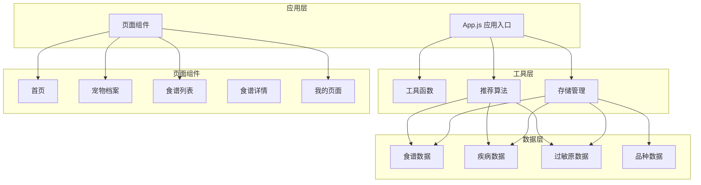

**图表来源**
- [app.js](file://app.js#L1-L21)
- [storage.js](file://utils/storage.js#L1-L155)
- [recommend.js](file://utils/recommend.js#L1-L109)

**章节来源**
- [app.js](file://app.js#L1-L21)
- [storage.js](file://utils/storage.js#L1-L155)
- [recommend.js](file://utils/recommend.js#L1-L109)

## 核心组件

### 数据存储系统

系统采用微信小程序的本地存储API实现数据持久化，支持以下核心功能：

- **宠物信息管理**：完整的CRUD操作
- **当前宠物状态**：记录用户当前选中的宠物
- **用户信息存储**：保存用户的基本信息
- **数据类型安全**：确保数据格式的一致性和完整性

### 智能推荐引擎

基于机器学习原理的食谱推荐算法，主要特征包括：

- **疾病匹配**：根据宠物的健康状况进行精准匹配
- **过敏原避免**：自动过滤宠物过敏的食物成分
- **难度筛选**：考虑制作复杂度的实用性
- **评分机制**：量化推荐结果的质量

### 通用工具库

提供开发中常用的基础功能：

- **时间格式化**：统一的时间显示格式
- **年龄描述**：根据年龄自动分类
- **营养计算**：基础代谢率和喂食量估算
- **UI交互**：加载提示、确认对话框等

**章节来源**
- [storage.js](file://utils/storage.js#L1-L155)
- [recommend.js](file://utils/recommend.js#L1-L109)
- [util.js](file://utils/util.js#L1-L123)

## 架构概览

系统采用分层架构设计，各层职责明确，耦合度低：

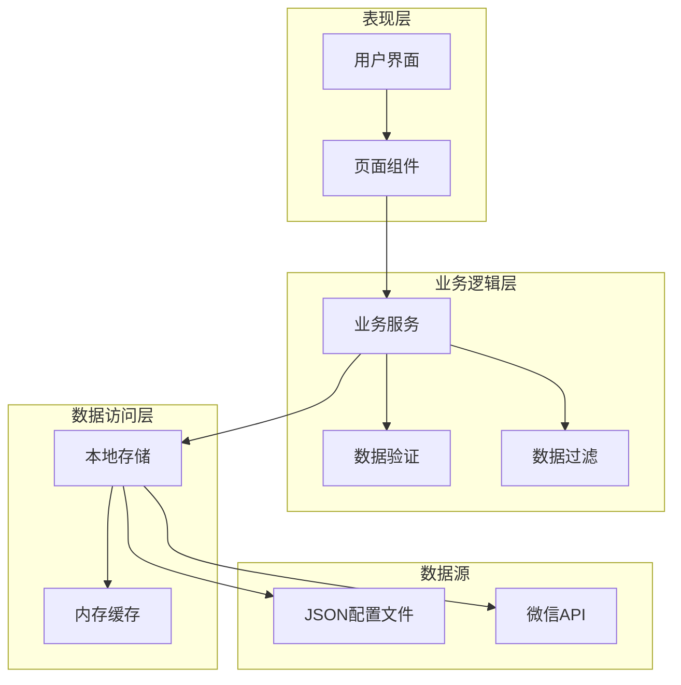

**图表来源**
- [storage.js](file://utils/storage.js#L1-L155)
- [recommend.js](file://utils/recommend.js#L1-L109)
- [util.js](file://utils/util.js#L1-L123)

### 数据流图

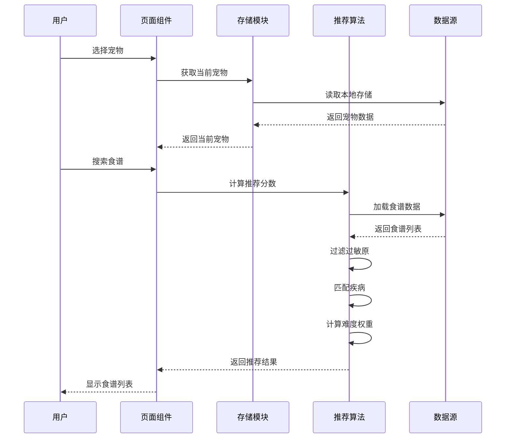

**图表来源**
- [recipe-list.js](file://pages/recipe-list/recipe-list.js#L30-L48)
- [recommend.js](file://utils/recommend.js#L10-L66)

## 详细组件分析

### 存储管理系统

#### 数据模型设计

系统采用扁平化数据结构，确保数据的可访问性和一致性：

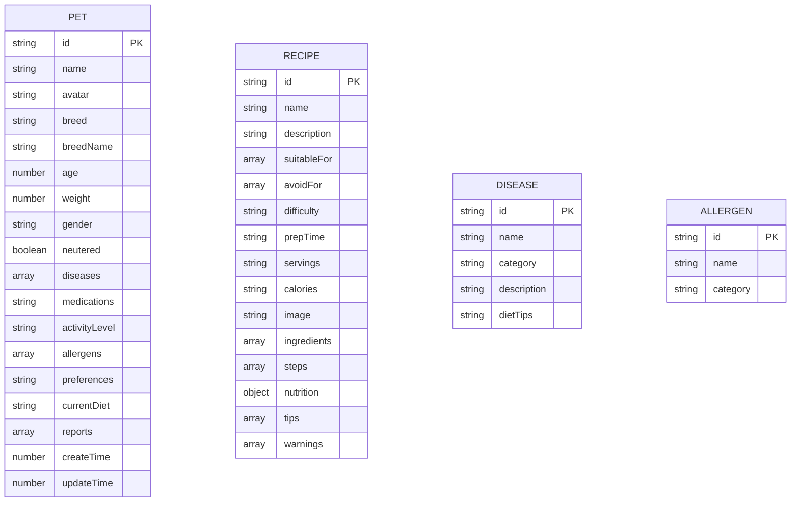

**图表来源**
- [storage.js](file://utils/storage.js#L52-L77)
- [recipes.json](file://data/recipes.json#L1-L515)
- [diseases.json](file://data/diseases.json#L1-L108)
- [allergens.json](file://data/allergens.json#L1-L15)

#### CRUD操作流程

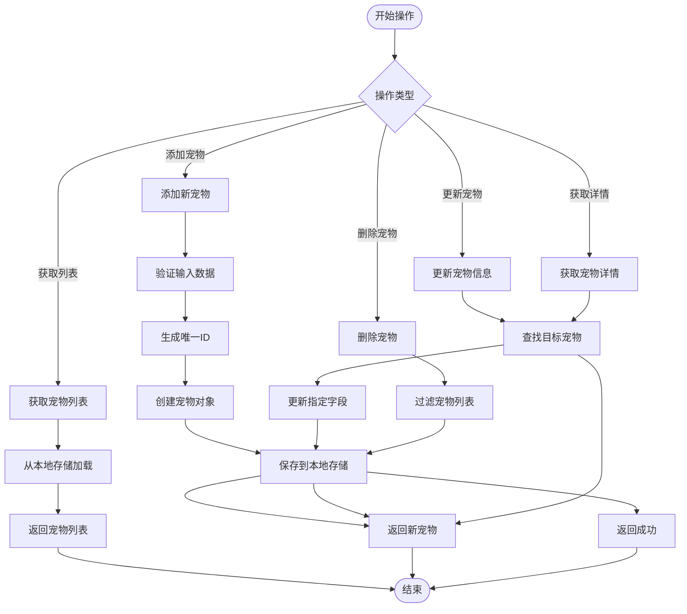

**图表来源**
- [storage.js](file://utils/storage.js#L19-L108)

#### 状态管理机制

系统通过全局状态管理实现跨页面的数据共享：

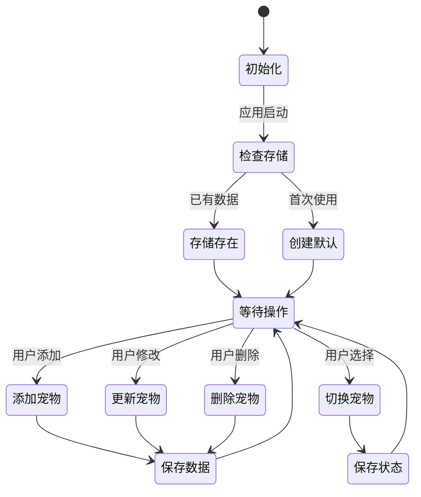

**图表来源**
- [app.js](file://app.js#L8-L14)
- [storage.js](file://utils/storage.js#L113-L140)

**章节来源**
- [storage.js](file://utils/storage.js#L1-L155)
- [app.js](file://app.js#L1-L21)

### 智能推荐算法

#### 推荐算法架构

推荐系统采用多因子评分机制，综合考虑多个维度：

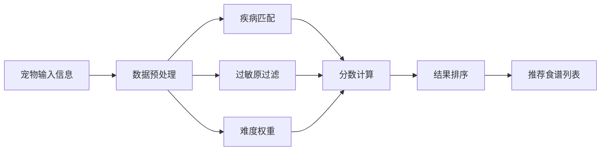

**图表来源**
- [recommend.js](file://utils/recommend.js#L10-L66)

#### 疾病匹配机制

算法通过精确匹配宠物的疾病标签来计算相关性分数：

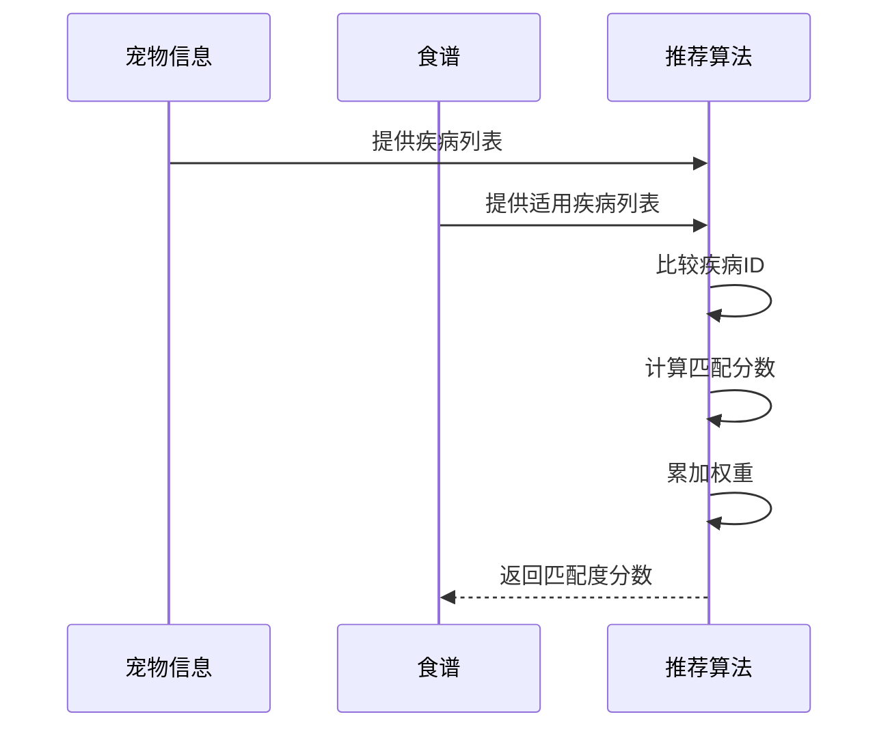

**图表来源**
- [recommend.js](file://utils/recommend.js#L32-L45)

#### 过敏原避免策略

系统采用严格的过敏原过滤机制：

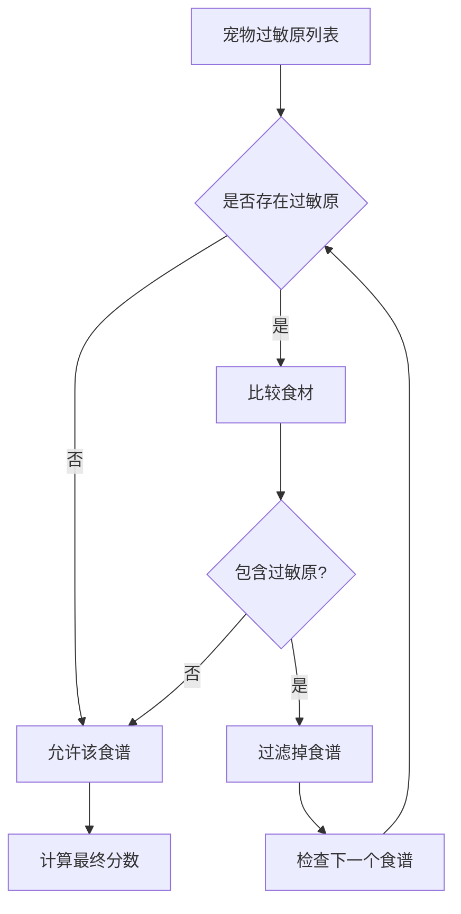

**图表来源**
- [recommend.js](file://utils/recommend.js#L24-L30)

#### 难度筛选机制

考虑到老年犬的特殊需求，系统优先推荐制作简单的食谱：

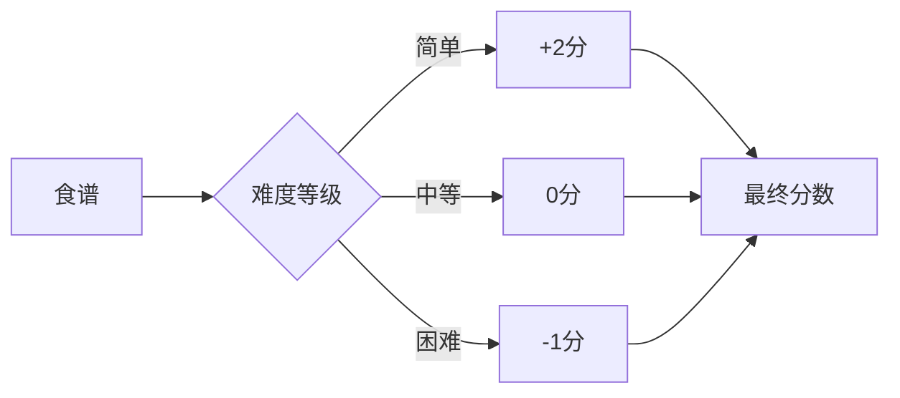

**图表来源**
- [recommend.js](file://utils/recommend.js#L47-L50)

**章节来源**
- [recommend.js](file://utils/recommend.js#L1-L109)
- [recipes.json](file://data/recipes.json#L1-L515)

### 通用工具函数

#### 时间处理工具

提供统一的时间格式化功能：

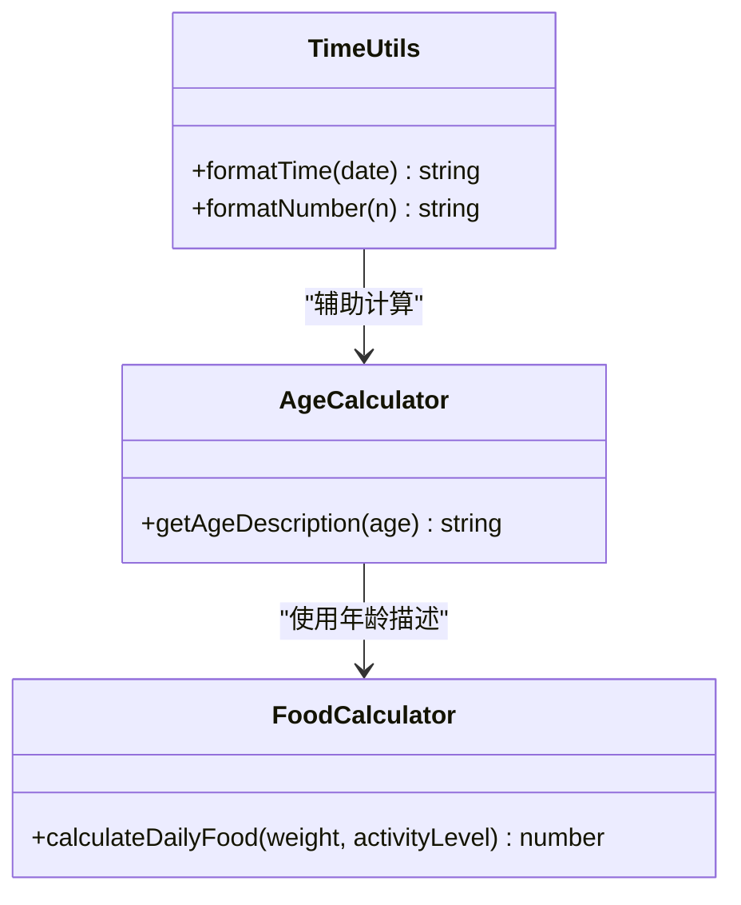

**图表来源**
- [util.js](file://utils/util.js#L6-L54)

#### UI交互工具

提供丰富的用户界面交互功能：

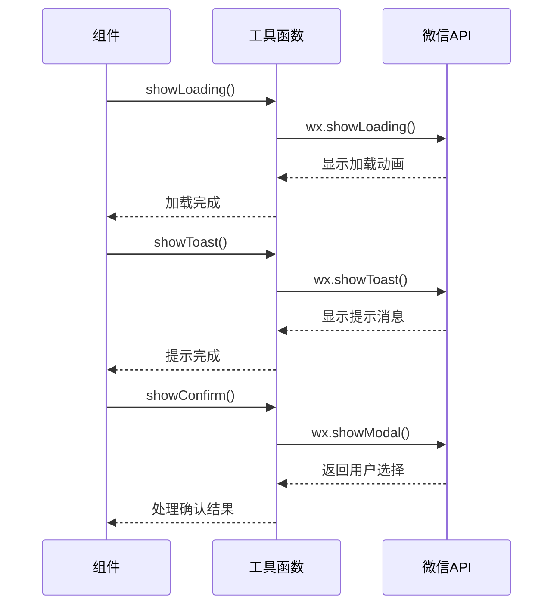

**图表来源**
- [util.js](file://utils/util.js#L72-L110)

**章节来源**
- [util.js](file://utils/util.js#L1-L123)

## 依赖关系分析

系统采用模块化设计，各组件间依赖关系清晰：

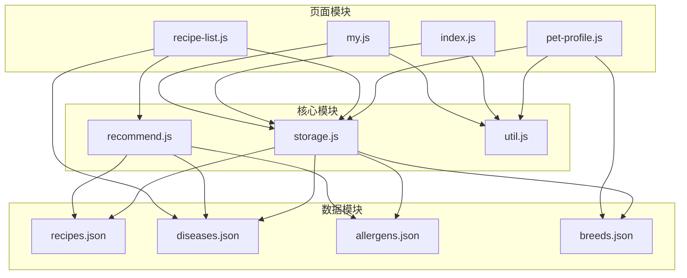

**图表来源**
- [storage.js](file://utils/storage.js#L1-L155)
- [recommend.js](file://utils/recommend.js#L1-L109)
- [util.js](file://utils/util.js#L1-L123)

### 数据依赖关系

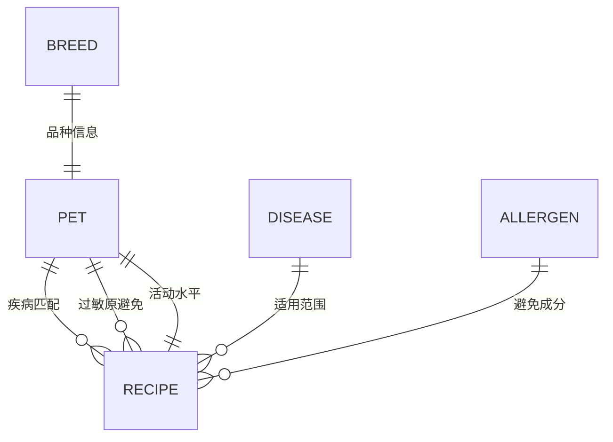

**图表来源**
- [storage.js](file://utils/storage.js#L67-L76)
- [recommend.js](file://utils/recommend.js#L32-L45)

**章节来源**
- [storage.js](file://utils/storage.js#L1-L155)
- [recommend.js](file://utils/recommend.js#L1-L109)

## 性能考虑

### 存储性能优化

1. **批量操作**：所有CRUD操作都通过批量处理减少存储调用次数
2. **内存缓存**：热门数据在内存中缓存，减少重复读取
3. **延迟加载**：非关键数据采用延迟加载策略

### 推荐算法优化

1. **索引优化**：使用数组索引快速查找疾病和过敏原
2. **早期过滤**：优先过滤明显不合适的食谱
3. **增量计算**：只对变化的数据重新计算分数

### 内存管理

1. **及时释放**：页面切换时及时清理不需要的数据
2. **数据压缩**：对大型数据结构进行压缩存储
3. **懒加载**：按需加载页面组件和数据

## 故障排除指南

### 常见问题及解决方案

#### 数据丢失问题

**问题现象**：宠物信息无法保存或丢失

**可能原因**：
- 本地存储空间不足
- 权限被拒绝
- 数据格式错误

**解决步骤**：
1. 检查设备存储空间
2. 重新授权存储权限
3. 验证数据格式正确性
4. 清理缓存后重试

#### 推荐结果异常

**问题现象**：食谱推荐不符合预期

**可能原因**：
- 疾病标签不匹配
- 过敏原数据缺失
- 推荐权重设置不当

**解决步骤**：
1. 检查宠物健康信息完整性
2. 验证过敏原列表准确性
3. 调整推荐参数
4. 清除推荐缓存

#### 页面加载缓慢

**问题现象**：页面响应速度慢

**可能原因**：
- 数据量过大
- 网络请求阻塞
- 组件渲染复杂

**解决步骤**：
1. 优化数据结构
2. 实现分页加载
3. 减少不必要的渲染
4. 使用虚拟滚动

**章节来源**
- [storage.js](file://utils/storage.js#L20-L38)
- [recommend.js](file://utils/recommend.js#L10-L66)

## 结论

Old-baby项目的存储管理和智能推荐系统展现了优秀的软件工程实践：

### 技术优势

1. **模块化设计**：清晰的分层架构便于维护和扩展
2. **数据驱动**：通过JSON配置实现灵活的内容管理
3. **用户体验**：简洁直观的操作界面和流畅的交互体验
4. **性能优化**：合理的缓存策略和异步处理机制

### 扩展建议

1. **数据库迁移**：考虑引入云数据库支持多设备同步
2. **AI增强**：集成机器学习算法提升推荐精度
3. **实时同步**：实现云端数据备份和恢复
4. **API接口**：提供标准化的RESTful API便于第三方集成

该项目为老年犬护理领域提供了一个完整、实用的数字化解决方案，体现了技术服务于健康的宗旨。

## 附录

### API接口规范

#### 存储管理API

| 接口 | 方法 | 参数 | 返回值 | 描述 |
|------|------|------|--------|------|
| getPets | GET | 无 | Array | 获取所有宠物列表 |
| getPetById | GET | id: string | Object | 根据ID获取宠物详情 |
| addPet | POST | petData: Object | Object | 添加新宠物 |
| updatePet | PUT | id: string, updateData: Object | Object | 更新宠物信息 |
| deletePet | DELETE | id: string | boolean | 删除指定宠物 |
| getCurrentPet | GET | 无 | Object | 获取当前选中宠物 |
| setCurrentPetId | POST | id: string | boolean | 设置当前宠物ID |

#### 推荐算法API

| 接口 | 方法 | 参数 | 返回值 | 描述 |
|------|------|------|--------|------|
| getRecommendedRecipes | GET | pet: Object | Array | 获取推荐食谱列表 |
| getAllRecipes | GET | 无 | Array | 获取所有食谱 |
| getRecipeById | GET | id: string | Object | 根据ID获取食谱详情 |
| getRecipesByDisease | GET | diseaseId: string | Array | 根据疾病获取食谱 |
| searchRecipes | GET | keyword: string | Array | 搜索食谱 |

### 错误处理机制

系统采用统一的错误处理策略：

1. **存储错误**：捕获存储异常并记录日志
2. **网络错误**：提供重试机制和降级策略
3. **数据验证**：实时验证用户输入的有效性
4. **异常恢复**：自动恢复到安全状态

### 最佳实践

1. **数据一致性**：确保所有操作的原子性和一致性
2. **性能监控**：持续监控系统性能指标
3. **用户反馈**：建立有效的用户反馈收集机制
4. **安全防护**：实施必要的数据安全和隐私保护措施