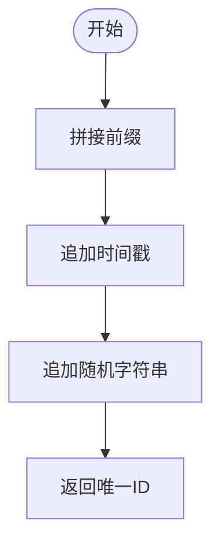

# 存储管理模块

<cite>
**本文引用的文件**
- [utils/storage.js](file://utils/storage.js)
- [app.js](file://app.js)
- [pages/pet-profile/pet-profile.js](file://pages/pet-profile/pet-profile.js)
- [pages/index/index.js](file://pages/index/index.js)
- [pages/health-info/health-info.js](file://pages/health-info/health-info.js)
- [pages/my/my.js](file://pages/my/my.js)
- [utils/util.js](file://utils/util.js)
- [utils/recommend.js](file://utils/recommend.js)
- [data/breeds.json](file://data/breeds.json)
- [data/diseases.json](file://data/diseases.json)
- [data/allergens.json](file://data/allergens.json)
</cite>

## 目录
1. [简介](#简介)
2. [项目结构](#项目结构)
3. [核心组件](#核心组件)
4. [架构总览](#架构总览)
5. [详细组件分析](#详细组件分析)
6. [依赖关系分析](#依赖关系分析)
7. [性能考量](#性能考量)
8. [故障排查指南](#故障排查指南)
9. [结论](#结论)
10. [附录](#附录)

## 简介
本文件系统性梳理 Old-baby 小程序的“存储管理模块”，聚焦本地数据存储的实现机制与最佳实践。内容涵盖：
- STORAGE_KEYS 常量定义与键空间规划
- 宠物信息的完整 CRUD 流程（查询、保存、新增、更新、删除）
- 数据持久化策略与状态管理
- generateId 唯一 ID 生成机制
- 数据模型设计与字段语义
- 错误处理策略与 API 规范
- 实际调用示例与最佳实践

## 项目结构
存储管理模块主要由以下部分组成：
- 工具层：utils/storage.js 提供统一的本地存储封装
- 页面层：各业务页面通过 storage.js 读写本地数据
- 数据层：breeds.json、diseases.json、allergens.json 提供静态字典数据
- 应用入口：app.js 在启动时进行基础初始化

图表来源
- [app.js](file://app.js#L1-L21)
- [utils/storage.js](file://utils/storage.js#L1-L155)
- [pages/index/index.js](file://pages/index/index.js#L1-L80)
- [pages/pet-profile/pet-profile.js](file://pages/pet-profile/pet-profile.js#L1-L216)
- [pages/health-info/health-info.js](file://pages/health-info/health-info.js#L1-L190)
- [pages/my/my.js](file://pages/my/my.js#L1-L113)
- [data/breeds.json](file://data/breeds.json#L1-L35)
- [data/diseases.json](file://data/diseases.json#L1-L108)
- [data/allergens.json](file://data/allergens.json#L1-L15)

章节来源
- [utils/storage.js](file://utils/storage.js#L1-L155)
- [app.js](file://app.js#L1-L21)

## 核心组件
- STORAGE_KEYS：集中定义本地存储键名，确保全局一致性
- generateId：基于时间戳与随机数的唯一 ID 生成策略
- getPets/savePets：批量读取/保存宠物列表
- getPetById/addPet/updatePet/deletePet：单条记录的 CRUD 操作
- getCurrentPetId/setCurrentPetId/getCurrentPet：当前选中宠物的状态管理

章节来源
- [utils/storage.js](file://utils/storage.js#L3-L154)

## 架构总览
存储模块采用“工具函数 + 页面调用”的分层设计：
- 工具层提供统一的存储 API，屏蔽 wx 对象差异
- 页面层仅负责业务逻辑与 UI 状态，不直接操作存储
- 字典数据以 JSON 文件形式注入，减少运行时网络请求

图表来源
- [utils/storage.js](file://utils/storage.js#L19-L108)
- [pages/pet-profile/pet-profile.js](file://pages/pet-profile/pet-profile.js#L47-L63)
- [pages/health-info/health-info.js](file://pages/health-info/health-info.js#L46-L60)
- [data/breeds.json](file://data/breeds.json#L1-L35)
- [data/diseases.json](file://data/diseases.json#L1-L108)

## 详细组件分析

### STORAGE_KEYS 常量定义
- PETS：宠物列表数组的存储键
- CURRENT_PET：当前选中宠物的 ID 存储键
- USER_INFO：用户信息存储键

这些键名在多个页面与工具函数中被复用，确保跨页面的一致性与可维护性。

章节来源
- [utils/storage.js](file://utils/storage.js#L3-L7)

### generateId 唯一 ID 生成机制
- 生成规则：前缀 + 时间戳 + 随机字符串，具备高冲突概率下的可区分性
- 适用场景：新增宠物时为每条记录分配唯一标识
- 复杂度：O(1)，无额外依赖

图表来源
- [utils/storage.js](file://utils/storage.js#L12-L14)

章节来源
- [utils/storage.js](file://utils/storage.js#L12-L14)

### getPets 与 savePets：批量读写
- getPets：从本地存储读取宠物数组；异常时返回空数组
- savePets：将宠物数组写入本地存储；异常时返回 false

图表来源
- [utils/storage.js](file://utils/storage.js#L19-L39)

章节来源
- [utils/storage.js](file://utils/storage.js#L19-L39)

### getPetById：按 ID 查询单条宠物
- 从全量列表中查找匹配 ID 的记录
- 未找到返回 null

章节来源
- [utils/storage.js](file://utils/storage.js#L44-L47)

### addPet：新增宠物
- 生成唯一 ID 与时间戳
- 填充基本信息、健康信息、饮食信息、体检报告等字段
- 写入本地存储并返回新记录

图表来源
- [utils/storage.js](file://utils/storage.js#L52-L81)

章节来源
- [utils/storage.js](file://utils/storage.js#L52-L81)

### updatePet：更新宠物
- 从全量列表中定位目标记录
- 合并更新字段并更新时间戳
- 写回本地存储，返回更新后的记录；未找到返回 null

章节来源
- [utils/storage.js](file://utils/storage.js#L86-L98)

### deletePet：删除宠物
- 过滤掉指定 ID 的记录
- 写回本地存储，返回 true

章节来源
- [utils/storage.js](file://utils/storage.js#L103-L108)

### 当前选中宠物状态管理
- getCurrentPetId/getCurrentPet：读取当前选中宠物 ID 及其完整信息
- setCurrentPetId：设置当前选中宠物 ID

图表来源
- [utils/storage.js](file://utils/storage.js#L113-L140)

章节来源
- [utils/storage.js](file://utils/storage.js#L113-L140)

### 数据模型设计
- 宠物对象字段概览（节选）：
  - 基本信息：id、name、avatar、breed、breedName、age、weight、gender、neutered、createTime、updateTime
  - 健康信息：diseases（疾病名称列表）、medications、activityLevel
  - 饮食信息：allergens（过敏原 ID 列表）、preferences、currentDiet
  - 体检报告：reports（图片路径与时间等元数据）

字段语义与来源：
- 字段来源于 addPet 的组装逻辑，以及页面表单与健康信息页的数据绑定
- 字典数据（品种、疾病、过敏原）在页面加载时注入，便于 UI 展示与选择

章节来源
- [utils/storage.js](file://utils/storage.js#L54-L77)
- [pages/pet-profile/pet-profile.js](file://pages/pet-profile/pet-profile.js#L164-L168)
- [pages/health-info/health-info.js](file://pages/health-info/health-info.js#L145-L161)
- [data/breeds.json](file://data/breeds.json#L1-L35)
- [data/diseases.json](file://data/diseases.json#L1-L108)
- [data/allergens.json](file://data/allergens.json#L1-L15)

### API 接口规范

- getPets
  - 功能：获取全部宠物列表
  - 参数：无
  - 返回：数组（默认空数组）
  - 异常：捕获存储异常并返回空数组
  - 使用场景：首页、我的页面展示宠物数量

- savePets(pets)
  - 功能：保存全部宠物列表
  - 参数：pets(Array) - 宠物数组
  - 返回：布尔值（true/false）
  - 异常：捕获存储异常并返回 false

- getPetById(petId)
  - 功能：按 ID 获取单个宠物
  - 参数：petId(String) - 宠物唯一标识
  - 返回：对象或 null

- addPet(petData)
  - 功能：新增宠物
  - 参数：petData(Object) - 新增数据（字段见“数据模型设计”）
  - 返回：新创建的宠物对象
  - 异常：内部已封装，调用方无需处理

- updatePet(petId, updateData)
  - 功能：更新宠物
  - 参数：petId(String)、updateData(Object) - 待更新字段
  - 返回：更新后的对象或 null（未找到）

- deletePet(petId)
  - 功能：删除宠物
  - 参数：petId(String)
  - 返回：布尔值（true）

- getCurrentPetId()
  - 功能：获取当前选中宠物 ID
  - 返回：ID 或 null

- setCurrentPetId(petId)
  - 功能：设置当前选中宠物 ID
  - 返回：布尔值（true/false）

- getCurrentPet()
  - 功能：获取当前选中宠物完整信息
  - 返回：对象或 null

章节来源
- [utils/storage.js](file://utils/storage.js#L19-L140)

### 错误处理策略
- 所有存储读写均包裹 try/catch，异常时：
  - 记录错误日志
  - 返回安全默认值（空数组、null、false）
- 页面层通过工具函数返回值判断操作成败，统一使用 util.js 的提示与确认弹窗

章节来源
- [utils/storage.js](file://utils/storage.js#L20-L38)
- [utils/util.js](file://utils/util.js#L72-L110)

### 使用方法与最佳实践
- 新增宠物
  - 页面收集表单数据后调用 addPet，随后调用 setCurrentPetId
  - 参考路径：[pages/pet-profile/pet-profile.js](file://pages/pet-profile/pet-profile.js#L173-L178)
- 更新宠物
  - 页面收集表单数据后调用 updatePet
  - 参考路径：[pages/health-info/health-info.js](file://pages/health-info/health-info.js#L165-L167)
- 删除宠物
  - 确认后调用 deletePet，并刷新页面数据
  - 参考路径：[pages/index/index.js](file://pages/index/index.js#L67-L78)
- 当前选中宠物
  - 通过 setCurrentPetId 切换，getCurrentPet 获取当前宠物信息
  - 参考路径：[pages/index/index.js](file://pages/index/index.js#L42-L46), [pages/recipe-list/recipe-list.js](file://pages/recipe-list/recipe-list.js#L31-L41)

章节来源
- [pages/pet-profile/pet-profile.js](file://pages/pet-profile/pet-profile.js#L145-L190)
- [pages/health-info/health-info.js](file://pages/health-info/health-info.js#L144-L177)
- [pages/index/index.js](file://pages/index/index.js#L40-L78)
- [pages/recipe-list/recipe-list.js](file://pages/recipe-list/recipe-list.js#L30-L48)

## 依赖关系分析
- 页面到存储工具：index、pet-profile、health-info、my 页面均依赖 storage.js
- 存储工具到微信本地存储：wx.getStorageSync / wx.setStorageSync
- 页面到字典数据：pet-profile 依赖 breeds.json；health-info 依赖 diseases.json、allergens.json
- 应用入口到存储工具：app.js 在启动时确保 pets 键存在

图表来源
- [pages/index/index.js](file://pages/index/index.js#L1-L80)
- [pages/pet-profile/pet-profile.js](file://pages/pet-profile/pet-profile.js#L1-L216)
- [pages/health-info/health-info.js](file://pages/health-info/health-info.js#L1-L190)
- [pages/my/my.js](file://pages/my/my.js#L1-L113)
- [utils/storage.js](file://utils/storage.js#L1-L155)
- [data/breeds.json](file://data/breeds.json#L1-L35)
- [data/diseases.json](file://data/diseases.json#L1-L108)
- [data/allergens.json](file://data/allergens.json#L1-L15)
- [app.js](file://app.js#L8-L14)

章节来源
- [utils/storage.js](file://utils/storage.js#L1-L155)
- [pages/index/index.js](file://pages/index/index.js#L1-L80)
- [pages/pet-profile/pet-profile.js](file://pages/pet-profile/pet-profile.js#L1-L216)
- [pages/health-info/health-info.js](file://pages/health-info/health-info.js#L1-L190)
- [pages/my/my.js](file://pages/my/my.js#L1-L113)
- [data/breeds.json](file://data/breeds.json#L1-L35)
- [data/diseases.json](file://data/diseases.json#L1-L108)
- [data/allergens.json](file://data/allergens.json#L1-L15)
- [app.js](file://app.js#L8-L14)

## 性能考量
- 本地存储读写为同步 API，频繁调用需注意避免阻塞主线程
- 建议：
  - 批量更新时合并字段，减少多次写入
  - 大列表渲染前做必要的过滤与排序，避免在渲染阶段重复计算
  - 对输入验证与提示使用防抖/确认弹窗，提升交互体验

[本节为通用建议，不直接分析具体文件]

## 故障排查指南
- 无法读取宠物列表
  - 检查 STORAGE_KEYS.PETS 是否存在；若不存在，app.js 启动时会初始化为空数组
  - 参考路径：[app.js](file://app.js#L8-L14)
- 保存失败
  - 检查存储权限与磁盘空间；storage.js 已捕获异常并返回 false
  - 参考路径：[utils/storage.js](file://utils/storage.js#L31-L39)
- 未找到宠物
  - 确认 petId 是否正确；getPetById 未命中返回 null
  - 参考路径：[utils/storage.js](file://utils/storage.js#L44-L47)
- 当前选中宠物为空
  - 检查是否调用 setCurrentPetId；getCurrentPet 依赖当前 ID
  - 参考路径：[utils/storage.js](file://utils/storage.js#L113-L140)

章节来源
- [app.js](file://app.js#L8-L14)
- [utils/storage.js](file://utils/storage.js#L31-L39)
- [utils/storage.js](file://utils/storage.js#L44-L47)
- [utils/storage.js](file://utils/storage.js#L113-L140)

## 结论
存储管理模块通过集中化的工具函数实现了对本地存储的统一封装，配合清晰的键空间与稳健的错误处理，为页面提供了可靠的 CRUD 能力。结合字典数据与当前选中宠物状态管理，形成了完整的宠物信息生命周期管理方案。建议在后续迭代中：
- 对大列表做分页或虚拟滚动优化
- 增加数据校验与迁移策略
- 为关键操作增加幂等性保障

[本节为总结性内容，不直接分析具体文件]

## 附录

### STORAGE_KEYS 常量一览
- PETS：宠物列表
- CURRENT_PET：当前选中宠物 ID
- USER_INFO：用户信息

章节来源
- [utils/storage.js](file://utils/storage.js#L3-L7)

### 页面与存储调用映射
- 首页：加载宠物列表、切换当前宠物、删除宠物
  - 参考路径：[pages/index/index.js](file://pages/index/index.js#L25-L78)
- 宠物资料页：新增/编辑宠物、设置当前宠物、删除宠物
  - 参考路径：[pages/pet-profile/pet-profile.js](file://pages/pet-profile/pet-profile.js#L145-L214)
- 健康信息页：更新宠物健康/饮食/报告信息
  - 参考路径：[pages/health-info/health-info.js](file://pages/health-info/health-info.js#L144-L177)
- 我的页面：展示宠物数量、用户信息、清空缓存
  - 参考路径：[pages/my/my.js](file://pages/my/my.js#L25-L103)

章节来源
- [pages/index/index.js](file://pages/index/index.js#L25-L78)
- [pages/pet-profile/pet-profile.js](file://pages/pet-profile/pet-profile.js#L145-L214)
- [pages/health-info/health-info.js](file://pages/health-info/health-info.js#L144-L177)
- [pages/my/my.js](file://pages/my/my.js#L25-L103)