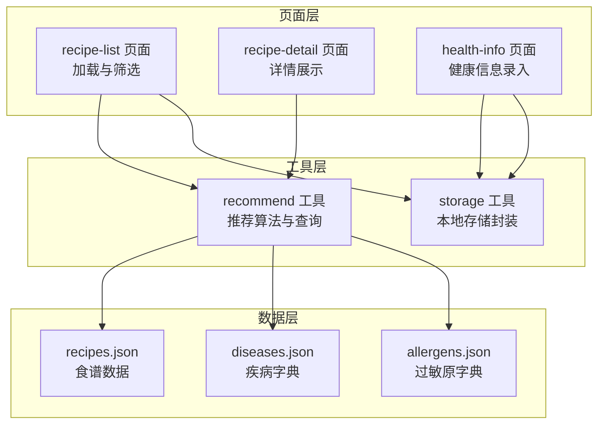
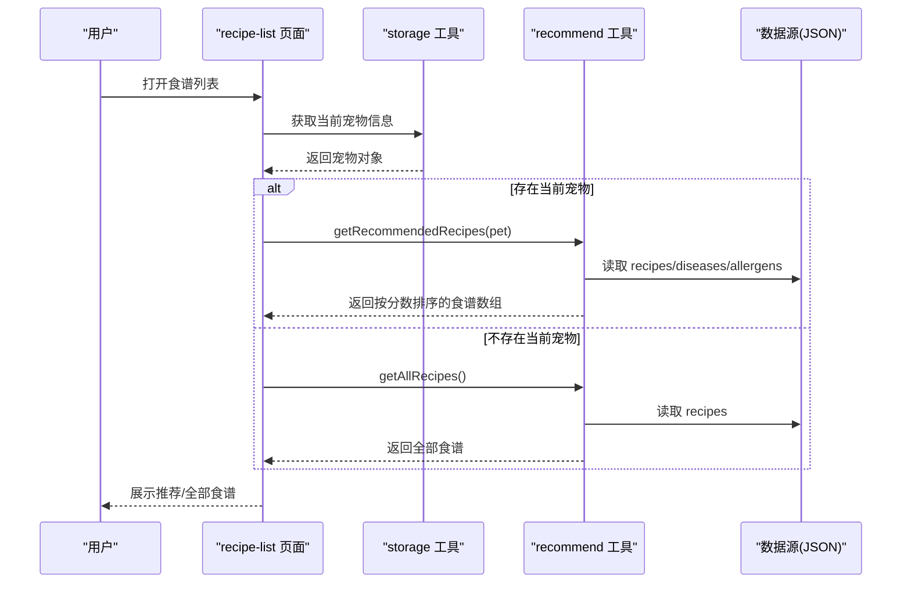
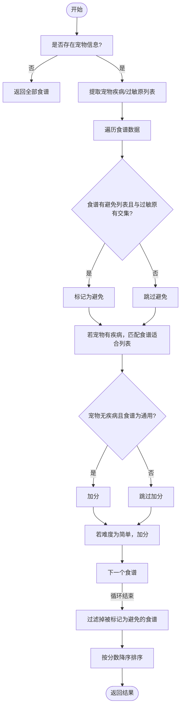
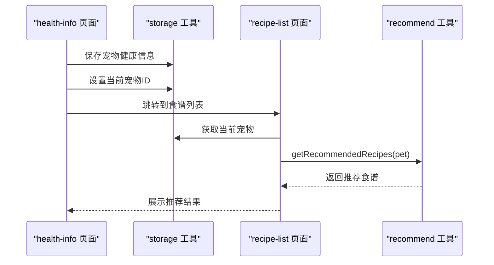
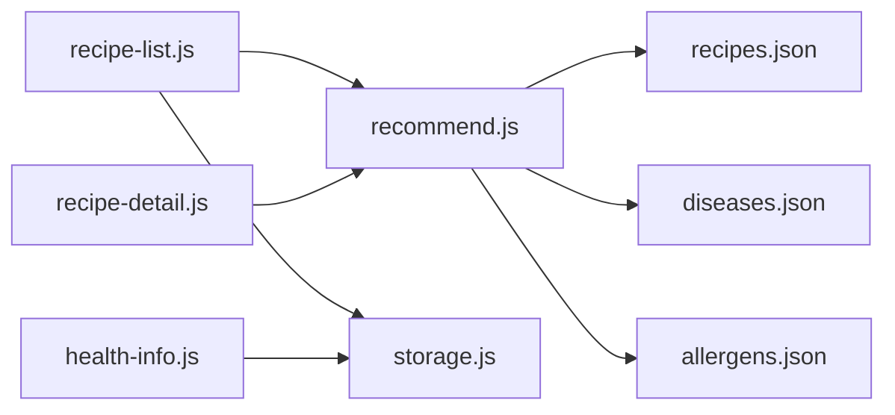

# 智能推荐引擎

<cite>
**本文档引用的文件**
- [utils/recommend.js](file://utils/recommend.js)
- [data/recipes.json](file://data/recipes.json)
- [data/diseases.json](file://data/diseases.json)
- [data/allergens.json](file://data/allergens.json)
- [pages/recipe-list/recipe-list.js](file://pages/recipe-list/recipe-list.js)
- [pages/recipe-detail/recipe-detail.js](file://pages/recipe-detail/recipe-detail.js)
- [utils/storage.js](file://utils/storage.js)
- [pages/health-info/health-info.js](file://pages/health-info/health-info.js)
</cite>

## 目录
1. [简介](#简介)
2. [项目结构](#项目结构)
3. [核心组件](#核心组件)
4. [架构总览](#架构总览)
5. [详细组件分析](#详细组件分析)
6. [依赖关系分析](#依赖关系分析)
7. [性能考虑](#性能考虑)
8. [故障排查指南](#故障排查指南)
9. [结论](#结论)
10. [附录](#附录)

## 简介
本文件面向Old-baby项目的智能推荐引擎，聚焦于食谱推荐算法的实现与优化。文档从输入参数处理、疾病匹配、过敏原避免、难度筛选、多条件综合评分到最终排序的完整流程进行深入解析，并提供权重设计思路、相似度匹配策略、过滤规则说明、性能优化建议以及扩展开发指导。同时给出使用示例与调试方法，帮助开发者理解并持续优化推荐效果。

## 项目结构
Old-baby采用小程序架构，推荐引擎位于工具层（utils），数据来源于静态JSON文件，前端页面通过页面脚本调用工具层接口完成推荐展示与交互。

图表来源
- [pages/recipe-list/recipe-list.js](file://pages/recipe-list/recipe-list.js#L1-L129)
- [pages/recipe-detail/recipe-detail.js](file://pages/recipe-detail/recipe-detail.js#L1-L43)
- [pages/health-info/health-info.js](file://pages/health-info/health-info.js#L1-L190)
- [utils/recommend.js](file://utils/recommend.js#L1-L109)
- [utils/storage.js](file://utils/storage.js#L1-L155)
- [data/recipes.json](file://data/recipes.json#L1-L515)
- [data/diseases.json](file://data/diseases.json#L1-L108)
- [data/allergens.json](file://data/allergens.json#L1-L15)

章节来源
- [pages/recipe-list/recipe-list.js](file://pages/recipe-list/recipe-list.js#L1-L129)
- [utils/recommend.js](file://utils/recommend.js#L1-L109)
- [data/recipes.json](file://data/recipes.json#L1-L515)

## 核心组件
- 推荐算法模块：负责根据宠物健康信息（疾病、过敏原等）对食谱进行评分与过滤，输出按匹配度排序的结果。
- 数据源模块：提供食谱、疾病、过敏原的静态数据，作为推荐的依据。
- 页面交互模块：负责用户输入（搜索、筛选、切换宠物）、调用推荐与查询接口，并渲染结果。
- 存储模块：管理宠物信息的增删改查与当前选中宠物的切换。

章节来源
- [utils/recommend.js](file://utils/recommend.js#L1-L109)
- [data/recipes.json](file://data/recipes.json#L1-L515)
- [data/diseases.json](file://data/diseases.json#L1-L108)
- [data/allergens.json](file://data/allergens.json#L1-L15)
- [pages/recipe-list/recipe-list.js](file://pages/recipe-list/recipe-list.js#L1-L129)
- [utils/storage.js](file://utils/storage.js#L1-L155)

## 架构总览
推荐引擎工作流自上而下分为三层：
- 输入层：页面收集宠物健康信息（疾病、过敏原、活动水平等），并支持关键词搜索与疾病筛选。
- 处理层：推荐算法对每条食谱计算匹配分数，执行过敏原避免与难度加分，随后过滤并排序。
- 输出层：页面渲染推荐结果，支持点击进入详情页。

图表来源
- [pages/recipe-list/recipe-list.js](file://pages/recipe-list/recipe-list.js#L30-L48)
- [utils/recommend.js](file://utils/recommend.js#L10-L66)
- [utils/storage.js](file://utils/storage.js#L136-L140)
- [data/recipes.json](file://data/recipes.json#L1-L515)

## 详细组件分析

### 推荐算法核心实现
推荐算法入口函数接收宠物对象，返回按匹配度降序排列的食谱列表。其主要流程如下：
- 初始化：若未提供宠物信息，则直接返回全部食谱；否则提取宠物的疾病列表与过敏原列表。
- 遍历食谱：对每条食谱计算分数，记录匹配的疾病与是否包含过敏原。
- 过敏原避免：若食谱声明了“避免”列表且与宠物过敏原存在交集，则标记为应避免。
- 疾病匹配：若宠物有疾病，则遍历食谱的“适合”列表，每匹配一项加固定分值，并记录匹配的疾病。
- 健康宠物加分：若宠物无疾病且食谱标注为通用（适合列表为空），则额外加分。
- 难度加分：若食谱难度为“简单”，则额外加分。
- 过滤与排序：过滤掉被标记为避免的食谱，按分数降序排序后返回。

图表来源
- [utils/recommend.js](file://utils/recommend.js#L10-L66)

章节来源
- [utils/recommend.js](file://utils/recommend.js#L10-L66)

### 疾病匹配算法
- 匹配方式：遍历食谱的“适合”字段（疾病ID列表），若与宠物的疾病列表存在交集，则累加固定分值，并记录匹配的疾病ID。
- 适用场景：当宠物患有特定疾病（如关节炎、糖尿病、肾病等）时，优先推荐标注为“适合”的食谱。
- 通用食谱：若宠物无任何疾病且食谱的“适合”列表为空，则额外加分，提升通用食谱的曝光率。

章节来源
- [utils/recommend.js](file://utils/recommend.js#L32-L45)
- [data/diseases.json](file://data/diseases.json#L1-L108)

### 过敏原避免机制
- 避免标识：食谱的“避免”字段列出该食谱不适合的过敏原ID列表。
- 匹配策略：若宠物的过敏原列表与食谱的“避免”列表存在交集，则将该食谱标记为“应避免”，并在最终结果中过滤掉。
- 优先级：即使某食谱在其他维度（如疾病匹配）得分很高，只要存在过敏原冲突，也会被过滤掉，确保安全。

章节来源
- [utils/recommend.js](file://utils/recommend.js#L24-L30)
- [data/allergens.json](file://data/allergens.json#L1-L15)

### 难度筛选逻辑
- 加分规则：若食谱的难度为“简单”，则在基础分数上额外加分，鼓励用户选择易于制作的食谱。
- 设计意图：降低用户门槛，提高推荐食谱的可执行性与复购率。

章节来源
- [utils/recommend.js](file://utils/recommend.js#L47-L50)

### 多条件综合评分系统
- 分数构成：
  - 疾病匹配：每匹配一个适合的疾病，加固定分值。
  - 健康通用：宠物无疾病且食谱为通用，加额外分值。
  - 难度加分：食谱难度为“简单”，加额外分值。
- 过滤与排序：先过滤掉包含过敏原的食谱，再按分数降序排序，确保结果既安全又贴合需求。

章节来源
- [utils/recommend.js](file://utils/recommend.js#L18-L66)

### 页面交互与数据流
- 食谱列表页：
  - 加载时读取当前宠物信息，若存在则调用推荐算法，否则展示全部食谱。
  - 支持关键词搜索与按疾病筛选，二次过滤后更新视图。
- 详情页：
  - 根据URL参数查询食谱详情并渲染。
- 健康信息页：
  - 录入宠物的疾病、过敏原、活动水平等信息，并保存到本地存储。
  - 保存完成后设置当前宠物并跳转到食谱列表页。

图表来源
- [pages/health-info/health-info.js](file://pages/health-info/health-info.js#L180-L188)
- [utils/storage.js](file://utils/storage.js#L136-L140)
- [pages/recipe-list/recipe-list.js](file://pages/recipe-list/recipe-list.js#L30-L48)
- [utils/recommend.js](file://utils/recommend.js#L10-L66)

章节来源
- [pages/recipe-list/recipe-list.js](file://pages/recipe-list/recipe-list.js#L1-L129)
- [pages/recipe-detail/recipe-detail.js](file://pages/recipe-detail/recipe-detail.js#L1-L43)
- [pages/health-info/health-info.js](file://pages/health-info/health-info.js#L1-L190)
- [utils/storage.js](file://utils/storage.js#L1-L155)

## 依赖关系分析
- 推荐算法依赖数据源：
  - 食谱数据：提供食谱ID、名称、描述、适合/避免列表、难度、食材、步骤等。
  - 疾病字典：提供疾病ID与分类、描述、饮食建议。
  - 过敏原字典：提供过敏原ID与类别。
- 页面层依赖工具层：
  - 食谱列表页依赖推荐工具与存储工具，实现推荐与筛选。
  - 详情页依赖推荐工具，实现按ID查询。
  - 健康信息页依赖存储工具，实现宠物信息的增删改查与当前宠物切换。

图表来源
- [utils/recommend.js](file://utils/recommend.js#L1-L109)
- [data/recipes.json](file://data/recipes.json#L1-L515)
- [data/diseases.json](file://data/diseases.json#L1-L108)
- [data/allergens.json](file://data/allergens.json#L1-L15)
- [pages/recipe-list/recipe-list.js](file://pages/recipe-list/recipe-list.js#L1-L129)
- [pages/recipe-detail/recipe-detail.js](file://pages/recipe-detail/recipe-detail.js#L1-L43)
- [pages/health-info/health-info.js](file://pages/health-info/health-info.js#L1-L190)
- [utils/storage.js](file://utils/storage.js#L1-L155)

章节来源
- [utils/recommend.js](file://utils/recommend.js#L1-L109)
- [pages/recipe-list/recipe-list.js](file://pages/recipe-list/recipe-list.js#L1-L129)
- [pages/recipe-detail/recipe-detail.js](file://pages/recipe-detail/recipe-detail.js#L1-L43)
- [pages/health-info/health-info.js](file://pages/health-info/health-info.js#L1-L190)
- [utils/storage.js](file://utils/storage.js#L1-L155)

## 性能考虑
- 时间复杂度：
  - 对于N条食谱，算法对每条食谱进行常数时间的匹配与加分操作，整体复杂度约为O(N)。
  - 若在页面层再次进行关键词与疾病筛选，额外复杂度约为O(M)，M为筛选后的食谱数量。
- 空间复杂度：
  - 仅复制食谱对象并附加分数、匹配疾病与避免标记，空间开销与食谱数量线性相关。
- 优化建议：
  - 将数据源改为服务端接口，减少本地静态文件体积，便于动态更新。
  - 在页面层增加缓存策略：若宠物信息未变更，复用上次推荐结果。
  - 对食谱数据进行预索引（如按难度、适合列表建立索引），加速筛选阶段。
  - 异步加载与分页展示，避免一次性渲染过多节点。

[本节为通用性能讨论，无需具体文件引用]

## 故障排查指南
- 推荐结果为空：
  - 检查当前宠物是否正确设置，确认存储中存在当前宠物ID。
  - 确认食谱数据中“避免”字段与宠物过敏原列表是否存在交集。
- 推荐结果不符合预期：
  - 核对食谱的“适合”字段是否包含宠物的疾病ID。
  - 检查难度加分是否生效（食谱难度是否为“简单”）。
- 页面无法跳转或显示空白：
  - 确认页面脚本中调用的工具函数路径与导出一致。
  - 检查本地存储键名与当前宠物ID是否正确写入。

章节来源
- [utils/storage.js](file://utils/storage.js#L113-L140)
- [pages/recipe-list/recipe-list.js](file://pages/recipe-list/recipe-list.js#L30-L48)
- [utils/recommend.js](file://utils/recommend.js#L10-L66)

## 结论
Old-baby的智能推荐引擎以简洁高效的算法实现了基于疾病匹配、过敏原避免与难度加分的综合评分体系。通过页面层的搜索与筛选能力，进一步提升了用户体验。未来可在数据源服务化、缓存与索引优化、以及权重可配置化等方面继续演进，以支撑更大规模的数据与更复杂的业务场景。

[本节为总结性内容，无需具体文件引用]

## 附录

### 使用示例
- 获取推荐食谱：
  - 在页面中调用推荐工具的入口函数，传入当前宠物对象，得到按匹配度排序的食谱数组。
- 获取全部食谱：
  - 当未选择宠物或需要浏览全部食谱时，调用获取全部食谱的函数。
- 按ID获取食谱详情：
  - 在详情页根据URL参数调用按ID查询函数，渲染食谱详情。
- 按关键词搜索：
  - 在食谱列表页输入关键词，调用搜索函数，对当前结果进行二次过滤。
- 按疾病筛选：
  - 在筛选面板选择疾病ID，调用按疾病筛选函数，对当前结果进行过滤。

章节来源
- [utils/recommend.js](file://utils/recommend.js#L70-L100)
- [pages/recipe-list/recipe-list.js](file://pages/recipe-list/recipe-list.js#L50-L109)
- [pages/recipe-detail/recipe-detail.js](file://pages/recipe-detail/recipe-detail.js#L10-L18)

### 调试方法
- 控制台日志：
  - 在推荐算法的关键分支打印输入参数与中间结果，定位匹配与过滤逻辑的问题。
- 数据校验：
  - 校验食谱的“适合/避免”字段与疾病/过敏原字典的ID一致性。
- 页面断点：
  - 在页面脚本的关键调用点设置断点，检查数据流向与状态更新。
- 存储验证：
  - 使用存储工具读取当前宠物信息，确认ID与健康信息正确写入。

章节来源
- [utils/recommend.js](file://utils/recommend.js#L10-L66)
- [utils/storage.js](file://utils/storage.js#L136-L140)
- [pages/recipe-list/recipe-list.js](file://pages/recipe-list/recipe-list.js#L30-L48)

### 扩展开发指导
- 新增推荐条件：
  - 在推荐算法中新增条件分支，例如按活动水平、体重范围、食材偏好等进行加分或过滤。
  - 在页面层增加对应的筛选UI与事件处理，调用相应的查询/过滤函数。
- 调整推荐权重：
  - 修改疾病匹配、健康通用、难度加分的分值，观察对推荐结果的影响。
  - 可考虑引入动态权重：根据宠物年龄、性别、活动水平等因素调整权重。
- 数据源扩展：
  - 将静态JSON替换为服务端接口，支持实时更新与个性化推荐。
  - 增加食谱评分统计、用户反馈等指标，构建更完善的推荐模型。

章节来源
- [utils/recommend.js](file://utils/recommend.js#L18-L66)
- [pages/recipe-list/recipe-list.js](file://pages/recipe-list/recipe-list.js#L84-L109)