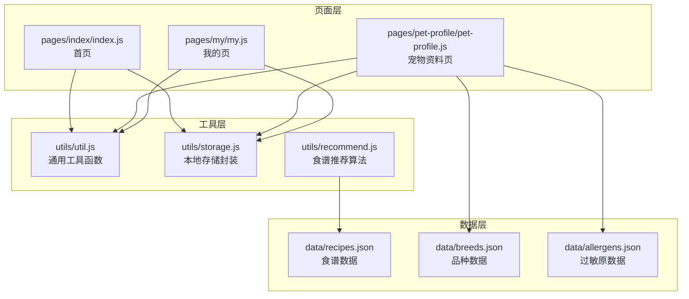
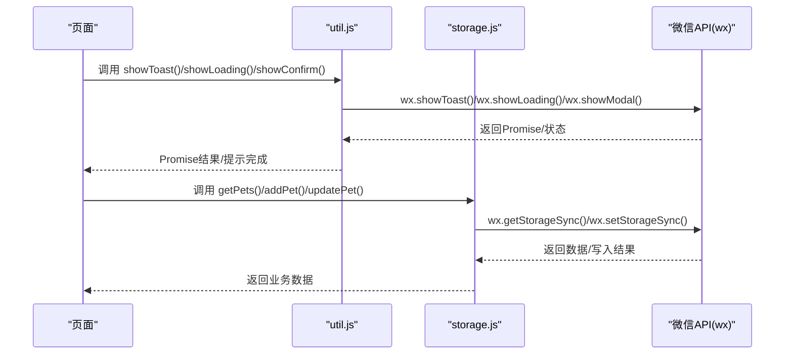
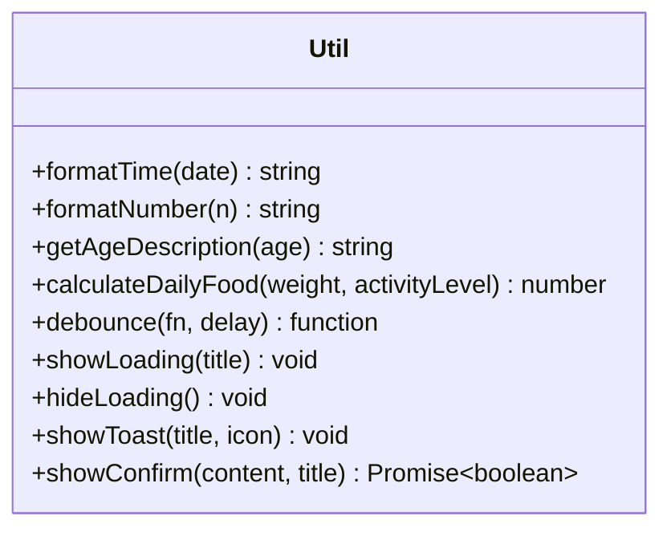
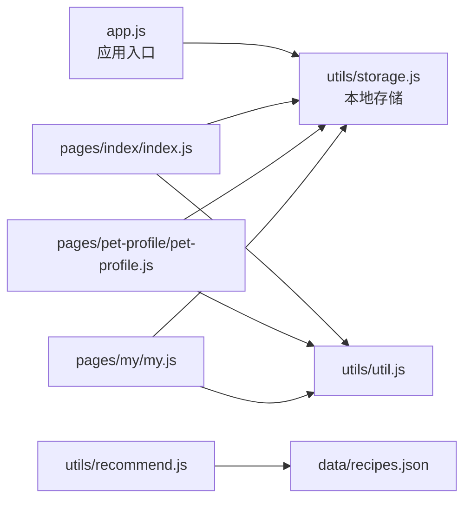

# 通用工具函数

<cite>
**本文档引用的文件**
- [utils/util.js](file://utils/util.js)
- [utils/storage.js](file://utils/storage.js)
- [utils/recommend.js](file://utils/recommend.js)
- [app.js](file://app.js)
- [pages/index/index.js](file://pages/index/index.js)
- [pages/pet-profile/pet-profile.js](file://pages/pet-profile/pet-profile.js)
- [pages/my/my.js](file://pages/my/my.js)
- [data/recipes.json](file://data/recipes.json)
- [data/breeds.json](file://data/breeds.json)
- [data/allergens.json](file://data/allergens.json)
</cite>

## 目录
1. [简介](#简介)
2. [项目结构](#项目结构)
3. [核心组件](#核心组件)
4. [架构总览](#架构总览)
5. [详细组件分析](#详细组件分析)
6. [依赖关系分析](#依赖关系分析)
7. [性能考虑](#性能考虑)
8. [故障排除指南](#故障排除指南)
9. [结论](#结论)
10. [附录](#附录)

## 简介
本文件为 Old-baby 项目的通用工具函数库文档，重点覆盖 utils/util.js 中提供的实用工具函数。内容涵盖数据格式化、用户交互提示、时间处理、字符串操作、防抖机制等核心功能，并提供完整的 API 参考、使用示例与最佳实践，帮助开发者在项目中正确高效地使用这些工具函数。

## 项目结构
Old-baby 采用模块化的工具函数组织方式：
- 工具函数集中于 utils 目录，按职责拆分为 util.js（通用工具）、storage.js（本地存储封装）、recommend.js（食谱推荐算法）
- 页面通过 require 方式引入工具模块，实现业务逻辑与工具层解耦
- 数据资源位于 data 目录，供推荐算法与页面渲染使用

图表来源
- [utils/util.js](file://utils/util.js#L1-L123)
- [utils/storage.js](file://utils/storage.js#L1-L155)
- [utils/recommend.js](file://utils/recommend.js#L1-L109)
- [pages/index/index.js](file://pages/index/index.js#L1-L80)
- [pages/pet-profile/pet-profile.js](file://pages/pet-profile/pet-profile.js#L1-L216)
- [pages/my/my.js](file://pages/my/my.js#L1-L113)
- [data/recipes.json](file://data/recipes.json#L1-L515)
- [data/breeds.json](file://data/breeds.json#L1-L35)
- [data/allergens.json](file://data/allergens.json#L1-L15)

章节来源
- [utils/util.js](file://utils/util.js#L1-L123)
- [utils/storage.js](file://utils/storage.js#L1-L155)
- [utils/recommend.js](file://utils/recommend.js#L1-L109)
- [pages/index/index.js](file://pages/index/index.js#L1-L80)
- [pages/pet-profile/pet-profile.js](file://pages/pet-profile/pet-profile.js#L1-L216)
- [pages/my/my.js](file://pages/my/my.js#L1-L113)

## 核心组件
本节概述 util.js 中提供的核心工具函数及其职责：
- 时间格式化：将 Date 对象格式化为“YYYY/M/D HH:mm:ss”字符串
- 数字补零：将个位数补零为两位数字符串
- 年龄描述：根据年龄区间返回“幼犬/成年犬/老年犬/高龄犬”
- 日常建议喂食量：基于体重与活动水平估算每日喂食量（g）
- 防抖函数：对高频事件进行延迟执行，减少重复调用
- 加载提示：显示/隐藏带遮罩的加载提示
- 提示消息：显示带图标的 Toast 消息
- 确认弹窗：异步显示模态确认框，返回用户选择结果

章节来源
- [utils/util.js](file://utils/util.js#L1-L123)

## 架构总览
工具函数在页面层的使用模式如下：
- 页面通过 require 引入 util.js，统一调用工具函数处理 UI 交互与提示
- 页面通过 storage.js 管理本地数据持久化
- recommend.js 依赖 recipes.json 实现食谱推荐与搜索

图表来源
- [utils/util.js](file://utils/util.js#L69-L110)
- [utils/storage.js](file://utils/storage.js#L19-L98)
- [pages/index/index.js](file://pages/index/index.js#L67-L78)
- [pages/pet-profile/pet-profile.js](file://pages/pet-profile/pet-profile.js#L145-L190)
- [pages/my/my.js](file://pages/my/my.js#L88-L103)

## 详细组件分析

### 时间格式化与数字补零
- 功能：将 Date 对象格式化为“YYYY/M/D HH:mm:ss”，内部使用数字补零函数保证两位显示
- 参数：date（Date 对象）
- 返回：字符串（格式化后的日期时间）
- 使用场景：日志记录、数据展示、时间戳显示
- 复杂度：O(1)，空间复杂度 O(1)

章节来源
- [utils/util.js](file://utils/util.js#L6-L20)

### 年龄描述
- 功能：根据年龄区间返回对应的年龄阶段描述
- 参数：age（数字，单位通常为岁）
- 返回：字符串（“幼犬/成年犬/老年犬/高龄犬”）
- 使用场景：宠物年龄展示、健康评估提示
- 复杂度：O(1)，空间复杂度 O(1)

章节来源
- [utils/util.js](file://utils/util.js#L25-L30)

### 每日建议喂食量
- 功能：基于体重与活动水平估算每日喂食量（g），默认取整到整数
- 参数：
  - weight（kg，必需）
  - activityLevel（字符串，可选，默认 normal；支持 low/normal/high）
- 返回：数字（g）
- 使用场景：宠物营养管理、喂食计划制定
- 复杂度：O(1)，空间复杂度 O(1)

章节来源
- [utils/util.js](file://utils/util.js#L37-L54)

### 防抖函数
- 功能：对传入函数进行延迟执行，若在延迟时间内再次触发，则重置计时器
- 参数：
  - fn（函数）
  - delay（毫秒，可选，默认 300）
- 返回：函数（包装后的防抖函数）
- 使用场景：输入框实时搜索、窗口尺寸变化监听、按钮点击去抖
- 复杂度：O(1)，空间复杂度 O(1)

章节来源
- [utils/util.js](file://utils/util.js#L59-L67)

### 加载提示
- 功能：显示带遮罩的加载提示
- 参数：
  - title（字符串，可选，默认“加载中...”）
- 返回：无
- 使用场景：网络请求、数据保存、页面切换等待
- 注意：需与隐藏函数配对使用

章节来源
- [utils/util.js](file://utils/util.js#L72-L84)

### 隐藏加载提示
- 功能：关闭加载提示
- 参数：无
- 返回：无
- 使用场景：请求完成或异常处理后关闭提示

章节来源
- [utils/util.js](file://utils/util.js#L82-L84)

### 提示消息
- 功能：显示带图标的消息提示
- 参数：
  - title（字符串）
  - icon（字符串，可选，默认“none”；支持 none/success/loading/error）
- 返回：无
- 使用场景：保存成功/失败、输入验证提示、系统通知
- 注意：默认持续时间约 2 秒

章节来源
- [utils/util.js](file://utils/util.js#L89-L95)

### 确认弹窗
- 功能：显示模态确认框，返回 Promise，resolve 为用户确认结果
- 参数：
  - content（字符串）
  - title（字符串，可选，默认“提示”）
- 返回：Promise<boolean>
- 使用场景：删除确认、危险操作确认、重要变更确认
- 注意：异步调用，需 await 或 .then 处理结果

章节来源
- [utils/util.js](file://utils/util.js#L100-L110)

### 工具函数类图

图表来源
- [utils/util.js](file://utils/util.js#L6-L122)

## 依赖关系分析
- 页面层依赖工具层：首页、宠物资料页、我的页均通过 require 引入 util.js 与 storage.js
- 工具层内部解耦：util.js 仅依赖微信小程序 API，不依赖业务数据
- 数据层独立：recommend.js 依赖 recipes.json，与工具层无直接耦合
- 入口初始化：app.js 在启动时初始化本地存储（pets）

图表来源
- [app.js](file://app.js#L8-L14)
- [pages/index/index.js](file://pages/index/index.js#L2-L3)
- [pages/pet-profile/pet-profile.js](file://pages/pet-profile/pet-profile.js#L2-L4)
- [pages/my/my.js](file://pages/my/my.js#L2-L3)
- [utils/recommend.js](file://utils/recommend.js#L3)
- [data/recipes.json](file://data/recipes.json#L1)

章节来源
- [app.js](file://app.js#L1-L21)
- [pages/index/index.js](file://pages/index/index.js#L1-L80)
- [pages/pet-profile/pet-profile.js](file://pages/pet-profile/pet-profile.js#L1-L216)
- [pages/my/my.js](file://pages/my/my.js#L1-L113)
- [utils/recommend.js](file://utils/recommend.js#L1-L109)

## 性能考虑
- 防抖函数：合理设置 delay（默认 300ms），避免频繁触发导致的性能浪费
- 加载提示：仅在必要时显示，避免长时间遮罩影响用户体验
- Toast 持续时间：默认约 2 秒，避免过长阻塞用户操作
- 时间格式化：O(1) 复杂度，开销极小，可安全用于高频展示
- 数字补零：O(1) 复杂度，字符串拼接成本低

## 故障排除指南
- 加载提示无法关闭
  - 检查是否调用了隐藏函数
  - 确认页面生命周期中未被覆盖
- 确认弹窗未返回结果
  - 确保以 await 方式调用或正确处理 Promise
  - 检查传入的 content 是否为空
- 提示消息不显示
  - 检查 title 是否为空字符串
  - 确认 icon 值是否为受支持的枚举值
- 防抖无效
  - 确认传入的函数是否为同一引用
  - 检查 delay 参数是否过大或过小

章节来源
- [utils/util.js](file://utils/util.js#L72-L110)

## 结论
util.js 提供了小程序开发中常用的 UI 交互与数据处理工具，具备简洁、可复用、低耦合的特点。结合 storage.js 的本地持久化能力与 recommend.js 的智能推荐算法，形成了从界面交互到数据管理的完整工具链。建议在后续开发中遵循现有命名与参数约定，保持工具函数的单一职责与幂等特性，以便于扩展与维护。

## 附录

### API 参考（工具函数）
- formatTime(date)
  - 参数：date（Date）
  - 返回：string（格式化后的日期时间）
  - 示例路径：[utils/util.js](file://utils/util.js#L6-L15)
- formatNumber(n)
  - 参数：n（number/string）
  - 返回：string（两位数字字符串）
  - 示例路径：[utils/util.js](file://utils/util.js#L17-L20)
- getAgeDescription(age)
  - 参数：age（number）
  - 返回：string（年龄阶段描述）
  - 示例路径：[utils/util.js](file://utils/util.js#L25-L30)
- calculateDailyFood(weight, activityLevel)
  - 参数：weight（number，kg）；activityLevel（'low' | 'normal' | 'high'）
  - 返回：number（g）
  - 示例路径：[utils/util.js](file://utils/util.js#L37-L54)
- debounce(fn, delay)
  - 参数：fn（function）；delay（number，ms）
  - 返回：function（防抖包装函数）
  - 示例路径：[utils/util.js](file://utils/util.js#L59-L67)
- showLoading(title)
  - 参数：title（string）
  - 返回：void
  - 示例路径：[utils/util.js](file://utils/util.js#L72-L84)
- hideLoading()
  - 参数：无
  - 返回：void
  - 示例路径：[utils/util.js](file://utils/util.js#L82-L84)
- showToast(title, icon)
  - 参数：title（string）；icon（'none' | 'success' | 'loading' | 'error'）
  - 返回：void
  - 示例路径：[utils/util.js](file://utils/util.js#L89-L95)
- showConfirm(content, title)
  - 参数：content（string）；title（string）
  - 返回：Promise<boolean>
  - 示例路径：[utils/util.js](file://utils/util.js#L100-L110)

### 使用示例与最佳实践
- 删除宠物时的确认流程
  - 路径：[pages/index/index.js](file://pages/index/index.js#L67-L78)
  - 步骤：调用确认弹窗 -> 根据结果执行删除 -> 成功后提示并刷新列表
- 保存宠物资料时的交互
  - 路径：[pages/pet-profile/pet-profile.js](file://pages/pet-profile/pet-profile.js#L145-L190)
  - 步骤：显示加载 -> 校验表单 -> 保存数据 -> 隐藏加载 -> 成功提示 -> 返回上一页
- 清除缓存时的确认流程
  - 路径：[pages/my/my.js](file://pages/my/my.js#L88-L103)
  - 步骤：调用确认弹窗 -> 清空本地存储 -> 刷新页面状态 -> 成功提示

### 设计原则与扩展建议
- 单一职责：每个工具函数专注于一个明确任务，便于测试与复用
- 参数最小化：尽量使用最少且语义清晰的参数，提供合理的默认值
- 错误处理：在工具层对外部 API 的调用中进行容错处理，避免抛出未捕获异常
- 可测试性：保持纯函数优先，减少对外部状态的依赖
- 扩展方法：
  - 新增工具函数时，遵循现有命名风格与导出方式
  - 如需新增微信 API 封装，统一在 util.js 中维护，避免分散
  - 对于复杂业务逻辑，建议拆分为独立模块并通过 require 引入