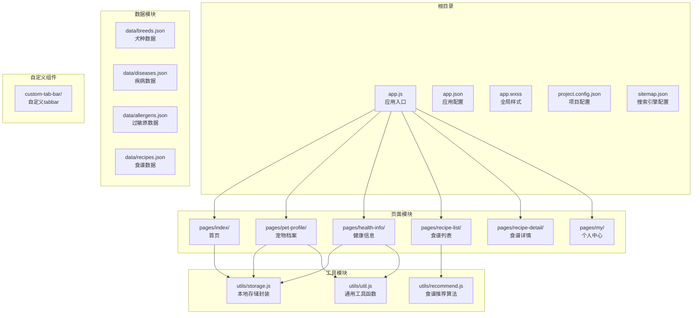
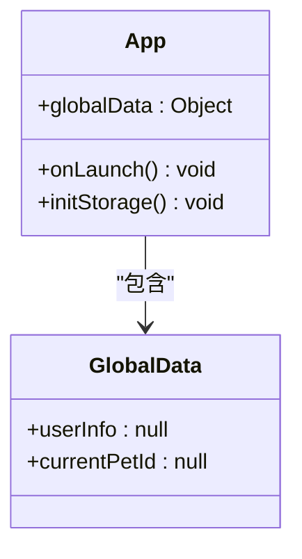
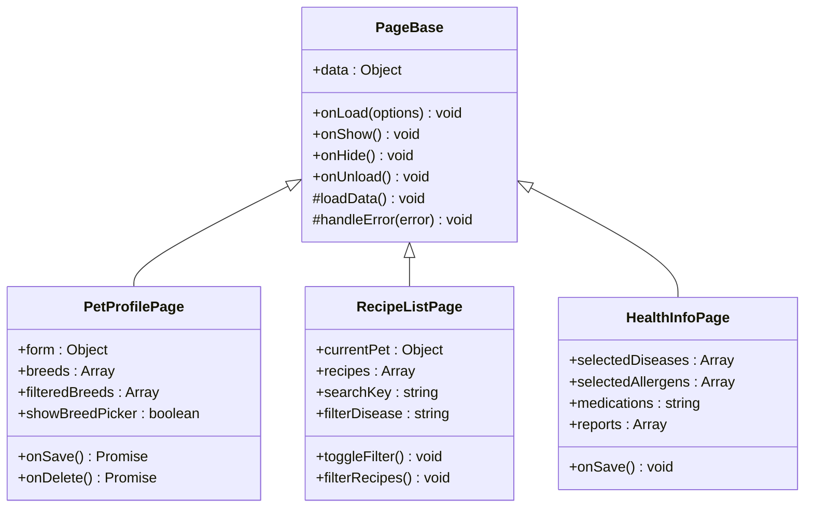
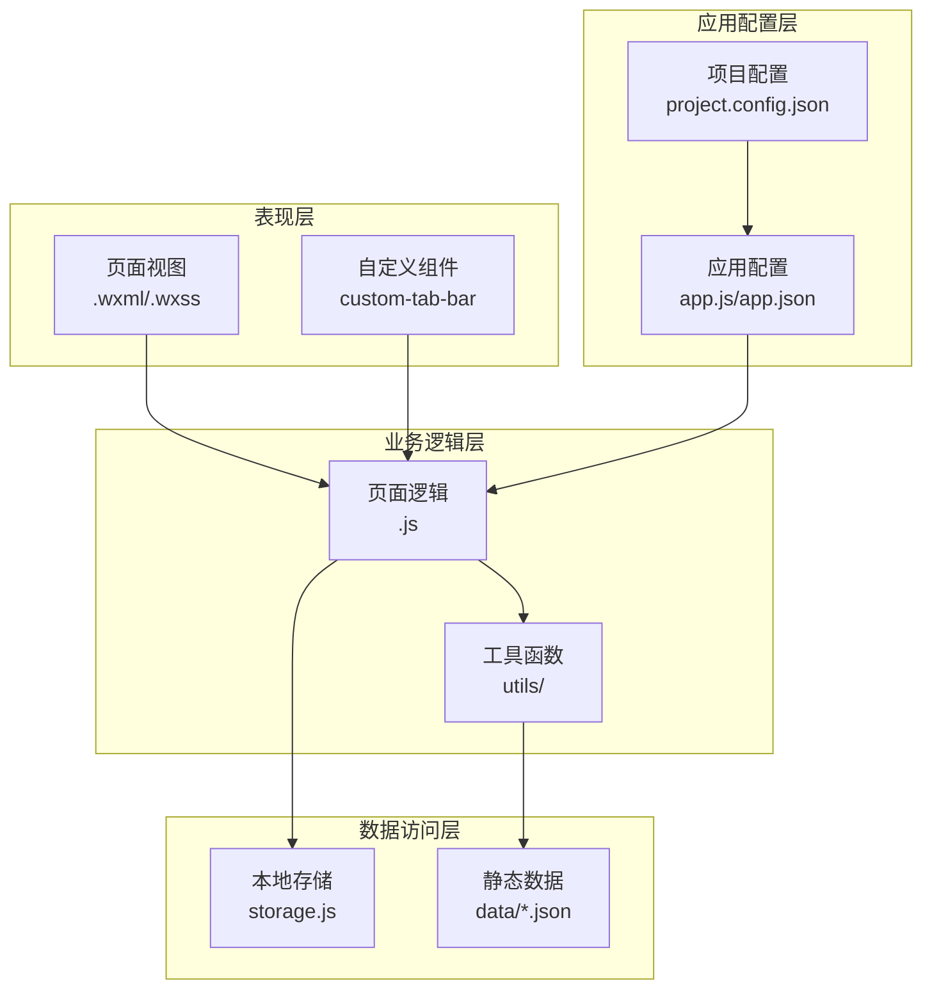
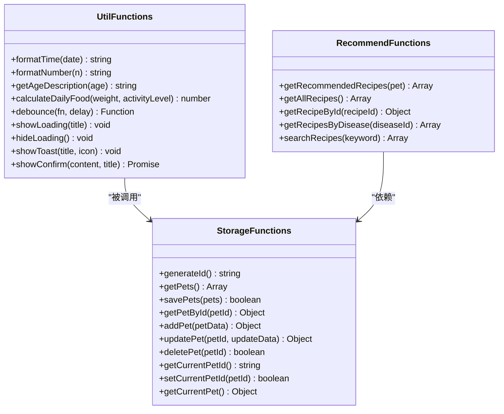
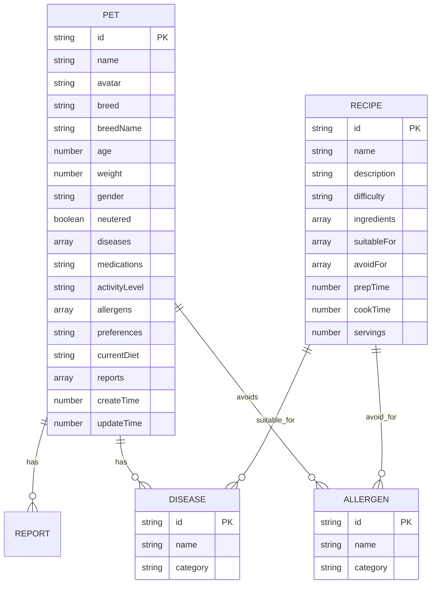
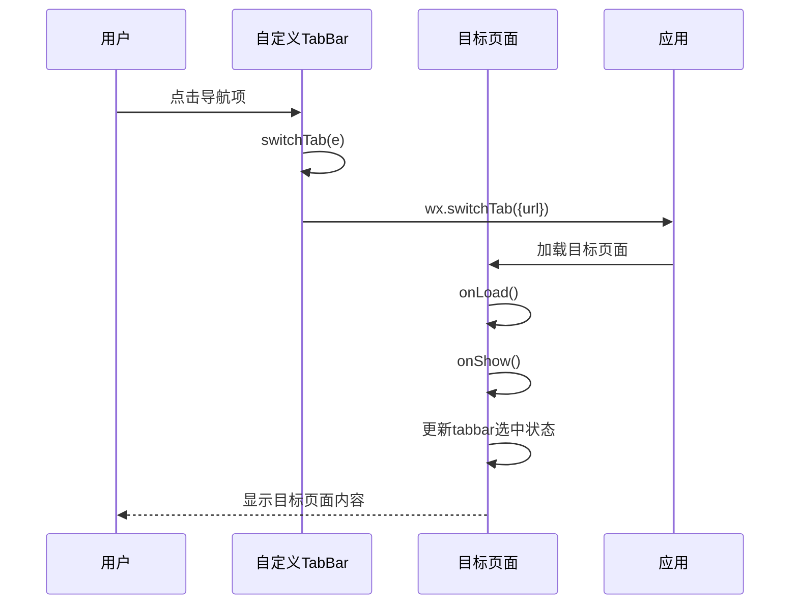
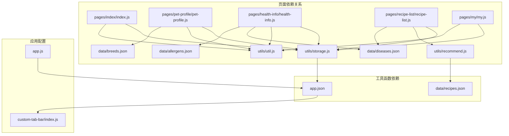

# 代码规范

<cite>
**本文档引用的文件**
- [app.js](file://app.js)
- [app.json](file://app.json)
- [utils/util.js](file://utils/util.js)
- [utils/storage.js](file://utils/storage.js)
- [utils/recommend.js](file://utils/recommend.js)
- [pages/index/index.js](file://pages/index/index.js)
- [pages/my/my.js](file://pages/my/my.js)
- [pages/pet-profile/pet-profile.js](file://pages/pet-profile/pet-profile.js)
- [pages/recipe-list/recipe-list.js](file://pages/recipe-list/recipe-list.js)
- [pages/health-info/health-info.js](file://pages/health-info/health-info.js)
- [custom-tab-bar/index.js](file://custom-tab-bar/index.js)
- [project.config.json](file://project.config.json)
- [sitemap.json](file://sitemap.json)
- [data/breeds.json](file://data/breeds.json)
</cite>

## 目录
1. [简介](#简介)
2. [项目结构](#项目结构)
3. [核心组件](#核心组件)
4. [架构概览](#架构概览)
5. [详细组件分析](#详细组件分析)
6. [依赖关系分析](#依赖关系分析)
7. [性能考虑](#性能考虑)
8. [故障排除指南](#故障排除指南)
9. [结论](#结论)

## 简介

Old-baby是一个专为老年犬主人设计的自制狗粮指南微信小程序。该项目采用模块化架构，包含宠物管理、食谱推荐、健康信息记录等功能模块。本文档旨在建立统一的代码规范，确保代码风格一致性，提高代码可读性和可维护性。

## 项目结构

项目采用典型的微信小程序目录结构，按照功能模块进行组织：

**图表来源**
- [app.js](file://app.js#L1-L21)
- [app.json](file://app.json#L1-L41)
- [utils/util.js](file://utils/util.js#L1-L123)
- [utils/storage.js](file://utils/storage.js#L1-L155)
- [utils/recommend.js](file://utils/recommend.js#L1-L109)

**章节来源**
- [app.js](file://app.js#L1-L21)
- [app.json](file://app.json#L1-L41)

## 核心组件

### 应用入口组件

应用入口负责初始化全局配置和存储系统：

**图表来源**
- [app.js](file://app.js#L1-L21)

### 页面组件架构

所有页面遵循统一的Page组件模式：

**图表来源**
- [pages/pet-profile/pet-profile.js](file://pages/pet-profile/pet-profile.js#L1-L216)
- [pages/recipe-list/recipe-list.js](file://pages/recipe-list/recipe-list.js#L1-L129)
- [pages/health-info/health-info.js](file://pages/health-info/health-info.js#L1-L190)

**章节来源**
- [pages/index/index.js](file://pages/index/index.js#L1-L80)
- [pages/my/my.js](file://pages/my/my.js#L1-L113)

## 架构概览

项目采用分层架构设计，清晰分离关注点：

**图表来源**
- [app.js](file://app.js#L1-L21)
- [app.json](file://app.json#L1-L41)
- [utils/util.js](file://utils/util.js#L1-L123)
- [utils/storage.js](file://utils/storage.js#L1-L155)

## 详细组件分析

### 工具函数模块

工具函数模块提供了通用的辅助功能：

**图表来源**
- [utils/util.js](file://utils/util.js#L1-L123)
- [utils/storage.js](file://utils/storage.js#L1-L155)
- [utils/recommend.js](file://utils/recommend.js#L1-L109)

### 数据模型设计

项目使用标准化的数据结构：

**图表来源**
- [utils/storage.js](file://utils/storage.js#L48-L98)
- [utils/recommend.js](file://utils/recommend.js#L10-L80)
- [data/breeds.json](file://data/breeds.json#L1-L35)

**章节来源**
- [utils/util.js](file://utils/util.js#L1-L123)
- [utils/storage.js](file://utils/storage.js#L1-L155)
- [utils/recommend.js](file://utils/recommend.js#L1-L109)

### 自定义组件实现

自定义tabbar组件提供了统一的导航体验：

**图表来源**
- [custom-tab-bar/index.js](file://custom-tab-bar/index.js#L1-L32)
- [pages/index/index.js](file://pages/index/index.js#L15-L23)

**章节来源**
- [custom-tab-bar/index.js](file://custom-tab-bar/index.js#L1-L32)

## 依赖关系分析

项目依赖关系清晰，遵循单一职责原则：

**图表来源**
- [pages/index/index.js](file://pages/index/index.js#L1-L80)
- [pages/pet-profile/pet-profile.js](file://pages/pet-profile/pet-profile.js#L1-L216)
- [pages/health-info/health-info.js](file://pages/health-info/health-info.js#L1-L190)
- [pages/recipe-list/recipe-list.js](file://pages/recipe-list/recipe-list.js#L1-L129)
- [pages/my/my.js](file://pages/my/my.js#L1-L113)

**章节来源**
- [app.js](file://app.js#L1-L21)
- [app.json](file://app.json#L1-L41)

## 性能考虑

### 代码性能优化策略

1. **防抖机制**：在高频交互场景中使用防抖函数，减少不必要的重复调用
2. **异步处理**：使用Promise和async/await处理异步操作，避免阻塞UI线程
3. **数据缓存**：合理使用本地存储，减少重复的数据请求
4. **条件渲染**：根据数据状态动态渲染，避免不必要的DOM操作

### 内存管理

- 及时清理定时器和事件监听器
- 合理使用setData，避免一次性更新大量数据
- 在页面卸载时释放资源

## 故障排除指南

### 常见问题及解决方案

#### 存储相关问题
- **问题**：本地存储读取失败
- **原因**：存储空间不足或权限问题
- **解决**：添加try-catch异常处理，提供降级方案

#### 网络请求问题
- **问题**：数据加载超时
- **原因**：网络不稳定或服务器响应慢
- **解决**：实现重试机制和超时处理

#### UI渲染问题
- **问题**：页面显示异常
- **原因**：数据格式不正确或状态更新时机不当
- **解决**：验证数据结构，使用合理的状态更新策略

**章节来源**
- [utils/storage.js](file://utils/storage.js#L19-L39)
- [utils/util.js](file://utils/util.js#L59-L67)

## 结论

Old-baby项目展现了良好的代码组织和架构设计。通过建立统一的代码规范，可以进一步提升代码质量，确保团队协作效率。建议在后续开发中严格执行本文档的各项规范，持续改进代码质量和用户体验。