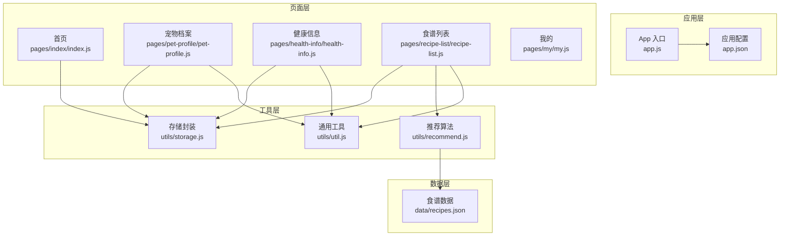
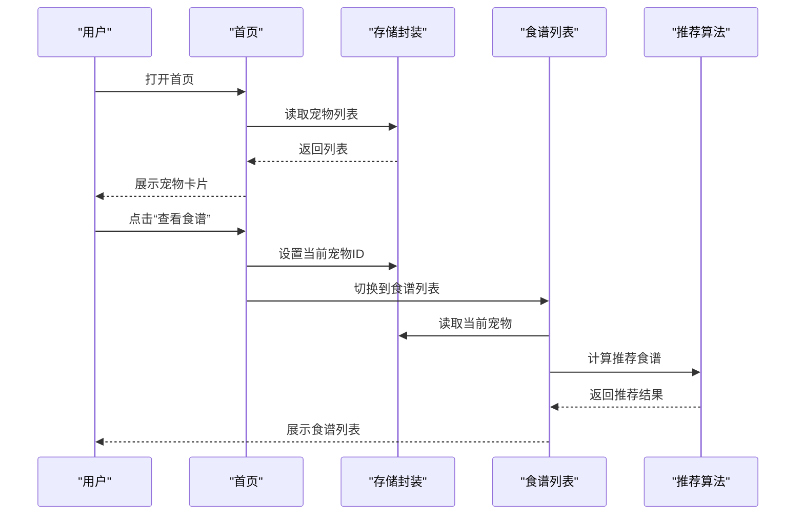
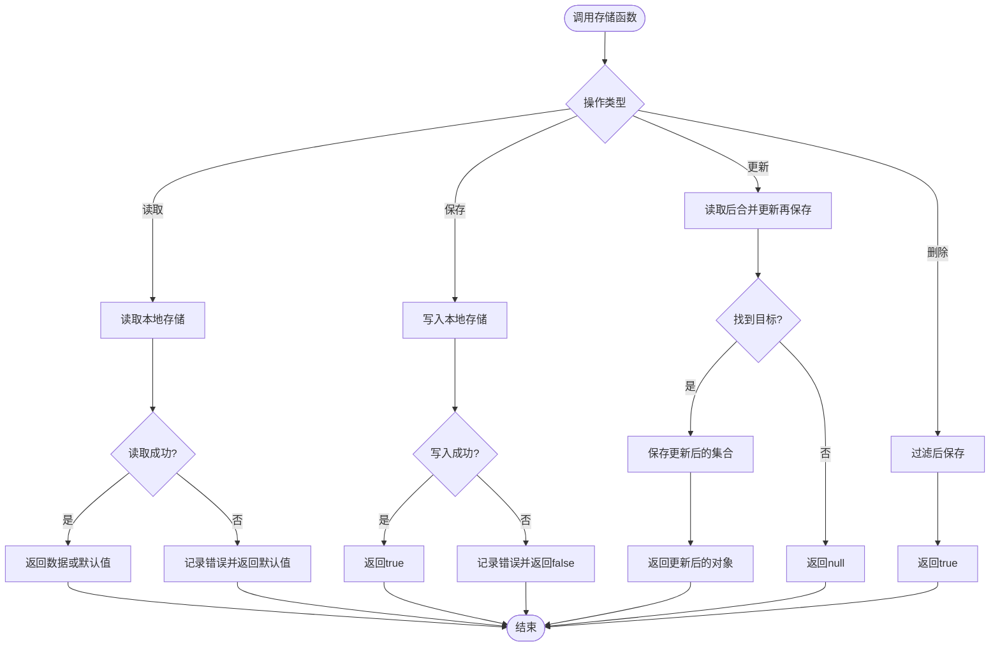
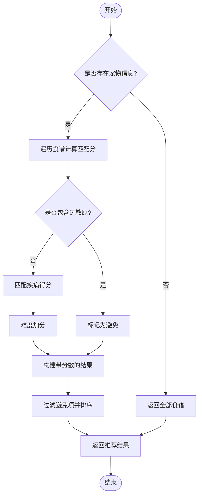
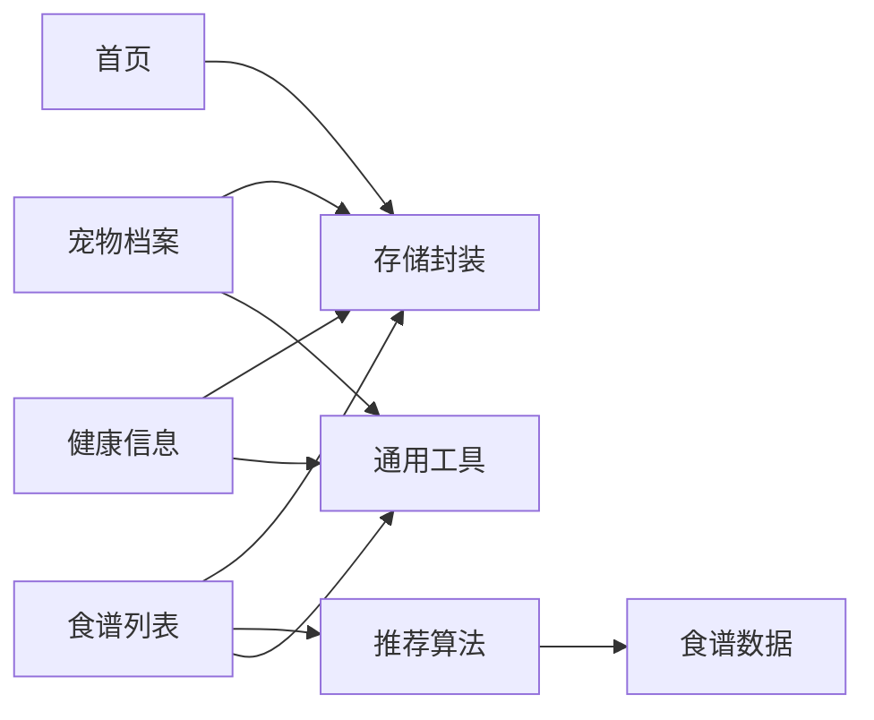

# 开发指南

<cite>
**本文档引用的文件**
- [app.js](file://app.js)
- [app.json](file://app.json)
- [custom-tab-bar/index.js](file://custom-tab-bar/index.js)
- [utils/recommend.js](file://utils/recommend.js)
- [utils/storage.js](file://utils/storage.js)
- [utils/util.js](file://utils/util.js)
- [pages/index/index.js](file://pages/index/index.js)
- [pages/recipe-list/recipe-list.js](file://pages/recipe-list/recipe-list.js)
- [pages/my/my.js](file://pages/my/my.js)
- [pages/pet-profile/pet-profile.js](file://pages/pet-profile/pet-profile.js)
- [pages/health-info/health-info.js](file://pages/health-info/health-info.js)
- [data/recipes.json](file://data/recipes.json)
- [project.config.json](file://project.config.json)
</cite>

## 目录
1. [简介](#简介)
2. [项目结构](#项目结构)
3. [核心组件](#核心组件)
4. [架构总览](#架构总览)
5. [详细组件分析](#详细组件分析)
6. [依赖关系分析](#依赖关系分析)
7. [性能考虑](#性能考虑)
8. [调试与开发工具](#调试与开发工具)
9. [扩展开发流程](#扩展开发流程)
10. [常见问题与排错](#常见问题与排错)
11. [结论](#结论)

## 简介
本指南面向Old-baby项目的开发者，提供从代码规范、最佳实践到扩展开发、性能优化与安全兼容性的完整说明。项目采用微信小程序框架，围绕“老年犬护理”主题，提供宠物档案管理、健康信息记录、食谱推荐与查看等功能。文档将结合现有代码结构，给出可操作的开发流程与注意事项，帮助团队高效迭代与维护。

## 项目结构
项目采用按页面与功能模块划分的目录组织方式：
- 应用入口与全局配置：app.js、app.json
- 自定义TabBar：custom-tab-bar/index.js 及其资源文件
- 页面：pages 下按功能划分的多个页面（首页、宠物档案、健康信息、食谱列表、食谱详情、我的）
- 工具与数据：utils 下的存储封装、推荐算法、通用工具；data 下的静态数据（食谱、品种、疾病、过敏原）
- 构建与项目配置：project.config.json

图表来源
- [app.js](file://app.js#L1-L21)
- [app.json](file://app.json#L1-L41)
- [pages/index/index.js](file://pages/index/index.js#L1-L80)
- [pages/pet-profile/pet-profile.js](file://pages/pet-profile/pet-profile.js#L1-L216)
- [pages/health-info/health-info.js](file://pages/health-info/health-info.js#L1-L190)
- [pages/recipe-list/recipe-list.js](file://pages/recipe-list/recipe-list.js#L1-L129)
- [pages/my/my.js](file://pages/my/my.js#L1-L113)
- [utils/storage.js](file://utils/storage.js#L1-L155)
- [utils/recommend.js](file://utils/recommend.js#L1-L109)
- [utils/util.js](file://utils/util.js#L1-L123)
- [data/recipes.json](file://data/recipes.json#L1-L200)

章节来源
- [app.js](file://app.js#L1-L21)
- [app.json](file://app.json#L1-L41)

## 核心组件
- 应用入口与生命周期：在启动时初始化本地存储，确保宠物数据键存在。
- 自定义TabBar：提供图标+文字的自定义底部导航，支持切换页面。
- 存储封装：统一管理宠物列表、当前选中宠物、用户信息等键值，提供增删改查与当前宠物上下文。
- 推荐算法：基于宠物疾病、过敏原、难度等维度计算食谱匹配度，支持搜索与筛选。
- 通用工具：时间格式化、年龄描述、喂食量估算、防抖、加载与提示、确认弹窗等。
- 页面逻辑：首页展示宠物列表、跳转编辑/查看/删除；宠物档案页表单录入与校验；健康信息页多选疾病/过敏原与体检报告上传；食谱列表页搜索与筛选；我的页用户信息与缓存清理。

章节来源
- [app.js](file://app.js#L1-L21)
- [custom-tab-bar/index.js](file://custom-tab-bar/index.js#L1-L32)
- [utils/storage.js](file://utils/storage.js#L1-L155)
- [utils/recommend.js](file://utils/recommend.js#L1-L109)
- [utils/util.js](file://utils/util.js#L1-L123)
- [pages/index/index.js](file://pages/index/index.js#L1-L80)
- [pages/pet-profile/pet-profile.js](file://pages/pet-profile/pet-profile.js#L1-L216)
- [pages/health-info/health-info.js](file://pages/health-info/health-info.js#L1-L190)
- [pages/recipe-list/recipe-list.js](file://pages/recipe-list/recipe-list.js#L1-L129)
- [pages/my/my.js](file://pages/my/my.js#L1-L113)

## 架构总览
系统采用“页面-工具-数据”的分层架构：
- 页面负责交互与业务流程编排
- 工具层提供复用能力（存储、推荐、通用）
- 数据层提供静态数据与本地存储

图表来源
- [pages/index/index.js](file://pages/index/index.js#L1-L80)
- [pages/recipe-list/recipe-list.js](file://pages/recipe-list/recipe-list.js#L1-L129)
- [utils/storage.js](file://utils/storage.js#L1-L155)
- [utils/recommend.js](file://utils/recommend.js#L1-L109)

## 详细组件分析

### 应用入口与生命周期
- 在启动阶段调用初始化逻辑，确保本地存储中存在宠物数据键，避免后续读写异常。
- 全局数据区提供当前选中宠物ID等共享状态。

章节来源
- [app.js](file://app.js#L1-L21)

### 自定义TabBar组件
- 组件内部维护选中状态、颜色与列表项，通过事件回调触发页面切换。
- 支持自定义图标与文案，适配项目主题色。

章节来源
- [custom-tab-bar/index.js](file://custom-tab-bar/index.js#L1-L32)

### 存储封装（utils/storage.js）
- 提供宠物列表的增删改查、当前宠物ID的读写、生成唯一ID等能力。
- 对本地存储操作进行错误捕获，保障健壮性。
- 使用集中化的键名常量，便于维护与变更。

图表来源
- [utils/storage.js](file://utils/storage.js#L1-L155)

章节来源
- [utils/storage.js](file://utils/storage.js#L1-L155)

### 推荐算法（utils/recommend.js）
- 根据宠物的疾病、过敏原、难度等因素计算匹配度，优先排除过敏原，再按分数排序。
- 支持获取全部食谱、按ID查询、按疾病筛选、关键词搜索。
- 与数据层的食谱JSON配合，形成“规则驱动”的推荐策略。

图表来源
- [utils/recommend.js](file://utils/recommend.js#L1-L109)
- [data/recipes.json](file://data/recipes.json#L1-L200)

章节来源
- [utils/recommend.js](file://utils/recommend.js#L1-L109)
- [data/recipes.json](file://data/recipes.json#L1-L200)

### 通用工具（utils/util.js）
- 时间格式化、数字补零、年龄描述、喂食量估算、防抖、加载/提示/确认弹窗等。
- 为页面提供一致的交互体验与基础能力。

章节来源
- [utils/util.js](file://utils/util.js#L1-L123)

### 首页（pages/index/index.js）
- 加载宠物列表，支持添加、编辑、查看食谱、编辑健康信息、删除宠物。
- 切换TabBar选中态，确保视觉一致性。

章节来源
- [pages/index/index.js](file://pages/index/index.js#L1-L80)

### 宠物档案（pages/pet-profile/pet-profile.js）
- 表单录入宠物基本信息，支持头像选择、性别与绝育开关、品种搜索与选择。
- 校验必填项与数值有效性，保存成功后返回或继续健康信息。

章节来源
- [pages/pet-profile/pet-profile.js](file://pages/pet-profile/pet-profile.js#L1-L216)

### 健康信息（pages/health-info/health-info.js）
- 多选疾病与过敏原，输入用药、活动水平、偏好、当前饮食，支持体检报告图片上传与预览。
- 保存后可直接跳转食谱列表查看推荐。

章节来源
- [pages/health-info/health-info.js](file://pages/health-info/health-info.js#L1-L190)

### 食谱列表（pages/recipe-list/recipe-list.js）
- 根据当前宠物生成推荐食谱，支持关键词搜索与按疾病筛选。
- 提供切换宠物、打开筛选面板、清除筛选等交互。

章节来源
- [pages/recipe-list/recipe-list.js](file://pages/recipe-list/recipe-list.js#L1-L129)

### 我的（pages/my/my.js）
- 展示用户信息与宠物数量，支持头像与昵称输入、关于、反馈、清除缓存等。
- 提供分享入口。

章节来源
- [pages/my/my.js](file://pages/my/my.js#L1-L113)

## 依赖关系分析
- 页面依赖工具层：各页面通过require引入storage、recommend、util，形成清晰的职责边界。
- 工具层依赖数据层：recommend依赖recipes.json；storage依赖本地存储API。
- 自定义TabBar独立于页面逻辑，仅通过事件触发页面切换。

图表来源
- [pages/index/index.js](file://pages/index/index.js#L1-L80)
- [pages/pet-profile/pet-profile.js](file://pages/pet-profile/pet-profile.js#L1-L216)
- [pages/health-info/health-info.js](file://pages/health-info/health-info.js#L1-L190)
- [pages/recipe-list/recipe-list.js](file://pages/recipe-list/recipe-list.js#L1-L129)
- [utils/storage.js](file://utils/storage.js#L1-L155)
- [utils/recommend.js](file://utils/recommend.js#L1-L109)
- [utils/util.js](file://utils/util.js#L1-L123)
- [data/recipes.json](file://data/recipes.json#L1-L200)

章节来源
- [pages/index/index.js](file://pages/index/index.js#L1-L80)
- [pages/pet-profile/pet-profile.js](file://pages/pet-profile/pet-profile.js#L1-L216)
- [pages/health-info/health-info.js](file://pages/health-info/health-info.js#L1-L190)
- [pages/recipe-list/recipe-list.js](file://pages/recipe-list/recipe-list.js#L1-L129)
- [utils/storage.js](file://utils/storage.js#L1-L155)
- [utils/recommend.js](file://utils/recommend.js#L1-L109)
- [utils/util.js](file://utils/util.js#L1-L123)
- [data/recipes.json](file://data/recipes.json#L1-L200)

## 性能考虑
- 防抖与节流：在高频输入场景（如搜索）使用防抖减少重复计算与渲染压力。
- 数据缓存：将常用数据（如宠物列表、当前宠物）缓存在内存中，减少频繁读取。
- 图片与媒体：上传体检报告时限制数量与尺寸，避免过大文件影响性能。
- 页面切换：使用switchTab减少页面栈深度，降低内存占用。
- 渲染优化：列表渲染时尽量使用稳定的key，避免不必要的setData调用。
- 网络与存储：本地存储操作尽量批量处理，减少IO次数。

## 调试与开发工具
- 微信开发者工具：启用真机调试、断点调试、网络面板、Storage面板、Console日志。
- 项目配置：在project.config.json中开启增强编译、最小化、压缩等选项，提升构建效率与包体大小控制。
- 日志与提示：统一使用工具层的提示与加载，便于问题定位与用户体验优化。
- 真机测试：在不同机型与系统版本上验证兼容性，关注字体、布局与交互差异。

章节来源
- [project.config.json](file://project.config.json#L1-L47)

## 扩展开发流程

### 新增页面
- 创建页面目录与四件套：.js/.json/.wxml/.wxss，并在app.json的pages中注册。
- 在自定义TabBar中添加对应条目，确保pagePath正确。
- 在页面中引入所需工具与数据模块，完成业务逻辑与UI交互。
- 如需跨页面传递参数，使用URL参数或全局状态管理（如当前宠物ID）。

章节来源
- [app.json](file://app.json#L1-L41)
- [custom-tab-bar/index.js](file://custom-tab-bar/index.js#L1-L32)

### 新增功能模块
- 将通用逻辑抽象到工具层（如新的工具函数、数据处理方法），保持页面简洁。
- 对外暴露明确的API接口，遵循单一职责原则。
- 编写单元测试或在页面中进行集成验证，确保边界条件与异常处理。

章节来源
- [utils/util.js](file://utils/util.js#L1-L123)
- [utils/storage.js](file://utils/storage.js#L1-L155)
- [utils/recommend.js](file://utils/recommend.js#L1-L109)

### 新增API接口
- 若涉及网络请求，建议在工具层封装统一的请求方法，包含超时、重试、错误码处理。
- 对返回数据进行结构化校验，避免页面直接处理异常数据。
- 在页面中使用Promise或async/await管理异步流程，避免回调地狱。

（本节为通用指导，不直接分析具体文件）

### 新增数据模型
- 在data目录下新增JSON文件或扩展现有数据结构，确保字段命名与页面绑定一致。
- 在工具层提供对应的读取与转换方法，避免页面直接解析复杂数据。
- 对外部数据进行白名单校验，防止注入与越权访问。

章节来源
- [data/recipes.json](file://data/recipes.json#L1-L200)

## 常见问题与排错

- 本地存储读写失败
  - 现象：页面无法读取或保存宠物信息。
  - 排查：检查工具层的try/catch处理与错误日志输出；确认键名是否正确。
  - 解决：使用统一的存储封装，避免直接调用原生API；必要时回退到默认值。

- 推荐结果为空
  - 现象：无食谱推荐或推荐不符合预期。
  - 排查：检查宠物的疾病与过敏原配置；确认食谱数据中suitableFor/avoidFor字段。
  - 解决：在页面中提供“查看全部食谱”入口；优化推荐权重与阈值。

- 页面切换异常
  - 现象：点击TabBar无法跳转或选中态不正确。
  - 排查：确认自定义TabBar的pagePath与app.json中注册路径一致；检查页面onShow中设置选中态的逻辑。
  - 解决：统一在页面onShow中调用getTabBar并设置selected。

- 表单校验失败
  - 现象：保存时报错或数据未生效。
  - 排查：检查必填项与数值类型校验；确认表单字段与存储字段映射。
  - 解决：在保存前统一执行校验，使用工具层提示用户。

- 体检报告上传失败
  - 现象：图片选择后无法上传或显示。
  - 排查：检查chooseMedia权限与返回结构；确认预览与删除逻辑。
  - 解决：限制最大数量与文件大小；提供清晰的错误提示。

章节来源
- [utils/storage.js](file://utils/storage.js#L1-L155)
- [utils/recommend.js](file://utils/recommend.js#L1-L109)
- [custom-tab-bar/index.js](file://custom-tab-bar/index.js#L1-L32)
- [pages/index/index.js](file://pages/index/index.js#L1-L80)
- [pages/pet-profile/pet-profile.js](file://pages/pet-profile/pet-profile.js#L1-L216)
- [pages/health-info/health-info.js](file://pages/health-info/health-info.js#L1-L190)

## 结论
本指南基于现有代码结构，总结了Old-baby项目的核心组件、架构关系与开发流程。通过统一的工具层与清晰的数据契约，项目实现了良好的可维护性与扩展性。建议在后续迭代中持续完善数据校验、错误处理与性能优化，同时加强跨页面状态管理与API封装，以支撑更复杂的业务场景。