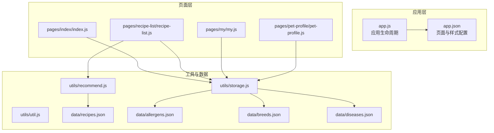
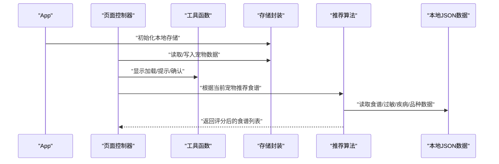
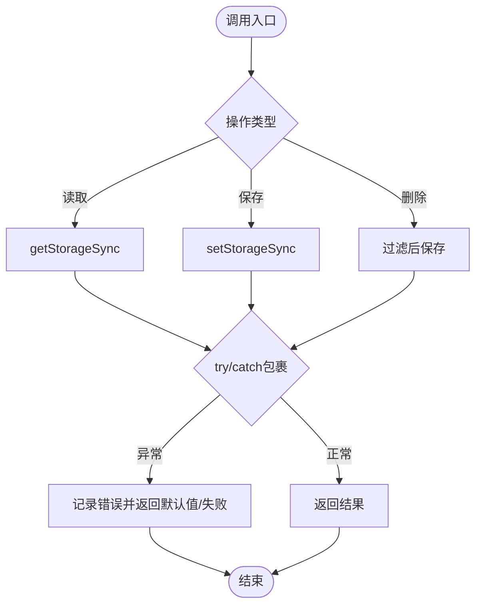
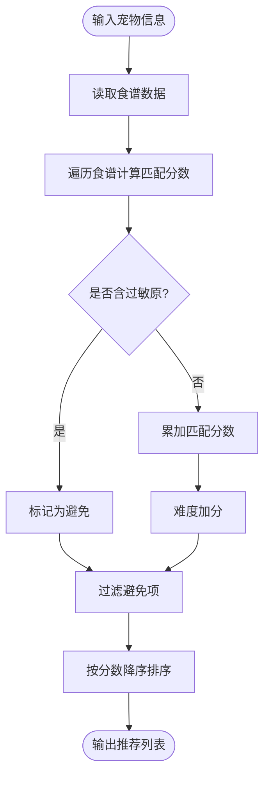
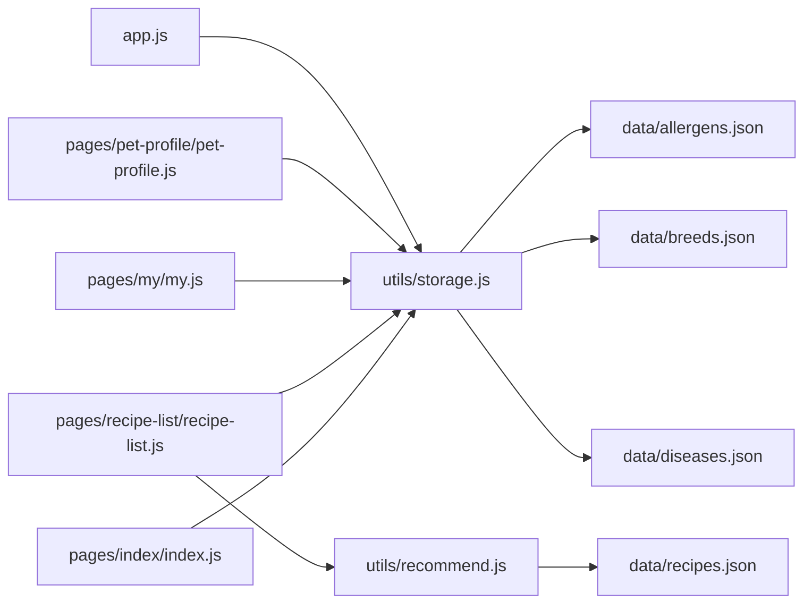

# 性能优化与安全

<cite>
**本文引用的文件**
- [app.js](file://app.js)
- [app.json](file://app.json)
- [utils/storage.js](file://utils/storage.js)
- [utils/util.js](file://utils/util.js)
- [utils/recommend.js](file://utils/recommend.js)
- [pages/index/index.js](file://pages/index/index.js)
- [pages/recipe-list/recipe-list.js](file://pages/recipe-list/recipe-list.js)
- [pages/my/my.js](file://pages/my/my.js)
- [pages/pet-profile/pet-profile.js](file://pages/pet-profile/pet-profile.js)
- [data/recipes.json](file://data/recipes.json)
- [data/allergens.json](file://data/allergens.json)
- [data/breeds.json](file://data/breeds.json)
- [data/diseases.json](file://data/diseases.json)
</cite>

## 目录
1. [简介](#简介)
2. [项目结构](#项目结构)
3. [核心组件](#核心组件)
4. [架构总览](#架构总览)
5. [详细组件分析](#详细组件分析)
6. [依赖关系分析](#依赖关系分析)
7. [性能优化实践](#性能优化实践)
8. [安全与合规](#安全与合规)
9. [兼容性与用户体验](#兼容性与用户体验)
10. [故障排查指南](#故障排查指南)
11. [结论](#结论)

## 简介
本指南面向“老宝贝护理”小程序，聚焦性能优化与安全实践，覆盖代码分包、图片资源优化、网络请求优化、内存管理、Storage缓存策略、异步与清理机制、数据验证与防攻击、跨版本与设备适配、用户体验与监控方法论。文档以仓库现有实现为基础，结合最佳实践给出可落地的改进建议。

## 项目结构
项目采用按页面与功能模块划分的组织方式：
- 应用入口与全局配置：app.js、app.json
- 工具与业务逻辑：utils 下的 storage、util、recommend
- 页面：pages 下的 index、recipe-list、my、pet-profile、health-info、recipe-detail
- 数据：data 下的 recipes、allergens、breeds、diseases
- 其他：sitemap.json、project.config.json

图表来源
- [app.js](file://app.js#L1-L21)
- [app.json](file://app.json#L1-L41)
- [utils/storage.js](file://utils/storage.js#L1-L155)
- [utils/util.js](file://utils/util.js#L1-L123)
- [utils/recommend.js](file://utils/recommend.js#L1-L109)
- [pages/index/index.js](file://pages/index/index.js#L1-L80)
- [pages/recipe-list/recipe-list.js](file://pages/recipe-list/recipe-list.js#L1-L129)
- [pages/my/my.js](file://pages/my/my.js#L1-L113)
- [pages/pet-profile/pet-profile.js](file://pages/pet-profile/pet-profile.js#L1-L216)
- [data/recipes.json](file://data/recipes.json#L1-L515)
- [data/allergens.json](file://data/allergens.json#L1-L15)
- [data/breeds.json](file://data/breeds.json#L1-L35)
- [data/diseases.json](file://data/diseases.json#L1-L108)

章节来源
- [app.js](file://app.js#L1-L21)
- [app.json](file://app.json#L1-L41)

## 核心组件
- 存储封装：提供宠物列表、当前选中宠物、增删改查等能力，并统一错误处理与返回值。
- 工具函数：格式化时间、年龄描述、防抖、加载与提示、确认弹窗等。
- 推荐算法：基于宠物疾病、过敏原、难度等维度评分，过滤并排序食谱。
- 页面控制器：负责数据加载、交互事件、导航跳转、缓存切换等。

章节来源
- [utils/storage.js](file://utils/storage.js#L1-L155)
- [utils/util.js](file://utils/util.js#L1-L123)
- [utils/recommend.js](file://utils/recommend.js#L1-L109)
- [pages/index/index.js](file://pages/index/index.js#L1-L80)
- [pages/recipe-list/recipe-list.js](file://pages/recipe-list/recipe-list.js#L1-L129)
- [pages/my/my.js](file://pages/my/my.js#L1-L113)
- [pages/pet-profile/pet-profile.js](file://pages/pet-profile/pet-profile.js#L1-L216)

## 架构总览
整体采用“页面-工具-数据”三层结构，页面通过工具函数与存储封装访问数据；推荐模块读取本地 JSON 数据进行本地计算；应用启动时初始化本地存储键值。

图表来源
- [app.js](file://app.js#L3-L14)
- [pages/index/index.js](file://pages/index/index.js#L25-L31)
- [pages/recipe-list/recipe-list.js](file://pages/recipe-list/recipe-list.js#L30-L48)
- [utils/recommend.js](file://utils/recommend.js#L10-L66)
- [data/recipes.json](file://data/recipes.json#L1-L515)

## 详细组件分析

### 存储封装（storage.js）
- 设计要点
  - 使用常量集中管理键名，避免魔法字符串。
  - 对同步接口进行 try/catch 包裹，保证调用稳定性。
  - 提供增删改查与当前宠物ID的读写，支持链式更新与持久化。
- 复杂度与性能
  - 读取/保存为 O(1)，列表查询为 O(n)；在数据规模可控时可接受。
  - 建议：对频繁读取的数据做内存缓存，减少重复序列化开销。
- 错误处理
  - 写入失败返回布尔值，读取失败返回默认值，调用方据此判断。
- 安全与合规
  - 仅存储非敏感本地数据；涉及用户隐私字段应避免明文存储或加密。

图表来源
- [utils/storage.js](file://utils/storage.js#L19-L39)
- [utils/storage.js](file://utils/storage.js#L113-L131)

章节来源
- [utils/storage.js](file://utils/storage.js#L1-L155)

### 推荐算法（recommend.js）
- 设计要点
  - 评分规则：疾病匹配、难度加分、避免过敏原过滤。
  - 支持按ID、按疾病、按关键词搜索，返回排序后的结果。
- 复杂度与性能
  - 单次评分 O(m)（m 为食谱数量），过滤 O(m)；整体 O(m)。
  - 建议：对大列表场景启用虚拟滚动或分页加载，避免一次性渲染过多节点。
- 安全与合规
  - 本地数据，无需网络校验；但需确保输入参数类型正确，防止异常。

图表来源
- [utils/recommend.js](file://utils/recommend.js#L10-L66)
- [data/recipes.json](file://data/recipes.json#L1-L515)

章节来源
- [utils/recommend.js](file://utils/recommend.js#L1-L109)

### 页面控制器（index/recipe-list/my/pet-profile）
- 生命周期与数据加载
  - onShow 中刷新数据，确保切换到页面时展示最新状态。
  - 通过 storage.getCurrentPet() 与 storage.getPets() 获取上下文数据。
- 交互与导航
  - 使用 wx.navigateTo、wx.switchTab、wx.redirectTo 实现页面跳转。
  - 使用 util.showLoading、util.showToast、util.showConfirm 提升体验。
- 性能与内存
  - 避免在 setData 中传递大对象；拆分数据，按需更新。
  - 在复杂列表中使用 key 或分页，减少渲染压力。

章节来源
- [pages/index/index.js](file://pages/index/index.js#L15-L23)
- [pages/recipe-list/recipe-list.js](file://pages/recipe-list/recipe-list.js#L21-L28)
- [pages/my/my.js](file://pages/my/my.js#L16-L23)
- [pages/pet-profile/pet-profile.js](file://pages/pet-profile/pet-profile.js#L34-L45)
- [utils/util.js](file://utils/util.js#L69-L110)

## 依赖关系分析
- 页面依赖工具与存储：index、recipe-list、my、pet-profile 均依赖 storage 与 util。
- 推荐模块依赖本地数据：recommend 依赖 recipes.json 及疾病/过敏/品种数据。
- 应用级初始化：app.js 在启动时初始化 pets 键，避免后续空指针。

图表来源
- [pages/index/index.js](file://pages/index/index.js#L1-L80)
- [pages/recipe-list/recipe-list.js](file://pages/recipe-list/recipe-list.js#L1-L129)
- [pages/my/my.js](file://pages/my/my.js#L1-L113)
- [pages/pet-profile/pet-profile.js](file://pages/pet-profile/pet-profile.js#L1-L216)
- [utils/storage.js](file://utils/storage.js#L1-L155)
- [utils/recommend.js](file://utils/recommend.js#L1-L109)
- [data/recipes.json](file://data/recipes.json#L1-L515)
- [data/allergens.json](file://data/allergens.json#L1-L15)
- [data/breeds.json](file://data/breeds.json#L1-L35)
- [data/diseases.json](file://data/diseases.json#L1-L108)
- [app.js](file://app.js#L3-L14)

章节来源
- [app.js](file://app.js#L1-L21)
- [app.json](file://app.json#L1-L41)

## 性能优化实践

### 代码分包与页面加载
- 将高频页面与低频页面分离，减少首屏包体。
- 使用分包策略将推荐与详情页放入独立分包，按需加载。
- 避免在 app.json 中一次性注册过多页面，减少主包体积。

章节来源
- [app.json](file://app.json#L2-L9)

### 图片资源优化
- 使用 WebP/JPEG2000 等压缩格式，按尺寸裁剪与懒加载。
- 对列表缩略图采用占位图与骨架屏，提升感知速度。
- 将静态图片放置在独立域名，开启 CDN 与缓存策略。

### 网络请求优化
- 本地数据优先：推荐算法与列表筛选尽量在本地完成，减少网络请求。
- 对外网接口（如有）启用缓存与条件请求（ETag/Last-Modified）。
- 合并请求与批量读取，避免频繁短连接。

### 内存管理
- 避免在页面 data 中存放大对象或深层嵌套结构。
- 使用 setData 的局部更新，减少不必要的视图重绘。
- 在页面离开时及时释放定时器、监听器与临时变量。

### Storage 缓存策略与清理
- 缓存策略
  - 对频繁读取的数据（如 breeds、diseases、allergens）在内存中缓存，减少重复读取。
  - 对用户偏好与最近浏览记录设置 TTL，到期自动失效。
- 异步与清理
  - 写入采用异步化（如批量写入）降低主线程阻塞。
  - 提供“一键清理”入口，支持按类别清理（宠物、食谱、用户信息）。
- 数据结构优化
  - 使用索引字段（如 id）快速定位，避免线性扫描。
  - 对长列表分页或虚拟滚动，避免一次性渲染。

章节来源
- [utils/storage.js](file://utils/storage.js#L1-L155)
- [pages/my/my.js](file://pages/my/my.js#L88-L103)

### 用户体验优化
- 加载动画与错误处理
  - 使用 util.showLoading 与 util.hideLoading 包裹耗时操作。
  - 对网络/存储异常统一提示，提供重试或回退路径。
- 用户反馈机制
  - 使用 util.showToast 提示关键操作结果。
  - 对删除、清空等不可逆操作使用 util.showConfirm 确认。

章节来源
- [utils/util.js](file://utils/util.js#L69-L110)
- [pages/index/index.js](file://pages/index/index.js#L67-L78)
- [pages/my/my.js](file://pages/my/my.js#L88-L103)

## 安全与合规

### 数据验证
- 输入校验
  - 年龄与体重字段需为数字且范围合理，使用 util.showToast 提示错误。
  - 表单提交前统一校验必填项，避免空值进入存储。
- 类型约束
  - 对从 storage 获取的数据进行类型断言，防止下游逻辑异常。

章节来源
- [pages/pet-profile/pet-profile.js](file://pages/pet-profile/pet-profile.js#L144-L168)

### XSS 防护
- 输出编码
  - 对用户输入文本在渲染前进行 HTML 转义，避免注入脚本。
- 内容安全策略
  - 限制富文本渲染范围，必要时使用白名单标签与属性。

### CSRF 防范
- 本项目为纯前端小程序，无服务端直接交互，无需 CSRF Token。
- 若未来接入服务端，务必启用同源策略与安全响应头，避免跨站请求伪造。

### 敏感信息保护
- 不在本地存储敏感信息（如账号、密码、身份证号）。
- 对用户头像与昵称等可识别信息，遵循最小化原则与用户授权。

## 兼容性与用户体验

### 微信客户端版本适配
- 低版本兼容
  - 使用 wx.canIUse 检测 API 支持情况，提供降级方案。
  - 对新语法（如 async/await）确保编译器支持或提供 polyfill。
- 设备差异
  - 针对不同屏幕尺寸与系统字体大小，调整布局与字号。
  - 对 iOS 与 Android 的导航栏高度差异进行适配。

### 设备兼容性测试
- 建议覆盖机型：iPhone SE/11/14、华为 P30/Mate40、小米 Redmi 等。
- 测试场景：弱网、离线、后台切换、锁屏唤醒、深色模式。

### 用户体验优化
- 加载与反馈
  - 使用骨架屏与占位图，缩短感知等待时间。
  - 对长列表使用分页或虚拟滚动，避免卡顿。
- 错误处理
  - 统一错误提示与重试按钮，提供帮助入口。
- 导航与交互
  - 保持页面切换流畅，避免重复跳转与死循环。

## 故障排查指南

### 常见问题定位
- 页面空白或数据不显示
  - 检查 storage 初始化是否成功，确认 pets 键是否存在。
  - 确认 onShow 中是否重新加载数据。
- 推荐结果异常
  - 检查 recipes.json 是否完整加载，确认疾病/过敏/难度字段存在。
- 删除/清空无效
  - 检查 util.showConfirm 返回值与 storage.deletePet/savePets 的调用链。

章节来源
- [app.js](file://app.js#L8-L14)
- [pages/index/index.js](file://pages/index/index.js#L67-L78)
- [pages/my/my.js](file://pages/my/my.js#L88-L103)

### 日志与监控
- 建议埋点
  - 页面曝光、点击、分享、删除、清空等关键事件。
  - 性能指标：首屏时间、接口耗时、存储读写耗时。
- 监控平台
  - 使用微信开发者工具的性能面板与网络面板。
  - 结合小程序后台日志与第三方监控平台进行趋势分析。

## 结论
本项目以本地数据驱动为核心，具备良好的扩展性与可维护性。通过合理的分包策略、图片优化、本地计算与缓存机制，可在保证功能完整性的同时显著提升性能与稳定性。配合完善的数据验证、XSS 防护与敏感信息保护，以及跨版本与设备的兼容性测试，可进一步提升安全性与用户体验。建议持续引入埋点与监控，形成闭环的质量保障体系。