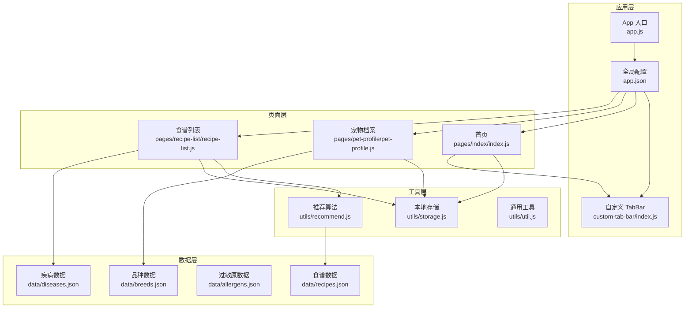
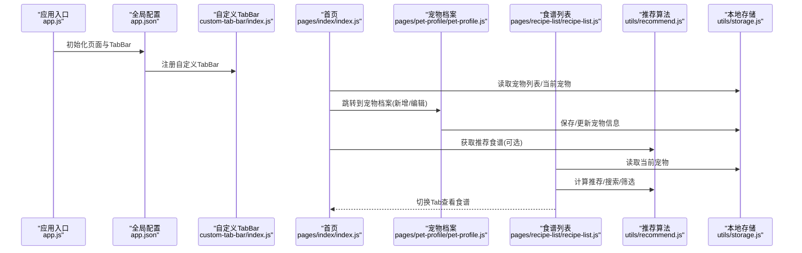
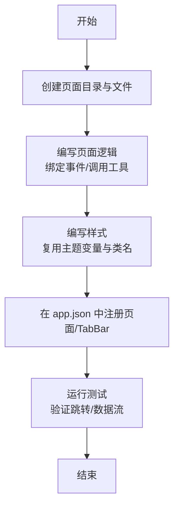
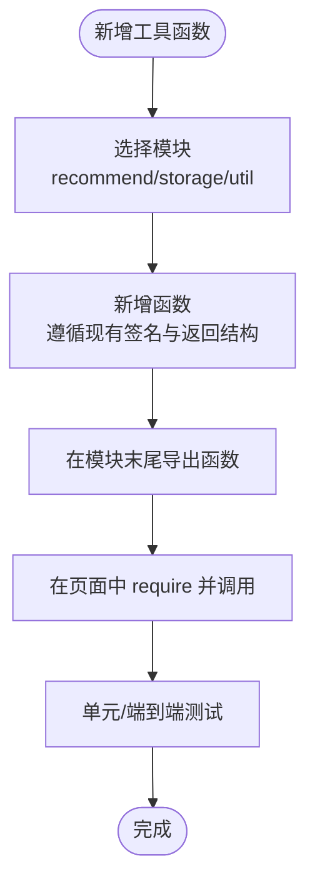
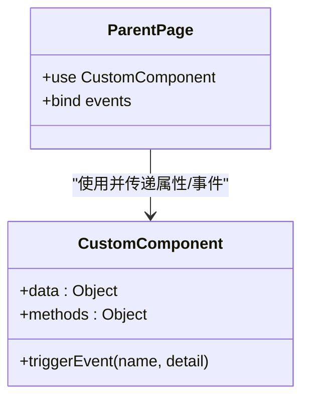
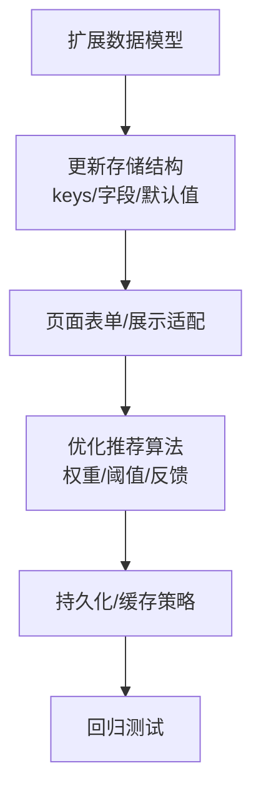
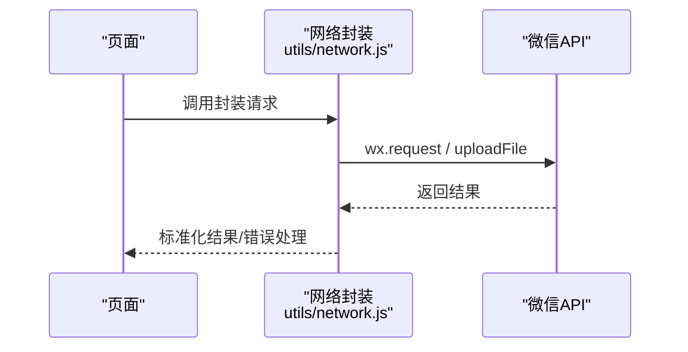
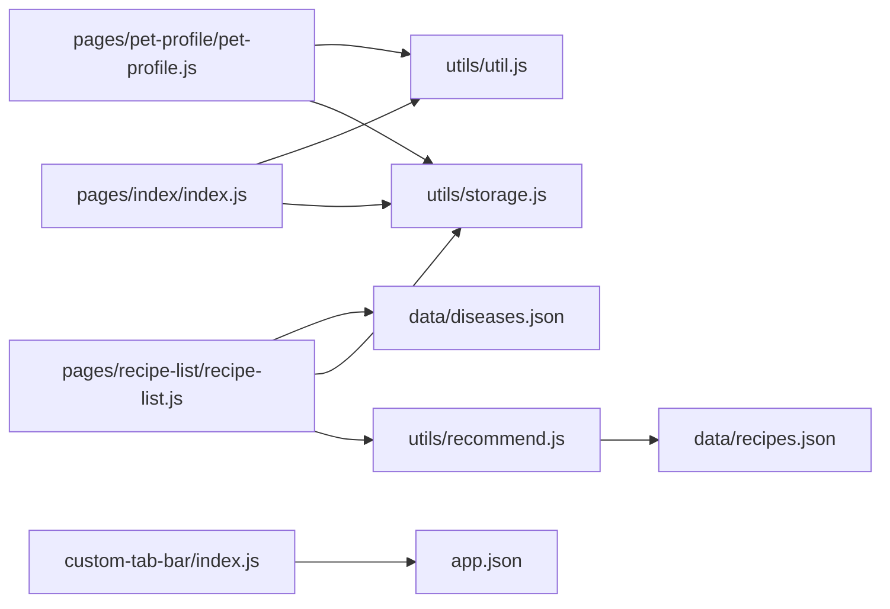

# 扩展开发

<cite>
**本文引用的文件**
- [app.js](file://app.js)
- [app.json](file://app.json)
- [custom-tab-bar/index.js](file://custom-tab-bar/index.js)
- [utils/recommend.js](file://utils/recommend.js)
- [utils/storage.js](file://utils/storage.js)
- [utils/util.js](file://utils/util.js)
- [pages/index/index.js](file://pages/index/index.js)
- [pages/recipe-list/recipe-list.js](file://pages/recipe-list/recipe-list.js)
- [pages/pet-profile/pet-profile.js](file://pages/pet-profile/pet-profile.js)
- [pages/index/index.wxss](file://pages/index/index.wxss)
- [data/recipes.json](file://data/recipes.json)
- [data/breeds.json](file://data/breeds.json)
- [data/allergens.json](file://data/allergens.json)
- [data/diseases.json](file://data/diseases.json)
</cite>

## 目录
1. [简介](#简介)
2. [项目结构](#项目结构)
3. [核心组件](#核心组件)
4. [架构总览](#架构总览)
5. [详细组件分析](#详细组件分析)
6. [依赖关系分析](#依赖关系分析)
7. [性能与可扩展性](#性能与可扩展性)
8. [故障排查指南](#故障排查指南)
9. [结论](#结论)
10. [附录：开发规范与最佳实践](#附录开发规范与最佳实践)

## 简介
本指南面向希望为 Old-baby 项目进行扩展开发的开发者，围绕“页面组件新增”“工具函数扩展”“自定义组件开发”“API 接口扩展”“第三方服务集成”“插件开发最佳实践”以及“功能模块化与代码组织原则”等方面，提供从零到一的完整落地步骤与可视化图示，帮助你在不破坏现有架构的前提下，安全、高效地扩展系统能力。

## 项目结构
Old-baby 采用微信小程序的典型目录组织方式：
- 应用入口与全局配置：app.js、app.json
- 自定义 TabBar：custom-tab-bar
- 页面层：pages 下按功能划分的页面（如首页、宠物档案、食谱列表、食谱详情、我的）
- 工具层：utils 下封装了推荐算法、本地存储、通用工具
- 数据层：data 下存放静态数据（食谱、品种、过敏原、疾病）

图表来源
- [app.js](file://app.js#L1-L21)
- [app.json](file://app.json#L1-L41)
- [custom-tab-bar/index.js](file://custom-tab-bar/index.js#L1-L32)
- [pages/index/index.js](file://pages/index/index.js#L1-L80)
- [pages/pet-profile/pet-profile.js](file://pages/pet-profile/pet-profile.js#L1-L216)
- [pages/recipe-list/recipe-list.js](file://pages/recipe-list/recipe-list.js#L1-L129)
- [utils/recommend.js](file://utils/recommend.js#L1-L109)
- [utils/storage.js](file://utils/storage.js#L1-L155)
- [utils/util.js](file://utils/util.js#L1-L123)
- [data/recipes.json](file://data/recipes.json#L1-L515)
- [data/breeds.json](file://data/breeds.json#L1-L35)
- [data/allergens.json](file://data/allergens.json#L1-L15)
- [data/diseases.json](file://data/diseases.json#L1-L108)

章节来源
- [app.js](file://app.js#L1-L21)
- [app.json](file://app.json#L1-L41)

## 核心组件
- 推荐算法模块：基于宠物的疾病、过敏原、难度偏好等维度，对食谱进行评分与过滤，支持按 ID、按疾病、搜索等查询。
- 本地存储模块：统一管理宠物列表、当前选中宠物、用户信息等键值，提供增删改查与当前宠物上下文读写。
- 通用工具模块：时间格式化、年龄描述、每日喂食量估算、防抖、加载与提示、确认弹窗等。
- 页面控制器：首页负责宠物列表与跳转；宠物档案负责表单输入、校验、保存与删除；食谱列表负责推荐、搜索、筛选与跳转详情。

章节来源
- [utils/recommend.js](file://utils/recommend.js#L1-L109)
- [utils/storage.js](file://utils/storage.js#L1-L155)
- [utils/util.js](file://utils/util.js#L1-L123)
- [pages/index/index.js](file://pages/index/index.js#L1-L80)
- [pages/pet-profile/pet-profile.js](file://pages/pet-profile/pet-profile.js#L1-L216)
- [pages/recipe-list/recipe-list.js](file://pages/recipe-list/recipe-list.js#L1-L129)

## 架构总览
Old-baby 的整体交互链路如下：
- 应用启动时初始化本地存储，随后通过全局配置注册页面与 TabBar。
- 首页展示宠物列表，支持切换当前宠物、查看食谱、编辑健康信息、删除宠物。
- 宠物档案页面负责录入/编辑宠物信息，联动品种数据与校验逻辑。
- 食谱列表根据当前宠物信息调用推荐算法，支持搜索与按疾病筛选，并跳转详情页。

图表来源
- [app.js](file://app.js#L1-L21)
- [app.json](file://app.json#L1-L41)
- [custom-tab-bar/index.js](file://custom-tab-bar/index.js#L1-L32)
- [pages/index/index.js](file://pages/index/index.js#L1-L80)
- [pages/pet-profile/pet-profile.js](file://pages/pet-profile/pet-profile.js#L1-L216)
- [pages/recipe-list/recipe-list.js](file://pages/recipe-list/recipe-list.js#L1-L129)
- [utils/recommend.js](file://utils/recommend.js#L1-L109)
- [utils/storage.js](file://utils/storage.js#L1-L155)

## 详细组件分析

### 页面组件新增流程
新增页面组件遵循“结构创建—逻辑编写—样式设计—路由配置”的四步法。

- 结构创建
  - 在 pages 下新建目录与四个文件：.js/.json/.wxml/.wxss
  - 示例路径参考：pages/new-page/new-page.{js,json,wxml,wxss}
- 逻辑编写
  - 在 .js 中定义 Page({ data, onLoad/onShow, 事件处理等 })
  - 使用 utils 与 data 中的数据进行业务处理
  - 参考现有页面的事件命名与调用方式
- 样式设计
  - 在 .wxss 中定义组件样式，复用主题变量与现有类名
  - 参考首页样式命名规范与布局结构
- 路由配置
  - 在 app.json 的 pages 数组中注册新页面
  - 如需加入 TabBar，更新 tabBar.list 并设置 pagePath 与 text
  - 若为自定义 TabBar，确保与现有组件保持一致的结构与方法

章节来源
- [app.json](file://app.json#L1-L41)
- [pages/index/index.wxss](file://pages/index/index.wxss#L1-L215)

### 工具函数扩展方法
- 新增推荐算法
  - 在 utils/recommend.js 中新增函数，遵循现有评分/过滤/搜索模式
  - 对接 data/recipes.json 的结构，返回标准化对象（含评分、匹配字段等）
  - 提供导出接口，供页面调用
- 新增数据处理函数
  - 在 utils/storage.js 中新增 CRUD 或上下文读写函数
  - 统一使用 wx.get/setStorageSync，捕获异常并返回默认值
  - 在 utils/util.js 中新增通用工具（如格式化、计算、提示等）
- 扩展数据模型
  - 在 data/ 下新增 JSON 文件或扩展现有 JSON 字段
  - 页面通过 require 引入，保持字段命名一致性

章节来源
- [utils/recommend.js](file://utils/recommend.js#L1-L109)
- [utils/storage.js](file://utils/storage.js#L1-L155)
- [utils/util.js](file://utils/util.js#L1-L123)
- [data/recipes.json](file://data/recipes.json#L1-L515)

### 自定义组件开发流程
- 组件创建
  - 在独立目录下创建 .js/.json/.wxml/.wxss
  - 在 .json 中声明 component: true
- 属性定义
  - 在 data 中定义默认值，对外暴露 props 通过传参注入
- 事件处理
  - 在 methods 中定义回调，通过 this.triggerEvent 触发上层事件
- 样式封装
  - 使用局部样式与外部样式类，避免污染全局
  - 复用主题变量，保持视觉一致性

图表来源
- [custom-tab-bar/index.js](file://custom-tab-bar/index.js#L1-L32)

章节来源
- [custom-tab-bar/index.js](file://custom-tab-bar/index.js#L1-L32)

### API 接口扩展指导
- 数据模型扩展
  - 在 data/ 下新增或扩展 JSON，确保字段与页面/工具函数一致
  - 例如新增“体检报告”“用药记录”等，需同步更新 utils/storage.js 的存储结构与页面表单
- 存储结构优化
  - 使用统一的 STORAGE_KEYS，避免魔法字符串
  - 对复杂对象进行分层存储，减少序列化开销
- 推荐算法改进
  - 在 utils/recommend.js 中增加权重参数、动态阈值、多维评分
  - 支持用户反馈（收藏/评分）反向优化评分

章节来源
- [utils/storage.js](file://utils/storage.js#L1-L155)
- [utils/recommend.js](file://utils/recommend.js#L1-L109)
- [data/diseases.json](file://data/diseases.json#L1-L108)

### 第三方服务集成指南
- 微信生态内服务
  - 使用 wx.request 发起网络请求，结合 utils/util.js 的提示与防抖
  - 使用 wx.uploadFile 上传图片/文件，结合头像选择逻辑
- 外部服务
  - 通过云开发或自有后端对接，统一在 utils/network.js 中封装请求层
  - 在页面中以 Promise 形式调用，错误统一处理与提示

（本图为概念示意，未直接映射具体源码文件）

### 插件开发最佳实践
- 将通用能力抽象为插件模块，按需引入
- 使用事件总线或全局状态管理，避免跨页面耦合
- 提供完善的错误边界与降级策略，保证用户体验

（本节为通用指导，不涉及具体源码文件）

## 依赖关系分析
- 页面依赖工具层：首页/宠物档案/食谱列表均依赖 storage 与 util
- 推荐算法依赖数据层：recipes.json、diseases.json
- 自定义 TabBar 依赖全局配置：app.json 的 tabBar 配置

图表来源
- [pages/index/index.js](file://pages/index/index.js#L1-L80)
- [pages/pet-profile/pet-profile.js](file://pages/pet-profile/pet-profile.js#L1-L216)
- [pages/recipe-list/recipe-list.js](file://pages/recipe-list/recipe-list.js#L1-L129)
- [utils/recommend.js](file://utils/recommend.js#L1-L109)
- [utils/storage.js](file://utils/storage.js#L1-L155)
- [utils/util.js](file://utils/util.js#L1-L123)
- [custom-tab-bar/index.js](file://custom-tab-bar/index.js#L1-L32)
- [app.json](file://app.json#L1-L41)
- [data/recipes.json](file://data/recipes.json#L1-L515)
- [data/diseases.json](file://data/diseases.json#L1-L108)

章节来源
- [pages/index/index.js](file://pages/index/index.js#L1-L80)
- [pages/pet-profile/pet-profile.js](file://pages/pet-profile/pet-profile.js#L1-L216)
- [pages/recipe-list/recipe-list.js](file://pages/recipe-list/recipe-list.js#L1-L129)
- [utils/recommend.js](file://utils/recommend.js#L1-L109)
- [utils/storage.js](file://utils/storage.js#L1-L155)
- [utils/util.js](file://utils/util.js#L1-L123)
- [custom-tab-bar/index.js](file://custom-tab-bar/index.js#L1-L32)
- [app.json](file://app.json#L1-L41)
- [data/recipes.json](file://data/recipes.json#L1-L515)
- [data/diseases.json](file://data/diseases.json#L1-L108)

## 性能与可扩展性
- 推荐算法
  - 对 recipes.json 的遍历与过滤应避免重复计算，可缓存中间结果
  - 搜索与筛选建议使用防抖，降低频繁渲染成本
- 存储访问
  - 批量读写时合并 setData，减少页面重排
  - 对大对象序列化前做必要裁剪，避免内存压力
- 样式与资源
  - 图片懒加载、图标字体化，减少首屏阻塞
  - 复用主题变量，减少样式体积与维护成本

（本节为通用指导，不涉及具体源码文件）

## 故障排查指南
- 页面无法跳转
  - 检查 app.json 中 pages 是否正确注册
  - 检查 TabBar 的 pagePath 是否指向有效页面
- 数据不显示或为空
  - 检查 utils/storage.js 的读写是否抛错并返回默认值
  - 检查 app.js 的初始化逻辑是否执行
- 推荐结果异常
  - 检查 utils/recommend.js 的评分/过滤条件是否与 data/recipes.json 字段一致
  - 检查页面是否正确传入当前宠物对象
- 样式不生效
  - 检查 wxss 类名是否与 wxml 绑定一致
  - 检查是否使用了正确的主题变量

章节来源
- [app.json](file://app.json#L1-L41)
- [app.js](file://app.js#L1-L21)
- [utils/storage.js](file://utils/storage.js#L1-L155)
- [utils/recommend.js](file://utils/recommend.js#L1-L109)
- [pages/index/index.wxss](file://pages/index/index.wxss#L1-L215)

## 结论
通过本文档的步骤与图示，你可以安全地在 Old-baby 项目中新增页面组件、扩展工具函数、开发自定义组件、优化推荐算法与数据模型，并合理集成第三方服务与插件。建议在每次扩展后进行端到端测试，确保与现有模块的兼容性与稳定性。

## 附录：开发规范与最佳实践
- 命名规范
  - 文件与目录使用小驼峰或短横线风格，保持一致性
  - 函数命名语义明确，如 getRecommendedRecipes、showConfirm
- 数据约定
  - 所有字段在 data/ 与 utils/storage.js 中保持一致
  - 对外暴露的接口返回标准化对象，便于页面消费
- 错误处理
  - 统一使用 util.js 的提示与确认弹窗
  - 对存储异常进行 try/catch 并降级处理
- 版本与迁移
  - 新增字段时提供默认值，避免破坏旧版本数据
  - 逐步替换旧逻辑，保留兼容路径

（本节为通用指导，不涉及具体源码文件）