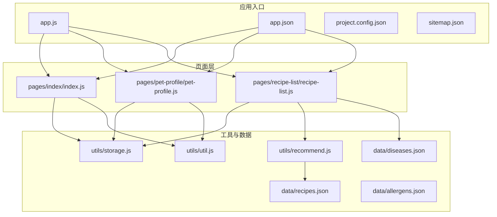
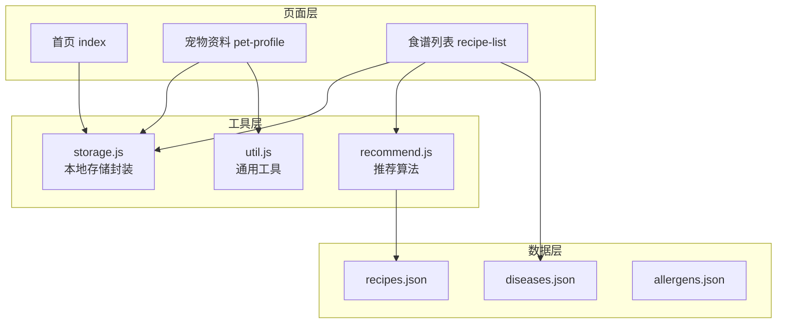
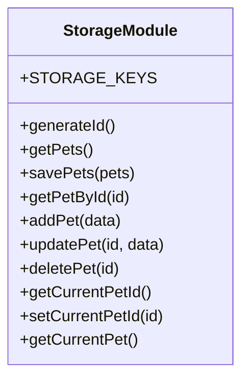
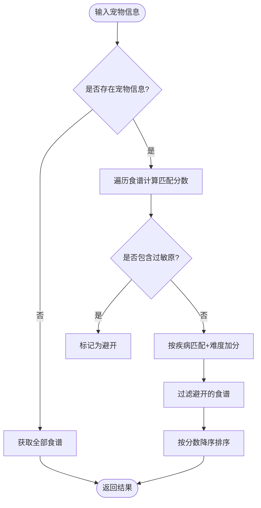
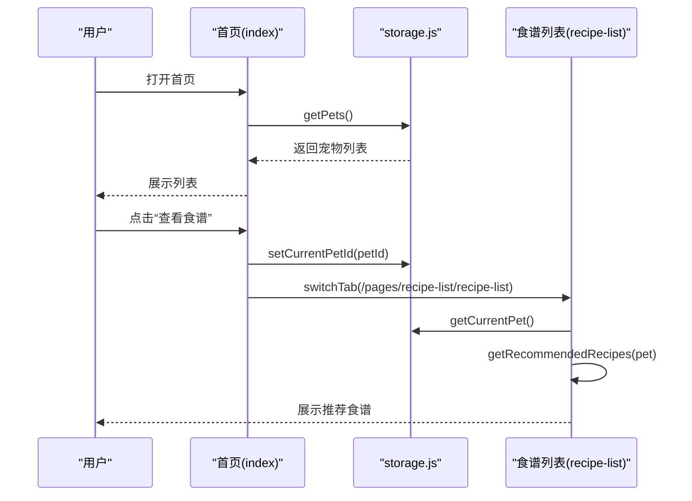
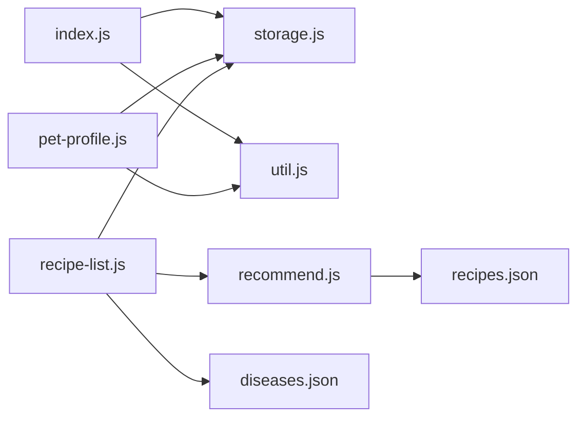

# 调试与测试

<cite>
**本文引用的文件**
- [app.js](file://app.js)
- [app.json](file://app.json)
- [project.config.json](file://project.config.json)
- [sitemap.json](file://sitemap.json)
- [utils/storage.js](file://utils/storage.js)
- [utils/recommend.js](file://utils/recommend.js)
- [utils/util.js](file://utils/util.js)
- [pages/index/index.js](file://pages/index/index.js)
- [pages/recipe-list/recipe-list.js](file://pages/recipe-list/recipe-list.js)
- [pages/pet-profile/pet-profile.js](file://pages/pet-profile/pet-profile.js)
- [data/recipes.json](file://data/recipes.json)
- [data/diseases.json](file://data/diseases.json)
- [data/allergens.json](file://data/allergens.json)
</cite>

## 目录
1. [简介](#简介)
2. [项目结构](#项目结构)
3. [核心组件](#核心组件)
4. [架构总览](#架构总览)
5. [详细组件分析](#详细组件分析)
6. [依赖关系分析](#依赖关系分析)
7. [性能考虑](#性能考虑)
8. [故障排查指南](#故障排查指南)
9. [结论](#结论)
10. [附录](#附录)

## 简介
本指南面向 Old-baby 小程序项目的调试与测试实践，覆盖微信开发者工具的断点调试、网络监控、Storage 检查等能力；提供单元测试与集成测试的设计思路与数据准备建议；介绍性能分析工具的使用方法（内存占用、启动时间等）；并总结常见问题的排查技巧（页面加载失败、数据存储异常、推荐算法错误等）。最后给出自动化测试与持续集成的建议，帮助团队建立稳定的开发与发布流程。

## 项目结构
Old-baby 是一个基于微信小程序框架的“老年宠物护理”应用，采用分页页面与工具模块分离的组织方式：
- 应用入口与全局配置：app.js、app.json、project.config.json、sitemap.json
- 页面层：pages/index、pages/pet-profile、pages/recipe-list、pages/recipe-detail、pages/health-info、pages/my
- 工具与数据：utils/storage.js、utils/recommend.js、utils/util.js
- 数据资源：data/recipes.json、data/diseases.json、data/allergens.json

图表来源
- [app.js](file://app.js#L1-L21)
- [app.json](file://app.json#L1-L41)
- [project.config.json](file://project.config.json#L1-L47)
- [sitemap.json](file://sitemap.json#L1-L8)
- [pages/index/index.js](file://pages/index/index.js#L1-L80)
- [pages/pet-profile/pet-profile.js](file://pages/pet-profile/pet-profile.js#L1-L216)
- [pages/recipe-list/recipe-list.js](file://pages/recipe-list/recipe-list.js#L1-L129)
- [utils/storage.js](file://utils/storage.js#L1-L155)
- [utils/recommend.js](file://utils/recommend.js#L1-L109)
- [utils/util.js](file://utils/util.js#L1-L123)
- [data/recipes.json](file://data/recipes.json#L1-L515)
- [data/diseases.json](file://data/diseases.json#L1-L108)
- [data/allergens.json](file://data/allergens.json#L1-L15)

章节来源
- [app.js](file://app.js#L1-L21)
- [app.json](file://app.json#L1-L41)
- [project.config.json](file://project.config.json#L1-L47)
- [sitemap.json](file://sitemap.json#L1-L8)

## 核心组件
- 全局应用生命周期与初始化：在应用启动时初始化本地存储，确保关键键存在。
- 本地存储封装：统一管理宠物列表、当前选中宠物、用户信息等键值，提供增删改查与错误处理。
- 推荐算法：根据宠物的疾病、过敏原、难度偏好等维度计算匹配分数，过滤并排序食谱。
- 通用工具：时间格式化、年龄描述、每日喂食量估算、防抖、加载与提示、确认弹窗等。
- 页面逻辑：首页展示宠物列表、跳转编辑/查看/删除；宠物资料页表单校验与保存；食谱列表页搜索、筛选与推荐。

章节来源
- [app.js](file://app.js#L1-L21)
- [utils/storage.js](file://utils/storage.js#L1-L155)
- [utils/recommend.js](file://utils/recommend.js#L1-L109)
- [utils/util.js](file://utils/util.js#L1-L123)
- [pages/index/index.js](file://pages/index/index.js#L1-L80)
- [pages/pet-profile/pet-profile.js](file://pages/pet-profile/pet-profile.js#L1-L216)
- [pages/recipe-list/recipe-list.js](file://pages/recipe-list/recipe-list.js#L1-L129)

## 架构总览
Old-baby 的前端架构遵循“页面-工具-数据”的分层设计：
- 页面层负责交互与路由跳转，调用工具模块完成业务逻辑。
- 工具模块封装通用能力与业务算法，供页面复用。
- 数据资源以 JSON 文件形式提供静态数据，推荐模块直接读取。

图表来源
- [pages/index/index.js](file://pages/index/index.js#L1-L80)
- [pages/pet-profile/pet-profile.js](file://pages/pet-profile/pet-profile.js#L1-L216)
- [pages/recipe-list/recipe-list.js](file://pages/recipe-list/recipe-list.js#L1-L129)
- [utils/storage.js](file://utils/storage.js#L1-L155)
- [utils/recommend.js](file://utils/recommend.js#L1-L109)
- [utils/util.js](file://utils/util.js#L1-L123)
- [data/recipes.json](file://data/recipes.json#L1-L515)
- [data/diseases.json](file://data/diseases.json#L1-L108)
- [data/allergens.json](file://data/allergens.json#L1-L15)

## 详细组件分析

### 本地存储模块（storage.js）
职责与特性
- 统一键名常量，避免魔法字符串
- 提供宠物列表的增删改查、当前选中宠物的读写
- 包含错误捕获与日志输出，提升健壮性
- 支持生成唯一 ID，用于新增宠物

图表来源
- [utils/storage.js](file://utils/storage.js#L1-L155)

章节来源
- [utils/storage.js](file://utils/storage.js#L1-L155)

### 推荐算法模块（recommend.js）
职责与特性
- 从 recipes.json 加载食谱数据
- 根据宠物的过敏原、疾病、难度偏好计算匹配分数
- 过滤掉过敏原相关的食谱，按分数降序排列
- 提供搜索、按疾病筛选、获取全部食谱、按 ID 查询等辅助接口

图表来源
- [utils/recommend.js](file://utils/recommend.js#L1-L109)
- [data/recipes.json](file://data/recipes.json#L1-L515)

章节来源
- [utils/recommend.js](file://utils/recommend.js#L1-L109)
- [data/recipes.json](file://data/recipes.json#L1-L515)

### 通用工具模块（util.js）
职责与特性
- 时间格式化、年龄描述、喂食量估算
- 防抖函数，降低频繁触发开销
- 加载提示、消息提示、确认弹窗，统一交互体验

章节来源
- [utils/util.js](file://utils/util.js#L1-L123)

### 页面逻辑（index、pet-profile、recipe-list）
- 首页 index：加载宠物列表、跳转编辑/查看/删除、切换到食谱列表
- 宠物资料 pet-profile：表单校验、保存/更新、继续健康信息、删除
- 食谱列表 recipe-list：加载当前宠物、推荐/搜索/筛选、跳转详情

图表来源
- [pages/index/index.js](file://pages/index/index.js#L1-L80)
- [pages/recipe-list/recipe-list.js](file://pages/recipe-list/recipe-list.js#L1-L129)
- [utils/storage.js](file://utils/storage.js#L1-L155)
- [utils/recommend.js](file://utils/recommend.js#L1-L109)

章节来源
- [pages/index/index.js](file://pages/index/index.js#L1-L80)
- [pages/pet-profile/pet-profile.js](file://pages/pet-profile/pet-profile.js#L1-L216)
- [pages/recipe-list/recipe-list.js](file://pages/recipe-list/recipe-list.js#L1-L129)

## 依赖关系分析
- 页面与工具：各页面通过 require 引入 storage、util、recommend 等模块
- 推荐算法依赖数据：recommend 依赖 recipes.json；recipe-list 依赖 diseases.json
- 应用配置：app.json 控制页面、导航栏与 tabBar；project.config.json 控制编译与运行设置；sitemap.json 控制搜索引擎收录

图表来源
- [pages/index/index.js](file://pages/index/index.js#L1-L80)
- [pages/pet-profile/pet-profile.js](file://pages/pet-profile/pet-profile.js#L1-L216)
- [pages/recipe-list/recipe-list.js](file://pages/recipe-list/recipe-list.js#L1-L129)
- [utils/storage.js](file://utils/storage.js#L1-L155)
- [utils/recommend.js](file://utils/recommend.js#L1-L109)
- [utils/util.js](file://utils/util.js#L1-L123)
- [data/recipes.json](file://data/recipes.json#L1-L515)
- [data/diseases.json](file://data/diseases.json#L1-L108)

章节来源
- [app.json](file://app.json#L1-L41)
- [project.config.json](file://project.config.json#L1-L47)

## 性能考虑
- 启动时间监控
  - 使用微信开发者工具的“性能分析”功能，记录 App.onLaunch 至首屏渲染完成的时间节点，定位耗时环节（如数据读取、页面渲染）。
  - 在关键路径（如首页加载、食谱列表推荐）埋点，统计平均耗时与 P95 分位。
- 内存占用分析
  - 使用“内存分析”查看对象分配与回收情况，关注页面栈深度、长列表渲染、图片资源占用。
  - 对于 recipe-list 的长列表，建议使用虚拟滚动或分页加载，减少一次性渲染的数据量。
- 网络请求优化
  - 若未来接入云开发或远程数据，优先使用缓存策略与并发合并，避免重复请求。
- 代码体积与编译
  - project.config.json 中已启用压缩与最小化，建议结合分包策略进一步优化首屏加载。

[本节为通用性能建议，无需特定文件引用]

## 故障排查指南

### 页面加载失败
- 现象：页面空白或白屏
- 排查步骤
  - 检查 app.json 的 pages 列表与页面路径是否正确
  - 在开发者工具 Console 中查看是否有报错（如 require 失败、语法错误）
  - 确认 sitemap.json 是否允许该页面被索引
- 参考文件
  - [app.json](file://app.json#L1-L41)
  - [sitemap.json](file://sitemap.json#L1-L8)

章节来源
- [app.json](file://app.json#L1-L41)
- [sitemap.json](file://sitemap.json#L1-L8)

### 数据存储异常（Storage）
- 现象：宠物列表为空、当前选中宠物丢失、保存失败
- 排查步骤
  - 使用“Storage”面板查看本地缓存键值，确认 STORAGE_KEYS 是否存在
  - 在 storage.js 的 getPets/savePets 等函数中设置断点，观察异常分支与返回值
  - 检查 app.js 的 onLaunch 中 initStorage 是否执行
- 参考文件
  - [utils/storage.js](file://utils/storage.js#L1-L155)
  - [app.js](file://app.js#L1-L21)

章节来源
- [utils/storage.js](file://utils/storage.js#L1-L155)
- [app.js](file://app.js#L1-L21)

### 推荐算法错误（推荐食谱异常）
- 现象：推荐结果为空、分数异常、过滤失效
- 排查步骤
  - 在 recommend.js 的 getRecommendedRecipes 中设置断点，检查 pet 参数、过敏原与疾病字段
  - 核对 recipes.json 的字段（如 suitableFor、avoidFor、difficulty）是否符合预期
  - 在 recipe-list.js 中验证传入的 currentPet 是否正确
- 参考文件
  - [utils/recommend.js](file://utils/recommend.js#L1-L109)
  - [pages/recipe-list/recipe-list.js](file://pages/recipe-list/recipe-list.js#L1-L129)
  - [data/recipes.json](file://data/recipes.json#L1-L515)

章节来源
- [utils/recommend.js](file://utils/recommend.js#L1-L109)
- [pages/recipe-list/recipe-list.js](file://pages/recipe-list/recipe-list.js#L1-L129)
- [data/recipes.json](file://data/recipes.json#L1-L515)

### 表单校验与保存失败（宠物资料）
- 现象：保存按钮无效、提示错误、数据未更新
- 排查步骤
  - 在 pet-profile.js 的 onSave 中设置断点，检查表单字段与验证逻辑
  - 观察 util.showConfirm 与 util.showToast 的调用链路
  - 确认 storage.addPet/updatePet 的返回值与 setCurrentPetId 的调用
- 参考文件
  - [pages/pet-profile/pet-profile.js](file://pages/pet-profile/pet-profile.js#L1-L216)
  - [utils/util.js](file://utils/util.js#L1-L123)
  - [utils/storage.js](file://utils/storage.js#L1-L155)

章节来源
- [pages/pet-profile/pet-profile.js](file://pages/pet-profile/pet-profile.js#L1-L216)
- [utils/util.js](file://utils/util.js#L1-L123)
- [utils/storage.js](file://utils/storage.js#L1-L155)

## 微信开发者工具调试实操

### 断点调试
- 在目标 JS 文件中设置断点（如 pages/recipe-list/recipe-list.js、utils/recommend.js）
- 打开“调试器”面板，触发对应事件（如点击“查看食谱”、输入搜索词）
- 观察变量变化、调用栈与返回值，定位异常分支

章节来源
- [pages/recipe-list/recipe-list.js](file://pages/recipe-list/recipe-list.js#L1-L129)
- [utils/recommend.js](file://utils/recommend.js#L1-L109)

### 网络监控
- 打开“网络”面板，观察页面请求（如数据文件加载、图片资源）
- 关注响应码、耗时与大小，识别慢请求与异常请求

章节来源
- [data/recipes.json](file://data/recipes.json#L1-L515)
- [data/diseases.json](file://data/diseases.json#L1-L108)

### Storage 检查
- 打开“Storage”面板，查看本地缓存键值（如 pets、currentPetId、userInfo）
- 修改或清空键值后重新进入页面，验证初始化逻辑与容错处理

章节来源
- [utils/storage.js](file://utils/storage.js#L1-L155)
- [app.js](file://app.js#L1-L21)

## 单元测试与集成测试指南

### 测试用例设计
- storage 模块
  - 场景：初始化、读取空列表、添加宠物、更新宠物、删除宠物、设置/获取当前宠物
  - 断言：返回值类型、数量变化、键值一致性
- recommend 模块
  - 场景：无宠物参数、有过敏原、有疾病匹配、难度加分、搜索关键词、按疾病筛选
  - 断言：过滤结果、排序顺序、分数范围
- util 模块
  - 场景：时间格式化、年龄描述、防抖延迟、加载/提示/确认
  - 断言：输出格式、回调时机、Promise 结果

### 测试数据准备
- 使用 data/recipes.json、data/diseases.json、data/allergens.json 作为基准数据
- 构造边界数据：空列表、极端年龄/体重、空字符串、特殊字符
- 模拟异常：Storage 抛错、网络中断（若扩展远程数据）

### 测试执行建议
- 单元测试：优先针对 recommend.js 与 storage.js 的纯函数进行断言测试
- 集成测试：在页面层模拟用户交互（如点击、输入），验证数据流与 UI 更新
- 回归测试：在关键修复后，运行核心场景（添加宠物、查看推荐、搜索筛选）

[本节为测试设计建议，无需特定文件引用]

## 自动化测试与持续集成建议
- 单元测试
  - 使用小程序原生测试框架或第三方测试工具，编写针对 recommend.js、storage.js 的测试用例
  - 将测试脚本纳入构建流程，失败即阻断发布
- 集成测试
  - 使用自动化 UI 测试工具（如自动化框架）录制关键流程（添加宠物、查看推荐、搜索）
  - 在 CI 中执行，输出测试报告与覆盖率
- 持续集成
  - 在 CI 中执行：代码检查、单元测试、集成测试、打包校验
  - 对关键分支（master/main）开启保护，要求测试通过后方可合并
- 性能回归
  - 在 CI 中记录启动时间、内存峰值、页面渲染耗时，对比阈值并告警

[本节为流程建议，无需特定文件引用]

## 结论
Old-baby 项目通过清晰的分层设计与工具模块封装，实现了从宠物管理到食谱推荐的核心功能。借助微信开发者工具的断点调试、网络监控与 Storage 检查，可以快速定位页面加载、数据存储与推荐算法的问题。结合单元与集成测试、以及持续集成流程，能够有效保障质量与稳定性，并为后续扩展（如云开发、远程数据）奠定基础。