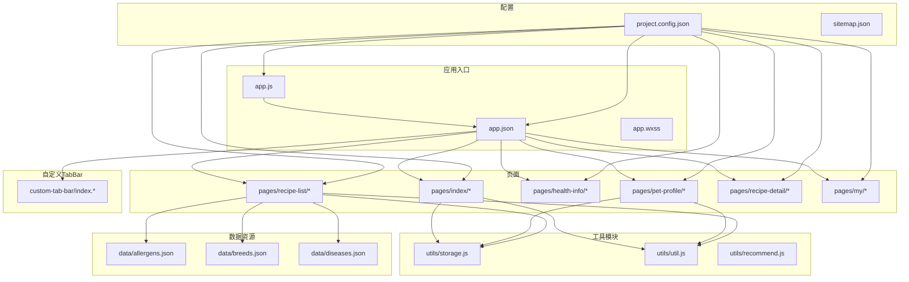
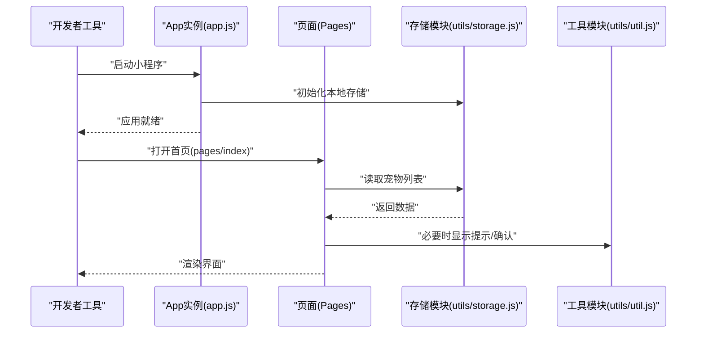
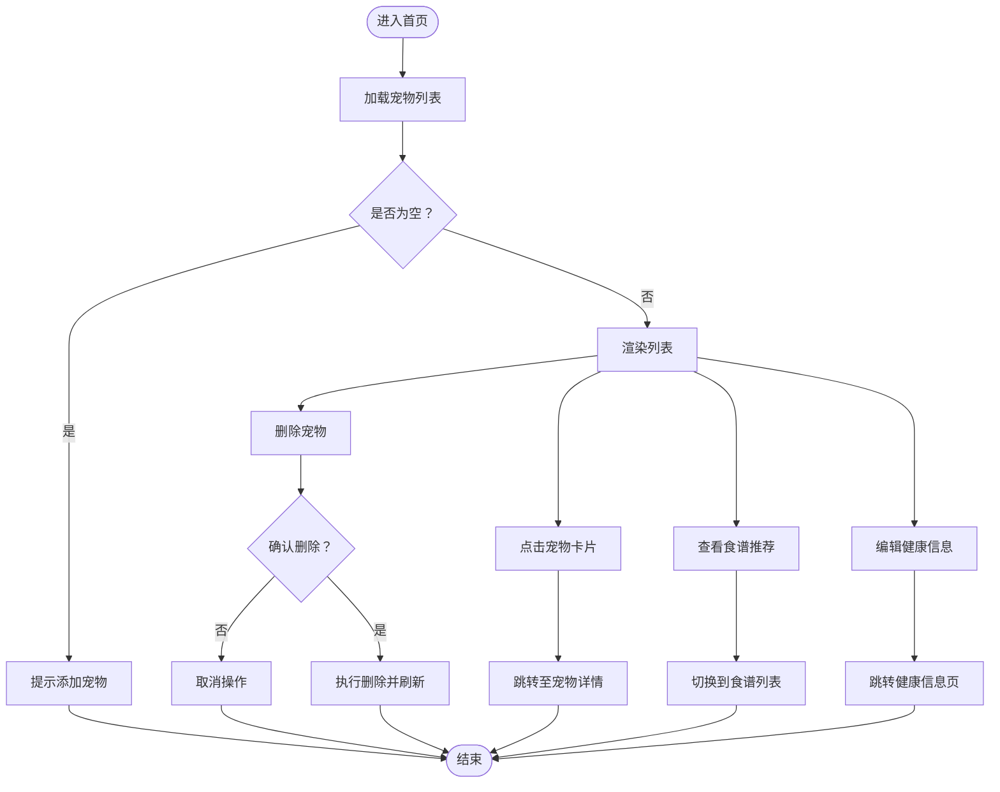
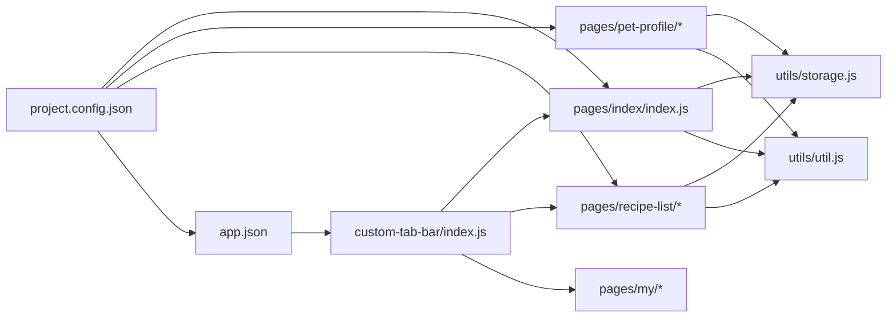

# 快速开始

<cite>
**本文引用的文件**
- [app.js](file://app.js)
- [app.json](file://app.json)
- [project.config.json](file://project.config.json)
- [sitemap.json](file://sitemap.json)
- [pages/index/index.js](file://pages/index/index.js)
- [pages/index/index.json](file://pages/index/index.json)
- [utils/storage.js](file://utils/storage.js)
- [utils/util.js](file://utils/util.js)
- [custom-tab-bar/index.js](file://custom-tab-bar/index.js)
- [data/allergens.json](file://data/allergens.json)
- [data/breeds.json](file://data/breeds.json)
- [data/diseases.json](file://data/diseases.json)
</cite>

## 目录
1. [简介](#简介)
2. [项目结构](#项目结构)
3. [核心组件](#核心组件)
4. [架构总览](#架构总览)
5. [详细组件分析](#详细组件分析)
6. [依赖分析](#依赖分析)
7. [性能考虑](#性能考虑)
8. [故障排查指南](#故障排查指南)
9. [结论](#结论)
10. [附录](#附录)

## 简介
本指南面向首次接触 Old-baby 小程序的新手开发者，帮助你在最短时间内完成开发环境搭建、项目导入与首次运行，并理解项目的基本配置与运行流程。你将学会：
- 安装与配置微信开发者工具
- 导入 Old-baby 项目并在模拟器中运行
- 理解关键配置文件的作用与常用选项
- 掌握基础调试方法与常见问题排查

## 项目结构
Old-baby 是一个基于微信小程序框架的“老年宠物护理”应用，采用典型的分页式页面组织与工具模块化设计。核心目录与文件如下：
- 应用入口：app.js、app.json、app.wxss
- 页面：pages/index、pages/pet-profile、pages/health-info、pages/recipe-list、pages/recipe-detail、pages/my
- 自定义 TabBar：custom-tab-bar/index.*
- 数据资源：data/*.json（致敏原、品种、疾病等）
- 工具模块：utils/storage.js、utils/util.js、utils/recommend.js
- 其他配置：project.config.json、sitemap.json

图表来源
- [app.json](file://app.json#L1-L41)
- [project.config.json](file://project.config.json#L1-L47)
- [pages/index/index.js](file://pages/index/index.js#L1-L80)
- [utils/storage.js](file://utils/storage.js#L1-L155)
- [utils/util.js](file://utils/util.js#L1-L123)
- [custom-tab-bar/index.js](file://custom-tab-bar/index.js#L1-L32)
- [data/allergens.json](file://data/allergens.json#L1-L15)
- [data/breeds.json](file://data/breeds.json#L1-L35)
- [data/diseases.json](file://data/diseases.json#L1-L108)

章节来源
- [app.json](file://app.json#L1-L41)
- [project.config.json](file://project.config.json#L1-L47)

## 核心组件
- 应用生命周期与全局数据：应用启动时初始化本地存储；提供全局数据如当前选中宠物 ID。
- 页面导航与交互：首页负责宠物列表展示与管理，支持添加、查看、编辑、删除；通过工具模块实现数据持久化与通用提示。
- 自定义 TabBar：提供三个底部导航项，支持切换到首页、食谱列表与我的页面。
- 数据资源：包含致敏原、犬种与常见疾病的数据字典，用于食谱推荐与健康信息维护。

章节来源
- [app.js](file://app.js#L1-L21)
- [pages/index/index.js](file://pages/index/index.js#L1-L80)
- [custom-tab-bar/index.js](file://custom-tab-bar/index.js#L1-L32)
- [utils/storage.js](file://utils/storage.js#L1-L155)
- [utils/util.js](file://utils/util.js#L1-L123)
- [data/allergens.json](file://data/allergens.json#L1-L15)
- [data/breeds.json](file://data/breeds.json#L1-L35)
- [data/diseases.json](file://data/diseases.json#L1-L108)

## 架构总览
下图展示了从应用启动到页面渲染的关键路径，以及页面与工具模块之间的协作关系。

图表来源
- [app.js](file://app.js#L1-L21)
- [pages/index/index.js](file://pages/index/index.js#L1-L80)
- [utils/storage.js](file://utils/storage.js#L1-L155)
- [utils/util.js](file://utils/util.js#L1-L123)

## 详细组件分析

### 应用入口与全局配置
- app.js：应用启动时调用初始化逻辑，确保本地存储中存在必要的键值；提供全局数据对象，便于跨页面共享。
- app.json：声明页面路由、窗口样式、导航栏与自定义 TabBar 的配置；声明 sitemap 文件位置与编译风格。
- project.config.json：开发者工具的工程配置，包含打包策略、编译选项、小程序版本与 appid 等。
- sitemap.json：搜索引擎收录规则，允许所有页面被索引。

章节来源
- [app.js](file://app.js#L1-L21)
- [app.json](file://app.json#L1-L41)
- [project.config.json](file://project.config.json#L1-L47)
- [sitemap.json](file://sitemap.json#L1-L8)

### 页面与交互流程（以首页为例）
首页负责宠物列表的展示与管理，典型交互包括：
- 加载宠物列表
- 添加新宠物
- 点击宠物卡片跳转详情
- 查看食谱推荐
- 编辑健康信息
- 删除宠物（带二次确认）

图表来源
- [pages/index/index.js](file://pages/index/index.js#L1-L80)
- [utils/storage.js](file://utils/storage.js#L1-L155)
- [utils/util.js](file://utils/util.js#L1-L123)

章节来源
- [pages/index/index.js](file://pages/index/index.js#L1-L80)
- [pages/index/index.json](file://pages/index/index.json#L1-L5)

### 自定义 TabBar 组件
- 自定义 TabBar 提供三个导航项，点击后通过 wx.switchTab 切换页面。
- 与 app.json 中的 tabBar 配置配合使用，实现统一的底部导航体验。

章节来源
- [custom-tab-bar/index.js](file://custom-tab-bar/index.js#L1-L32)
- [app.json](file://app.json#L17-L37)

### 工具模块：存储与通用工具
- 存储模块（storage.js）：封装本地存储的增删改查，提供生成唯一 ID、获取/设置当前选中宠物等能力。
- 通用工具（util.js）：提供时间格式化、年龄描述、每日喂食量估算、防抖、加载与提示、确认弹窗等工具函数。

章节来源
- [utils/storage.js](file://utils/storage.js#L1-L155)
- [utils/util.js](file://utils/util.js#L1-L123)

### 数据资源
- 致敏原（allergens.json）：列出常见致敏食材及其分类，用于食谱匹配与健康提醒。
- 品种（breeds.json）：覆盖主流犬种及体型分类，辅助个性化推荐。
- 疾病（diseases.json）：列举老年犬常见疾病及其饮食建议，支撑健康信息维护。

章节来源
- [data/allergens.json](file://data/allergens.json#L1-L15)
- [data/breeds.json](file://data/breeds.json#L1-L35)
- [data/diseases.json](file://data/diseases.json#L1-L108)

## 依赖分析
- 页面与工具模块：各页面通过 require 引入工具模块，形成“页面层 → 工具层”的清晰依赖。
- 自定义 TabBar 与页面：TabBar 组件通过 wx.switchTab 与页面建立运行时依赖。
- 配置文件：project.config.json 控制编译与打包策略；app.json 决定页面路由与 UI 行为。

图表来源
- [pages/index/index.js](file://pages/index/index.js#L1-L80)
- [utils/storage.js](file://utils/storage.js#L1-L155)
- [utils/util.js](file://utils/util.js#L1-L123)
- [custom-tab-bar/index.js](file://custom-tab-bar/index.js#L1-L32)
- [app.json](file://app.json#L1-L41)
- [project.config.json](file://project.config.json#L1-L47)

章节来源
- [app.json](file://app.json#L1-L41)
- [project.config.json](file://project.config.json#L1-L47)

## 性能考虑
- 使用工具模块统一处理本地存储与提示，减少重复代码与潜在错误。
- 在页面切换与数据更新时，尽量避免不必要的 setData 调用，保持渲染性能。
- 对高频操作（如输入框事件）可结合防抖工具降低触发频率。

## 故障排查指南
- 无法在模拟器中打开页面
  - 检查 app.json 中的 pages 列表是否包含目标页面路径。
  - 确认页面文件夹命名与路径一致，且包含 .js/.json/.wxml/.wxss。
- 自定义 TabBar 不生效
  - 确认 app.json 的 tabBar.custom 为 true，并正确配置 list 中的 pagePath。
  - 确保自定义组件文件存在且未被忽略打包。
- 本地存储相关报错
  - 检查 storage.js 的读写封装是否抛出异常；确认设备/模拟器支持本地存储。
- 数据未显示或为空
  - 首次运行时需先添加宠物；检查 storage.js 是否正确初始化默认数据。
- 编译或热更新异常
  - 参考 project.config.json 中的编译与打包设置，必要时关闭某些优化选项以定位问题。

章节来源
- [app.json](file://app.json#L1-L41)
- [project.config.json](file://project.config.json#L1-L47)
- [utils/storage.js](file://utils/storage.js#L1-L155)

## 结论
通过本指南，你已经完成了 Old-baby 项目的开发环境准备、项目导入与首次运行，并理解了关键配置文件与核心模块的作用。建议在熟悉首页交互后，逐步探索宠物资料、健康信息与食谱推荐等页面，结合工具模块与数据资源加深对业务流程的理解。

## 附录

### 开发环境搭建与首次运行
- 安装微信开发者工具
  - 在官网下载并安装最新版本的微信开发者工具。
- 导入项目
  - 打开开发者工具，选择“添加项目”，填写 appid（测试号即可）、项目目录与编译类型（小程序）。
  - 点击导入，等待构建完成。
- 运行项目
  - 在左侧选择模拟器机型，点击“编译”或“预览”按钮启动。
  - 首次运行会自动初始化本地存储，可在首页添加第一条宠物记录。
- 基本调试
  - 使用控制台查看日志输出；在页面中使用工具模块提供的提示函数验证交互。
  - 如需真机调试，可在开发者工具中开启“真机调试”。

### 关键配置文件说明
- app.json
  - pages：声明小程序页面路由列表。
  - window：设置导航栏与窗口背景等样式。
  - tabBar：启用自定义 TabBar 并配置颜色、图标与导航项。
  - sitemapLocation：指定 sitemap 文件路径。
  - style：编译风格（v2）。
- project.config.json
  - setting：包含编译优化、打包策略、API 开关等大量配置项。
  - compileType：编译类型（miniprogram）。
  - libVersion：基础库版本。
  - appid：小程序 appid。
  - projectname：项目名称。
- sitemap.json
  - rules：声明页面收录规则（示例允许所有页面被索引）。

章节来源
- [app.json](file://app.json#L1-L41)
- [project.config.json](file://project.config.json#L1-L47)
- [sitemap.json](file://sitemap.json#L1-L8)