# 宠物品种数据库

<cite>
**本文档引用的文件**
- [breeds.json](file://data/breeds.json)
- [pet-profile.js](file://pages/pet-profile/pet-profile.js)
- [pet-profile.wxml](file://pages/pet-profile/pet-profile.wxml)
- [storage.js](file://utils/storage.js)
- [recommend.js](file://utils/recommend.js)
- [recipes.json](file://data/recipes.json)
- [health-info.js](file://pages/health-info/health-info.js)
- [util.js](file://utils/util.js)
- [allergens.json](file://data/allergens.json)
- [diseases.json](file://data/diseases.json)
</cite>

## 目录
1. [简介](#简介)
2. [项目结构](#项目结构)
3. [核心组件](#核心组件)
4. [架构概览](#架构概览)
5. [详细组件分析](#详细组件分析)
6. [依赖关系分析](#依赖关系分析)
7. [性能考虑](#性能考虑)
8. [故障排除指南](#故障排除指南)
9. [结论](#结论)
10. [附录](#附录)

## 简介

这是一个基于微信小程序的宠物健康管理应用，专注于提供科学的宠物食谱推荐服务。该应用的核心功能是通过宠物的品种信息来推荐最适合的食谱，帮助宠物主人为爱宠提供个性化的营养方案。

应用采用模块化设计，包含宠物档案管理、健康信息记录、食谱推荐等功能模块。其中，品种数据库作为食谱推荐系统的重要基础数据，直接影响着推荐算法的准确性和实用性。

## 项目结构

该项目采用典型的微信小程序目录结构，主要分为以下几个核心部分：

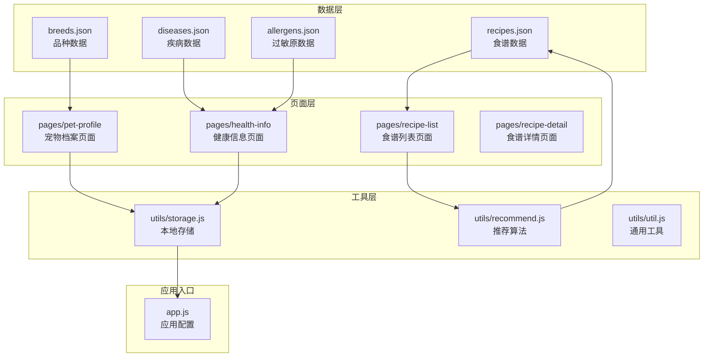

**图表来源**
- [breeds.json](file://data/breeds.json#L1-L35)
- [recipes.json](file://data/recipes.json#L1-L515)
- [pet-profile.js](file://pages/pet-profile/pet-profile.js#L1-L216)
- [health-info.js](file://pages/health-info/health-info.js#L1-L190)

**章节来源**
- [app.js](file://app.js#L1-L21)
- [pet-profile.js](file://pages/pet-profile/pet-profile.js#L1-L216)

## 核心组件

### 品种数据库核心结构

品种数据库采用JSON格式存储，每个品种包含三个核心字段：

| 字段名 | 数据类型 | 取值范围 | 业务含义 | 示例值 |
|--------|----------|----------|----------|--------|
| id | 字符串 | 英文字母+下划线 | 品种唯一标识符 | "golden", "labrador" |
| name | 字符串 | 中文名称 | 品种中文名称 | "金毛寻回犬", "拉布拉多" |
| size | 字符串 | "small", "medium", "large", "giant" | 体型分类 | "large", "medium" |

### 体型分类标准

应用定义了四个标准化的体型分类，用于指导食谱推荐：

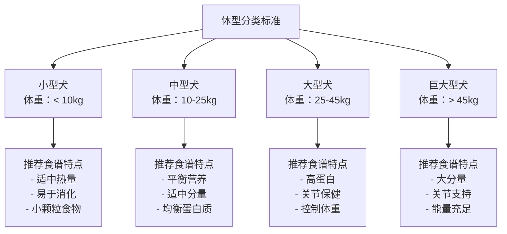

**图表来源**
- [breeds.json](file://data/breeds.json#L1-L35)

**章节来源**
- [breeds.json](file://data/breeds.json#L1-L35)

## 架构概览

应用采用分层架构设计，从底层数据存储到上层用户界面形成清晰的层次结构：

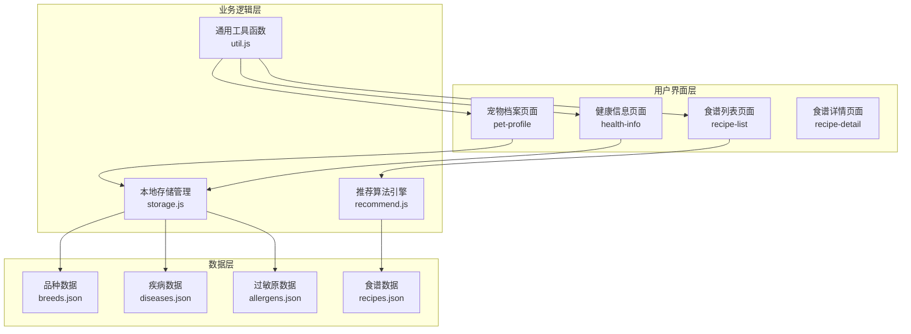

**图表来源**
- [pet-profile.js](file://pages/pet-profile/pet-profile.js#L1-L216)
- [health-info.js](file://pages/health-info/health-info.js#L1-L190)
- [recommend.js](file://utils/recommend.js#L1-L109)
- [storage.js](file://utils/storage.js#L1-L155)

## 详细组件分析

### 品种数据模型分析

#### 数据结构设计

品种数据采用简洁而高效的数据结构，每个品种对象包含三个必需字段：

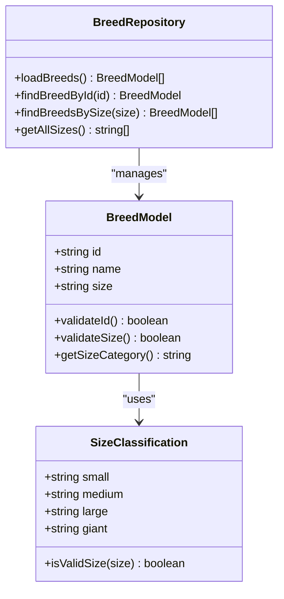

**图表来源**
- [breeds.json](file://data/breeds.json#L1-L35)

#### 数据验证机制

应用实现了完善的字段验证机制：

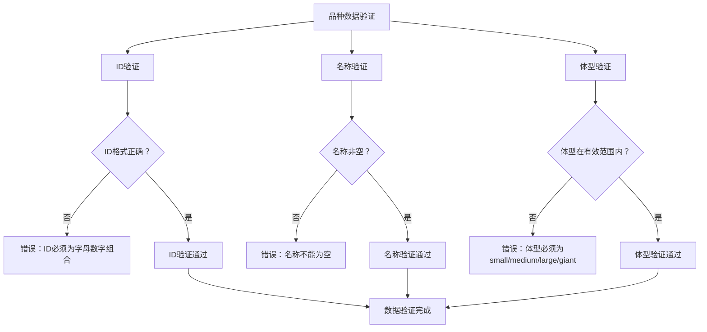

**图表来源**
- [pet-profile.js](file://pages/pet-profile/pet-profile.js#L145-L162)

**章节来源**
- [breeds.json](file://data/breeds.json#L1-L35)
- [pet-profile.js](file://pages/pet-profile/pet-profile.js#L145-L162)

### 品种选择器组件

#### 用户交互流程

品种选择器提供了完整的用户交互体验：

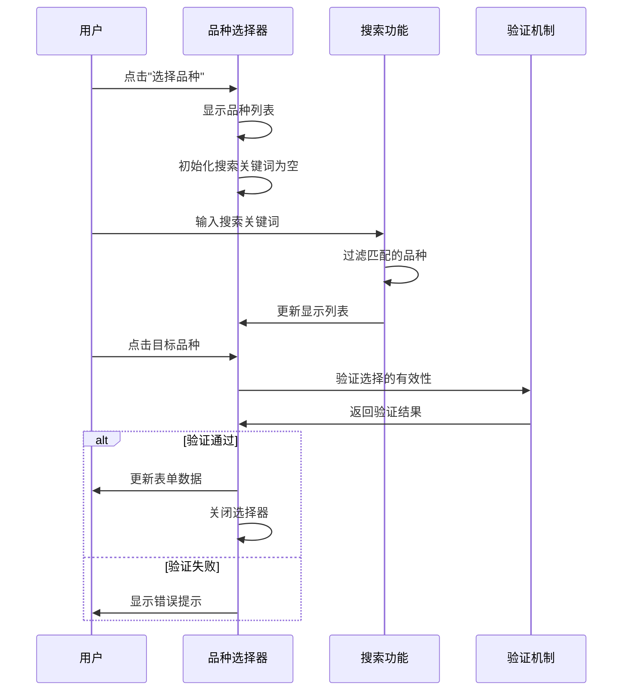

**图表来源**
- [pet-profile.js](file://pages/pet-profile/pet-profile.js#L104-L139)
- [pet-profile.wxml](file://pages/pet-profile/pet-profile.wxml#L111-L141)

#### 搜索过滤机制

应用实现了智能的搜索过滤功能：

| 功能特性 | 实现方式 | 效果 |
|----------|----------|------|
| 实时搜索 | 键盘输入事件监听 | 输入即响应 |
| 不区分大小写 | 转换为小写进行比较 | 提升用户体验 |
| 模糊匹配 | 包含匹配算法 | 扩大匹配范围 |
| 结果高亮 | 条件渲染样式 | 视觉反馈 |

**章节来源**
- [pet-profile.js](file://pages/pet-profile/pet-profile.js#L120-L129)
- [pet-profile.wxml](file://pages/pet-profile/pet-profile.wxml#L117-L139)

### 食谱推荐系统集成

#### 推荐算法工作原理

食谱推荐系统与品种数据库深度集成：

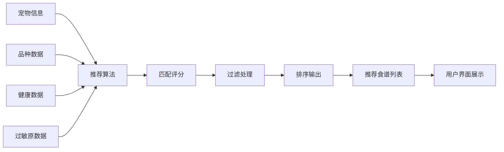

**图表来源**
- [recommend.js](file://utils/recommend.js#L10-L66)
- [storage.js](file://utils/storage.js#L44-L47)

**章节来源**
- [recommend.js](file://utils/recommend.js#L10-L66)
- [storage.js](file://utils/storage.js#L44-L47)

### 数据持久化管理

#### 本地存储策略

应用采用微信小程序的本地存储API实现数据持久化：

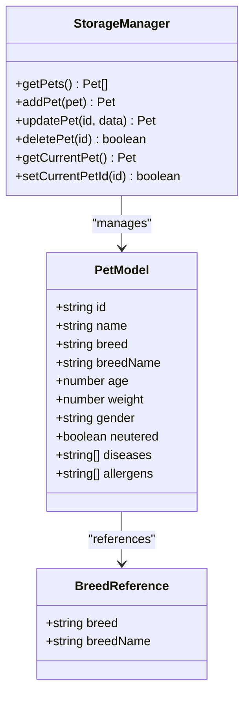

**图表来源**
- [storage.js](file://utils/storage.js#L44-L98)
- [pet-profile.js](file://pages/pet-profile/pet-profile.js#L164-L168)

**章节来源**
- [storage.js](file://utils/storage.js#L44-L98)
- [pet-profile.js](file://pages/pet-profile/pet-profile.js#L164-L168)

## 依赖关系分析

### 模块间依赖关系

应用各模块之间形成了清晰的依赖关系：

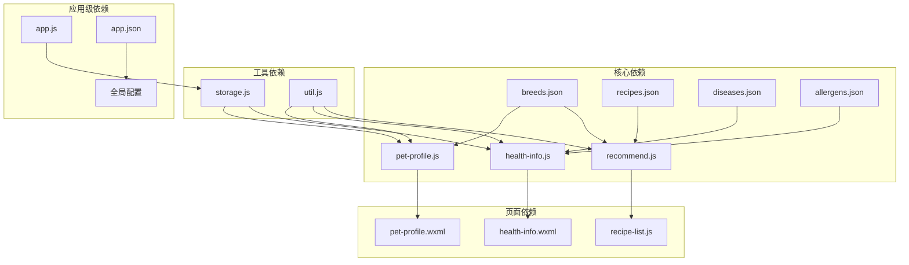

**图表来源**
- [pet-profile.js](file://pages/pet-profile/pet-profile.js#L2-L4)
- [health-info.js](file://pages/health-info/health-info.js#L2-L5)
- [recommend.js](file://utils/recommend.js#L3)

**章节来源**
- [pet-profile.js](file://pages/pet-profile/pet-profile.js#L2-L4)
- [health-info.js](file://pages/health-info/health-info.js#L2-L5)
- [recommend.js](file://utils/recommend.js#L3)

### 数据流分析

应用内部的数据流转形成了完整的信息链路：

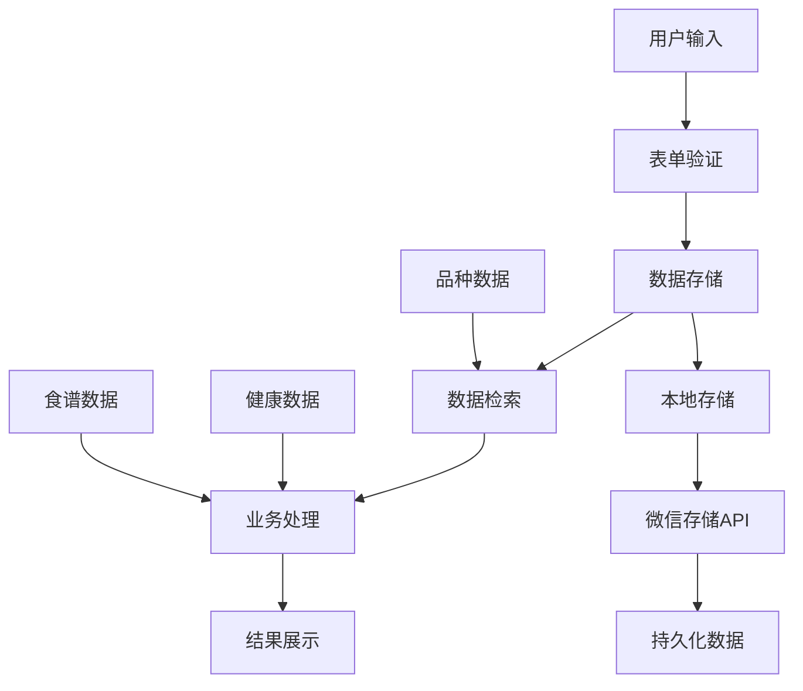

**图表来源**
- [pet-profile.js](file://pages/pet-profile/pet-profile.js#L145-L190)
- [storage.js](file://utils/storage.js#L19-L26)

**章节来源**
- [pet-profile.js](file://pages/pet-profile/pet-profile.js#L145-L190)
- [storage.js](file://utils/storage.js#L19-L26)

## 性能考虑

### 数据访问优化

应用在数据访问方面采用了多项优化策略：

1. **内存缓存机制**：品种数据在页面加载时一次性载入内存，避免重复I/O操作
2. **防抖搜索**：搜索功能采用防抖技术，减少频繁的DOM更新
3. **懒加载策略**：食谱数据仅在需要时才进行处理和排序

### 存储性能优化

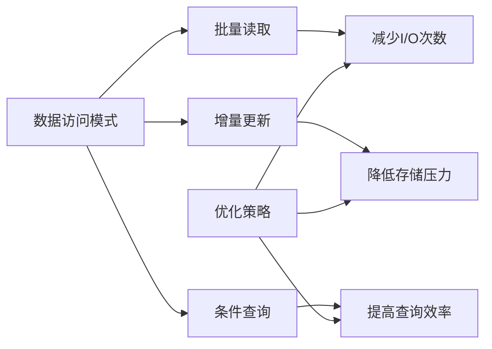

**图表来源**
- [storage.js](file://utils/storage.js#L19-L26)
- [pet-profile.js](file://pages/pet-profile/pet-profile.js#L120-L129)

## 故障排除指南

### 常见问题及解决方案

#### 品种数据加载失败

**问题现象**：品种选择器无法显示任何选项

**可能原因**：
1. breeds.json文件损坏或格式错误
2. 文件路径配置错误
3. 权限问题导致文件无法读取

**解决步骤**：
1. 检查breeds.json文件格式是否正确
2. 验证文件路径是否指向正确的相对位置
3. 确认文件权限设置

#### 数据验证错误

**问题现象**：保存宠物信息时报错

**可能原因**：
1. 必填字段缺失
2. 年龄或体重格式不正确
3. 品种选择无效

**解决步骤**：
1. 检查所有必填字段是否已填写
2. 确认年龄和体重为有效数字
3. 验证品种选择是否来自官方列表

#### 推荐算法异常

**问题现象**：食谱推荐结果不符合预期

**可能原因**：
1. 品种数据缺失或不完整
2. 健康信息冲突
3. 过敏原数据不准确

**解决步骤**：
1. 检查breeds.json中对应品种的size字段
2. 验证健康信息的准确性
3. 确认过敏原列表的完整性

**章节来源**
- [pet-profile.js](file://pages/pet-profile/pet-profile.js#L145-L162)
- [storage.js](file://utils/storage.js#L20-L25)

## 结论

该宠物品种数据库项目展现了良好的软件工程实践，具有以下突出特点：

1. **数据模型简洁明确**：品种数据采用标准化的三字段设计，易于理解和扩展
2. **用户交互体验优秀**：提供了直观的品种选择和搜索功能
3. **系统集成度高**：与食谱推荐系统无缝集成，形成完整的解决方案
4. **代码结构清晰**：模块划分合理，职责分离明确

通过持续的维护和扩展，该系统能够为宠物主人提供更加精准和个性化的食谱推荐服务。

## 附录

### 品种数据维护指南

#### 新增品种的标准流程

1. **命名规范**
   - 使用英文小写字母和下划线
   - 语义化命名，避免缩写
   - 保持命名一致性

2. **数据格式要求**
   - 确保JSON格式正确
   - 验证字段完整性
   - 测试数据有效性

3. **测试验证**
   - 在开发环境中测试
   - 验证UI显示效果
   - 确认推荐算法兼容性

#### 支持的体型分类

| 体型类别 | 适用范围 | 特殊说明 |
|----------|----------|----------|
| small | 体重 < 10kg | 小型犬专用食谱 |
| medium | 10kg ≤ 体重 < 25kg | 中等体型犬食谱 |
| large | 25kg ≤ 体重 < 45kg | 大型犬专用食谱 |
| giant | 体重 ≥ 45kg | 巨大型犬食谱 |

#### 实际使用示例

**在宠物档案页面中调用和显示品种信息**：

1. 页面加载时自动载入品种数据
2. 用户点击"选择品种"触发选择器
3. 支持搜索和过滤功能
4. 选择后自动更新表单显示

**推荐食谱的使用场景**：

1. 用户完成健康信息填写后查看推荐
2. 系统根据品种和健康状况智能匹配
3. 提供个性化的食谱建议