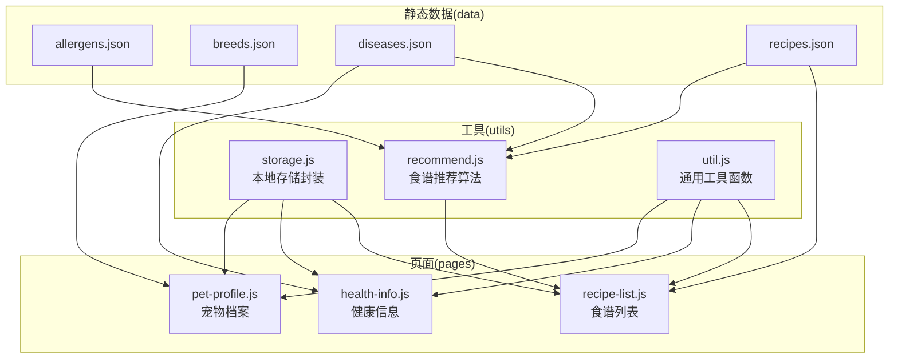
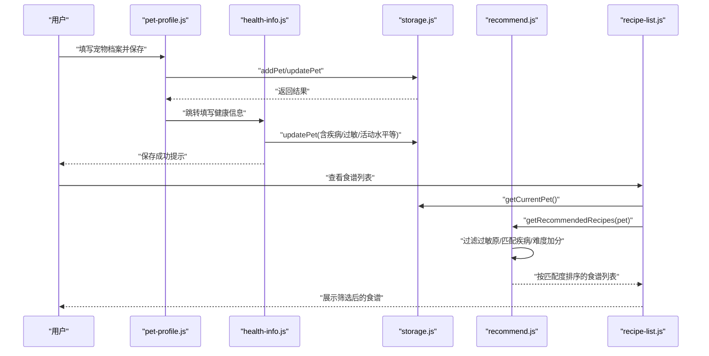
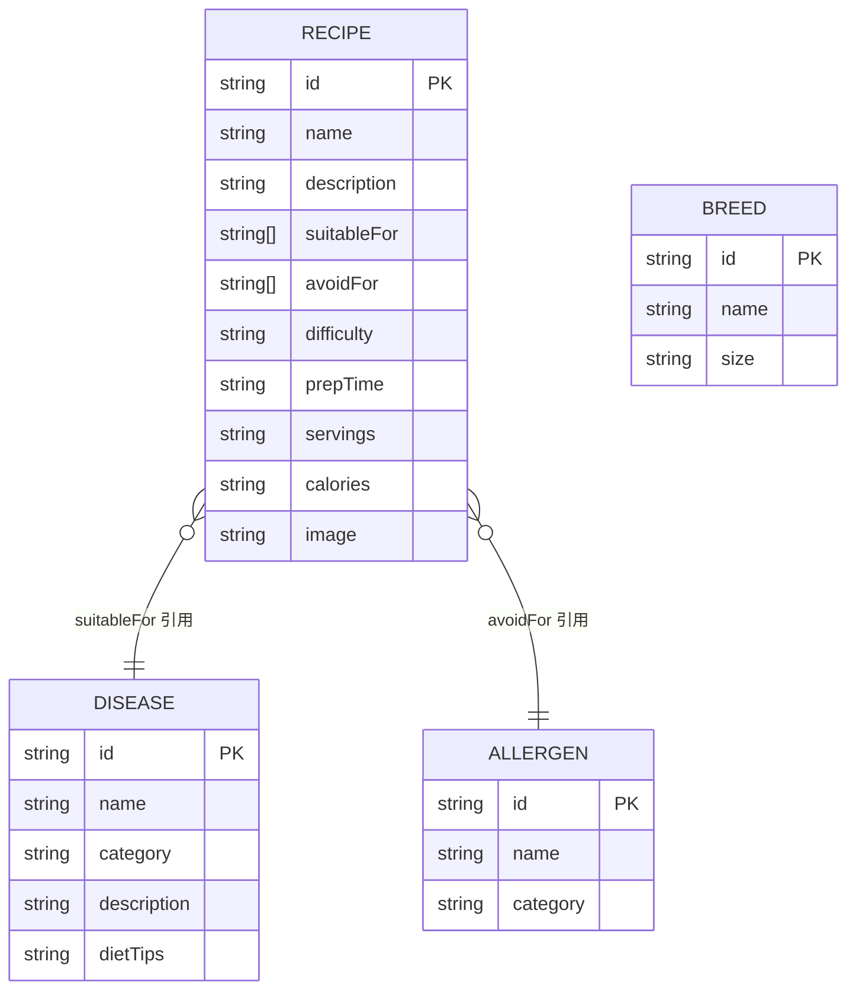
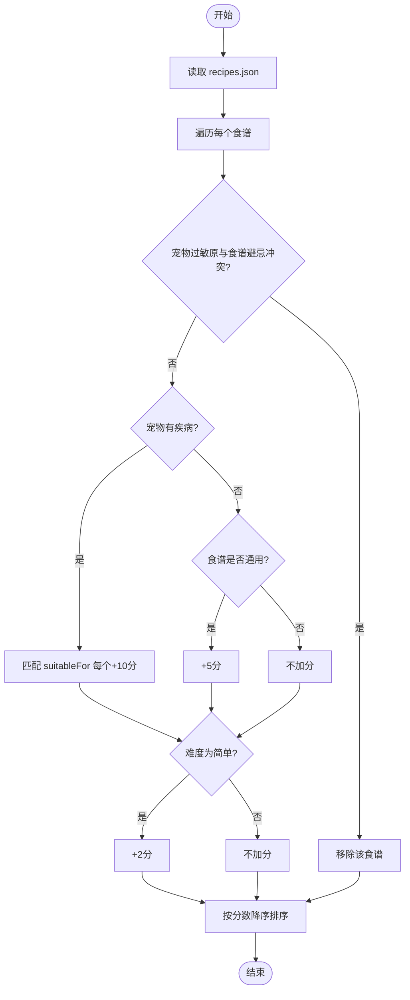
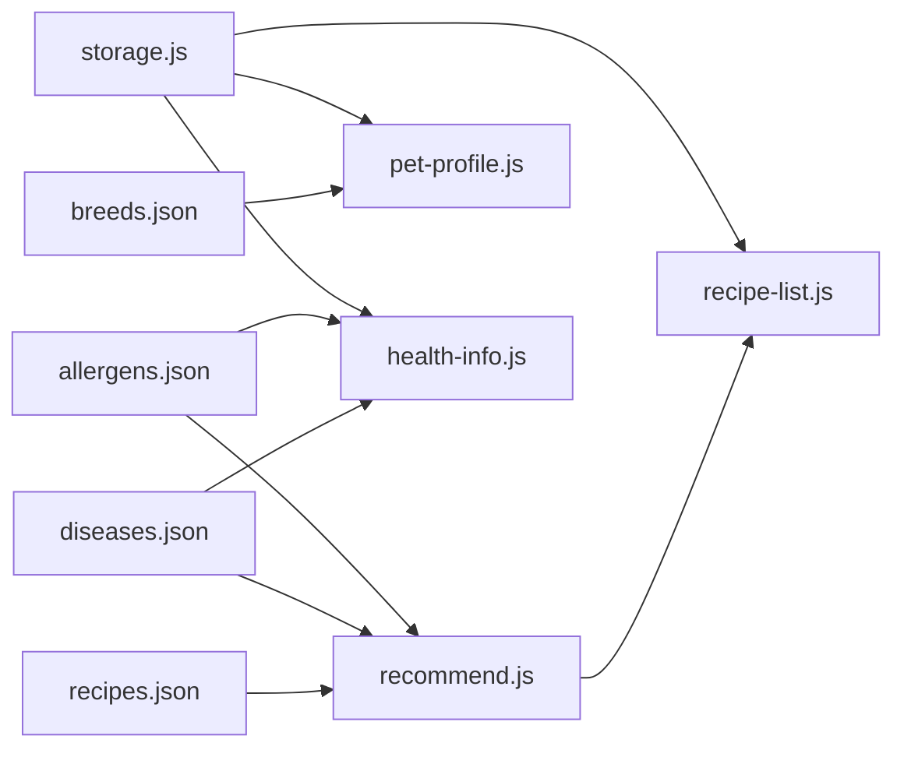

# 数据系统

<cite>
**本文引用的文件**
- [data/allergens.json](file://data/allergens.json)
- [data/breeds.json](file://data/breeds.json)
- [data/diseases.json](file://data/diseases.json)
- [data/recipes.json](file://data/recipes.json)
- [utils/recommend.js](file://utils/recommend.js)
- [utils/storage.js](file://utils/storage.js)
- [utils/util.js](file://utils/util.js)
- [pages/health-info/health-info.js](file://pages/health-info/health-info.js)
- [pages/pet-profile/pet-profile.js](file://pages/pet-profile/pet-profile.js)
- [pages/recipe-list/recipe-list.js](file://pages/recipe-list/recipe-list.js)
- [app.js](file://app.js)
</cite>

## 目录
1. [简介](#简介)
2. [项目结构](#项目结构)
3. [核心组件](#核心组件)
4. [架构总览](#架构总览)
5. [详细组件分析](#详细组件分析)
6. [依赖关系分析](#依赖关系分析)
7. [性能与可维护性](#性能与可维护性)
8. [故障排查指南](#故障排查指南)
9. [结论](#结论)
10. [附录：数据模型与字段说明](#附录数据模型与字段说明)

## 简介
本文件系统性梳理 Old-baby 项目的静态数据资产与数据驱动逻辑，覆盖宠物品种、疾病类型、过敏原、食谱信息等核心数据的组织结构、字段语义、数据验证规则、模型间关系与约束，并给出数据导入导出、版本管理与迁移的最佳实践建议。同时，结合前端页面与工具模块，解释数据在应用中的使用方式与推荐机制。

## 项目结构
项目采用“静态数据 + 工具模块 + 页面逻辑”的分层组织：
- 静态数据位于 data 目录，采用 JSON 文件形式存放，便于版本管理与人工校验。
- 工具模块位于 utils 目录，封装存储、推荐算法与通用工具函数。
- 页面逻辑位于 pages 目录，负责用户交互、表单输入、数据展示与跳转。

图表来源
- [data/allergens.json](file://data/allergens.json#L1-L15)
- [data/breeds.json](file://data/breeds.json#L1-L35)
- [data/diseases.json](file://data/diseases.json#L1-L108)
- [data/recipes.json](file://data/recipes.json#L1-L515)
- [utils/storage.js](file://utils/storage.js#L1-L155)
- [utils/recommend.js](file://utils/recommend.js#L1-L109)
- [utils/util.js](file://utils/util.js#L1-L123)
- [pages/pet-profile/pet-profile.js](file://pages/pet-profile/pet-profile.js#L1-L216)
- [pages/health-info/health-info.js](file://pages/health-info/health-info.js#L1-L190)
- [pages/recipe-list/recipe-list.js](file://pages/recipe-list/recipe-list.js#L1-L129)

章节来源
- [app.js](file://app.js#L1-L21)

## 核心组件
- 静态数据文件：提供基础字典与参考数据，作为推荐与筛选的权威来源。
- 存储模块：封装本地持久化，统一管理宠物档案、当前选中宠物与用户信息。
- 推荐模块：基于宠物健康状况与过敏原，计算食谱匹配度并排序。
- 页面逻辑：负责表单收集、数据校验、调用存储与推荐模块，并进行页面跳转。

章节来源
- [utils/storage.js](file://utils/storage.js#L1-L155)
- [utils/recommend.js](file://utils/recommend.js#L1-L109)
- [pages/pet-profile/pet-profile.js](file://pages/pet-profile/pet-profile.js#L1-L216)
- [pages/health-info/health-info.js](file://pages/health-info/health-info.js#L1-L190)
- [pages/recipe-list/recipe-list.js](file://pages/recipe-list/recipe-list.js#L1-L129)

## 架构总览
数据从静态文件进入应用，经由存储模块持久化到本地，再由推荐模块根据宠物健康档案进行智能筛选，最终在页面中呈现给用户。

图表来源
- [pages/pet-profile/pet-profile.js](file://pages/pet-profile/pet-profile.js#L144-L190)
- [pages/health-info/health-info.js](file://pages/health-info/health-info.js#L144-L177)
- [utils/storage.js](file://utils/storage.js#L44-L98)
- [utils/recommend.js](file://utils/recommend.js#L10-L66)
- [pages/recipe-list/recipe-list.js](file://pages/recipe-list/recipe-list.js#L30-L48)

## 详细组件分析

### 静态数据模型与字段说明
- 过敏原(allergens.json)
  - 字段：id、name、category
  - 用途：标识常见致敏食材类别，用于食谱避忌过滤
  - 约束：id 唯一；category 为分类标签（如肉类、蛋类、奶类、谷物、豆类）

- 品种(breeds.json)
  - 字段：id、name、size
  - 用途：宠物品种字典，支持筛选与展示
  - 约束：id 唯一；size 为体型分类（small、medium、large、giant）

- 疾病(diseases.json)
  - 字段：id、name、category、description、dietTips
  - 用途：疾病字典，提供描述与饮食建议
  - 约束：id 唯一；category 为疾病分类（如骨骼、心血管、泌尿、消化、内分泌、神经、皮肤、肿瘤、眼科）

- 食谱(recipes.json)
  - 字段：id、name、description、suitableFor、avoidFor、difficulty、prepTime、servings、calories、image、ingredients、steps、nutrition、tips、warnings
  - 用途：食谱清单，包含适用疾病、避忌过敏原、制作步骤与营养说明
  - 约束：id 唯一；suitableFor 与 avoidFor 为字符串数组，对应疾病/过敏原 id；difficulty 为难度等级；ingredients 为对象数组，包含 name、amount、note；steps 为步骤文本数组；nutrition 为键值对描述；tips/warnings 为提示与警告数组

章节来源
- [data/allergens.json](file://data/allergens.json#L1-L15)
- [data/breeds.json](file://data/breeds.json#L1-L35)
- [data/diseases.json](file://data/diseases.json#L1-L108)
- [data/recipes.json](file://data/recipes.json#L1-L515)

### 数据模型关系与约束
- 食谱与疾病：食谱的 suitableFor 数组引用 diseases 的 id，表示该食谱适合的疾病集合。
- 食谱与过敏原：食谱的 avoidFor 数组引用 allergens 的 id，表示应避免的过敏原。
- 食谱与推荐：推荐算法通过比较宠物的 diseases 与 allergens，过滤 avoidFor 并统计匹配 diseases 的数量，形成匹配度评分。
- 品种与页面：页面使用 breeds 作为下拉/搜索来源，存储时同时记录 breed 与 breedName，便于展示与检索。

图表来源
- [data/recipes.json](file://data/recipes.json#L1-L515)
- [data/diseases.json](file://data/diseases.json#L1-L108)
- [data/allergens.json](file://data/allergens.json#L1-L15)
- [data/breeds.json](file://data/breeds.json#L1-L35)

### 推荐算法与数据流
- 过滤过敏原：若宠物存在过敏原列表且食谱包含避忌，则直接剔除。
- 匹配疾病：每匹配一个食谱的 suitableFor，计 10 分；若宠物无疾病且食谱适用于“通用”，额外加 5 分。
- 难度加分：简单难度额外加 2 分。
- 排序：按分数降序排列，输出推荐列表。

图表来源
- [utils/recommend.js](file://utils/recommend.js#L10-L66)

章节来源
- [utils/recommend.js](file://utils/recommend.js#L1-L109)

### 页面与数据交互
- 宠物档案页面
  - 收集基本信息（姓名、头像、品种、年龄、体重、性别、是否绝育）
  - 校验年龄与体重为数字
  - 调用存储模块保存或更新宠物信息
  - 保存后设置当前选中宠物并跳转健康信息页

- 健康信息页面
  - 展示疾病与过敏原列表，支持多选
  - 支持上传体检报告图片并预览/删除
  - 保存时将疾病 id 转换为名称，便于展示
  - 保存后可直接跳转食谱列表页

- 食谱列表页面
  - 加载当前选中宠物，若无则展示全部食谱
  - 支持关键词搜索与按疾病筛选
  - 调用推荐模块进行智能排序与过滤
  - 点击进入食谱详情页

章节来源
- [pages/pet-profile/pet-profile.js](file://pages/pet-profile/pet-profile.js#L144-L190)
- [pages/health-info/health-info.js](file://pages/health-info/health-info.js#L144-L177)
- [pages/recipe-list/recipe-list.js](file://pages/recipe-list/recipe-list.js#L30-L109)

## 依赖关系分析
- 数据依赖
  - recipes.json 依赖 allergens.json 与 diseases.json 的 id 一致性
  - health-info 页面依赖 diseases.json 与 allergens.json 提供的枚举
  - pet-profile 页面依赖 breeds.json 提供的品种列表
- 模块依赖
  - storage.js 依赖微信小程序本地存储 API
  - recommend.js 依赖 recipes.json
  - 页面逻辑依赖 storage.js 与 recommend.js

图表来源
- [data/recipes.json](file://data/recipes.json#L1-L515)
- [data/diseases.json](file://data/diseases.json#L1-L108)
- [data/allergens.json](file://data/allergens.json#L1-L15)
- [data/breeds.json](file://data/breeds.json#L1-L35)
- [utils/recommend.js](file://utils/recommend.js#L1-L109)
- [utils/storage.js](file://utils/storage.js#L1-L155)
- [pages/pet-profile/pet-profile.js](file://pages/pet-profile/pet-profile.js#L1-L216)
- [pages/health-info/health-info.js](file://pages/health-info/health-info.js#L1-L190)
- [pages/recipe-list/recipe-list.js](file://pages/recipe-list/recipe-list.js#L1-L129)

## 性能与可维护性
- 性能
  - 推荐算法对食谱列表进行一次遍历并排序，复杂度 O(n log n)，n 为食谱数量；在当前规模下性能良好。
  - 页面搜索与筛选为线性过滤，建议在数据量增长时考虑索引或缓存策略。
- 可维护性
  - 静态数据文件结构清晰，字段语义明确，便于人工校验与扩展。
  - 推荐逻辑集中于 recommend.js，便于测试与演进。
  - 存储封装统一了本地持久化，降低页面耦合度。

[本节为通用建议，无需具体文件分析]

## 故障排查指南
- 保存失败
  - 检查本地存储权限与异常捕获日志
  - 章节来源: [utils/storage.js](file://utils/storage.js#L20-L39)
- 食谱推荐为空
  - 确认宠物过敏原与疾病信息是否正确设置
  - 检查 recipes.json 中 avoidFor 与 suitableFor 是否与 allergens/diseases 的 id 对齐
  - 章节来源: [utils/recommend.js](file://utils/recommend.js#L10-L66)
- 品种选择异常
  - 检查 breeds.json 中 id 与页面传参是否一致
  - 章节来源: [pages/pet-profile/pet-profile.js](file://pages/pet-profile/pet-profile.js#L132-L139)
- 页面跳转后未显示推荐
  - 确认当前选中宠物是否设置成功
  - 章节来源: [pages/recipe-list/recipe-list.js](file://pages/recipe-list/recipe-list.js#L30-L48)

## 结论
本数据系统以静态 JSON 文件为核心，辅以推荐与存储模块，实现了从宠物健康档案到个性化食谱推荐的闭环。其结构清晰、职责分离，具备良好的可维护性与扩展性。建议在后续迭代中加强数据校验、引入版本号与变更日志，并考虑将推荐算法抽象为可配置规则，以提升灵活性。

## 附录：数据模型与字段说明

### 过敏原(allergens.json)
- 字段
  - id: 字符串，唯一标识
  - name: 字符串，中文名称
  - category: 字符串，分类（肉类、蛋类、奶类、谷物、豆类等）
- 用途
  - 与食谱 avoidFor 关联，用于过滤避忌食材

章节来源
- [data/allergens.json](file://data/allergens.json#L1-L15)

### 品种(breeds.json)
- 字段
  - id: 字符串，唯一标识
  - name: 字符串，中文名称
  - size: 字符串，体型分类（small、medium、large、giant）
- 用途
  - 页面选择与展示，辅助健康评估

章节来源
- [data/breeds.json](file://data/breeds.json#L1-L35)

### 疾病(diseases.json)
- 字段
  - id: 字符串，唯一标识
  - name: 字符串，中文名称
  - category: 字符串，分类（骨骼、心血管、泌尿、消化、内分泌、神经、皮肤、肿瘤、眼科等）
  - description: 字符串，简述
  - dietTips: 字符串，饮食建议
- 用途
  - 与食谱 suitableFor 关联，提供疾病背景与饮食指导

章节来源
- [data/diseases.json](file://data/diseases.json#L1-L108)

### 食谱(recipes.json)
- 字段
  - id: 字符串，唯一标识
  - name: 字符串，名称
  - description: 字符串，描述
  - suitableFor: 字符串数组，适用疾病 id
  - avoidFor: 字符串数组，避忌过敏原 id
  - difficulty: 字符串，难度（简单/中等）
  - prepTime: 字符串，准备时间
  - servings: 字符串，份量说明
  - calories: 字符串，热量信息
  - image: 字符串，图片路径
  - ingredients: 对象数组，name/amount/note
  - steps: 字符串数组，制作步骤
  - nutrition: 对象，蛋白质/脂肪/纤维/特殊说明
  - tips: 字符串数组，提示
  - warnings: 字符串数组，注意事项
- 用途
  - 推荐算法输入，页面展示与详情页渲染

章节来源
- [data/recipes.json](file://data/recipes.json#L1-L515)

### 推荐算法关键流程
- 过滤避忌：若食谱 avoidFor 与宠物过敏原有交集则剔除
- 匹配疾病：每匹配一个 suitableFor +10 分
- 通用加分：若宠物无疾病且食谱适用于通用 +5 分
- 难度加分：简单难度 +2 分
- 排序：按分数降序

章节来源
- [utils/recommend.js](file://utils/recommend.js#L10-L66)

### 存储与页面交互要点
- 存储封装
  - 本地键名：pets、currentPetId、userInfo
  - 生成唯一 id：带前缀的时间戳+随机串
  - 增删改查：统一接口，异常捕获
- 页面交互
  - 宠物档案：必填校验（姓名、年龄、体重），保存后设置当前宠物
  - 健康信息：多选疾病/过敏原，上传体检报告，保存后可跳转食谱
  - 食谱列表：按宠物推荐，支持搜索与按疾病筛选

章节来源
- [utils/storage.js](file://utils/storage.js#L1-L155)
- [pages/pet-profile/pet-profile.js](file://pages/pet-profile/pet-profile.js#L144-L190)
- [pages/health-info/health-info.js](file://pages/health-info/health-info.js#L144-L177)
- [pages/recipe-list/recipe-list.js](file://pages/recipe-list/recipe-list.js#L30-L109)