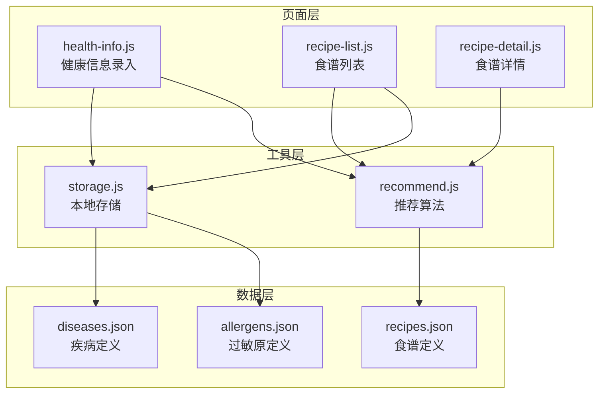
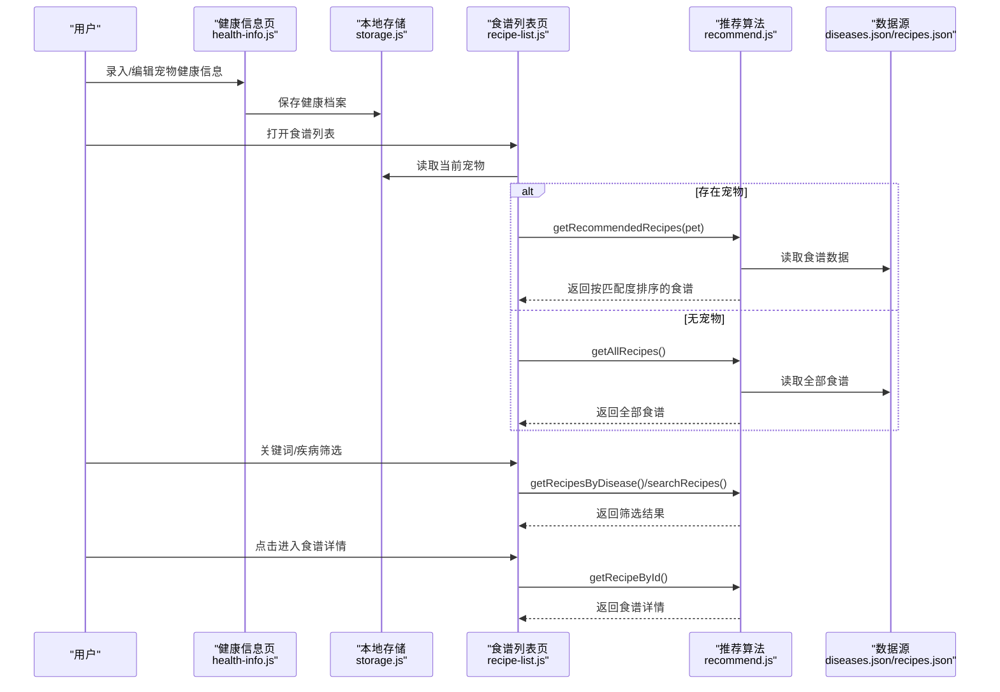
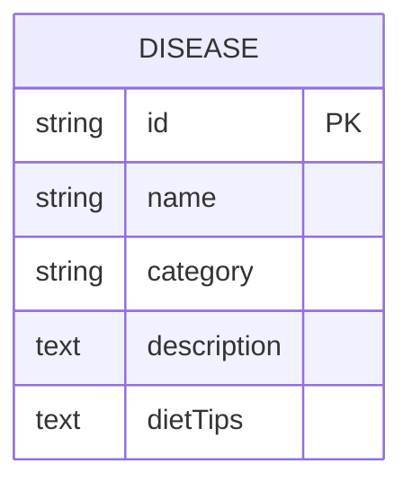
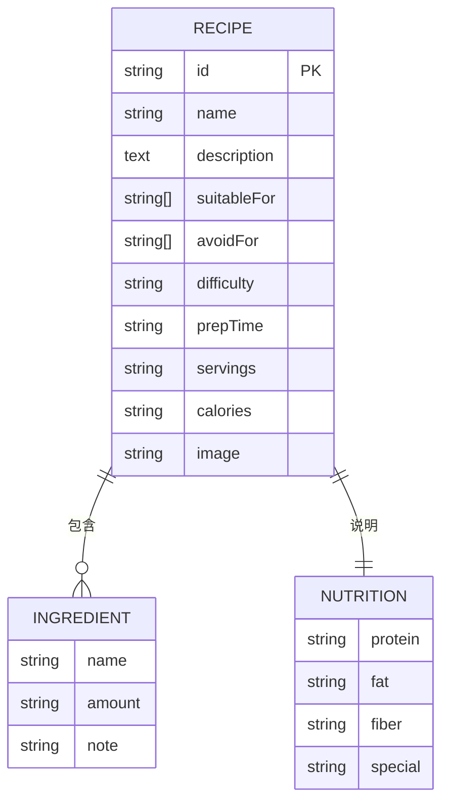
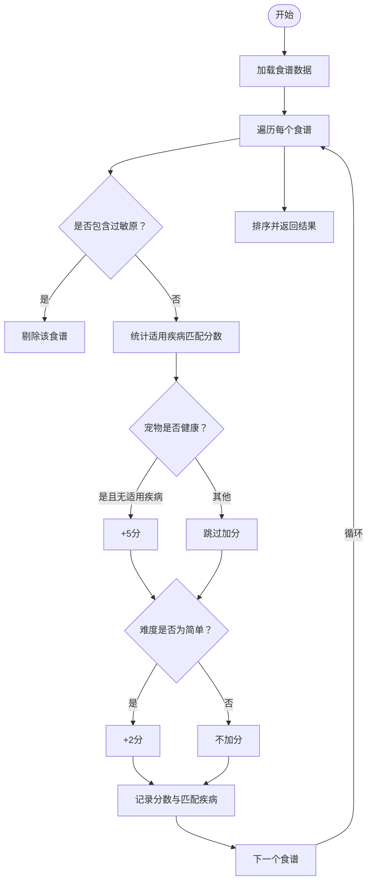
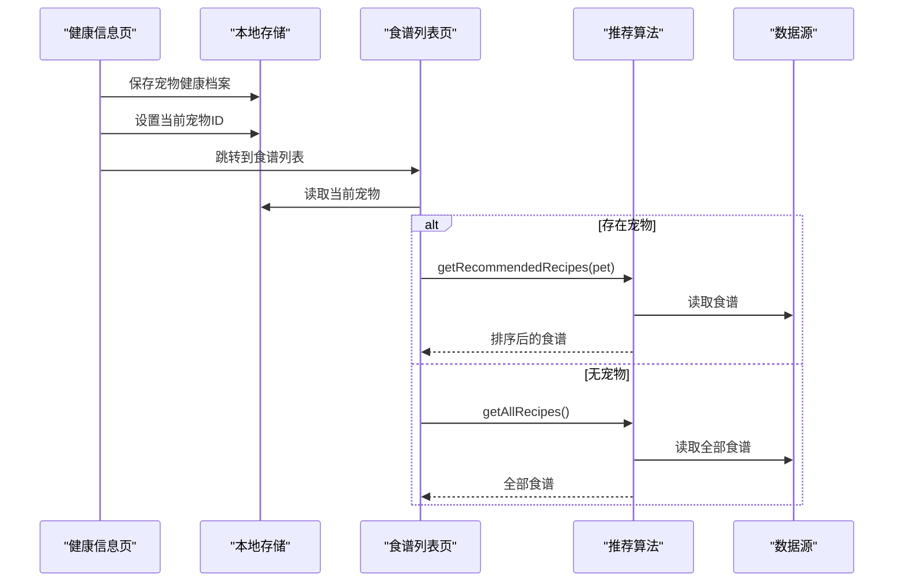
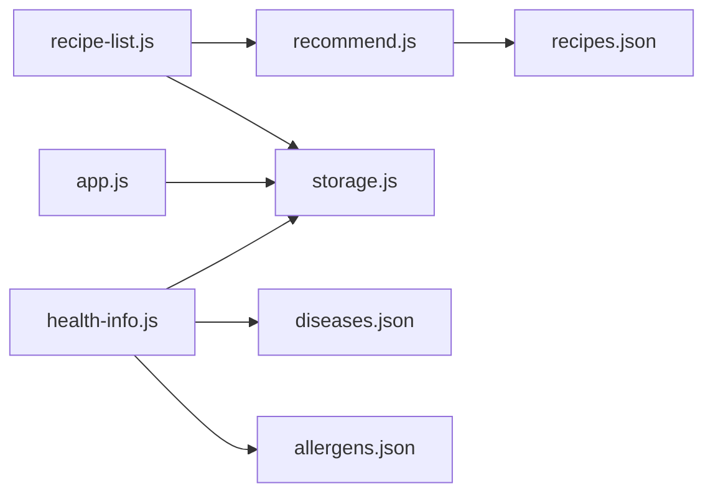

# 疾病数据库

<cite>
**本文引用的文件**
- [diseases.json](file://data/diseases.json)
- [recipes.json](file://data/recipes.json)
- [allergens.json](file://data/allergens.json)
- [recommend.js](file://utils/recommend.js)
- [storage.js](file://utils/storage.js)
- [recipe-list.js](file://pages/recipe-list/recipe-list.js)
- [health-info.js](file://pages/health-info/health-info.js)
- [recipe-detail.js](file://pages/recipe-detail/recipe-detail.js)
- [app.js](file://app.js)
</cite>

## 目录
1. [简介](#简介)
2. [项目结构](#项目结构)
3. [核心组件](#核心组件)
4. [架构总览](#架构总览)
5. [详细组件分析](#详细组件分析)
6. [依赖关系分析](#依赖关系分析)
7. [性能考虑](#性能考虑)
8. [故障排查指南](#故障排查指南)
9. [结论](#结论)
10. [附录：扩展与实践指南](#附录扩展与实践指南)

## 简介
本文件系统性介绍“老年犬智能食谱”项目中的疾病数据库，重点覆盖：
- diseases.json 的数据结构与疾病分类体系
- 每种疾病的字段定义（名称、分类、描述、饮食建议）
- 疾病数据库在智能推荐系统中的核心作用
- 如何通过疾病匹配筛选合适食谱
- 新增疾病的标准流程与数据格式规范
- 实际应用场景与具体实现方式

## 项目结构
该项目采用小程序架构，数据层以 JSON 文件形式存放基础数据，业务逻辑集中在工具模块与页面脚本中：
- 数据层：data 目录下包含疾病、食谱、过敏原等 JSON 文件
- 工具层：utils 目录下包含推荐算法、本地存储等工具
- 页面层：pages 目录下包含健康信息录入、食谱列表、食谱详情等页面

图表来源
- [diseases.json](file://data/diseases.json#L1-L108)
- [recipes.json](file://data/recipes.json#L1-L515)
- [allergens.json](file://data/allergens.json#L1-L15)
- [recommend.js](file://utils/recommend.js#L1-L109)
- [storage.js](file://utils/storage.js#L1-L155)
- [health-info.js](file://pages/health-info/health-info.js#L1-L190)
- [recipe-list.js](file://pages/recipe-list/recipe-list.js#L1-L129)
- [recipe-detail.js](file://pages/recipe-detail/recipe-detail.js#L1-L43)

章节来源
- [diseases.json](file://data/diseases.json#L1-L108)
- [recipes.json](file://data/recipes.json#L1-L515)
- [allergens.json](file://data/allergens.json#L1-L15)
- [recommend.js](file://utils/recommend.js#L1-L109)
- [storage.js](file://utils/storage.js#L1-L155)
- [health-info.js](file://pages/health-info/health-info.js#L1-L190)
- [recipe-list.js](file://pages/recipe-list/recipe-list.js#L1-L129)
- [recipe-detail.js](file://pages/recipe-detail/recipe-detail.js#L1-L43)

## 核心组件
- 疾病数据库：diseases.json 提供疾病标识、名称、分类、描述与饮食建议
- 食谱数据库：recipes.json 提供食谱与适用疾病、避免食材、难度、制作步骤等
- 推荐引擎：recommend.js 基于宠物的疾病与过敏信息，计算食谱匹配度并排序
- 本地存储：storage.js 封装本地数据读写，管理宠物健康档案
- 页面交互：health-info.js 录入健康信息；recipe-list.js 展示与筛选食谱；recipe-detail.js 展示食谱详情

章节来源
- [diseases.json](file://data/diseases.json#L1-L108)
- [recipes.json](file://data/recipes.json#L1-L515)
- [recommend.js](file://utils/recommend.js#L1-L109)
- [storage.js](file://utils/storage.js#L1-L155)
- [health-info.js](file://pages/health-info/health-info.js#L1-L190)
- [recipe-list.js](file://pages/recipe-list/recipe-list.js#L1-L129)
- [recipe-detail.js](file://pages/recipe-detail/recipe-detail.js#L1-L43)

## 架构总览
智能推荐系统围绕“宠物健康档案”展开，流程如下：
- 用户在健康信息页录入宠物的疾病与过敏信息
- 页面调用本地存储模块持久化健康档案
- 进入食谱列表页时，根据当前选中宠物的健康档案，调用推荐算法
- 推荐算法综合考虑：适用疾病匹配度、是否含过敏原、食谱难度等维度进行评分与排序
- 用户可按关键词与疾病进一步筛选，最终查看食谱详情

图表来源
- [health-info.js](file://pages/health-info/health-info.js#L144-L188)
- [storage.js](file://utils/storage.js#L86-L98)
- [recipe-list.js](file://pages/recipe-list/recipe-list.js#L30-L48)
- [recommend.js](file://utils/recommend.js#L10-L66)
- [diseases.json](file://data/diseases.json#L1-L108)
- [recipes.json](file://data/recipes.json#L1-L515)

## 详细组件分析

### 疾病数据库（diseases.json）
- 结构要点
  - 每条记录包含：唯一标识、中文名称、所属分类、症状描述、饮食建议
  - 分类涵盖：骨骼、心血管、泌尿、消化、内分泌、代谢、神经、皮肤、肿瘤、眼科、口腔等
- 字段定义
  - id：字符串，唯一标识符，用于与食谱的 suitableFor 字段关联
  - name：字符串，中文名称，支持中英文混排
  - category：字符串，疾病分类，用于页面侧边栏筛选
  - description：字符串，简要症状描述
  - dietTips：字符串，基于医学营养学的饮食建议
- 典型用途
  - 作为食谱适用性判断的依据之一
  - 作为健康信息录入界面的选项来源

图表来源
- [diseases.json](file://data/diseases.json#L1-L108)

章节来源
- [diseases.json](file://data/diseases.json#L1-L108)

### 食谱数据库（recipes.json）
- 结构要点
  - 每条记录包含：唯一标识、名称、描述、适用疾病、避免食材、难度、准备时间、份量、卡路里、图片、食材清单、步骤、营养说明、提示与注意事项
- 字段定义
  - id：字符串，唯一标识
  - name/description：字符串，标题与描述
  - suitableFor：数组，字符串数组，对应 diseases.json 中的 id
  - avoidFor：数组，字符串数组，表示该食谱应避免的过敏原（对应 allergens.json 的 id）
  - difficulty：字符串，难度等级（简单/中等/困难）
  - prepTime/servings/calories：字符串，准备时间、份量、卡路里密度
  - ingredients：数组，对象数组，包含 name/amount/note
  - steps：数组，字符串数组，步骤说明
  - nutrition：对象，营养说明（蛋白质/脂肪/纤维/特殊说明）
  - tips/warnings：数组，提示与注意事项
- 与疾病匹配的关系
  - 食谱的 suitableFor 与宠物的 diseases 字段进行集合交集，交集越大匹配度越高
  - 若食谱的 avoidFor 与宠物的 allergens 存在交集，则直接剔除该食谱

图表来源
- [recipes.json](file://data/recipes.json#L1-L515)

章节来源
- [recipes.json](file://data/recipes.json#L1-L515)

### 推荐算法（recommend.js）
- 核心逻辑
  - 输入：宠物对象（包含 diseases、allergens 等）
  - 输出：按匹配度降序排列的食谱列表
- 匹配规则
  - 适用疾病匹配：每匹配一个 diseases.json 的 id，+10 分
  - 健康狗狗（无疾病）：若食谱未指定适用疾病（即 suitableFor 为空），+5 分
  - 食谱难度：若 difficulty 为“简单”，+2 分
  - 过敏原过滤：若食谱 avoidFor 与宠物 allergens 存在交集，则标记为 isAvoided=true 并从候选中剔除
- 辅助函数
  - getAllRecipes：返回全部食谱
  - getRecipeById：按 id 获取食谱详情
  - getRecipesByDisease：按疾病筛选食谱
  - searchRecipes：按关键词搜索食谱（名称/描述/食材名）

图表来源
- [recommend.js](file://utils/recommend.js#L10-L66)

章节来源
- [recommend.js](file://utils/recommend.js#L1-L109)

### 页面交互与数据流
- 健康信息页（health-info.js）
  - 加载/保存宠物健康档案（疾病、过敏原、活动水平、偏好等）
  - 保存后设置当前宠物并跳转到食谱列表页
- 食谱列表页（recipe-list.js）
  - 读取当前宠物，调用推荐算法生成推荐列表
  - 支持关键词搜索与按疾病筛选
  - 点击进入食谱详情页
- 食谱详情页（recipe-detail.js）
  - 根据 id 获取食谱详情并展示

图表来源
- [health-info.js](file://pages/health-info/health-info.js#L144-L188)
- [recipe-list.js](file://pages/recipe-list/recipe-list.js#L30-L48)
- [recommend.js](file://utils/recommend.js#L71-L73)
- [storage.js](file://utils/storage.js#L136-L140)

章节来源
- [health-info.js](file://pages/health-info/health-info.js#L1-L190)
- [recipe-list.js](file://pages/recipe-list/recipe-list.js#L1-L129)
- [recipe-detail.js](file://pages/recipe-detail/recipe-detail.js#L1-L43)
- [storage.js](file://utils/storage.js#L1-L155)

## 依赖关系分析
- recommend.js 依赖 recipes.json（读取食谱数据）
- recipe-list.js 依赖 recommend.js 与 storage.js
- health-info.js 依赖 storage.js、diseases.json、allergens.json
- app.js 初始化本地存储（pets 数组）

图表来源
- [recommend.js](file://utils/recommend.js#L3-L3)
- [recipe-list.js](file://pages/recipe-list/recipe-list.js#L2-L4)
- [health-info.js](file://pages/health-info/health-info.js#L2-L6)
- [app.js](file://app.js#L8-L14)

章节来源
- [recommend.js](file://utils/recommend.js#L1-L109)
- [recipe-list.js](file://pages/recipe-list/recipe-list.js#L1-L129)
- [health-info.js](file://pages/health-info/health-info.js#L1-L190)
- [app.js](file://app.js#L1-L21)

## 性能考虑
- 数据规模较小：当前 JSON 文件体量适中，推荐算法遍历与过滤在移动端可接受范围内
- 建议优化方向
  - 对 recipes.json 建立索引（如按 category 或 difficulty 分组），减少每次筛选的扫描范围
  - 在页面级缓存推荐结果，避免重复计算
  - 对搜索关键词建立倒排索引或预处理小写化，提升检索效率
  - 对过敏原与适用疾病建立映射表，降低交集判断复杂度

## 故障排查指南
- 无法显示食谱列表
  - 检查本地存储 pets 是否存在且非空
  - 确认当前宠物 ID 是否正确设置
- 推荐结果不符合预期
  - 检查宠物的 diseases 与 allergens 是否正确保存
  - 确认食谱的 suitableFor 与 avoidFor 是否与 diseases.json/allergens.json 的 id 一致
- 过敏原过滤不生效
  - 确认 avoidFor 与 allergens 的 id 类型一致（字符串）
  - 检查是否存在大小写或拼写差异
- 页面跳转后数据丢失
  - 确认 storage.js 的 setStorageSync/getStorageSync 调用是否成功
  - 检查 app.js 的初始化逻辑是否执行

章节来源
- [storage.js](file://utils/storage.js#L113-L140)
- [recommend.js](file://utils/recommend.js#L24-L30)
- [recipe-list.js](file://pages/recipe-list/recipe-list.js#L30-L48)

## 结论
本项目通过结构化的疾病与食谱数据库，结合本地存储与推荐算法，实现了面向老年犬的智能食谱推荐。diseases.json 作为核心元数据，为食谱筛选提供了明确的匹配依据；recommend.js 将适用性、过敏原与难度等因素综合评分，确保输出既科学又实用。页面层通过健康信息录入与筛选交互，使用户能够快速定位适合的食谱。

## 附录：扩展与实践指南

### 疾病数据扩展标准流程
- 步骤
  - 在 diseases.json 中新增一条记录，字段包括 id、name、category、description、dietTips
  - 在 recipes.json 中为相关食谱的 suitableFor 字段追加该 id
  - 若食谱包含该疾病对应的过敏原，可在 avoidFor 中追加相应 allergens.json 的 id
  - 在健康信息页的分类列表中自动识别新增分类
- 数据格式规范
  - id：小写字母与下划线组合，全局唯一
  - name：中文名称，必要时可包含简短英文注释
  - category：参考现有分类，避免新增未覆盖类别
  - description：简洁明了的症状描述
  - dietTips：基于营养学建议的饮食指导
- 示例路径
  - 新增疾病记录：[diseases.json](file://data/diseases.json#L1-L108)
  - 新增食谱适用性：[recipes.json](file://data/recipes.json#L1-L515)
  - 过敏原对照：[allergens.json](file://data/allergens.json#L1-L15)

章节来源
- [diseases.json](file://data/diseases.json#L1-L108)
- [recipes.json](file://data/recipes.json#L1-L515)
- [allergens.json](file://data/allergens.json#L1-L15)

### 实际应用场景与实现方式
- 场景一：健康老年犬日常推荐
  - 条件：宠物无疾病，仅需均衡营养
  - 实现：推荐算法对未指定适用疾病的食谱给予额外加分，优先展示
  - 参考路径：[recommend.js](file://utils/recommend.js#L40-L45)
- 场景二：特定疾病筛选
  - 条件：宠物患有某类疾病（如关节炎）
  - 实现：在食谱列表页按疾病筛选，或通过推荐算法按匹配度排序
  - 参考路径：[recipe-list.js](file://pages/recipe-list/recipe-list.js#L64-L72), [recommend.js](file://utils/recommend.js#L85-L87)
- 场景三：过敏原规避
  - 条件：宠物对某些食材过敏
  - 实现：推荐算法在评分前先过滤掉包含过敏原的食谱
  - 参考路径：[recommend.js](file://utils/recommend.js#L24-L30)
- 场景四：关键词搜索
  - 条件：用户希望按名称、描述或食材名搜索
  - 实现：搜索函数对名称、描述与食材名进行模糊匹配
  - 参考路径：[recommend.js](file://utils/recommend.js#L92-L100)

章节来源
- [recommend.js](file://utils/recommend.js#L10-L66)
- [recipe-list.js](file://pages/recipe-list/recipe-list.js#L64-L109)