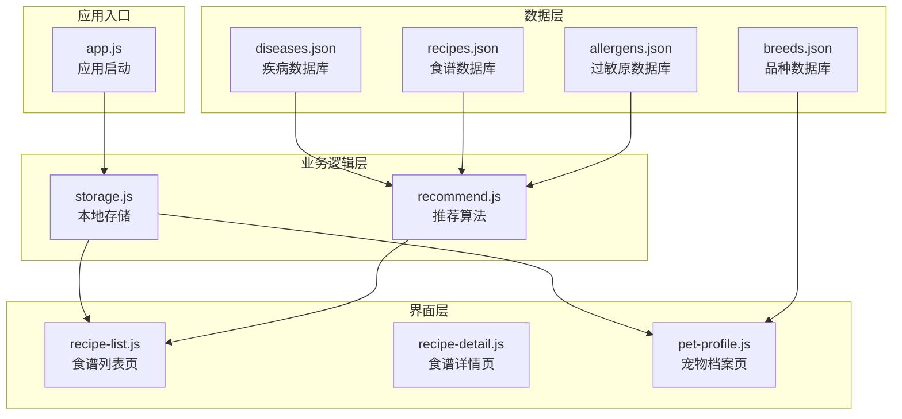
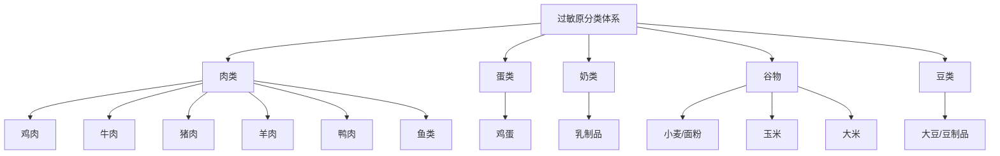
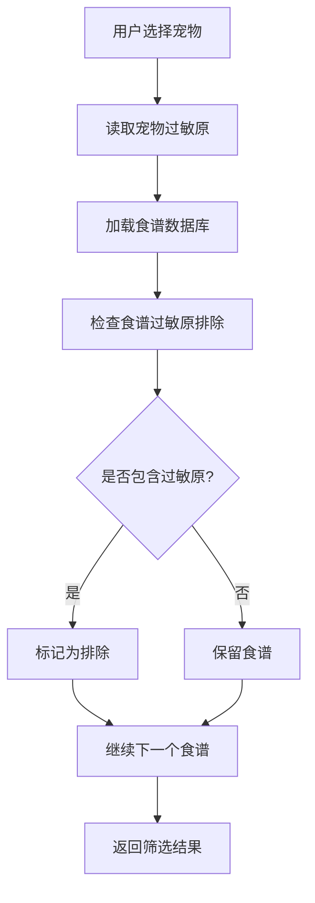
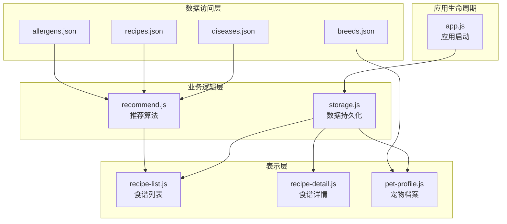
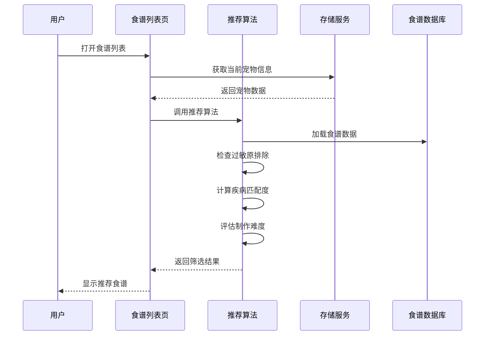
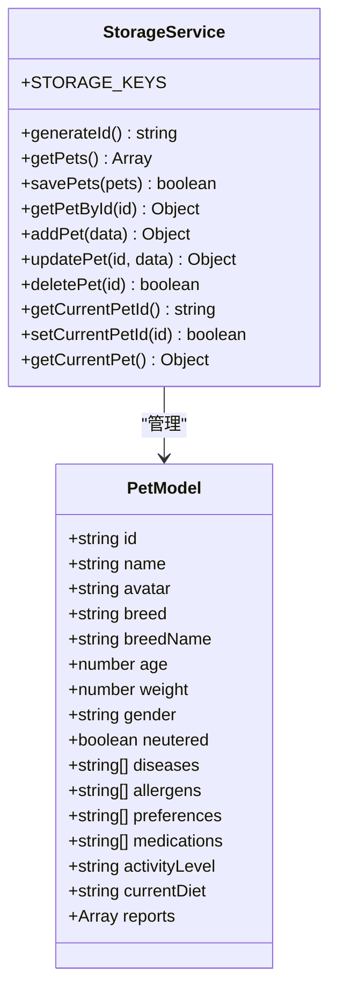
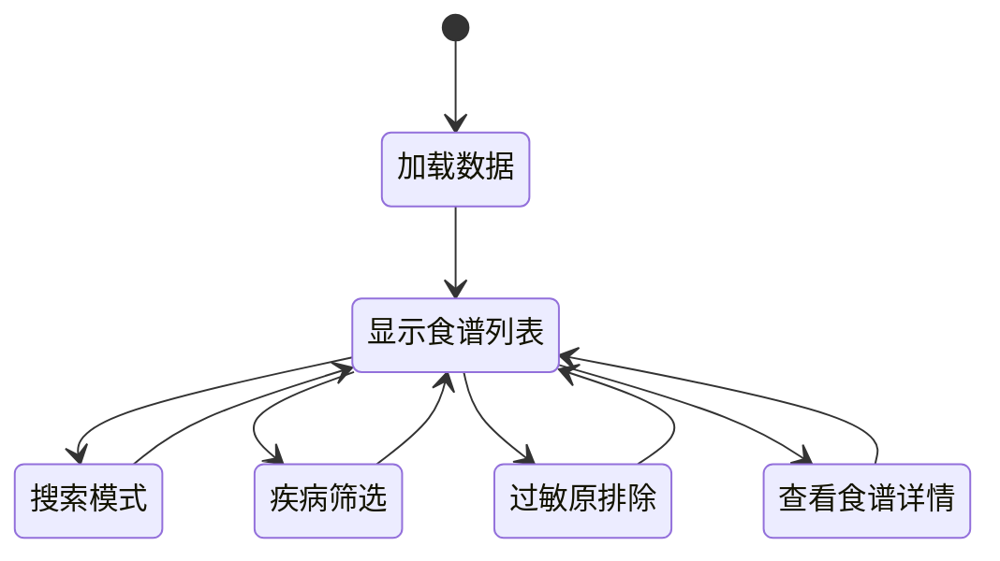
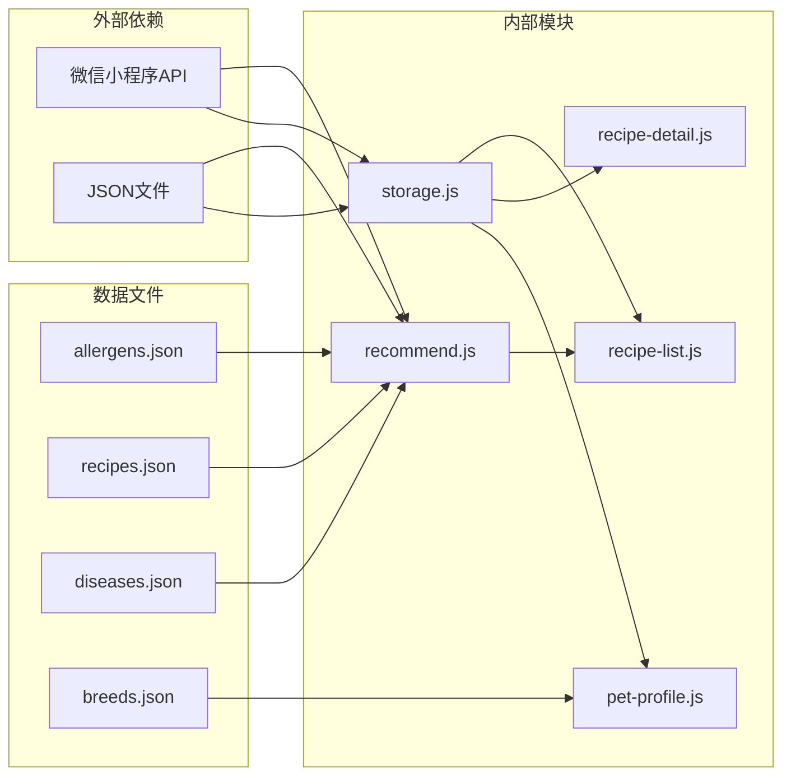
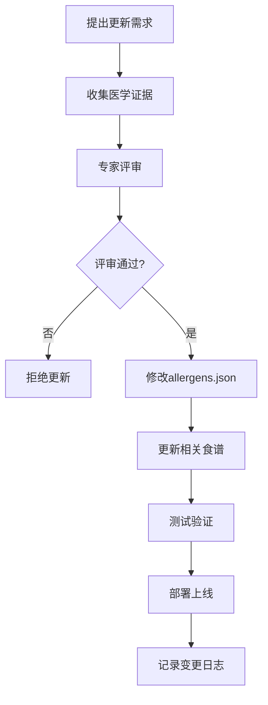

# 过敏原数据库

<cite>
**本文档引用的文件**
- [allergens.json](file://data/allergens.json)
- [recipes.json](file://data/recipes.json)
- [diseases.json](file://data/diseases.json)
- [recommend.js](file://utils/recommend.js)
- [storage.js](file://utils/storage.js)
- [recipe-list.js](file://pages/recipe-list/recipe-list.js)
- [recipe-detail.js](file://pages/recipe-detail/recipe-detail.js)
- [pet-profile.js](file://pages/pet-profile/pet-profile.js)
- [app.js](file://app.js)
- [breeds.json](file://data/breeds.json)
</cite>

## 目录
1. [简介](#简介)
2. [项目结构](#项目结构)
3. [核心组件](#核心组件)
4. [架构概览](#架构概览)
5. [详细组件分析](#详细组件分析)
6. [依赖关系分析](#依赖关系分析)
7. [性能考虑](#性能考虑)
8. [故障排除指南](#故障排除指南)
9. [结论](#结论)
10. [附录](#附录)

## 简介

本项目是一个专门为老年宠物设计的食谱推荐系统，其中过敏原数据库是整个系统的核心基础设施之一。该系统通过科学的过敏原分类体系和智能推荐算法，为患有各种疾病的老年人宠牛建立个性化的食谱方案，有效避免过敏原引发的健康风险。

过敏原数据库包含了12种常见的宠物过敏原，采用统一的JSON格式存储，为食谱安全筛选提供了可靠的数据基础。系统不仅支持过敏原排除机制，还能与疾病数据库结合，实现多维度的个性化食谱推荐。

## 项目结构

该项目采用模块化设计，主要分为以下几个核心模块：

**图表来源**
- [allergens.json](file://data/allergens.json#L1-L15)
- [recipes.json](file://data/recipes.json#L1-L515)
- [recommend.js](file://utils/recommend.js#L1-L109)
- [storage.js](file://utils/storage.js#L1-L155)

**章节来源**
- [app.js](file://app.js#L1-L21)
- [storage.js](file://utils/storage.js#L1-L155)

## 核心组件

### 过敏原数据库结构

过敏原数据库采用简洁而高效的JSON格式，每个过敏原包含三个核心字段：

| 字段名 | 类型 | 必需 | 描述 | 示例值 |
|--------|------|------|------|--------|
| id | string | 是 | 过敏原唯一标识符 | "chicken" |
| name | string | 是 | 过敏原中文名称 | "鸡肉" |
| category | string | 是 | 过敏原分类类别 | "肉类" |

**章节来源**
- [allergens.json](file://data/allergens.json#L1-L15)

### 过敏原分类体系

系统采用四层分类体系，涵盖宠物最常见的过敏原类型：

**图表来源**
- [allergens.json](file://data/allergens.json#L2-L13)

### 食谱安全筛选机制

每个食谱都包含明确的过敏原排除信息，通过`avoidFor`字段指定需要避免的过敏原列表：

**图表来源**
- [recommend.js](file://utils/recommend.js#L24-L30)
- [recipes.json](file://data/recipes.json#L7-L8)

**章节来源**
- [recipes.json](file://data/recipes.json#L1-L515)
- [recommend.js](file://utils/recommend.js#L1-L109)

## 架构概览

系统采用三层架构设计，从数据到界面形成完整的数据流：

**图表来源**
- [recommend.js](file://utils/recommend.js#L1-L109)
- [storage.js](file://utils/storage.js#L1-L155)
- [app.js](file://app.js#L1-L21)

## 详细组件分析

### 推荐算法组件

推荐算法是系统的核心，负责根据宠物的健康状况和过敏史进行智能食谱筛选：

**图表来源**
- [recommend.js](file://utils/recommend.js#L10-L66)
- [recipe-list.js](file://pages/recipe-list/recipe-list.js#L30-L48)

#### 算法评分机制

推荐算法采用多维度评分系统：

| 评分因素 | 评分规则 | 最大分数 |
|----------|----------|----------|
| 疾病匹配 | 每匹配一种疾病+10分 | 100分 |
| 健康狗狗 | 通用食谱+5分 | 5分 |
| 制作难度 | 简单难度+2分 | 2分 |
| 过敏原排除 | 包含过敏原-100分 | -100分 |

**章节来源**
- [recommend.js](file://utils/recommend.js#L18-L66)

### 数据存储组件

本地存储系统采用微信小程序的本地存储API，提供完整的CRUD操作：

**图表来源**
- [storage.js](file://utils/storage.js#L1-L155)

**章节来源**
- [storage.js](file://utils/storage.js#L1-L155)

### 界面交互组件

食谱列表页面实现了完整的筛选和搜索功能：

**图表来源**
- [recipe-list.js](file://pages/recipe-list/recipe-list.js#L84-L109)

**章节来源**
- [recipe-list.js](file://pages/recipe-list/recipe-list.js#L1-L129)
- [recipe-detail.js](file://pages/recipe-detail/recipe-detail.js#L1-L43)

## 依赖关系分析

系统各组件之间的依赖关系清晰明确：

**图表来源**
- [recommend.js](file://utils/recommend.js#L3)
- [storage.js](file://utils/storage.js#L3)
- [recipe-list.js](file://pages/recipe-list/recipe-list.js#L2-L4)

**章节来源**
- [recommend.js](file://utils/recommend.js#L1-L109)
- [storage.js](file://utils/storage.js#L1-L155)

## 性能考虑

### 数据加载优化

系统采用懒加载策略，仅在需要时加载相关数据：

- **食谱数据**：按需加载，避免一次性加载所有食谱
- **过敏原数据**：静态文件，直接读取无需网络请求
- **宠物数据**：本地存储，响应速度快

### 内存管理

- 使用函数式编程减少对象创建
- 及时清理事件监听器
- 合理使用数据缓存

### 网络优化

由于系统完全基于本地数据，不存在网络延迟问题，所有操作均为本地处理。

## 故障排除指南

### 常见问题及解决方案

| 问题类型 | 症状描述 | 解决方案 |
|----------|----------|----------|
| 过敏原识别错误 | 食谱未正确排除过敏原 | 检查allergens.json中的id是否与recipes.json一致 |
| 推荐结果异常 | 食谱推荐不符合预期 | 验证宠物的diseases和allergens字段设置 |
| 数据加载失败 | 页面空白或报错 | 检查JSON文件格式是否正确 |
| 存储异常 | 宠物信息无法保存 | 确认微信小程序权限设置 |

### 调试技巧

1. **开发者工具**：使用微信开发者工具的调试功能
2. **日志输出**：在关键节点添加console.log语句
3. **数据验证**：检查JSON文件的语法正确性
4. **边界测试**：测试极端情况下的系统表现

**章节来源**
- [storage.js](file://utils/storage.js#L20-L39)
- [recommend.js](file://utils/recommend.js#L11-L13)

## 结论

过敏原数据库作为老年宠物食谱推荐系统的核心基础设施，通过科学的数据结构设计和智能的推荐算法，为宠物健康提供了可靠的保障。系统的四层分类体系涵盖了宠物最常见的过敏原类型，配合完善的筛选机制，能够有效避免过敏反应的发生。

推荐算法的多维度评分系统不仅考虑了过敏原排除，还综合了疾病匹配度、制作难度等多个因素，为用户提供了个性化的食谱推荐。本地化的数据存储方案确保了系统的响应速度和稳定性。

未来可以考虑的功能扩展包括：
- 增加更多的过敏原类型
- 实现动态过敏原评估
- 添加过敏原交叉反应分析
- 集成专业的兽医建议

## 附录

### 过敏原数据维护指南

#### 新增过敏原评估标准

当考虑新增过敏原时，应遵循以下评估标准：

1. **医学证据**：必须有充分的医学文献支持
2. **临床案例**：存在明确的临床诊断案例
3. **流行程度**：在宠物群体中的发生频率
4. **替代性**：是否有安全的替代食材
5. **检测方法**：是否具备可靠的检测手段

#### 数据更新流程

#### 过敏原排除机制说明

系统通过以下步骤实现过敏原排除：

1. **数据读取**：从allergens.json读取过敏原列表
2. **用户输入**：从宠物档案中获取过敏原信息
3. **匹配检查**：对比食谱的avoidFor字段与用户过敏原
4. **结果筛选**：排除包含过敏原的食谱
5. **智能推荐**：基于剩余食谱进行评分排序

**章节来源**
- [allergens.json](file://data/allergens.json#L1-L15)
- [recipes.json](file://data/recipes.json#L7-L8)
- [recommend.js](file://utils/recommend.js#L24-L30)