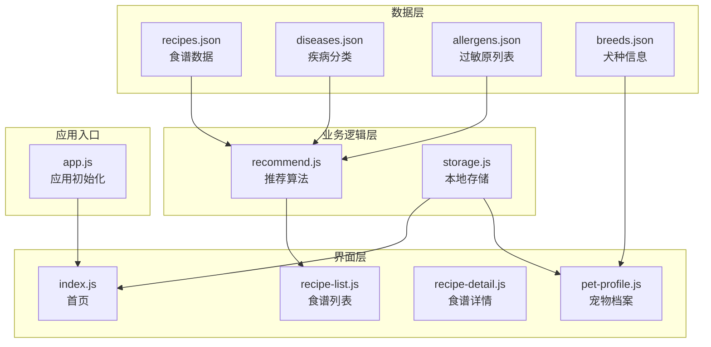
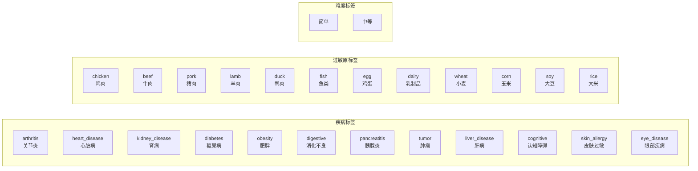
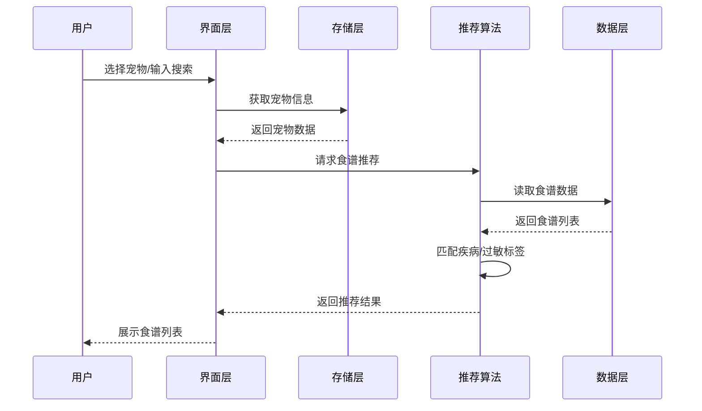
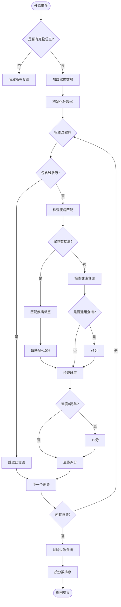
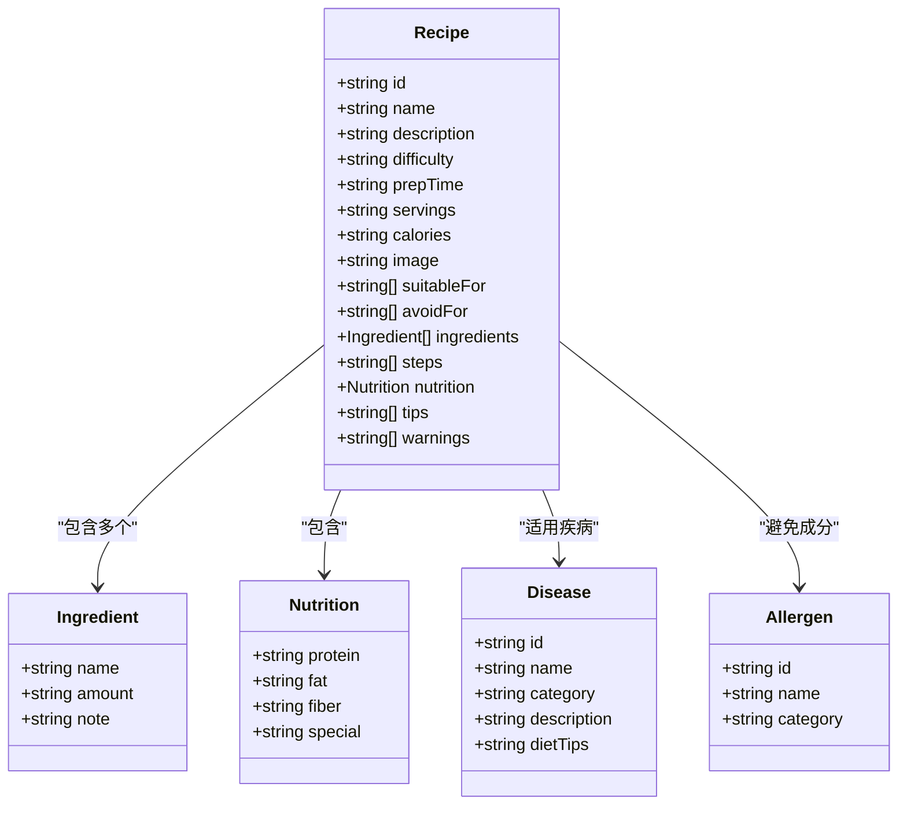
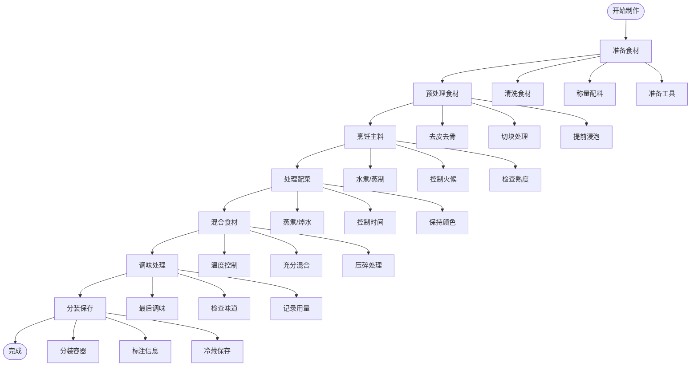
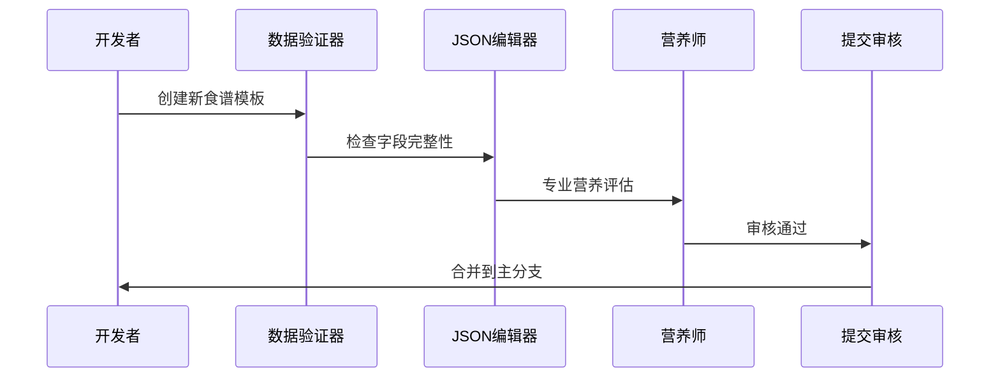
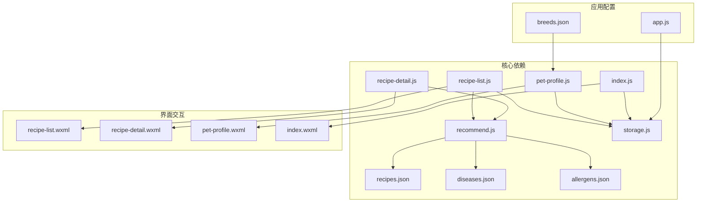

# 食谱数据库

<cite>
**本文档引用的文件**
- [recipes.json](file://data/recipes.json)
- [diseases.json](file://data/diseases.json)
- [allergens.json](file://data/allergens.json)
- [breeds.json](file://data/breeds.json)
- [recommend.js](file://utils/recommend.js)
- [storage.js](file://utils/storage.js)
- [recipe-list.js](file://pages/recipe-list/recipe-list.js)
- [recipe-detail.js](file://pages/recipe-detail/recipe-detail.js)
- [index.js](file://pages/index/index.js)
- [pet-profile.js](file://pages/pet-profile/pet-profile.js)
- [app.js](file://app.js)
</cite>

## 目录
1. [简介](#简介)
2. [项目结构](#项目结构)
3. [核心组件](#核心组件)
4. [架构概览](#架构概览)
5. [详细组件分析](#详细组件分析)
6. [依赖关系分析](#依赖关系分析)
7. [性能考虑](#性能考虑)
8. [故障排除指南](#故障排除指南)
9. [结论](#结论)
10. [附录](#附录)

## 简介

这是一个专为老年犬设计的食谱数据库系统，基于微信小程序平台构建。该系统通过结构化的JSON数据模型，实现了针对不同健康状况和过敏情况的精准食谱推荐。系统包含12种精心设计的食谱，涵盖关节炎、心脏病、肾病、糖尿病等多种老年犬常见疾病，以及过敏、消化不良等特殊情况。

## 项目结构

该项目采用模块化架构设计，主要分为以下几个层次：



**图表来源**
- [recipes.json](file://data/recipes.json#L1-L515)
- [recommend.js](file://utils/recommend.js#L1-L109)
- [storage.js](file://utils/storage.js#L1-L155)

**章节来源**
- [app.js](file://app.js#L1-L21)
- [index.js](file://pages/index/index.js#L1-L80)

## 核心组件

### 食谱数据模型

食谱数据采用统一的JSON格式，每个食谱包含以下核心字段：

| 字段名 | 类型 | 必填 | 描述 |
|--------|------|------|------|
| id | string | 是 | 食谱唯一标识符 |
| name | string | 是 | 食谱名称 |
| description | string | 是 | 食谱描述 |
| suitableFor | array | 否 | 适用疾病ID列表 |
| avoidFor | array | 否 | 避免成分ID列表 |
| difficulty | string | 是 | 制作难度：简单/中等 |
| prepTime | string | 是 | 准备时间 |
| servings | string | 是 | 份量说明 |
| calories | string | 是 | 热量信息 |
| image | string | 是 | 图片路径 |
| ingredients | array | 是 | 配料清单 |
| steps | array | 是 | 制作步骤 |
| nutrition | object | 是 | 营养信息 |
| tips | array | 否 | 小贴士 |
| warnings | array | 否 | 注意事项 |

### 多维度标签系统

系统通过三个维度的标签实现精准推荐：



**图表来源**
- [diseases.json](file://data/diseases.json#L1-L108)
- [allergens.json](file://data/allergens.json#L1-L15)

**章节来源**
- [recipes.json](file://data/recipes.json#L1-L515)
- [diseases.json](file://data/diseases.json#L1-L108)
- [allergens.json](file://data/allergens.json#L1-L15)

## 架构概览

系统采用分层架构，从底层数据到上层UI形成清晰的数据流：



**图表来源**
- [recipe-list.js](file://pages/recipe-list/recipe-list.js#L30-L48)
- [recommend.js](file://utils/recommend.js#L10-L66)
- [storage.js](file://utils/storage.js#L136-L140)

## 详细组件分析

### 推荐算法组件

推荐算法是整个系统的核心，负责根据宠物的健康状况和过敏情况智能匹配合适的食谱。

#### 推荐算法工作流程



**图表来源**
- [recommend.js](file://utils/recommend.js#L10-L66)

#### 推荐算法实现细节

推荐算法采用多因素评分机制：

1. **疾病匹配评分**：每匹配一个适用疾病+10分
2. **健康食谱加分**：通用食谱额外+5分  
3. **难度加分**：简单难度额外+2分
4. **过敏规避**：包含过敏原的食谱直接过滤

**章节来源**
- [recommend.js](file://utils/recommend.js#L10-L66)

### 食谱数据模型详解

#### 食谱结构化存储

每个食谱采用统一的结构化格式，确保数据的一致性和可扩展性：



**图表来源**
- [recipes.json](file://data/recipes.json#L2-L45)
- [diseases.json](file://data/diseases.json#L1-L108)
- [allergens.json](file://data/allergens.json#L1-L15)

#### 营养信息计算方法

系统通过预设的营养标签来描述食谱的营养价值，而非实时计算。每个食谱包含四个核心营养指标：

| 营养指标 | 描述 | 示例 |
|----------|------|------|
| protein | 蛋白质含量和来源 | 高蛋白易消化、优质蛋白、低磷蛋白等 |
| fat | 脂肪含量和类型 | 低脂肪、健康脂肪、极低脂肪等 |
| fiber | 膳食纤维含量 | 高纤维助消化、温和纤维、低纤维等 |
| special | 特殊营养成分 | DHA/EPA、牛磺酸、抗氧化物质等 |

**章节来源**
- [recipes.json](file://data/recipes.json#L30-L35)

### 食谱制作步骤处理

#### 结构化步骤存储

食谱制作步骤采用数组格式存储，确保步骤的顺序性和完整性：



**图表来源**
- [recipes.json](file://data/recipes.json#L21-L29)

**章节来源**
- [recipes.json](file://data/recipes.json#L21-L29)

### 数据维护和扩展实践

#### 新增食谱的标准流程



#### 质量控制要求

1. **字段完整性检查**：确保所有必需字段都已填写
2. **营养信息准确性**：由专业人员审核营养标签
3. **过敏原标注正确性**：确保避免成分列表准确无误
4. **食谱实用性验证**：确保步骤可执行且安全
5. **图片质量要求**：确保图片清晰且与内容相关

**章节来源**
- [recommend.js](file://utils/recommend.js#L10-L66)

## 依赖关系分析

系统各组件之间的依赖关系如下：



**图表来源**
- [recommend.js](file://utils/recommend.js#L3-L3)
- [recipe-list.js](file://pages/recipe-list/recipe-list.js#L2-L4)
- [recipe-detail.js](file://pages/recipe-detail/recipe-detail.js#L2-L2)
- [pet-profile.js](file://pages/pet-profile/pet-profile.js#L2-L4)

**章节来源**
- [recommend.js](file://utils/recommend.js#L1-L109)
- [recipe-list.js](file://pages/recipe-list/recipe-list.js#L1-L129)

## 性能考虑

### 数据加载优化

1. **懒加载策略**：食谱数据仅在需要时加载
2. **缓存机制**：推荐结果在一定时间内缓存
3. **分页加载**：大量食谱时采用分页显示
4. **图片优化**：使用适当的图片尺寸和格式

### 推荐算法优化

1. **索引优化**：为常用查询建立索引
2. **内存管理**：及时释放不再使用的数据
3. **异步处理**：复杂的计算在后台线程进行
4. **增量更新**：只更新发生变化的数据

## 故障排除指南

### 常见问题及解决方案

#### 食谱推荐不准确

**问题现象**：推荐的食谱与宠物状况不符

**可能原因**：
1. 宠物健康信息未正确填写
2. 疾病标签选择错误
3. 过敏原信息缺失

**解决方法**：
1. 检查宠物档案中的健康信息
2. 确认疾病和过敏标签的选择
3. 重新进行健康信息录入

#### 食谱详情无法显示

**问题现象**：点击食谱后无法打开详情页面

**可能原因**：
1. 食谱ID不存在
2. 数据文件损坏
3. 页面路由配置错误

**解决方法**：
1. 检查食谱ID格式是否正确
2. 验证JSON文件语法
3. 重新启动应用

#### 搜索功能失效

**问题现象**：搜索关键词无法找到相关食谱

**可能原因**：
1. 搜索算法错误
2. 关键词匹配规则问题
3. 数据索引缺失

**解决方法**：
1. 检查搜索函数实现
2. 验证关键词匹配逻辑
3. 重建搜索索引

**章节来源**
- [recommend.js](file://utils/recommend.js#L92-L100)
- [recipe-list.js](file://pages/recipe-list/recipe-list.js#L51-L55)

## 结论

这个食谱数据库系统通过精心设计的数据模型和智能推荐算法，为老年犬主人提供了科学、便捷的食谱选择方案。系统的主要优势包括：

1. **结构化数据模型**：统一的JSON格式确保了数据的一致性和可扩展性
2. **多维度推荐**：结合疾病、过敏和难度三个维度实现精准匹配
3. **用户友好界面**：简洁直观的操作流程提升了用户体验
4. **专业营养指导**：专业的营养信息和健康建议确保了食谱的安全性

未来可以考虑的功能扩展包括：
- 增加食谱收藏和历史记录功能
- 实现个性化营养需求计算
- 添加食谱分享和社区互动功能
- 集成更多宠物健康数据源

## 附录

### 使用示例

#### 食谱搜索实现

```javascript
// 搜索食谱示例
function searchRecipes(keyword) {
  const lowerKeyword = keyword.toLowerCase()
  return recipesData.filter(r => 
    r.name.toLowerCase().includes(lowerKeyword) ||
    r.description.toLowerCase().includes(lowerKeyword) ||
    r.ingredients.some(i => i.name.toLowerCase().includes(lowerKeyword))
  )
}
```

#### 食谱筛选实现

```javascript
// 按疾病筛选食谱
function getRecipesByDisease(diseaseId) {
  return recipesData.filter(r => r.suitableFor.includes(diseaseId))
}
```

#### 食谱详情展示

```javascript
// 获取食谱详情
function getRecipeById(recipeId) {
  return recipesData.find(r => r.id === recipeId) || null
}
```

### 数据模型参考

#### 疾病分类表

| 疾病ID | 疾病名称 | 分类 | 描述 |
|--------|----------|------|------|
| arthritis | 关节炎/关节退化 | 骨骼 | 老年犬常见问题 |
| heart_disease | 心脏病 | 心血管 | 心脏功能减退 |
| kidney_disease | 肾病/肾衰竭 | 泌尿 | 肾脏功能下降 |
| diabetes | 糖尿病 | 内分泌 | 血糖调节异常 |

#### 过敏原分类表

| 过敏原ID | 名称 | 分类 |
|----------|------|------|
| chicken | 鸡肉 | 肉类 |
| beef | 牛肉 | 肉类 |
| fish | 鱼类 | 肉类 |
| egg | 鸡蛋 | 蛋类 |
| dairy | 乳制品 | 奶类 |
| wheat | 小麦/面粉 | 谷物 |

**章节来源**
- [diseases.json](file://data/diseases.json#L1-L108)
- [allergens.json](file://data/allergens.json#L1-L15)