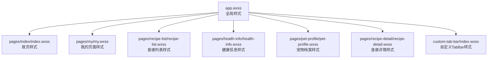
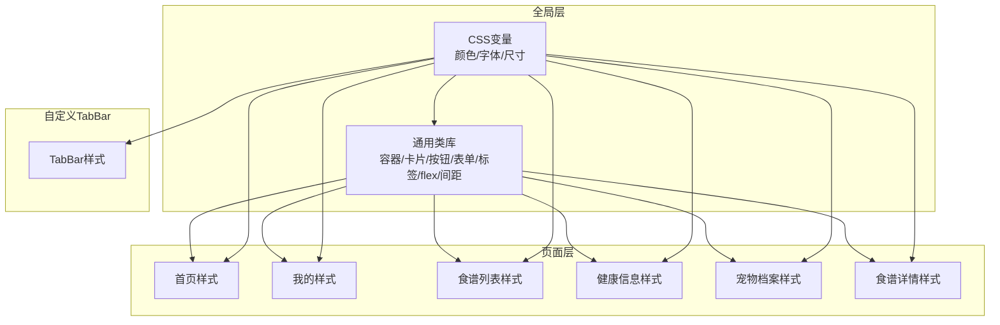
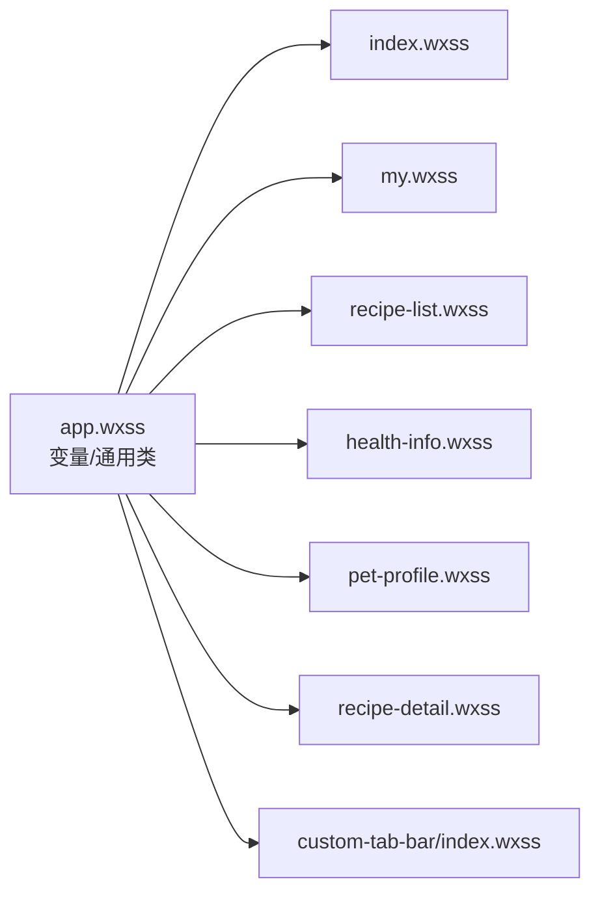

# 样式系统

<cite>
**本文引用的文件**
- [app.wxss](file://app.wxss)
- [app.json](file://app.json)
- [project.config.json](file://project.config.json)
- [pages/index/index.wxss](file://pages/index/index.wxss)
- [pages/my/my.wxss](file://pages/my/my.wxss)
- [pages/recipe-list/recipe-list.wxss](file://pages/recipe-list/recipe-list.wxss)
- [pages/health-info/health-info.wxss](file://pages/health-info/health-info.wxss)
- [pages/pet-profile/pet-profile.wxss](file://pages/pet-profile/pet-profile.wxss)
- [pages/recipe-detail/recipe-detail.wxss](file://pages/recipe-detail/recipe-detail.wxss)
- [custom-tab-bar/index.wxss](file://custom-tab-bar/index.wxss)
- [data/allergens.json](file://data/allergens.json)
- [data/breeds.json](file://data/breeds.json)
</cite>

## 目录
1. [简介](#简介)
2. [项目结构](#项目结构)
3. [核心组件](#核心组件)
4. [架构总览](#架构总览)
5. [详细组件分析](#详细组件分析)
6. [依赖关系分析](#依赖关系分析)
7. [性能考量](#性能考量)
8. [故障排查指南](#故障排查指南)
9. [结论](#结论)
10. [附录](#附录)

## 简介
本文件系统性梳理 Old-baby 小程序的样式体系与 WXSS 语法实践，覆盖全局样式与页面样式的组织方式、响应式与移动端适配策略、样式命名规范、组件样式管理与主题定制、CSS 动画与过渡效果、交互反馈实现技巧、样式调试与性能优化方法。目标是帮助开发者构建一致、美观且高效的用户界面。

## 项目结构
Old-baby 的样式采用“全局样式 + 页面样式 + 自定义 TabBar 样式”的分层组织：
- 全局样式：在应用级统一定义主题变量、通用容器、基础组件样式与布局辅助类。
- 页面样式：按页面职责划分，复用全局样式变量与通用类，避免重复定义。
- 自定义 TabBar：独立的样式模块，负责底部导航的视觉与交互表现。

图表来源
- [app.wxss](file://app.wxss#L1-L224)
- [pages/index/index.wxss](file://pages/index/index.wxss#L1-L215)
- [pages/my/my.wxss](file://pages/my/my.wxss#L1-L133)
- [pages/recipe-list/recipe-list.wxss](file://pages/recipe-list/recipe-list.wxss#L1-L322)
- [pages/health-info/health-info.wxss](file://pages/health-info/health-info.wxss#L1-L203)
- [pages/pet-profile/pet-profile.wxss](file://pages/pet-profile/pet-profile.wxss#L1-L259)
- [pages/recipe-detail/recipe-detail.wxss](file://pages/recipe-detail/recipe-detail.wxss#L1-L362)
- [custom-tab-bar/index.wxss](file://custom-tab-bar/index.wxss#L1-L36)

章节来源
- [app.wxss](file://app.wxss#L1-L224)
- [app.json](file://app.json#L1-L41)

## 核心组件
- 主题变量与基础样式
  - 在应用级通过 CSS 变量集中定义主色、辅色、背景、文字、边框、错误/成功等颜色，并在页面中以变量形式使用，便于主题切换与一致性维护。
  - 提供通用容器、卡片、按钮、表单、标签、分割线、空状态、标题、flex 辅助类与间距类，形成“原子化”样式库，减少重复定义。
- 页面样式组织
  - 各页面样式文件遵循“语义化类名 + 组合复用”的原则，优先复用全局类，局部差异化通过组合类或微调实现。
- 自定义 TabBar
  - 使用固定定位与安全区适配，结合过渡动画实现图标与文本的激活态反馈。

章节来源
- [app.wxss](file://app.wxss#L3-L23)
- [app.wxss](file://app.wxss#L25-L224)
- [custom-tab-bar/index.wxss](file://custom-tab-bar/index.wxss#L1-L36)

## 架构总览
Old-baby 的样式架构以“变量驱动 + 语义化类名 + 组合复用”为核心，通过以下机制实现：
- 变量集中管理：全局样式中定义主题变量，页面通过变量引用，确保色彩与排版一致。
- 通用类库：提供容器、卡片、按钮、表单、标签、flex 与间距等通用类，页面按需组合。
- 页面样式隔离：每个页面样式文件仅定义该页面所需样式，避免跨页面污染。
- 自定义 TabBar：独立样式模块，与页面样式解耦，便于维护与扩展。

图表来源
- [app.wxss](file://app.wxss#L3-L23)
- [app.wxss](file://app.wxss#L25-L224)
- [pages/index/index.wxss](file://pages/index/index.wxss#L1-L215)
- [pages/my/my.wxss](file://pages/my/my.wxss#L1-L133)
- [pages/recipe-list/recipe-list.wxss](file://pages/recipe-list/recipe-list.wxss#L1-L322)
- [pages/health-info/health-info.wxss](file://pages/health-info/health-info.wxss#L1-L203)
- [pages/pet-profile/pet-profile.wxss](file://pages/pet-profile/pet-profile.wxss#L1-L259)
- [pages/recipe-detail/recipe-detail.wxss](file://pages/recipe-detail/recipe-detail.wxss#L1-L362)
- [custom-tab-bar/index.wxss](file://custom-tab-bar/index.wxss#L1-L36)

## 详细组件分析

### 全局样式（app.wxss）
- 主题变量
  - 定义主色、浅主色、深主色、背景、强调色、文字、边框、错误、成功等变量，并在 page 选择器中统一应用到根元素，确保全局一致性。
- 通用容器与卡片
  - container 提供统一内边距与最小高度；card 提供圆角、阴影与内边距，作为页面内容块的基础样式。
- 按钮样式
  - 提供主按钮与次按钮两类，支持按下态的透明度与缩放反馈，增强交互感知。
- 表单样式
  - form-group/form-label/form-input/form-textarea 提供输入框与文本域的基础样式与聚焦态高亮。
- 标签与分割线
  - tag/tag-active 提供普通与激活态标签；divider 提供水平分割线。
- 空状态
  - empty-state/empty-icon/empty-text 提供统一的空状态展示。
- 标题样式
  - section-title 提供左侧强调条与标题组合的视觉风格。
- 安全区适配
  - safe-bottom 结合 constant(env) 适配 iPhone 系列的安全区域。
- flex 与间距
  - flex-row/flex-column/flex-center/flex-between/flex-1 提供常用布局；mt-*/mb-*/ml-*/mr-* 提供原子化间距。

章节来源
- [app.wxss](file://app.wxss#L3-L23)
- [app.wxss](file://app.wxss#L25-L224)

### 页面样式：首页（pages/index/index.wxss）
- 页面头部与宠物列表
  - header-title/header-subtitle 提供标题与副标题；pet-list/pet-card 实现卡片式宠物列表。
- 宠物头像与年龄标签
  - pet-avatar-wrap/pet-avatar/pet-avatar-placeholder 与 pet-age-tag 实现头像与年龄徽标。
- 健康标签
  - health-tag/healthy/more 提供不同健康状态的标签样式。
- 操作按钮
  - action-btn/action-btn:active 与 action-icon-emoji 实现简洁的操作入口。
- 空状态
  - empty-state/empty-icon-emoji/empty-text/empty-hint 提供统一空状态。
- 固定添加按钮
  - add-btn-wrap/add-btn/add-btn::after/add-icon 结合安全区变量，实现底部渐变遮罩与固定悬浮按钮。

章节来源
- [pages/index/index.wxss](file://pages/index/index.wxss#L3-L215)

### 页面样式：我的（pages/my/my.wxss）
- 用户信息区域
  - user-section/user-avatar/user-avatar-placeholder 与 nickname-input/user-stat/stat-num 实现用户信息展示。
- 菜单区域
  - menu-section/menu-item/menu-icon/menu-text/menu-arrow/danger 菜单项与危险项样式。
- 底部说明
  - footer/footer-text 提供版权与说明信息。

章节来源
- [pages/my/my.wxss](file://pages/my/my.wxss#L3-L133)

### 页面样式：食谱列表（pages/recipe-list/recipe-list.wxss）
- 宠物横幅与搜索栏
  - pet-banner/search-bar/search-input-wrap/search-input/filter-btn/filter-btn.active 实现宠物选择与搜索过滤。
- 当前筛选
  - active-filter/filter-tag/tag-close 提供已选条件的展示与移除。
- 食谱卡片
  - recipe-list/recipe-card/recipe-image-wrap/recipe-info/recipe-name/recipe-desc/recipe-meta/match-tags/match-tag 实现卡片式列表。
- 空状态
  - empty-state/empty-text 提供无结果时的提示。
- 筛选弹窗
  - filter-mask/filter-panel/filter-header/filter-content/filter-item/filter-footer 结合 transform 与 transition 实现滑入式面板。

章节来源
- [pages/recipe-list/recipe-list.wxss](file://pages/recipe-list/recipe-list.wxss#L3-L322)

### 页面样式：健康信息（pages/health-info/health-info.wxss）
- 区块与标题
  - section/section-title/section-desc 提供分节与标题样式。
- 疾病与过敏原标签
  - disease-tags/disease-tag/active 与 allergen-tags/allergen-tag/active 实现可选标签的激活态。
- 活动能力选项
  - activity-options/activity-option/active 实现能力选项的激活态。
- 体检报告
  - report-grid/report-item/report-image/report-delete/report-add 提供图片网格与增删控件。
- 操作按钮
  - action-buttons 提供底部操作区域。

章节来源
- [pages/health-info/health-info.wxss](file://pages/health-info/health-info.wxss#L3-L203)

### 页面样式：宠物档案（pages/pet-profile/pet-profile.wxss）
- 头像区域
  - avatar-section/avatar-image/avatar-placeholder/avatar-edit-hint/camera-icon 实现头像上传与提示。
- 表单区域
  - section/section-title/required/form-row/form-group.half/form-group.row/form-picker/input-with-unit/unit 实现表单布局与单位显示。
- 性别选择
  - gender-options/gender-option/active 实现性别选项的激活态。
- 操作按钮
  - action-buttons/btn-delete/btn-delete::after 实现删除按钮样式。
- 品种选择弹窗
  - breed-picker-mask/breed-picker-content/picker-header/picker-search/search-input/breed-list/breed-item/selected/breed-size/empty-tip 实现底部弹窗与搜索筛选。

章节来源
- [pages/pet-profile/pet-profile.wxss](file://pages/pet-profile/pet-profile.wxss#L3-L259)

### 页面样式：食谱详情（pages/recipe-detail/recipe-detail.wxss）
- 头部图片与遮罩
  - header-image-wrap/header-image/header-image-placeholder/header-overlay/recipe-title/recipe-subtitle 实现头部视觉与标题叠加。
- 信息卡片
  - info-cards/info-card/info-value/info-label 实现营养与信息卡片。
- 适用说明
  - suitable-section/suitable-title/suitable-tags/suitable-tag 实现适用标签展示。
- 标签页
  - tabs/tab/active 实现切换态。
- 食材清单与制作步骤
  - ingredient-list/ingredient-item/ingredient-name/ingredient-right/ingredient-amount/ingredient-note/servings-note 实现食材与分量说明；step-list/step-item/step-number/step-content 实现步骤编号与内容。
- 营养说明与小贴士
  - nutrition-grid/nutrition-item/nutrition-label/nutrition-value/nutrition-special/special-title/special-content 实现营养网格与特殊说明；tips-section/warnings-section/tips-title/warnings-title/tips-list/warnings-list/tip-item/warning-item 实现提示与警示。
- 底部操作栏
  - bottom-bar/action-btn/share-btn/btn-icon 实现底部操作按钮组。
- 加载状态
  - loading-state 提供全屏加载提示。

章节来源
- [pages/recipe-detail/recipe-detail.wxss](file://pages/recipe-detail/recipe-detail.wxss#L3-L362)

### 自定义 TabBar（custom-tab-bar/index.wxss）
- 布局与安全区
  - tab-bar/tab-bar-item/padding-bottom:env(safe-area-inset-bottom) 实现固定底部与安全区适配。
- 图标与文本
  - tab-icon/tab-icon.active 结合 transition 实现激活态的透明度与缩放反馈；tab-text 提供字号与对齐。
- 阴影
  - box-shadow 实现与页面内容的层次感。

章节来源
- [custom-tab-bar/index.wxss](file://custom-tab-bar/index.wxss#L1-L36)

### 数据与样式联动（示例）
- 过敏原与品种数据
  - allergens.json 与 breeds.json 提供前端筛选与展示的数据源，页面样式中的标签与列表组件与之对应，实现数据驱动的 UI 展示。

章节来源
- [data/allergens.json](file://data/allergens.json#L1-L15)
- [data/breeds.json](file://data/breeds.json#L1-L35)

## 依赖关系分析
- 全局样式依赖
  - 所有页面样式均依赖 app.wxss 中的主题变量与通用类，保证全局一致性。
- 页面样式依赖
  - 页面样式之间相互独立，不直接互相依赖，降低耦合。
- 自定义 TabBar 依赖
  - 依赖全局变量与 flex 辅助类，同时通过 transition 与 transform 实现交互反馈。

图表来源
- [app.wxss](file://app.wxss#L3-L23)
- [app.wxss](file://app.wxss#L25-L224)
- [pages/index/index.wxss](file://pages/index/index.wxss#L1-L215)
- [pages/my/my.wxss](file://pages/my/my.wxss#L1-L133)
- [pages/recipe-list/recipe-list.wxss](file://pages/recipe-list/recipe-list.wxss#L1-L322)
- [pages/health-info/health-info.wxss](file://pages/health-info/health-info.wxss#L1-L203)
- [pages/pet-profile/pet-profile.wxss](file://pages/pet-profile/pet-profile.wxss#L1-L259)
- [pages/recipe-detail/recipe-detail.wxss](file://pages/recipe-detail/recipe-detail.wxss#L1-L362)
- [custom-tab-bar/index.wxss](file://custom-tab-bar/index.wxss#L1-L36)

## 性能考量
- 样式压缩与编译
  - 项目设置中启用 wxss 压缩与 WXML 压缩，有助于减小包体与提升渲染效率。
- 变量与通用类复用
  - 通过全局变量与通用类减少重复定义，降低样式体积与维护成本。
- 原子化间距与 flex 辅助类
  - 使用 mt-*/mb-*/flex-* 等原子类，减少自定义样式数量，提升复用率。
- 过渡与动画
  - 合理使用 transition 与 transform，避免过度复杂动画导致掉帧。
- 安全区与固定定位
  - 使用 env(safe-area-inset-bottom) 与 fixed 定位时注意层级与阴影，避免遮挡与重绘。

章节来源
- [project.config.json](file://project.config.json#L32-L34)

## 故障排查指南
- 样式未生效
  - 检查是否正确引入全局样式与页面样式；确认类名拼写与选择器优先级。
- 主题色不一致
  - 确认使用了全局变量而非硬编码颜色；检查 app.json 中的主题配置是否与样式变量匹配。
- 安全区适配异常
  - 确认使用了 env(safe-area-inset-bottom) 并在页面容器与固定元素上正确应用。
- 动画卡顿
  - 减少复杂 transform 与阴影；优先使用 opacity、translate 等低开销属性。
- 自定义 TabBar 交互问题
  - 检查 transition 与 transform 的触发时机；确保激活态类名切换逻辑正确。

## 结论
Old-baby 的样式系统以全局变量与通用类为基础，结合页面级样式实现清晰的职责分离与良好的复用性。通过合理的命名规范、原子化间距与 flex 辅助类、以及安全区适配与过渡动画，整体实现了统一、美观且高效的移动端体验。建议在后续迭代中持续沉淀通用组件样式与交互反馈模式，进一步提升开发效率与一致性。

## 附录

### WXSS 语法与最佳实践要点
- 变量与颜色
  - 使用 CSS 变量集中管理主题色，页面通过 var() 引用，便于主题切换与一致性维护。
- 选择器与优先级
  - 避免过度深层嵌套；优先使用语义化类名，减少选择器权重冲突。
- 响应式与移动端适配
  - 使用 rpx 单位；结合 env(safe-area-inset-bottom) 适配刘海屏与底部安全区。
- 动画与过渡
  - 使用 transition 与 transform 实现轻量动画；控制动画时长与缓动函数，避免影响滚动性能。
- 组件样式管理
  - 以页面为单位管理样式，必要时抽取公共组件样式；通过组合类实现灵活布局。
- 调试与优化
  - 启用 wxss 压缩；利用开发者工具检查渲染树与重绘；关注层级与阴影对性能的影响。