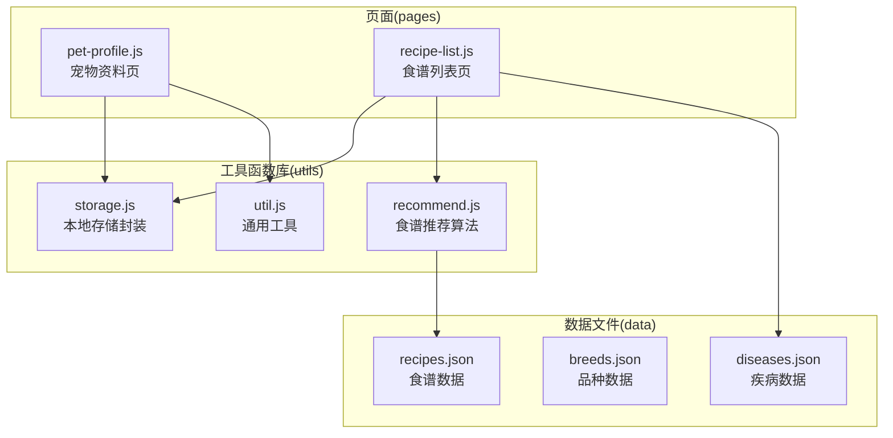
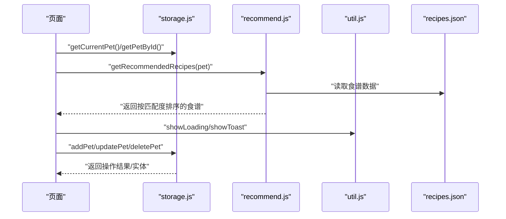
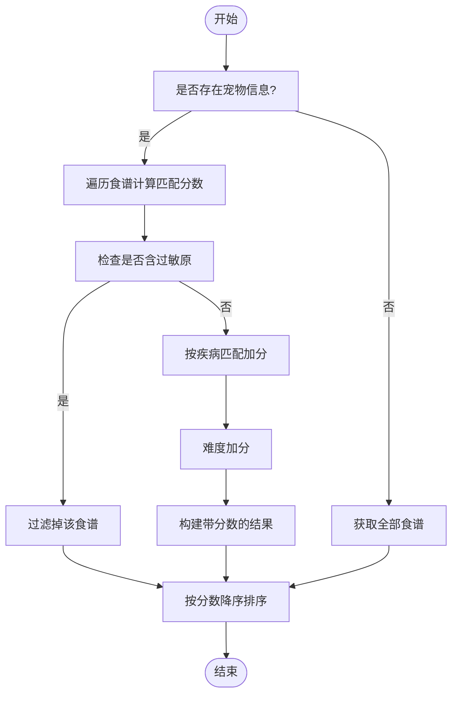
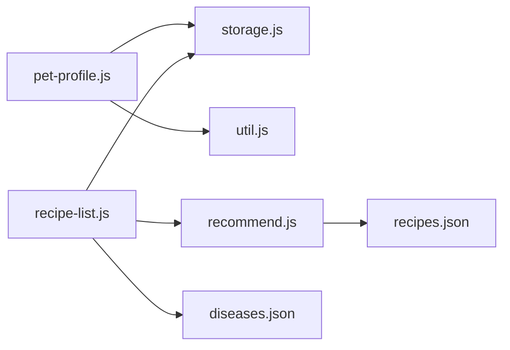

# 工具函数库

<cite>
**本文档引用的文件**
- [utils/storage.js](file://utils/storage.js)
- [utils/recommend.js](file://utils/recommend.js)
- [utils/util.js](file://utils/util.js)
- [data/recipes.json](file://data/recipes.json)
- [data/breeds.json](file://data/breeds.json)
- [data/diseases.json](file://data/diseases.json)
- [pages/pet-profile/pet-profile.js](file://pages/pet-profile/pet-profile.js)
- [pages/recipe-list/recipe-list.js](file://pages/recipe-list/recipe-list.js)
</cite>

## 目录
1. [简介](#简介)
2. [项目结构](#项目结构)
3. [核心组件](#核心组件)
4. [架构总览](#架构总览)
5. [详细组件分析](#详细组件分析)
6. [依赖关系分析](#依赖关系分析)
7. [性能考虑](#性能考虑)
8. [故障排查指南](#故障排查指南)
9. [结论](#结论)
10. [附录](#附录)

## 简介
本文件系统性梳理 Old-baby 项目的工具函数库，聚焦 utils 目录下的三个核心模块：storage.js（本地存储封装）、recommend.js（食谱推荐算法）、util.js（通用工具）。文档从功能职责、参数与返回值、调用流程、错误处理、性能优化、扩展建议等方面进行深入解析，并结合实际页面使用场景展示最佳实践。

## 项目结构
工具函数库位于 utils 目录，配合 data 目录的数据文件与 pages 目录的页面逻辑共同构成应用的数据与业务处理层。

图表来源
- [utils/storage.js](file://utils/storage.js#L1-L155)
- [utils/recommend.js](file://utils/recommend.js#L1-L109)
- [utils/util.js](file://utils/util.js#L1-L123)
- [data/recipes.json](file://data/recipes.json#L1-L515)
- [data/breeds.json](file://data/breeds.json#L1-L35)
- [data/diseases.json](file://data/diseases.json#L1-L108)
- [pages/pet-profile/pet-profile.js](file://pages/pet-profile/pet-profile.js#L1-L216)
- [pages/recipe-list/recipe-list.js](file://pages/recipe-list/recipe-list.js#L1-L129)

章节来源
- [utils/storage.js](file://utils/storage.js#L1-L155)
- [utils/recommend.js](file://utils/recommend.js#L1-L109)
- [utils/util.js](file://utils/util.js#L1-L123)
- [data/recipes.json](file://data/recipes.json#L1-L515)
- [data/breeds.json](file://data/breeds.json#L1-L35)
- [data/diseases.json](file://data/diseases.json#L1-L108)
- [pages/pet-profile/pet-profile.js](file://pages/pet-profile/pet-profile.js#L1-L216)
- [pages/recipe-list/recipe-list.js](file://pages/recipe-list/recipe-list.js#L1-L129)

## 核心组件
- storage.js：提供宠物信息的增删改查、当前选中宠物的存取、唯一ID生成等能力，基于微信本地存储接口封装。
- recommend.js：根据宠物的疾病与过敏原信息，对食谱数据进行评分与过滤，支持按疾病筛选与关键词搜索。
- util.js：提供时间格式化、年龄描述、喂食量估算、防抖、加载与提示、确认弹窗等通用能力，统一页面交互体验。

章节来源
- [utils/storage.js](file://utils/storage.js#L1-L155)
- [utils/recommend.js](file://utils/recommend.js#L1-L109)
- [utils/util.js](file://utils/util.js#L1-L123)

## 架构总览
工具函数库采用“模块化+数据驱动”的架构：
- storage.js 负责数据持久化与当前宠物上下文；
- recommend.js 依赖 recipes.json 数据，通过评分与过滤规则输出推荐结果；
- util.js 提供 UI 交互与通用算法辅助；
- 页面通过 require 引入工具模块，形成清晰的职责边界。

图表来源
- [pages/recipe-list/recipe-list.js](file://pages/recipe-list/recipe-list.js#L30-L48)
- [utils/storage.js](file://utils/storage.js#L113-L140)
- [utils/recommend.js](file://utils/recommend.js#L10-L66)
- [data/recipes.json](file://data/recipes.json#L1-L515)
- [utils/util.js](file://utils/util.js#L72-L95)

## 详细组件分析

### storage.js 存储管理模块
- 设计目标
  - 封装本地存储操作，屏蔽 wx API 的差异与异常处理细节；
  - 统一宠物数据模型字段与当前选中宠物上下文；
  - 提供 CRUD 与上下文切换能力，支撑页面业务逻辑。

- 关键常量与函数
  - 常量：STORAGE_KEYS（pets、currentPetId、userInfo）
  - 生成唯一ID：generateId
  - 宠物列表：getPets、savePets
  - 单体查询与变更：getPetById、addPet、updatePet、deletePet
  - 当前宠物：getCurrentPetId、setCurrentPetId、getCurrentPet

- 数据模型要点
  - 宠物对象包含基本信息、健康信息、饮食信息、体检报告等字段；
  - 新增时自动填充 id、createTime、updateTime；
  - 更新时仅合并变更字段并更新 updateTime。

- 错误处理策略
  - 所有 wx API 调用均包裹 try/catch，失败时记录日志并返回安全默认值；
  - 读取失败返回空数组或 null，写入失败返回布尔值表示结果。

- 使用示例（路径参考）
  - 添加宠物：[pages/pet-profile/pet-profile.js](file://pages/pet-profile/pet-profile.js#L174-L178)
  - 更新宠物：[pages/pet-profile/pet-profile.js](file://pages/pet-profile/pet-profile.js#L173-L175)
  - 设置当前宠物：[pages/pet-profile/pet-profile.js](file://pages/pet-profile/pet-profile.js#L177-L178)
  - 查询当前宠物：[pages/recipe-list/recipe-list.js](file://pages/recipe-list/recipe-list.js#L31-L32)

- 性能与扩展建议
  - 复杂查询建议在上层聚合后再写入，减少多次 setStorageSync；
  - 可引入版本号或校验字段，避免旧格式数据导致的兼容问题；
  - 对于大列表，可考虑分页或懒加载策略（当前项目规模较小，暂无需）。

章节来源
- [utils/storage.js](file://utils/storage.js#L1-L155)
- [pages/pet-profile/pet-profile.js](file://pages/pet-profile/pet-profile.js#L145-L190)
- [pages/recipe-list/recipe-list.js](file://pages/recipe-list/recipe-list.js#L30-L48)

### recommend.js 推荐算法模块
- 设计目标
  - 基于宠物的疾病与过敏原，对食谱进行评分与过滤；
  - 支持按疾病筛选与关键词搜索，兼顾通用与个性化需求。

- 核心算法
  - 评分规则
    - 若宠物存在过敏原且食谱包含对应 avoidFor，则标记为 isAvoided 并直接过滤；
    - 若宠物存在疾病，则对 suitableFor 中匹配的疾病逐条加分；
    - 健康宠物（无疾病）时，无适用疾病的食谱额外加分；
    - 难度为“简单”的食谱额外加分；
  - 过滤与排序：先过滤 isAvoided，再按 score 降序排列。

- 关键函数
  - getRecommendedRecipes：主入口，接收 pet 参数；
  - getAllRecipes：返回全部食谱；
  - getRecipeById：按 id 查询；
  - getRecipesByDisease：按疾病筛选；
  - searchRecipes：按关键词搜索（名称、描述、食材名）。

- 数据依赖
  - 依赖 data/recipes.json，字段包括 id、name、description、suitableFor、avoidFor、difficulty、ingredients、steps 等。

- 使用示例（路径参考）
  - 页面加载时根据当前宠物调用推荐：[pages/recipe-list/recipe-list.js](file://pages/recipe-list/recipe-list.js#L35-L41)
  - 搜索与筛选：[pages/recipe-list/recipe-list.js](file://pages/recipe-list/recipe-list.js#L84-L109)

- 性能与扩展建议
  - 当前算法为线性扫描，复杂度 O(N)；N 为食谱数量，当前项目规模较小，性能可接受；
  - 可考虑对 recipes.json 建立索引（如按 suitableFor、avoidFor 分类），提升查询效率；
  - 可引入权重配置或动态评分因子，支持更灵活的个性化推荐。

图表来源
- [utils/recommend.js](file://utils/recommend.js#L10-L66)

章节来源
- [utils/recommend.js](file://utils/recommend.js#L1-L109)
- [data/recipes.json](file://data/recipes.json#L1-L515)
- [pages/recipe-list/recipe-list.js](file://pages/recipe-list/recipe-list.js#L30-L109)

### util.js 通用工具模块
- 设计目标
  - 提供 UI 交互与常用算法的统一封装，降低页面重复代码，提升一致性。

- 关键函数
  - 时间格式化：formatTime、formatNumber
  - 年龄描述：getAgeDescription
  - 喂食量估算：calculateDailyFood（支持活动水平）
  - 防抖：debounce
  - 加载与提示：showLoading、hideLoading、showToast
  - 确认弹窗：showConfirm（返回 Promise）

- 使用示例（路径参考）
  - 表单验证与提示：[pages/pet-profile/pet-profile.js](file://pages/pet-profile/pet-profile.js#L149-L162)
  - 加载与提示：[pages/pet-profile/pet-profile.js](file://pages/pet-profile/pet-profile.js#L170-L189)
  - 确认删除：[pages/pet-profile/pet-profile.js](file://pages/pet-profile/pet-profile.js#L205-L214)

- 性能与扩展建议
  - 防抖延迟默认 300ms，适用于输入类高频触发场景；
  - 可扩展更多 UI 组件封装（如侧边栏、标签页等）；
  - 喂食量估算为近似值，建议结合兽医建议与个体差异调整。

章节来源
- [utils/util.js](file://utils/util.js#L1-L123)
- [pages/pet-profile/pet-profile.js](file://pages/pet-profile/pet-profile.js#L145-L214)

## 依赖关系分析
- 模块间耦合
  - storage.js 与 pages 层直接耦合，用于数据持久化与上下文管理；
  - recommend.js 与 data 层耦合，依赖 recipes.json；
  - util.js 与 pages 层耦合，提供 UI 与通用算法；
  - pages 层之间无直接耦合，通过工具模块间接协作。

- 外部依赖
  - 微信小程序 API：wx.getStorageSync、wx.setStorageSync、wx.showLoading、wx.showToast、wx.showModal、wx.chooseMedia 等。

图表来源
- [pages/pet-profile/pet-profile.js](file://pages/pet-profile/pet-profile.js#L1-L216)
- [pages/recipe-list/recipe-list.js](file://pages/recipe-list/recipe-list.js#L1-L129)
- [utils/storage.js](file://utils/storage.js#L1-L155)
- [utils/recommend.js](file://utils/recommend.js#L1-L109)
- [utils/util.js](file://utils/util.js#L1-L123)
- [data/recipes.json](file://data/recipes.json#L1-L515)
- [data/diseases.json](file://data/diseases.json#L1-L108)

章节来源
- [pages/pet-profile/pet-profile.js](file://pages/pet-profile/pet-profile.js#L1-L216)
- [pages/recipe-list/recipe-list.js](file://pages/recipe-list/recipe-list.js#L1-L129)
- [utils/storage.js](file://utils/storage.js#L1-L155)
- [utils/recommend.js](file://utils/recommend.js#L1-L109)
- [utils/util.js](file://utils/util.js#L1-L123)
- [data/recipes.json](file://data/recipes.json#L1-L515)
- [data/diseases.json](file://data/diseases.json#L1-L108)

## 性能考虑
- storage.js
  - 读写均为同步 API，频繁写入可能阻塞主线程；建议批量写入或在后台线程处理（当前项目规模小，影响有限）。
  - 建议对大对象进行序列化/反序列化时增加校验与版本控制，避免旧格式导致的异常。

- recommend.js
  - 线性扫描食谱，复杂度 O(N)；当前食谱数量约 500 条，性能可接受。
  - 可考虑建立索引或缓存热门筛选条件的结果，减少重复计算。

- util.js
  - 防抖函数对高频事件有效，建议根据具体场景调整延迟阈值。
  - 加载与提示函数为轻量封装，注意避免同时打开多个加载状态。

[本节为通用性能讨论，不涉及具体文件分析]

## 故障排查指南
- 存储相关
  - 症状：读取宠物列表为空或报错
  - 排查：确认 wx.getStorageSync 是否抛出异常；检查 STORAGE_KEYS 常量与实际存储键是否一致
  - 参考：[utils/storage.js](file://utils/storage.js#L20-L26)

- 推荐算法相关
  - 症状：推荐结果为空或不符合预期
  - 排查：确认 recipes.json 字段是否完整；检查 pet.diseases 与 pet.allergens 是否正确传入
  - 参考：[utils/recommend.js](file://utils/recommend.js#L15-L66)

- UI 交互相关
  - 症状：加载提示未关闭或提示不显示
  - 排查：确认 util.js 中 showLoading/hideLoading 的调用时机；检查 wx API 权限
  - 参考：[utils/util.js](file://utils/util.js#L72-L95)

章节来源
- [utils/storage.js](file://utils/storage.js#L20-L26)
- [utils/recommend.js](file://utils/recommend.js#L15-L66)
- [utils/util.js](file://utils/util.js#L72-L95)

## 结论
工具函数库通过模块化设计实现了清晰的职责分离：storage.js 负责数据持久化与上下文管理，recommend.js 实现了面向健康的食谱推荐算法，util.js 统一了 UI 交互与通用算法。三者与页面层协同良好，满足了 Old-baby 项目的核心需求。随着业务发展，可在现有基础上引入缓存、索引与配置化策略，进一步提升性能与可维护性。

[本节为总结性内容，不涉及具体文件分析]

## 附录

### 函数速查表
- storage.js
  - generateId：生成唯一ID
  - getPets/savePets：读取/保存宠物列表
  - getPetById：按ID查询宠物
  - addPet/updatePet/deletePet：新增/更新/删除宠物
  - getCurrentPetId/setCurrentPetId/getCurrentPet：当前宠物上下文

- recommend.js
  - getRecommendedRecipes：按宠物信息推荐食谱
  - getAllRecipes/getRecipeById：获取全部/按ID查询食谱
  - getRecipesByDisease/searchRecipes：按疾病筛选/关键词搜索

- util.js
  - formatTime/formatNumber：时间格式化
  - getAgeDescription：年龄描述
  - calculateDailyFood：喂食量估算
  - debounce：防抖
  - showLoading/hideLoading/showToast：加载与提示
  - showConfirm：确认弹窗

章节来源
- [utils/storage.js](file://utils/storage.js#L142-L154)
- [utils/recommend.js](file://utils/recommend.js#L102-L108)
- [utils/util.js](file://utils/util.js#L112-L122)