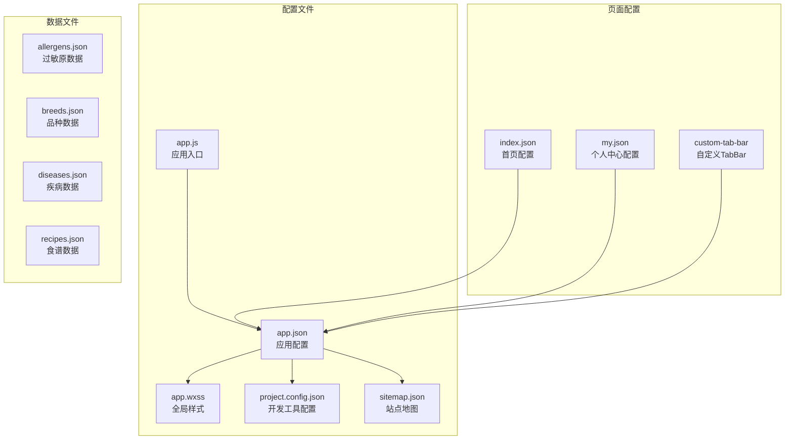
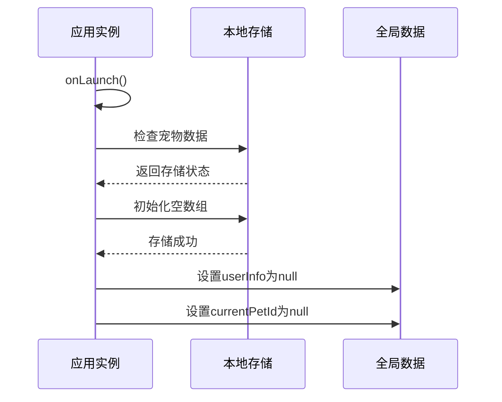
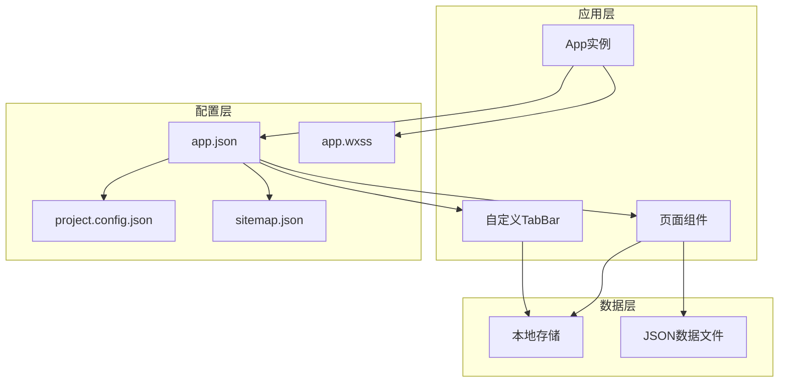
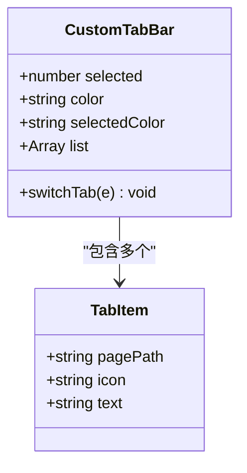
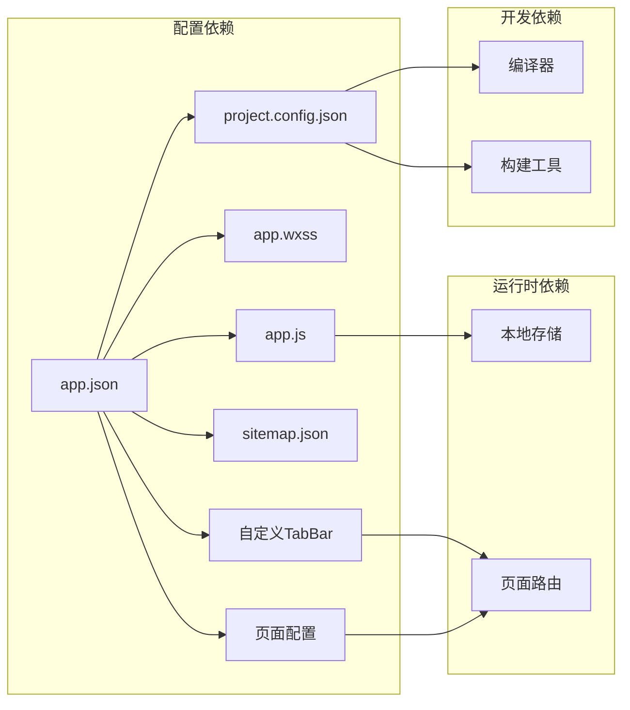

# 应用配置文件

<cite>
**本文档引用的文件**
- [app.js](file://app.js)
- [app.json](file://app.json)
- [app.wxss](file://app.wxss)
- [project.config.json](file://project.config.json)
- [sitemap.json](file://sitemap.json)
- [index.json](file://pages/index/index.json)
- [my.json](file://pages/my/my.json)
- [custom-tab-bar/index.json](file://custom-tab-bar/index.json)
- [custom-tab-bar/index.js](file://custom-tab-bar/index.js)
</cite>

## 目录
1. [简介](#简介)
2. [项目结构](#项目结构)
3. [核心组件](#核心组件)
4. [架构概览](#架构概览)
5. [详细组件分析](#详细组件分析)
6. [依赖关系分析](#依赖关系分析)
7. [性能考虑](#性能考虑)
8. [故障排除指南](#故障排除指南)
9. [结论](#结论)

## 简介

Old-baby项目是一个老年宠物护理小程序，采用微信小程序框架构建。本文档深入解析了项目的核心配置文件，包括应用入口文件、全局样式、开发工具配置和搜索引擎站点地图等关键配置。

## 项目结构

项目采用标准的微信小程序目录结构，主要包含以下配置相关文件：

**图表来源**
- [app.js](file://app.js#L1-L21)
- [app.json](file://app.json#L1-L41)
- [app.wxss](file://app.wxss#L1-L224)
- [project.config.json](file://project.config.json#L1-L47)
- [sitemap.json](file://sitemap.json#L1-L8)

**章节来源**
- [app.js](file://app.js#L1-L21)
- [app.json](file://app.json#L1-L41)
- [app.wxss](file://app.wxss#L1-L224)
- [project.config.json](file://project.config.json#L1-L47)
- [sitemap.json](file://sitemap.json#L1-L8)

## 核心组件

### 应用入口文件 (app.js)

应用入口文件负责小程序的初始化和全局状态管理：

- **生命周期管理**: 实现onLaunch钩子函数，在应用启动时执行初始化逻辑
- **本地存储初始化**: 检查并初始化宠物数据存储，确保应用有可用的数据结构
- **全局数据管理**: 定义globalData对象，包含用户信息和当前选中宠物ID等全局状态

**图表来源**
- [app.js](file://app.js#L3-L19)

**章节来源**
- [app.js](file://app.js#L1-L21)

### 应用配置文件 (app.json)

应用配置文件定义了小程序的整体行为和外观：

#### 页面路由配置
- **页面列表**: 定义了6个核心页面的路径
  - 首页: pages/index/index
  - 宠物档案: pages/pet-profile/pet-profile
  - 健康信息: pages/health-info/health-info
  - 食谱列表: pages/recipe-list/recipe-list
  - 食谱详情: pages/recipe-detail/recipe-detail
  - 我的: pages/my/my

#### 导航栏样式配置
- **背景文字样式**: dark模式
- **导航栏背景色**: 深绿色(#4A7C59)，体现自然主题
- **导航栏标题**: 老宝贝护理
- **导航栏文字颜色**: 白色
- **背景颜色**: 米色(#F5F1E8)，营造温馨氛围

#### 自定义TabBar设置
- **自定义启用**: custom: true
- **颜色方案**: 
  - 未选中状态: 灰色(#999999)
  - 选中状态: 深绿色(#4A7C59)
  - 背景色: 白色(#FFFFFF)
- **边框样式**: 白色边框
- **TabBar项**:
  - 我的宝贝 (🏠): 首页
  - 食谱 (🍲): 食谱列表
  - 我的 (👤): 个人中心

#### 其他配置
- **sitemap位置**: sitemapLocation: sitemap.json
- **样式版本**: style: v2

**章节来源**
- [app.json](file://app.json#L1-L41)

### 全局样式文件 (app.wxss)

全局样式文件采用CSS变量的方式实现设计系统：

#### 设计系统变量
- **主色调系列**: 
  - 主色: #4A7C59 (深绿色)
  - 浅色: #8FB996
  - 深色: #3D6B4A
- **辅助色彩**: #D4A574 (暖色调)
- **文本色彩**: 
  - 主要文本: #3D3D3D
  - 次要文本: #666666
  - 辅助文本: #999999
- **背景色彩**: #F5F1E8 (米色)
- **边框色彩**: #E8E4DB
- **状态色彩**: 
  - 错误: #E07A5F
  - 成功: #81B29A

#### 组件样式规范
- **容器样式**: .container - 30rpx内边距，100vh最小高度
- **卡片样式**: .card - 圆角24rpx，阴影效果，白色背景
- **按钮样式**: 
  - 主按钮: 渐变背景，圆角50rpx
  - 次按钮: 白色背景，绿色边框
- **表单样式**: 输入框统一设计，焦点状态高亮
- **标签样式**: .tag - 圆角30rpx，支持激活状态
- **布局系统**: 
  - Flex布局: .flex-row, .flex-column, .flex-center
  - 间距类: .mt-20, .mb-30 等

**章节来源**
- [app.wxss](file://app.wxss#L1-L224)

### 开发工具配置文件 (project.config.json)

开发工具配置文件控制编译和构建行为：

#### 打包选项
- **忽略规则**: 空数组，不忽略任何文件
- **包含规则**: 空数组，包含所有文件

#### 编译设置
- **基础设置**: 
  - es6: true (启用ES6)
  - postcss: true (启用CSS预处理)
  - minified: true (代码压缩)
  - minifyWXSS: true (样式压缩)
  - minifyWXML: true (模板压缩)
- **高级功能**: 
  - enhance: true (增强功能)
  - useMultiFrameRuntime: true (多帧运行时)
  - useApiHook: true (API钩子)
  - useApiHostProcess: true (API主机进程)

#### 项目信息
- **编译类型**: miniprogram (小程序)
- **库版本**: 3.3.4
- **AppID**: wx0000000000000000
- **项目名称**: old-baby-care

**章节来源**
- [project.config.json](file://project.config.json#L1-L47)

### 站点地图配置 (sitemap.json)

站点地图文件控制搜索引擎爬虫访问权限：

#### 配置规则
- **访问策略**: allow (允许访问)
- **页面范围**: * (所有页面)
- **描述信息**: 引导开发者查看官方文档

**章节来源**
- [sitemap.json](file://sitemap.json#L1-L8)

## 架构概览

**图表来源**
- [app.js](file://app.js#L1-L21)
- [app.json](file://app.json#L1-L41)
- [app.wxss](file://app.wxss#L1-L224)
- [project.config.json](file://project.config.json#L1-L47)
- [sitemap.json](file://sitemap.json#L1-L8)

## 详细组件分析

### 自定义TabBar组件

自定义TabBar组件提供了灵活的底部导航解决方案：

**图表来源**
- [custom-tab-bar/index.js](file://custom-tab-bar/index.js#L1-L32)

#### 组件特性
- **数据绑定**: 使用data属性管理选中状态和配置
- **事件处理**: switchTab方法处理页面切换逻辑
- **图标支持**: 支持emoji图标显示
- **路径匹配**: 使用pagePath进行页面导航

**章节来源**
- [custom-tab-bar/index.js](file://custom-tab-bar/index.js#L1-L32)
- [custom-tab-bar/index.json](file://custom-tab-bar/index.json#L1-L4)

### 页面配置分析

#### 首页配置
- **导航栏标题**: 老宝贝护理
- **组件使用**: 无特殊组件

#### 个人中心配置
- **导航栏标题**: 我的
- **组件使用**: 无特殊组件

**章节来源**
- [pages/index/index.json](file://pages/index/index.json#L1-L5)
- [pages/my/my.json](file://pages/my/my.json#L1-L5)

## 依赖关系分析

**图表来源**
- [app.json](file://app.json#L1-L41)
- [app.js](file://app.js#L1-L21)
- [project.config.json](file://project.config.json#L1-L47)

### 关键依赖关系
- **应用配置依赖**: app.json是所有页面和组件的配置中心
- **样式依赖**: app.wxss为所有页面提供统一的设计系统
- **运行时依赖**: app.js管理应用生命周期和全局状态
- **开发工具依赖**: project.config.json控制编译和构建过程

**章节来源**
- [app.json](file://app.json#L1-L41)
- [app.js](file://app.js#L1-L21)
- [app.wxss](file://app.wxss#L1-L224)
- [project.config.json](file://project.config.json#L1-L47)

## 性能考虑

### 样式优化
- **CSS变量**: 使用CSS变量减少重复定义，提高维护性
- **样式压缩**: 启用minifyWXSS和minifyWXML优化加载性能
- **渐进式设计**: 使用box-shadow等效果提升视觉体验但保持性能平衡

### 构建优化
- **代码压缩**: minified: true确保生产环境代码体积最小化
- **按需编译**: es6: true和postcss: true提升编译效率
- **资源优化**: lazyloadPlaceholderEnable: false避免不必要的占位符

### 运行时优化
- **存储初始化**: 在onLaunch阶段完成，避免运行时重复检查
- **组件复用**: 自定义TabBar组件可复用到多个页面

## 故障排除指南

### 常见配置问题

#### 页面路径错误
**问题**: 页面无法正常加载
**解决方案**: 
- 检查app.json中pages数组的路径格式
- 确保路径与实际文件夹结构一致
- 验证文件扩展名正确

#### 样式变量未生效
**问题**: CSS变量不显示预期效果
**解决方案**:
- 确认CSS变量在page选择器中定义
- 检查变量命名是否符合CSS规范
- 验证app.wxss文件被正确引入

#### TabBar显示异常
**问题**: 自定义TabBar不显示或点击无效
**解决方案**:
- 检查app.json中tabBar配置的custom字段
- 验证pagePath与目标页面路径一致
- 确认switchTab方法正确绑定事件

#### 构建失败
**问题**: 开发工具编译报错
**解决方案**:
- 检查project.config.json中的设置冲突
- 验证编译类型和库版本兼容性
- 确认所有必需的配置项都已正确设置

**章节来源**
- [app.json](file://app.json#L1-L41)
- [app.wxss](file://app.wxss#L1-L224)
- [project.config.json](file://project.config.json#L1-L47)

## 结论

Old-baby项目的配置文件体系体现了良好的架构设计和最佳实践：

1. **统一的配置中心**: app.json作为单一配置源，确保配置的一致性和可维护性
2. **设计系统化**: 通过CSS变量实现统一的设计语言和主题色彩
3. **模块化架构**: 自定义TabBar组件实现功能复用和代码分离
4. **开发友好**: 完善的开发工具配置支持高效的开发流程
5. **SEO友好**: 正确的sitemap配置有利于搜索引擎收录

这些配置文件共同构成了一个结构清晰、易于维护、具有良好用户体验的小程序应用基础。