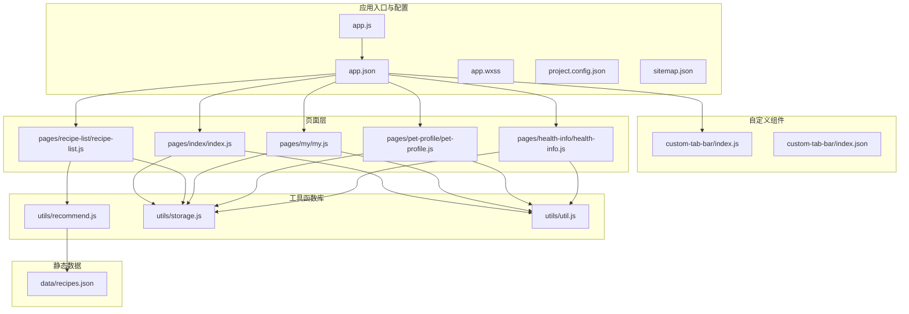
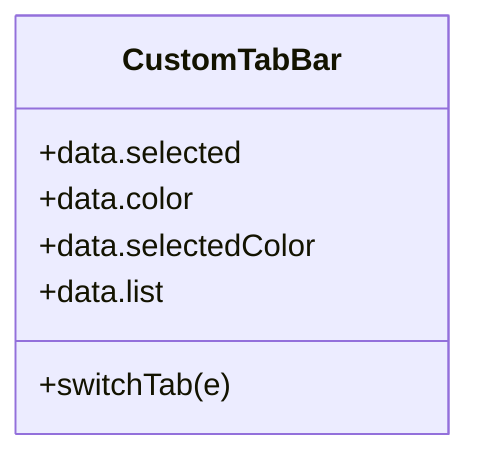
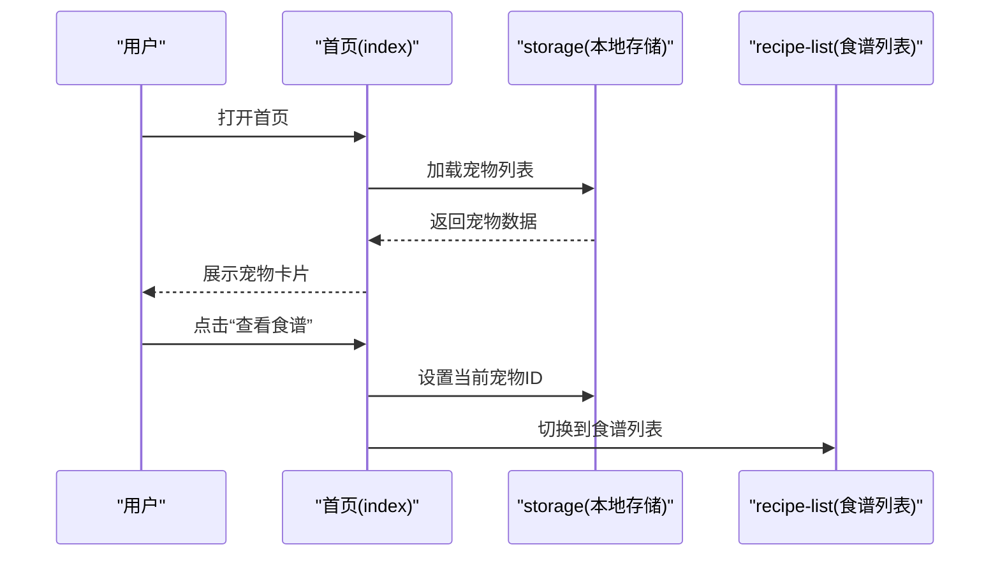
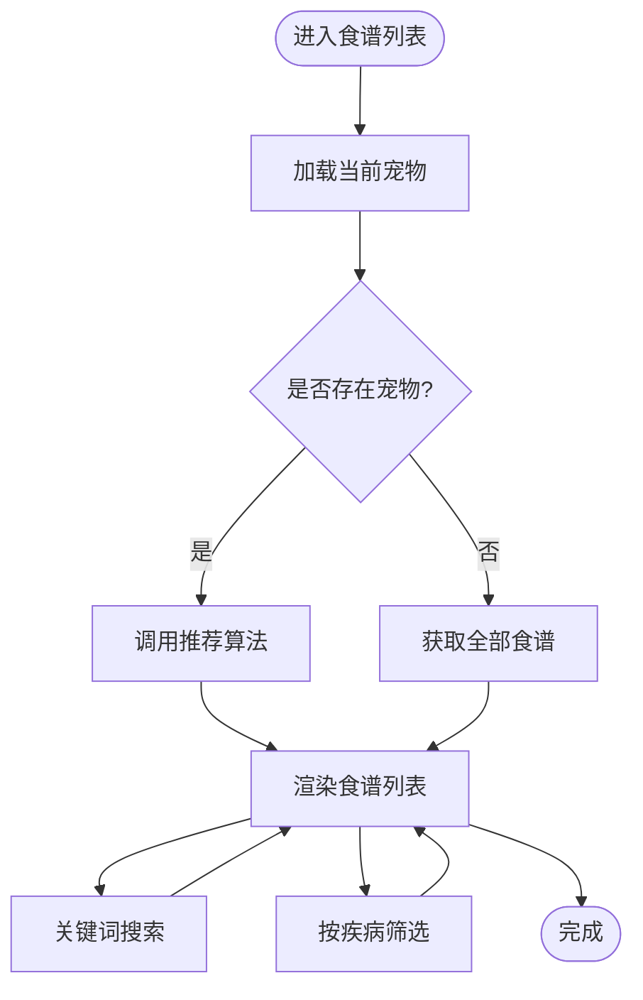
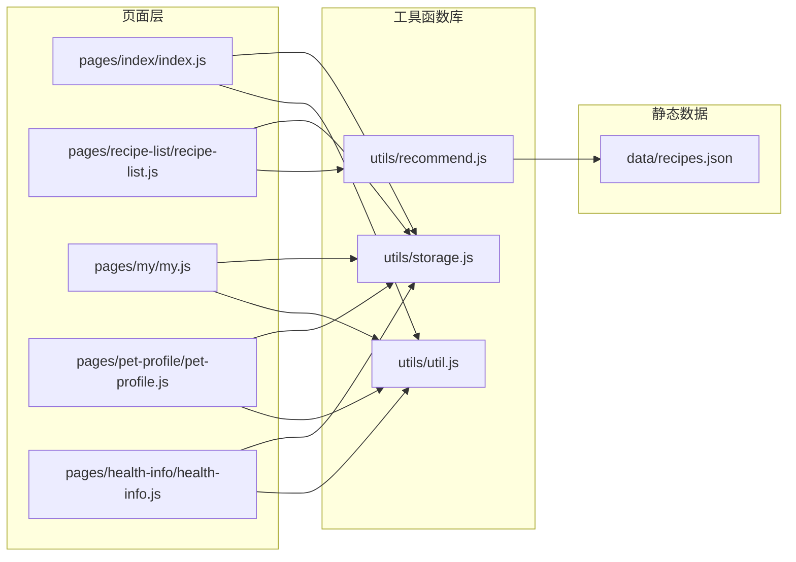

# 目录结构详解

<cite>
**本文档引用的文件**
- [app.js](file://app.js)
- [app.json](file://app.json)
- [app.wxss](file://app.wxss)
- [project.config.json](file://project.config.json)
- [sitemap.json](file://sitemap.json)
- [custom-tab-bar/index.js](file://custom-tab-bar/index.js)
- [custom-tab-bar/index.json](file://custom-tab-bar/index.json)
- [utils/recommend.js](file://utils/recommend.js)
- [utils/storage.js](file://utils/storage.js)
- [utils/util.js](file://utils/util.js)
- [data/recipes.json](file://data/recipes.json)
- [pages/index/index.js](file://pages/index/index.js)
- [pages/recipe-list/recipe-list.js](file://pages/recipe-list/recipe-list.js)
- [pages/my/my.js](file://pages/my/my.js)
- [pages/pet-profile/pet-profile.js](file://pages/pet-profile/pet-profile.js)
- [pages/health-info/health-info.js](file://pages/health-info/health-info.js)
</cite>

## 目录与文件总览

本项目采用“功能域+页面层”的组织方式，遵循微信小程序标准目录结构，并通过自定义组件与工具函数库实现清晰的职责分离。核心目录与文件职责如下：

- 根级配置与全局样式
  - app.js：应用生命周期与全局状态入口
  - app.json：页面路由、导航栏与自定义 tabBar 配置
  - app.wxss：全局样式与通用样式类
  - project.config.json：项目构建与编译配置
  - sitemap.json：搜索引擎收录规则

- 自定义组件
  - custom-tab-bar/：自定义底部导航组件，包含逻辑与模板资源

- 数据资源
  - data/：静态数据文件（过敏原、品种、疾病、食谱）

- 页面层
  - pages/：业务页面集合，每个页面包含 js/json/wxml/wxss 四件套

- 工具函数库
  - utils/：模块化工具函数（推荐算法、本地存储、通用工具）

**图表来源**
- [app.js](file://app.js#L1-L21)
- [app.json](file://app.json#L1-L41)
- [app.wxss](file://app.wxss#L1-L224)
- [project.config.json](file://project.config.json#L1-L47)
- [sitemap.json](file://sitemap.json#L1-L8)
- [custom-tab-bar/index.js](file://custom-tab-bar/index.js#L1-L32)
- [custom-tab-bar/index.json](file://custom-tab-bar/index.json#L1-L4)
- [utils/recommend.js](file://utils/recommend.js#L1-L109)
- [utils/storage.js](file://utils/storage.js#L1-L155)
- [utils/util.js](file://utils/util.js#L1-L123)
- [data/recipes.json](file://data/recipes.json#L1-L200)
- [pages/index/index.js](file://pages/index/index.js#L1-L80)
- [pages/recipe-list/recipe-list.js](file://pages/recipe-list/recipe-list.js#L1-L129)
- [pages/my/my.js](file://pages/my/my.js#L1-L113)
- [pages/pet-profile/pet-profile.js](file://pages/pet-profile/pet-profile.js#L1-L216)
- [pages/health-info/health-info.js](file://pages/health-info/health-info.js#L1-L190)

**章节来源**
- [app.js](file://app.js#L1-L21)
- [app.json](file://app.json#L1-L41)
- [app.wxss](file://app.wxss#L1-L224)
- [project.config.json](file://project.config.json#L1-L47)
- [sitemap.json](file://sitemap.json#L1-L8)

## 核心配置文件解析

### app.js：应用生命周期与全局状态
- 初始化本地存储：在启动时检查并确保宠物数据键存在，避免后续读写异常
- 全局数据：维护用户信息与当前选中宠物 ID，供页面间共享

最佳实践
- 在 onLaunch 中完成基础初始化，避免在多个页面重复初始化
- 将跨页面使用的状态集中管理，减少数据不一致风险

**章节来源**
- [app.js](file://app.js#L1-L21)

### app.json：页面路由与界面风格
- 页面注册：声明各页面路径，决定小程序启动页与页面栈顺序
- 导航栏：统一标题、背景色与文字颜色，提升品牌一致性
- 自定义 tabBar：启用自定义组件，配置三个 tab 的页面路径与文案
- Sitemap：允许所有页面被搜索引擎收录

最佳实践
- tabBar 数量建议不超过 5 个，本项目为 3 个，符合规范
- 页面路径与实际目录保持一致，避免运行时错误

**章节来源**
- [app.json](file://app.json#L1-L41)

### app.wxss：全局样式与通用类
- 设计系统：以自然森系为主题，定义主色、辅色、背景与文本变量
- 通用组件：卡片、按钮、表单、标签、分割线、空状态等
- 布局辅助：flex 布局与间距类，便于快速搭建页面结构

最佳实践
- 使用 CSS 变量统一主题色，便于主题切换或品牌更新
- 将常用样式抽象为通用类，减少重复代码

**章节来源**
- [app.wxss](file://app.wxss#L1-L224)

### project.config.json：构建与编译配置
- 构建优化：启用压缩、最小化与多帧运行时等特性
- 开发体验：覆盖视图、增强、API 钩子等开发相关设置

最佳实践
- 在团队协作中统一构建配置，避免差异化导致的打包问题
- 生产环境开启混淆与最小化，提升加载性能

**章节来源**
- [project.config.json](file://project.config.json#L1-L47)

### sitemap.json：搜索引擎收录策略
- 规则：允许所有页面被收录，便于 SEO 优化

最佳实践
- 对隐私页面或测试页面可设置拒绝收录
- 定期检查收录状态，确保关键页面可见

**章节来源**
- [sitemap.json](file://sitemap.json#L1-L8)

## 自定义组件：custom-tab-bar

### 设计思路
- 组件化：将 tabBar 抽象为独立组件，便于复用与定制
- 数据驱动：通过 list 配置 tab 列表，支持图标与文案
- 交互处理：提供 switchTab 方法，统一跳转逻辑

**图表来源**
- [custom-tab-bar/index.js](file://custom-tab-bar/index.js#L1-L32)

**章节来源**
- [custom-tab-bar/index.js](file://custom-tab-bar/index.js#L1-L32)
- [custom-tab-bar/index.json](file://custom-tab-bar/index.json#L1-L4)

## 数据静态资源：data 目录

### 组织结构与职责
- recipes.json：食谱清单，包含 ID、名称、描述、适用疾病、避免成分、难度、食材与步骤等
- 其他 JSON 文件：过敏原、品种、疾病等数据，供页面与推荐算法使用

最佳实践
- 数据格式标准化，字段命名语义明确
- 将业务数据与页面逻辑解耦，便于维护与扩展

**章节来源**
- [data/recipes.json](file://data/recipes.json#L1-L200)

## 页面目录：pages 功能划分

### 页面职责与交互流程

#### 首页 index
- 职责：展示宠物列表、添加新宠物、查看食谱推荐、编辑健康信息、删除宠物
- 流程：加载本地宠物数据 → 渲染卡片 → 支持跳转到宠物档案与食谱列表

**图表来源**
- [pages/index/index.js](file://pages/index/index.js#L1-L80)
- [utils/storage.js](file://utils/storage.js#L1-L155)
- [pages/recipe-list/recipe-list.js](file://pages/recipe-list/recipe-list.js#L1-L129)

**章节来源**
- [pages/index/index.js](file://pages/index/index.js#L1-L80)

#### 食谱列表 recipe-list
- 职责：根据当前选中宠物进行智能推荐，支持搜索与按疾病筛选
- 流程：加载当前宠物 → 调用推荐算法 → 渲染结果 → 支持跳转详情

**图表来源**
- [pages/recipe-list/recipe-list.js](file://pages/recipe-list/recipe-list.js#L1-L129)
- [utils/recommend.js](file://utils/recommend.js#L1-L109)

**章节来源**
- [pages/recipe-list/recipe-list.js](file://pages/recipe-list/recipe-list.js#L1-L129)

#### 我的 my
- 职责：用户信息录入、宠物管理入口、关于与反馈、清空缓存、分享
- 流程：读取本地用户信息 → 提供输入与操作 → 清空缓存时二次确认

**章节来源**
- [pages/my/my.js](file://pages/my/my.js#L1-L113)

#### 宠物档案 pet-profile
- 职责：新增/编辑宠物资料，包含头像、品种、年龄、体重、性别与绝育状态
- 流程：加载表单 → 校验输入 → 保存到本地存储 → 返回上一页

**章节来源**
- [pages/pet-profile/pet-profile.js](file://pages/pet-profile/pet-profile.js#L1-L216)

#### 健康信息 health-info
- 职责：记录宠物疾病、过敏原、用药、活动水平、偏好与体检报告
- 流程：加载数据 → 多选疾病与过敏原 → 上传报告图片 → 保存并返回

**章节来源**
- [pages/health-info/health-info.js](file://pages/health-info/health-info.js#L1-L190)

## 工具函数库：utils 模块化设计

### recommend.js：食谱推荐算法
- 核心能力：基于宠物疾病与过敏原进行评分与过滤，支持按 ID 查询、按疾病筛选与关键词搜索
- 数据来源：依赖 data/recipes.json

最佳实践
- 将算法封装为纯函数，便于单元测试与复用
- 对外部输入进行健壮性校验，避免空值影响排序

**章节来源**
- [utils/recommend.js](file://utils/recommend.js#L1-L109)
- [data/recipes.json](file://data/recipes.json#L1-L200)

### storage.js：本地存储封装
- 核心能力：宠物列表增删改查、当前宠物 ID 管理、用户信息持久化
- 错误处理：对存储异常进行捕获与降级

最佳实践
- 使用统一的键名常量，避免魔法字符串
- 对复杂对象进行序列化/反序列化，确保数据完整性

**章节来源**
- [utils/storage.js](file://utils/storage.js#L1-L155)

### util.js：通用工具函数
- 核心能力：时间格式化、年龄描述、每日喂食量估算、防抖、加载与提示、确认弹窗
- 作用：为页面提供一致的交互体验与便捷方法

最佳实践
- 将 UI 相关的提示与弹窗抽离为工具函数，减少页面样板代码
- 防抖函数可用于搜索与滚动场景，提升性能

**章节来源**
- [utils/util.js](file://utils/util.js#L1-L123)

## 依赖关系与数据流

**图表来源**
- [pages/index/index.js](file://pages/index/index.js#L1-L80)
- [pages/recipe-list/recipe-list.js](file://pages/recipe-list/recipe-list.js#L1-L129)
- [pages/my/my.js](file://pages/my/my.js#L1-L113)
- [pages/pet-profile/pet-profile.js](file://pages/pet-profile/pet-profile.js#L1-L216)
- [pages/health-info/health-info.js](file://pages/health-info/health-info.js#L1-L190)
- [utils/storage.js](file://utils/storage.js#L1-L155)
- [utils/recommend.js](file://utils/recommend.js#L1-L109)
- [utils/util.js](file://utils/util.js#L1-L123)
- [data/recipes.json](file://data/recipes.json#L1-L200)

## 性能与可维护性建议

- 模块化与解耦
  - 将业务逻辑（推荐算法）、数据访问（本地存储）与页面交互（工具函数）分离，降低耦合度
- 数据一致性
  - 通过统一的存储封装与全局初始化，确保数据可用性与一致性
- 用户体验
  - 使用通用工具函数提供一致的加载、提示与确认交互，减少页面重复代码
- 扩展性
  - 新增页面时，遵循现有命名与目录规范；新增功能优先考虑工具函数复用

[本节为通用建议，无需特定文件来源]

## 故障排查指南

常见问题与定位
- 页面无法跳转或 tab 不生效
  - 检查 app.json 中 pages 与 tabBar 配置是否正确
  - 确认自定义组件路径与页面路径一致
- 数据未持久化或为空
  - 检查 app.js 初始化逻辑与 storage 封装的键名
  - 确认页面读取与写入的键名一致
- 推荐结果异常
  - 检查 recipes.json 字段是否完整，推荐算法输入是否为空
  - 确认疾病与过敏原映射关系

**章节来源**
- [app.json](file://app.json#L1-L41)
- [app.js](file://app.js#L1-L21)
- [utils/storage.js](file://utils/storage.js#L1-L155)
- [utils/recommend.js](file://utils/recommend.js#L1-L109)

## 结论

本项目通过清晰的目录结构与模块化设计，实现了从页面到工具函数再到静态数据的有序组织。自定义组件与工具函数库提升了复用性与可维护性，配合统一的全局样式与配置，形成了良好的开发与扩展基础。建议在后续迭代中持续完善数据校验、错误处理与测试覆盖，以进一步提升稳定性与用户体验。