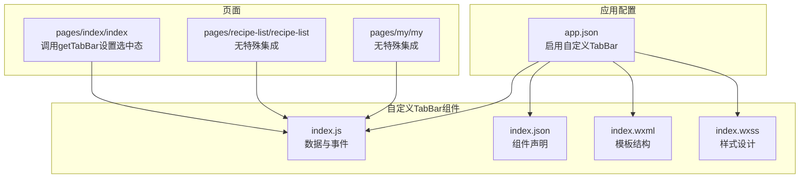
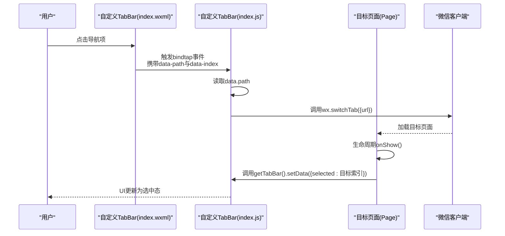
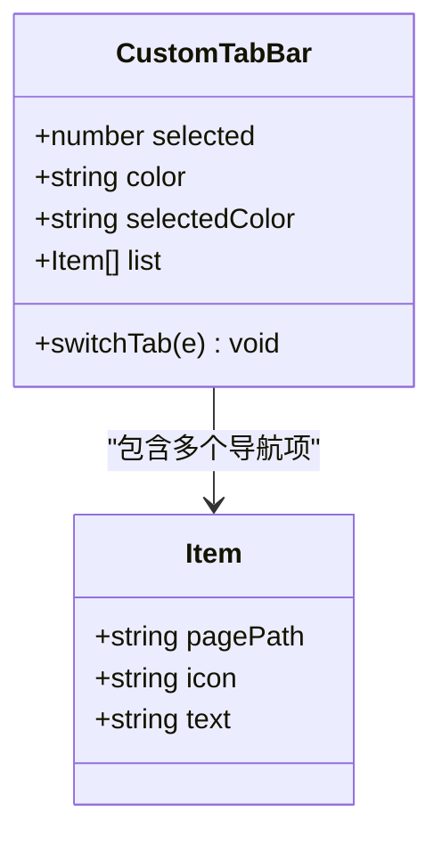
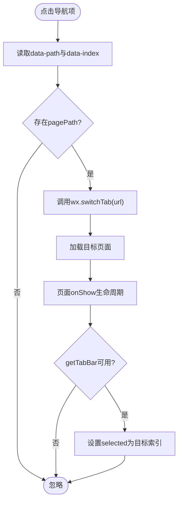
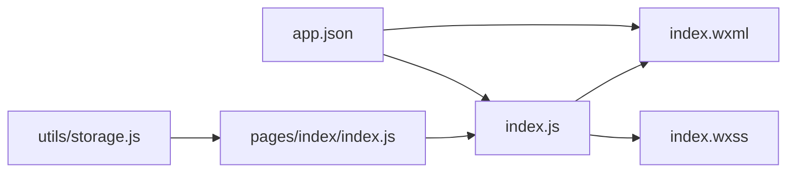

# 自定义TabBar组件

<cite>
**本文引用的文件**
- [custom-tab-bar/index.js](file://custom-tab-bar/index.js)
- [custom-tab-bar/index.json](file://custom-tab-bar/index.json)
- [custom-tab-bar/index.wxml](file://custom-tab-bar/index.wxml)
- [custom-tab-bar/index.wxss](file://custom-tab-bar/index.wxss)
- [app.json](file://app.json)
- [pages/index/index.js](file://pages/index/index.js)
- [pages/index/index.json](file://pages/index/index.json)
- [pages/recipe-list/recipe-list.json](file://pages/recipe-list/recipe-list.json)
- [pages/my/my.json](file://pages/my/my.json)
- [app.js](file://app.js)
- [app.wxss](file://app.wxss)
- [utils/storage.js](file://utils/storage.js)
</cite>

## 目录
1. [简介](#简介)
2. [项目结构](#项目结构)
3. [核心组件](#核心组件)
4. [架构总览](#架构总览)
5. [详细组件分析](#详细组件分析)
6. [依赖关系分析](#依赖关系分析)
7. [性能考量](#性能考量)
8. [故障排查指南](#故障排查指南)
9. [结论](#结论)
10. [附录](#附录)

## 简介
本文件针对 Old-baby 项目中的自定义 TabBar 组件进行系统化技术文档整理。重点包括：
- 自定义 TabBar 的设计思路与实现细节
- index.js 中的页面切换逻辑与事件处理机制
- index.json 的组件声明与属性设置
- index.wxml 模板结构与 index.wxss 样式设计
- 自定义 TabBar 与小程序原生 TabBar 的区别与优势
- 使用方法、定制化配置与扩展建议
- 实际代码示例路径与最佳实践

## 项目结构
自定义 TabBar 组件位于 custom-tab-bar 目录，采用标准小程序自定义组件结构：index.js（逻辑）、index.json（声明）、index.wxml（模板）、index.wxss（样式）。同时，应用级配置 app.json 中通过 custom: true 开启自定义 TabBar，并在各页面 JSON 中按需引入组件。

图表来源
- [app.json](file://app.json#L17-L37)
- [custom-tab-bar/index.js](file://custom-tab-bar/index.js#L1-L32)
- [custom-tab-bar/index.json](file://custom-tab-bar/index.json#L1-L4)
- [custom-tab-bar/index.wxml](file://custom-tab-bar/index.wxml#L1-L14)
- [custom-tab-bar/index.wxss](file://custom-tab-bar/index.wxss#L1-L36)
- [pages/index/index.js](file://pages/index/index.js#L15-L23)

章节来源
- [app.json](file://app.json#L1-L41)
- [custom-tab-bar/index.js](file://custom-tab-bar/index.js#L1-L32)
- [custom-tab-bar/index.json](file://custom-tab-bar/index.json#L1-L4)
- [custom-tab-bar/index.wxml](file://custom-tab-bar/index.wxml#L1-L14)
- [custom-tab-bar/index.wxss](file://custom-tab-bar/index.wxss#L1-L36)
- [pages/index/index.js](file://pages/index/index.js#L15-L23)

## 核心组件
自定义 TabBar 组件由以下文件构成：
- index.js：定义默认数据（选中索引、颜色、图标与文本列表），提供 switchTab 事件处理函数，用于触发 wx.switchTab 切换页面。
- index.json：声明该目录为小程序自定义组件。
- index.wxml：渲染底部导航项，绑定 tap 事件，动态显示选中态与文字颜色。
- index.wxss：设置固定定位、弹性布局、图标动画与阴影等视觉效果。

关键点
- 数据驱动：通过 list 数组维护导航项，selected 控制当前选中项，color/selectedColor 控制未选中与选中态文字颜色。
- 事件绑定：每个导航项绑定 tap 事件，事件参数来自 data-path 与 data-index，switchTab 读取 data-path 并调用 wx.switchTab。
- 样式适配：支持 iPhone 横屏安全区，底部留白与阴影增强层次感。

章节来源
- [custom-tab-bar/index.js](file://custom-tab-bar/index.js#L1-L32)
- [custom-tab-bar/index.json](file://custom-tab-bar/index.json#L1-L4)
- [custom-tab-bar/index.wxml](file://custom-tab-bar/index.wxml#L1-L14)
- [custom-tab-bar/index.wxss](file://custom-tab-bar/index.wxss#L1-L36)

## 架构总览
自定义 TabBar 与页面的交互流程如下：

图表来源
- [custom-tab-bar/index.wxml](file://custom-tab-bar/index.wxml#L6-L8)
- [custom-tab-bar/index.js](file://custom-tab-bar/index.js#L24-L29)
- [pages/index/index.js](file://pages/index/index.js#L15-L23)
- [app.json](file://app.json#L17-L37)

## 详细组件分析

### 设计思路与数据模型
- 导航项模型：每项包含 pagePath（跳转地址）、icon（图标）、text（文本）。
- 选中态控制：通过 selected 索引与当前渲染项索引比较，动态切换 active 类名与文字颜色。
- 主题色统一：color/selectedColor 与 app.json 中 tabBar 配置保持一致，确保视觉一致性。

图表来源
- [custom-tab-bar/index.js](file://custom-tab-bar/index.js#L2-L23)

章节来源
- [custom-tab-bar/index.js](file://custom-tab-bar/index.js#L1-L32)

### 页面切换逻辑与事件处理机制
- 事件绑定：index.wxml 中通过 data-path 与 data-index 将目标 URL 与索引传递给事件处理器。
- 事件处理：index.js 的 switchTab 从事件对象中读取 data-path，调用 wx.switchTab 进行页面跳转。
- 页面联动：目标页面在 onShow 中检测 getTabBar 是否可用，若可用则设置 selected 为对应索引，使 TabBar 与当前页面状态同步。

图表来源
- [custom-tab-bar/index.wxml](file://custom-tab-bar/index.wxml#L6-L8)
- [custom-tab-bar/index.js](file://custom-tab-bar/index.js#L24-L29)
- [pages/index/index.js](file://pages/index/index.js#L15-L23)

章节来源
- [custom-tab-bar/index.wxml](file://custom-tab-bar/index.wxml#L1-L14)
- [custom-tab-bar/index.js](file://custom-tab-bar/index.js#L24-L29)
- [pages/index/index.js](file://pages/index/index.js#L15-L23)

### index.json 组件声明与属性设置
- 组件声明：component: true 明确该目录为自定义组件。
- 页面集成：各页面 JSON 中 usingComponents 可按需引入自定义 TabBar，但当前项目中未在页面 JSON 中显式声明，而是通过 app.json 的 tabBar.custom=true 与页面 onShow 中的 getTabBar 方式实现联动。

章节来源
- [custom-tab-bar/index.json](file://custom-tab-bar/index.json#L1-L4)
- [pages/index/index.json](file://pages/index/index.json#L1-L5)
- [pages/recipe-list/recipe-list.json](file://pages/recipe-list/recipe-list.json#L1-L5)
- [pages/my/my.json](file://pages/my/my.json#L1-L5)

### index.wxml 模板结构
- 外层容器：tab-bar 使用 flex 布局，子元素均分宽度。
- 导航项：通过 wx:for 遍历 list，使用 wx:key="index" 提升渲染性能；绑定 tap 事件并传入 data-path 与 data-index。
- 选中态：根据 selected 与当前索引比较，动态添加 active 类名到图标，同时根据选中状态切换文字颜色。

章节来源
- [custom-tab-bar/index.wxml](file://custom-tab-bar/index.wxml#L1-L14)

### index.wxss 样式设计
- 固定定位：bottom: 0，left: 0，right: 0，高度 100rpx，保证始终位于屏幕底部。
- 弹性布局：flex 均分空间，垂直方向居中对齐。
- 图标动画：选中态下图标放大与透明度提升，提供微妙反馈。
- 安全区适配：padding-bottom 使用 env(safe-area-inset-bottom)，避免刘海屏遮挡。
- 阴影：轻微阴影增强层级感。

章节来源
- [custom-tab-bar/index.wxss](file://custom-tab-bar/index.wxss#L1-L36)

### 与小程序原生 TabBar 的区别与优势
- 自定义 TabBar 优势
  - 更强的可定制性：可自由调整图标、文案、颜色与布局，满足品牌风格。
  - 更灵活的交互：可在导航项上叠加徽标、动画或手势操作。
  - 更好的状态同步：通过 getTabBar().setData 手动控制选中态，避免原生 TabBar 在某些场景下的状态不一致。
- 适用场景
  - 需要与页面内容深度融合的底部导航。
  - 对视觉与交互有特殊要求的业务场景。

章节来源
- [app.json](file://app.json#L17-L37)
- [pages/index/index.js](file://pages/index/index.js#L15-L23)

### 使用方法与集成步骤
- 启用自定义 TabBar：在 app.json 的 tabBar 中设置 custom: true，并提供颜色、背景色与导航项列表。
- 页面接入：在需要显示自定义 TabBar 的页面，在 onShow 中调用 getTabBar().setData({ selected })，将选中索引设置为目标页面对应的索引。
- 样式与主题：确保自定义 TabBar 的颜色与 app.json 中的 tabBar 配置一致，保证全局一致性。

章节来源
- [app.json](file://app.json#L17-L37)
- [pages/index/index.js](file://pages/index/index.js#L15-L23)

### 定制化配置与扩展建议
- 导航项扩展
  - 新增导航项：在 index.js 的 list 中追加对象，包含 pagePath、icon、text。
  - 动态图标：可通过 selected 状态切换不同图标，或根据业务状态显示徽标。
- 交互增强
  - 长按或双击：在 index.wxml 中为导航项增加长按事件，执行特定动作。
  - 中间凸起按钮：在两列之间插入中间按钮，结合 flex 布局实现。
- 样式优化
  - 动画：为选中态增加过渡时间，提升交互体验。
  - 安全区：确保在不同机型与横竖屏下均正确适配。
- 数据持久化
  - 选中态：可将 selected 存入本地缓存，页面加载时恢复状态。
  - 主题：将 color/selectedColor 抽象为全局变量，便于统一管理。

章节来源
- [custom-tab-bar/index.js](file://custom-tab-bar/index.js#L2-L23)
- [custom-tab-bar/index.wxml](file://custom-tab-bar/index.wxml#L10-L11)
- [custom-tab-bar/index.wxss](file://custom-tab-bar/index.wxss#L21-L31)

## 依赖关系分析
- 组件依赖
  - index.js 依赖 index.wxml 的事件绑定与 index.wxss 的样式类。
  - index.wxml 依赖 index.js 的 data 与 methods。
- 页面依赖
  - pages/index/index 通过 getTabBar().setData 与自定义 TabBar 同步选中态。
  - app.json 的 tabBar 配置为自定义 TabBar 提供全局主题与导航项列表。
- 工具与数据
  - utils/storage.js 提供本地存储能力，页面与 TabBar 间接受益于统一的数据管理。

图表来源
- [custom-tab-bar/index.js](file://custom-tab-bar/index.js#L1-L32)
- [custom-tab-bar/index.wxml](file://custom-tab-bar/index.wxml#L1-L14)
- [custom-tab-bar/index.wxss](file://custom-tab-bar/index.wxss#L1-L36)
- [pages/index/index.js](file://pages/index/index.js#L1-L80)
- [app.json](file://app.json#L1-L41)
- [utils/storage.js](file://utils/storage.js#L1-L155)

章节来源
- [custom-tab-bar/index.js](file://custom-tab-bar/index.js#L1-L32)
- [custom-tab-bar/index.wxml](file://custom-tab-bar/index.wxml#L1-L14)
- [custom-tab-bar/index.wxss](file://custom-tab-bar/index.wxss#L1-L36)
- [pages/index/index.js](file://pages/index/index.js#L1-L80)
- [app.json](file://app.json#L1-L41)
- [utils/storage.js](file://utils/storage.js#L1-L155)

## 性能考量
- 渲染优化
  - 使用 wx:key="index" 提升列表渲染性能。
  - 减少不必要的 setData 调用，批量更新选中态。
- 事件处理
  - 事件绑定在单项上，避免在父级重复绑定导致的性能损耗。
- 样式优化
  - 使用 rpx 单位适配多设备，减少重排。
  - 避免在选中态切换时频繁触发布局计算，保持 transform 与 opacity 的组合以利用硬件加速。

## 故障排查指南
- 点击无反应
  - 检查 index.wxml 中是否正确绑定 bindtap 与 data-path。
  - 确认 index.js 中 switchTab 是否读取到 data.path 并调用 wx.switchTab。
- 选中态不更新
  - 确认目标页面 onShow 中是否调用 getTabBar().setData({ selected })。
  - 检查 selected 索引是否与当前页面对应。
- 样式异常
  - 检查 index.wxss 中的安全区适配与阴影设置。
  - 确认颜色值与 app.json 中 tabBar 配置一致。
- 页面未显示自定义 TabBar
  - 确认 app.json 中 tabBar.custom 为 true。
  - 若页面未在 app.json 的 pages 列表中，可能无法正确加载。

章节来源
- [custom-tab-bar/index.wxml](file://custom-tab-bar/index.wxml#L6-L8)
- [custom-tab-bar/index.js](file://custom-tab-bar/index.js#L24-L29)
- [pages/index/index.js](file://pages/index/index.js#L15-L23)
- [app.json](file://app.json#L17-L37)

## 结论
自定义 TabBar 组件通过清晰的数据驱动与事件处理机制，实现了与页面状态的紧密联动。配合 app.json 的全局配置与页面 onShow 的选中态同步，能够在保证一致性的前提下提供更强的定制能力与交互体验。建议在后续迭代中进一步抽象主题与状态管理，提升可维护性与复用性。

## 附录
- 实际代码示例路径
  - 自定义 TabBar 逻辑：[custom-tab-bar/index.js](file://custom-tab-bar/index.js#L1-L32)
  - 自定义 TabBar 声明：[custom-tab-bar/index.json](file://custom-tab-bar/index.json#L1-L4)
  - 自定义 TabBar 模板：[custom-tab-bar/index.wxml](file://custom-tab-bar/index.wxml#L1-L14)
  - 自定义 TabBar 样式：[custom-tab-bar/index.wxss](file://custom-tab-bar/index.wxss#L1-L36)
  - 应用配置与自定义 TabBar：[app.json](file://app.json#L17-L37)
  - 页面 onShow 同步选中态：[pages/index/index.js](file://pages/index/index.js#L15-L23)
  - 页面 JSON 集成声明：[pages/index/index.json](file://pages/index/index.json#L1-L5)、[pages/recipe-list/recipe-list.json](file://pages/recipe-list/recipe-list.json#L1-L5)、[pages/my/my.json](file://pages/my/my.json#L1-L5)
  - 全局样式与主题变量：[app.wxss](file://app.wxss#L3-L23)
  - 本地存储工具：[utils/storage.js](file://utils/storage.js#L1-L155)