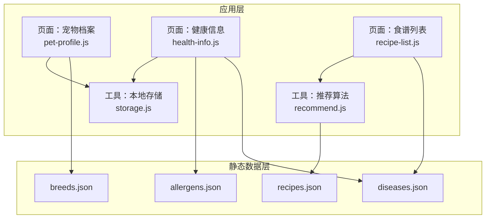
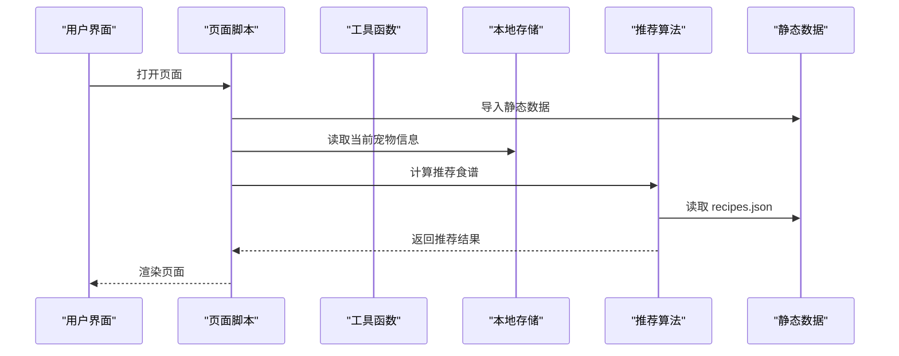
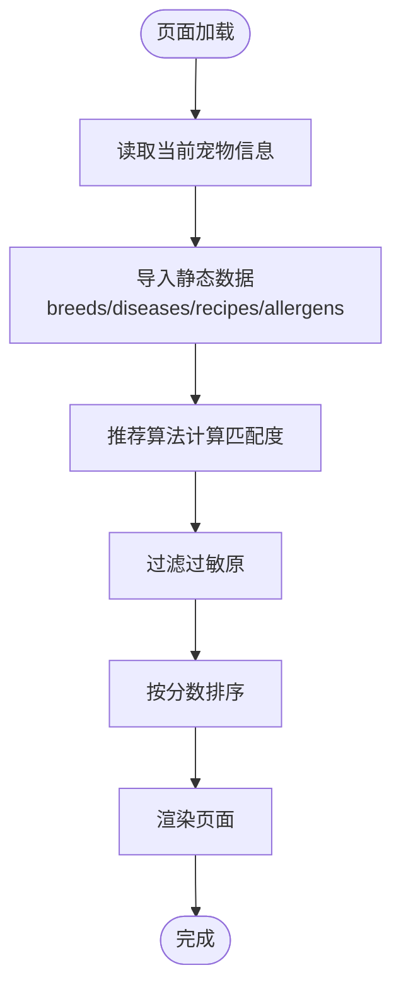
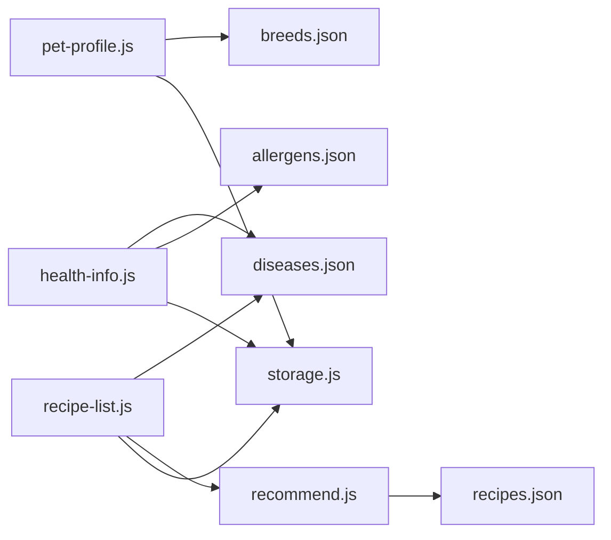

# 静态数据文件

<cite>
**本文引用的文件**
- [breeds.json](file://data/breeds.json)
- [diseases.json](file://data/diseases.json)
- [recipes.json](file://data/recipes.json)
- [allergens.json](file://data/allergens.json)
- [recommend.js](file://utils/recommend.js)
- [storage.js](file://utils/storage.js)
- [util.js](file://utils/util.js)
- [pet-profile.js](file://pages/pet-profile/pet-profile.js)
- [health-info.js](file://pages/health-info/health-info.js)
- [recipe-list.js](file://pages/recipe-list/recipe-list.js)
- [app.js](file://app.js)
</cite>

## 目录
1. [简介](#简介)
2. [项目结构](#项目结构)
3. [核心组件](#核心组件)
4. [架构总览](#架构总览)
5. [详细组件分析](#详细组件分析)
6. [依赖关系分析](#依赖关系分析)
7. [性能考虑](#性能考虑)
8. [故障排查指南](#故障排查指南)
9. [结论](#结论)
10. [附录](#附录)

## 简介
本文件系统性梳理 Old-baby 项目中 data 目录下的静态数据文件，包括 breeds.json（宠物品种数据库）、diseases.json（疾病数据库）、recipes.json（食谱数据库）、allergens.json（过敏原数据库）。内容涵盖：
- 数据结构与字段定义
- 业务含义与使用场景
- 应用中的加载与使用机制
- 数据维护与更新的最佳实践
- 设计原则与优化策略

## 项目结构
data 目录存放四类静态 JSON 文件，作为应用的核心静态知识库：
- breeds.json：宠物品种清单，包含 id、name、size 字段
- diseases.json：疾病清单，包含 id、name、category、description、dietTips
- recipes.json：食谱清单，包含 id、name、description、suitableFor、avoidFor、difficulty、prepTime、servings、calories、image、ingredients、steps、nutrition、tips、warnings
- allergens.json：过敏原清单，包含 id、name、category

图表来源
- [pet-profile.js](file://pages/pet-profile/pet-profile.js#L1-L216)
- [health-info.js](file://pages/health-info/health-info.js#L1-L44)
- [recipe-list.js](file://pages/recipe-list/recipe-list.js#L1-L62)
- [recommend.js](file://utils/recommend.js#L1-L109)
- [storage.js](file://utils/storage.js#L1-L98)
- [breeds.json](file://data/breeds.json#L1-L35)
- [diseases.json](file://data/diseases.json#L1-L108)
- [recipes.json](file://data/recipes.json#L1-L515)
- [allergens.json](file://data/allergens.json#L1-L15)

章节来源
- [breeds.json](file://data/breeds.json#L1-L35)
- [diseases.json](file://data/diseases.json#L1-L108)
- [recipes.json](file://data/recipes.json#L1-L515)
- [allergens.json](file://data/allergens.json#L1-L15)

## 核心组件
- breeds.json：提供宠物品种基础数据，支持页面选择与展示，字段包括 id（英文标识）、name（中文名称）、size（体型等级）。
- diseases.json：提供疾病基础数据，字段包括 id、name、category、description、dietTips，用于健康信息录入与食谱推荐。
- recipes.json：提供食谱数据，字段包括 id、name、description、suitableFor（适用疾病）、avoidFor（避免过敏原）、difficulty、prepTime、servings、calories、image、ingredients（食材列表）、steps（步骤）、nutrition（营养要点）、tips（小贴士）、warnings（注意事项）。
- allergens.json：提供过敏原基础数据，字段包括 id、name、category，用于健康信息录入与食谱过滤。

章节来源
- [breeds.json](file://data/breeds.json#L1-L35)
- [diseases.json](file://data/diseases.json#L1-L108)
- [recipes.json](file://data/recipes.json#L1-L515)
- [allergens.json](file://data/allergens.json#L1-L15)

## 架构总览
静态数据通过模块化导入的方式在各页面与工具函数中使用，形成“静态数据 + 业务逻辑”的解耦架构。推荐算法基于 recipes.json 的数据进行评分与过滤；健康信息页面基于 diseases.json 和 allergens.json 提供选择与提示；宠物档案页面基于 breeds.json 提供品种选择。

图表来源
- [recipe-list.js](file://pages/recipe-list/recipe-list.js#L1-L62)
- [recommend.js](file://utils/recommend.js#L1-L109)
- [recipes.json](file://data/recipes.json#L1-L515)

## 详细组件分析

### breeds.json（宠物品种数据库）
- 结构与字段
  - id：字符串，英文标识符，用于关联与存储
  - name：字符串，中文名称，用于展示
  - size：字符串，体型等级，枚举值包括 small、medium、large、giant
- 业务含义
  - 支持宠物档案页面的品种选择与展示
  - 与宠物档案中的 breed、breedName 字段对应
- 使用方式
  - 页面直接导入并在视图中渲染
  - 支持按名称搜索过滤
- 维护与扩展
  - 新增品种时，需保证 id 唯一且语义清晰
  - size 字段应与实际体型匹配，便于后续筛选与推荐

章节来源
- [breeds.json](file://data/breeds.json#L1-L35)
- [pet-profile.js](file://pages/pet-profile/pet-profile.js#L1-L216)

### diseases.json（疾病数据库）
- 结构与字段
  - id：字符串，疾病标识符
  - name：字符串，中文名称
  - category：字符串，分类（如骨骼、心血管、消化、内分泌、神经、皮肤、眼科、肿瘤）
  - description：字符串，简要描述
  - dietTips：字符串，饮食建议
- 业务含义
  - 用于健康信息页面的疾病选择与分类展示
  - 与食谱推荐算法中的 suitableFor 字段配合，实现基于疾病的食谱匹配
- 使用方式
  - 页面导入后用于渲染疾病列表与分类
  - 与 allergens.json 协同，共同参与推荐与过滤
- 维护与扩展
  - 新增疾病时，需同步更新 recipes.json 中的 suitableFor 字段
  - 分类字段应保持一致性，便于前端筛选与展示

章节来源
- [diseases.json](file://data/diseases.json#L1-L108)
- [health-info.js](file://pages/health-info/health-info.js#L1-L44)
- [recipe-list.js](file://pages/recipe-list/recipe-list.js#L1-L62)

### recipes.json（食谱数据库）
- 结构与字段
  - 基础字段：id、name、description、image、difficulty、prepTime、servings、calories
  - 适用性：suitableFor（适用疾病列表）、avoidFor（避免过敏原列表）
  - 食材与步骤：ingredients（名称、用量、备注）、steps（制作步骤）
  - 营养说明：nutrition（蛋白质、脂肪、纤维、特殊说明）
  - 辅助信息：tips（小贴士）、warnings（注意事项）
- 业务含义
  - 食谱推荐算法的核心数据源
  - 与宠物健康信息（疾病、过敏原）结合，生成个性化推荐
- 使用方式
  - 推荐算法读取并评分，返回匹配度高的食谱
  - 页面根据当前宠物信息动态筛选与排序
- 维护与扩展
  - 新增食谱时，需完善 suitableFor、avoidFor、ingredients、steps、nutrition 等字段
  - difficulty、prepTime、servings、calories 等字段应保持一致性与可读性

章节来源
- [recipes.json](file://data/recipes.json#L1-L515)
- [recommend.js](file://utils/recommend.js#L1-L109)
- [recipe-list.js](file://pages/recipe-list/recipe-list.js#L1-L62)

### allergens.json（过敏原数据库）
- 结构与字段
  - id：字符串，过敏原标识符
  - name：字符串，中文名称
  - category：字符串，分类（肉类、蛋类、奶类、谷物、豆类）
- 业务含义
  - 用于健康信息页面的过敏原选择
  - 与食谱推荐算法中的 avoidFor 字段配合，过滤不合适的食谱
- 使用方式
  - 页面导入后用于渲染过敏原列表与分类
  - 与 diseases.json 协同参与推荐
- 维护与扩展
  - 新增过敏原时，需同步更新 recipes.json 中的 avoidFor 字段
  - 分类字段应保持一致性，便于前端筛选与展示

章节来源
- [allergens.json](file://data/allergens.json#L1-L15)
- [health-info.js](file://pages/health-info/health-info.js#L1-L44)

### 加载机制与数据流
- 模块化导入
  - 各页面与工具函数通过 require 方式导入静态数据，形成“数据即代码”的直连访问
- 推荐流程
  - 页面读取当前宠物信息
  - 推荐算法基于 recipes.json 计算匹配度，过滤过敏原，按分数排序
  - 返回结果渲染到页面
- 存储与联动
  - 宠物信息（含疾病、过敏原、活动水平等）由本地存储管理
  - 页面与推荐算法通过统一的数据接口交互

图表来源
- [recipe-list.js](file://pages/recipe-list/recipe-list.js#L1-L62)
- [recommend.js](file://utils/recommend.js#L1-L109)
- [storage.js](file://utils/storage.js#L1-L98)

## 依赖关系分析
- 页面依赖
  - pet-profile.js 依赖 breeds.json
  - health-info.js 依赖 diseases.json、allergens.json
  - recipe-list.js 依赖 diseases.json，并通过 recommend.js 间接依赖 recipes.json
- 工具函数依赖
  - recommend.js 直接依赖 recipes.json
  - storage.js 管理宠物数据，与页面协作
- 数据一致性
  - diseases.json 与 recipes.json 的 suitableFor 字段需保持一致
  - allergens.json 与 recipes.json 的 avoidFor 字段需保持一致

图表来源
- [pet-profile.js](file://pages/pet-profile/pet-profile.js#L1-L216)
- [health-info.js](file://pages/health-info/health-info.js#L1-L44)
- [recipe-list.js](file://pages/recipe-list/recipe-list.js#L1-L62)
- [recommend.js](file://utils/recommend.js#L1-L109)
- [storage.js](file://utils/storage.js#L1-L98)
- [breeds.json](file://data/breeds.json#L1-L35)
- [diseases.json](file://data/diseases.json#L1-L108)
- [recipes.json](file://data/recipes.json#L1-L515)
- [allergens.json](file://data/allergens.json#L1-L15)

章节来源
- [pet-profile.js](file://pages/pet-profile/pet-profile.js#L1-L216)
- [health-info.js](file://pages/health-info/health-info.js#L1-L44)
- [recipe-list.js](file://pages/recipe-list/recipe-list.js#L1-L62)
- [recommend.js](file://utils/recommend.js#L1-L109)
- [storage.js](file://utils/storage.js#L1-L98)

## 性能考虑
- 静态数据体积
  - 四个 JSON 文件体量较小，模块化导入在小程序端开销可忽略
- 推荐算法复杂度
  - 推荐算法对 recipes.json 进行一次遍历并计算分数，时间复杂度 O(N)，N 为食谱数量
  - 过滤与排序为线性处理，性能良好
- 建议
  - 控制食谱数量规模，避免无限增长导致内存压力
  - 对频繁使用的字段（如 id、name）保持简洁，减少序列化与传输成本

## 故障排查指南
- 症状：页面无法显示静态数据
  - 可能原因：导入路径错误或文件名大小写不一致
  - 处理：检查 require 路径与文件名，确保与 data 目录结构一致
- 症状：推荐结果为空或不正确
  - 可能原因：recipes.json 中 suitableFor 或 avoidFor 与 diseases.json/allergens.json 不一致
  - 处理：核对 id 匹配关系，确保字段值与静态数据一致
- 症状：过敏原或疾病筛选无效
  - 可能原因：页面未正确导入静态数据或未触发重新计算
  - 处理：确认页面生命周期中已执行数据导入与筛选逻辑
- 症状：本地存储异常
  - 可能原因：小程序存储权限或异常
  - 处理：检查 storage.js 的读写逻辑与错误日志

章节来源
- [recommend.js](file://utils/recommend.js#L1-L109)
- [storage.js](file://utils/storage.js#L1-L98)

## 结论
data 目录的四个 JSON 文件构成了 Old-baby 的静态知识库，通过模块化导入与推荐算法协同工作，实现了基于宠物健康状况的个性化食谱推荐。设计上强调了数据与业务逻辑的解耦，具备良好的可维护性与扩展性。建议在维护过程中严格遵循字段规范与一致性校验，确保推荐效果与用户体验。

## 附录

### 数据模型设计原则
- 唯一标识：id 字段确保跨模块引用的稳定性
- 语义化命名：字段名直观表达业务含义，降低理解成本
- 分类与枚举：category、size 等字段采用有限集合，便于筛选与展示
- 一致性：疾病与过敏原的 id 必须与食谱的适用性字段保持一致

### 数据维护与更新最佳实践
- 版本管理
  - 为静态数据文件建立版本号或注释，记录变更历史
  - 在新增字段时，提供默认值或兼容逻辑，避免破坏现有功能
- 数据验证
  - 前端导入后进行基本校验（如 id 唯一性、字段完整性）
  - 推荐算法中增加异常分支，避免因数据缺失导致崩溃
- 扩展方法
  - 新增食谱：完善 recipes.json 的全部字段，同步更新 diseases.json/allergens.json 的映射
  - 新增疾病/过敏原：更新对应 JSON 并在 recipes.json 中补充映射关系
- 性能优化
  - 控制静态数据体积，避免不必要的冗余字段
  - 对高频访问的字段（如 id、name）保持简洁与稳定