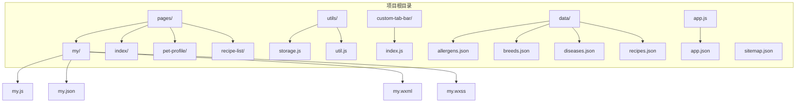
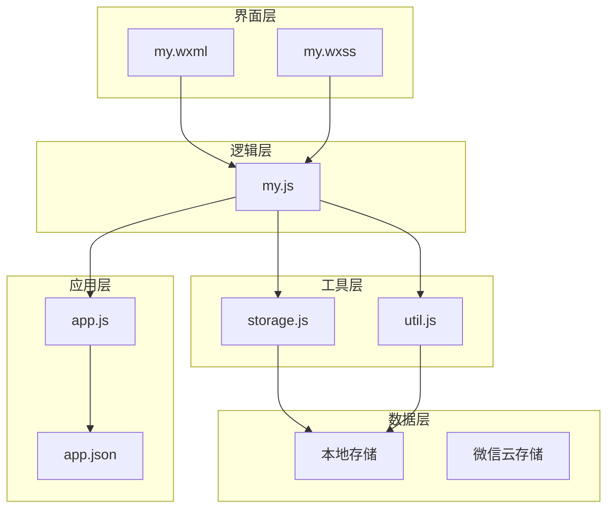
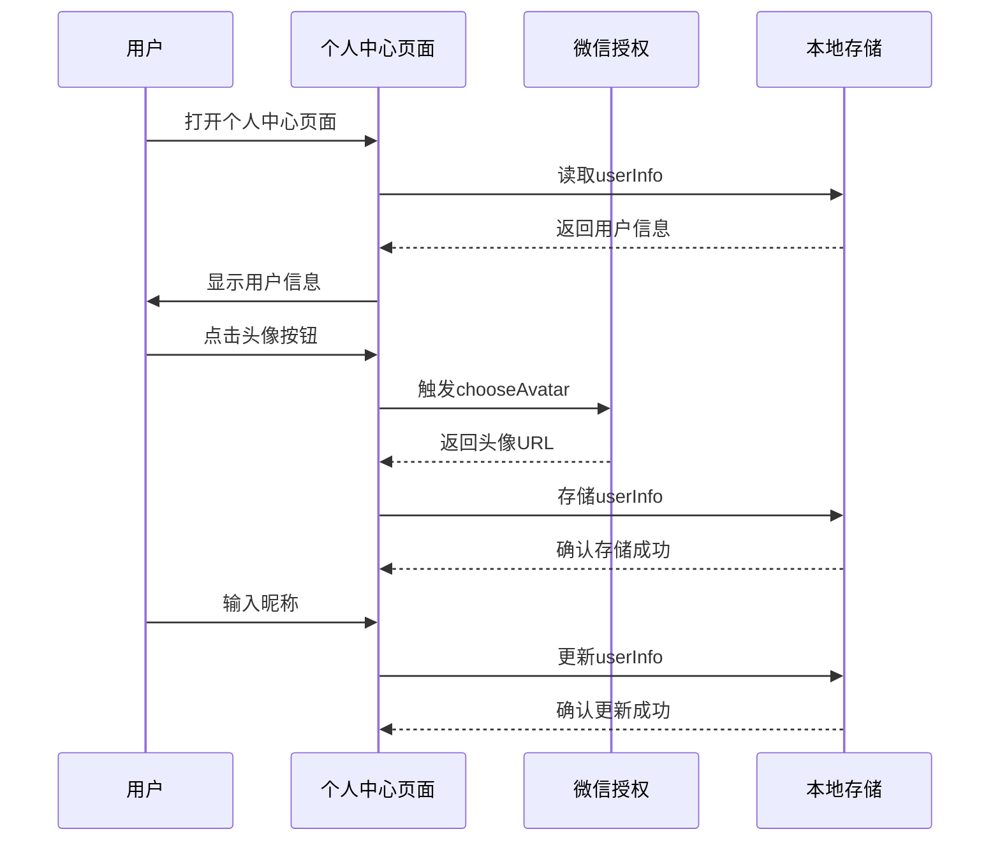
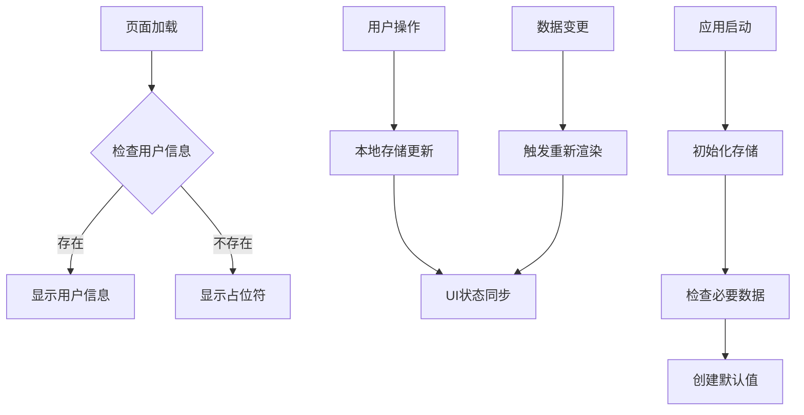
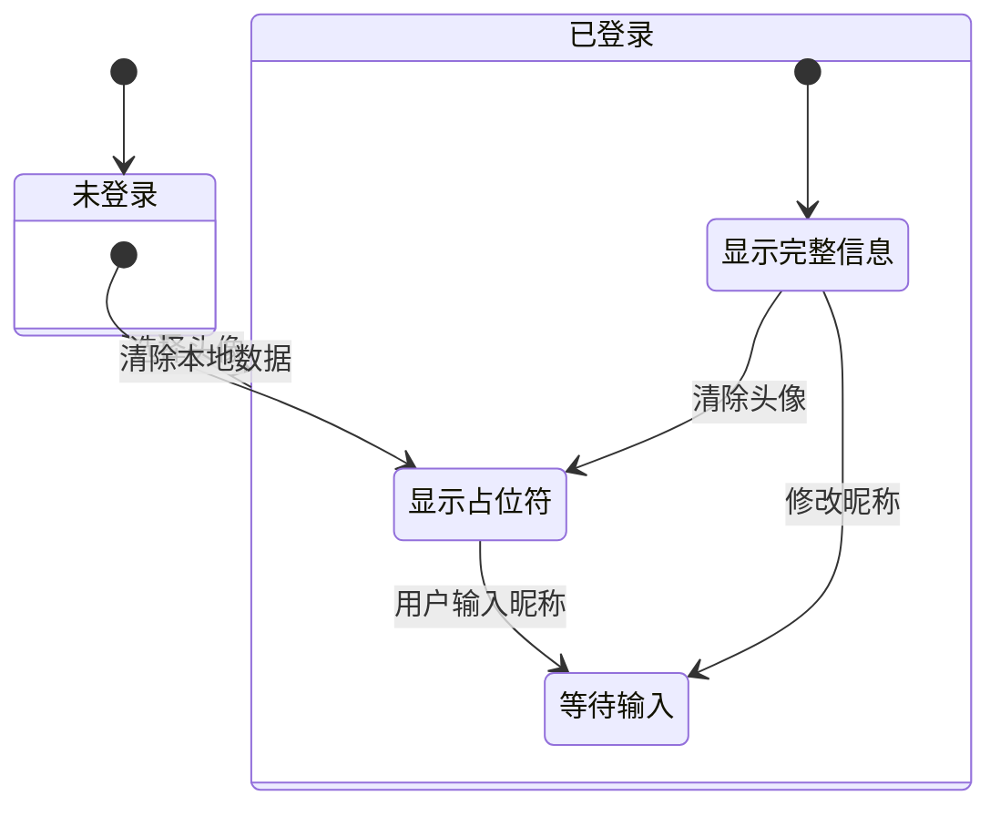
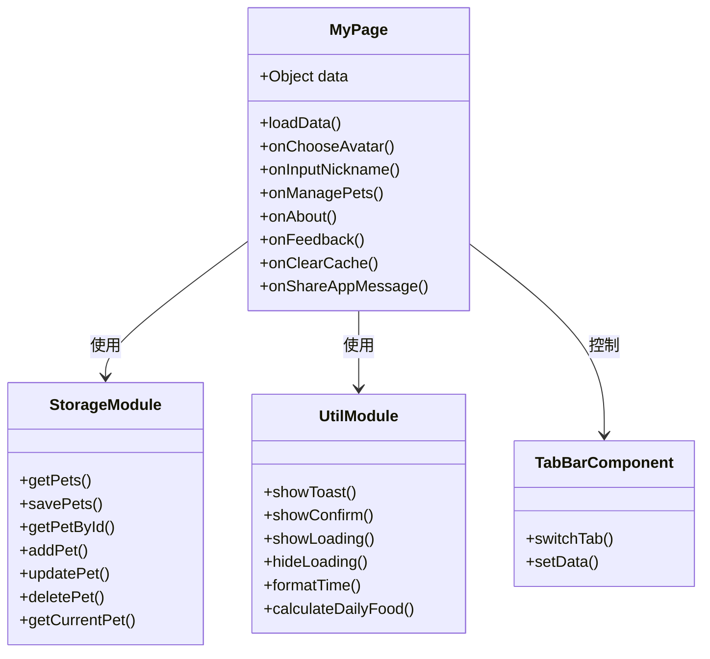
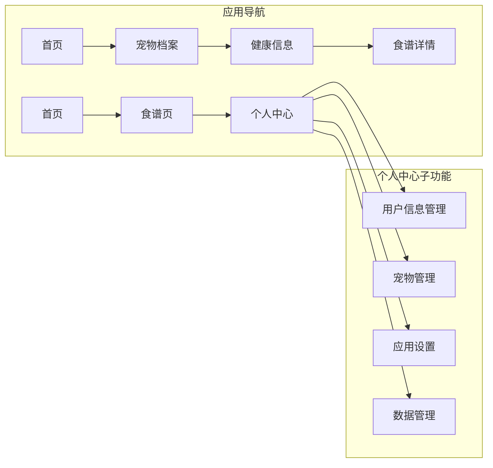
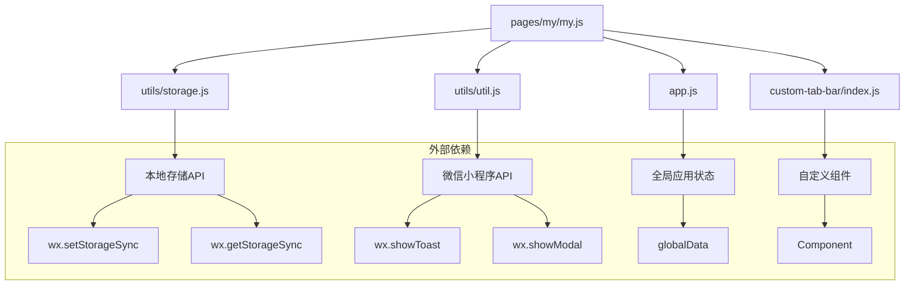

# 个人中心页面

<cite>
**本文档引用的文件**
- [pages/my/my.js](file://pages/my/my.js)
- [pages/my/my.json](file://pages/my/my.json)
- [pages/my/my.wxml](file://pages/my/my.wxml)
- [pages/my/my.wxss](file://pages/my/my.wxss)
- [app.js](file://app.js)
- [app.json](file://app.json)
- [utils/storage.js](file://utils/storage.js)
- [utils/util.js](file://utils/util.js)
- [custom-tab-bar/index.js](file://custom-tab-bar/index.js)
- [pages/index/index.js](file://pages/index/index.js)
- [pages/pet-profile/pet-profile.js](file://pages/pet-profile/pet-profile.js)
- [data/allergens.json](file://data/allergens.json)
</cite>

## 目录
1. [简介](#简介)
2. [项目结构](#项目结构)
3. [核心组件](#核心组件)
4. [架构概览](#架构概览)
5. [详细组件分析](#详细组件分析)
6. [依赖关系分析](#依赖关系分析)
7. [性能考虑](#性能考虑)
8. [故障排除指南](#故障排除指南)
9. [结论](#结论)

## 简介

个人中心页面是Old-baby项目的核心功能模块，为老年犬主人提供统一的个人信息管理和应用设置入口。该页面实现了用户身份识别、宠物信息管理、应用设置、数据备份恢复等核心功能，采用模块化设计和响应式布局，提供了良好的用户体验。

## 项目结构

Old-baby项目采用微信小程序的标准目录结构，个人中心页面位于`pages/my/`目录下，与主页面、食谱页面、宠物档案页面等并列组织。

**图表来源**
- [app.json](file://app.json#L1-L41)
- [pages/my/my.js](file://pages/my/my.js#L1-L113)

**章节来源**
- [app.json](file://app.json#L1-L41)
- [pages/my/my.js](file://pages/my/my.js#L1-L113)

## 核心组件

个人中心页面由四个主要组件构成：用户信息展示区、功能菜单区、数据管理区和底部信息区。

### 用户信息展示区

用户信息展示区包含头像选择、昵称编辑和宠物统计功能：
- 头像选择：支持微信授权头像和自定义图片上传
- 昵称编辑：实时输入和本地存储
- 宠物统计：显示已添加宠物数量

### 功能菜单区

功能菜单区提供核心应用功能入口：
- 管理我的宠物：跳转到宠物管理页面
- 关于我们：应用信息展示
- 意见反馈：用户反馈渠道
- 分享给朋友：小程序分享功能

### 数据管理区

数据管理区提供数据维护功能：
- 清除本地数据：一键清理所有本地存储数据

**章节来源**
- [pages/my/my.wxml](file://pages/my/my.wxml#L1-L70)
- [pages/my/my.wxss](file://pages/my/my.wxss#L1-L133)

## 架构概览

个人中心页面采用分层架构设计，通过工具函数和存储模块实现数据持久化。

**图表来源**
- [pages/my/my.js](file://pages/my/my.js#L1-L113)
- [utils/storage.js](file://utils/storage.js#L1-L155)
- [utils/util.js](file://utils/util.js#L1-L123)
- [app.js](file://app.js#L1-L21)

## 详细组件分析

### 用户认证机制

个人中心页面采用微信授权登录机制，通过微信提供的open-type="chooseAvatar"组件实现用户头像和昵称的获取。

**图表来源**
- [pages/my/my.js](file://pages/my/my.js#L42-L60)
- [pages/my/my.wxml](file://pages/my/my.wxml#L5-L21)

### 数据同步策略

系统采用本地存储为主的数据同步策略，确保用户数据在离线状态下也能正常访问。

**图表来源**
- [pages/my/my.js](file://pages/my/my.js#L25-L39)
- [app.js](file://app.js#L8-L14)

### 权限控制逻辑

个人中心页面采用基于用户状态的权限控制机制：

**图表来源**
- [pages/my/my.js](file://pages/my/my.js#L32-L38)
- [pages/my/my.js](file://pages/my/my.js#L42-L60)

### 模块化设计

个人中心页面采用模块化设计，将不同功能划分为独立的模块：

**图表来源**
- [pages/my/my.js](file://pages/my/my.js#L1-L113)
- [utils/storage.js](file://utils/storage.js#L1-L155)
- [utils/util.js](file://utils/util.js#L1-L123)
- [custom-tab-bar/index.js](file://custom-tab-bar/index.js#L1-L32)

**章节来源**
- [pages/my/my.js](file://pages/my/my.js#L1-L113)
- [utils/storage.js](file://utils/storage.js#L1-L155)
- [utils/util.js](file://utils/util.js#L1-L123)
- [custom-tab-bar/index.js](file://custom-tab-bar/index.js#L1-L32)

### 导航结构

个人中心页面集成到应用的整体导航结构中，通过自定义tabbar实现统一的导航体验。

**图表来源**
- [app.json](file://app.json#L17-L37)
- [custom-tab-bar/index.js](file://custom-tab-bar/index.js#L6-L22)

### 用户体验优化

个人中心页面在多个方面进行了用户体验优化：

- **响应式布局**：使用rpx单位确保在不同设备上的适配
- **即时反馈**：所有用户操作都有相应的视觉反馈
- **错误处理**：完善的错误捕获和用户提示机制
- **性能优化**：懒加载和防抖处理提升页面响应速度

**章节来源**
- [pages/my/my.wxss](file://pages/my/my.wxss#L1-L133)
- [pages/my/my.js](file://pages/my/my.js#L88-L103)

## 依赖关系分析

个人中心页面的依赖关系体现了清晰的分层架构：

**图表来源**
- [pages/my/my.js](file://pages/my/my.js#L1-L5)
- [utils/storage.js](file://utils/storage.js#L1-L155)
- [utils/util.js](file://utils/util.js#L1-L123)
- [app.js](file://app.js#L16-L19)

**章节来源**
- [pages/my/my.js](file://pages/my/my.js#L1-L5)
- [utils/storage.js](file://utils/storage.js#L1-L155)
- [utils/util.js](file://utils/util.js#L1-L123)

## 性能考虑

个人中心页面在性能方面采用了多项优化措施：

### 内存管理
- 使用setData进行局部状态更新，避免全量重渲染
- 及时清理定时器和事件监听器
- 合理使用数据缓存，避免重复计算

### 网络优化
- 本地数据优先策略，减少网络请求
- 批量数据操作，避免频繁的存储写入
- 异步处理耗时操作

### 用户体验优化
- 防抖处理高频操作
- 加载状态指示
- 错误恢复机制

## 故障排除指南

### 常见问题及解决方案

**问题1：用户头像无法显示**
- 检查本地存储中userInfo的avatarUrl字段
- 验证图片URL的有效性
- 确认网络连接状态

**问题2：昵称修改后不生效**
- 检查数据绑定是否正确
- 验证存储操作是否成功
- 确认页面刷新机制

**问题3：宠物统计数量不准确**
- 检查本地存储中的pets数组
- 验证数据完整性
- 确认页面加载时机

**问题4：清除数据功能异常**
- 检查权限设置
- 验证存储清理逻辑
- 确认用户确认流程

**章节来源**
- [pages/my/my.js](file://pages/my/my.js#L88-L103)
- [utils/util.js](file://utils/util.js#L98-L110)

## 结论

个人中心页面作为Old-baby项目的核心模块，展现了优秀的模块化设计和用户体验理念。通过清晰的分层架构、完善的权限控制和优化的性能策略，为老年犬主人提供了便捷的个人信息管理和应用设置功能。

该页面的成功实现为类似的小程序项目提供了良好的参考模板，特别是在用户认证、数据同步和权限控制方面的最佳实践值得借鉴。未来可以进一步扩展的功能包括云端数据同步、多设备数据备份、以及更丰富的个性化设置选项。