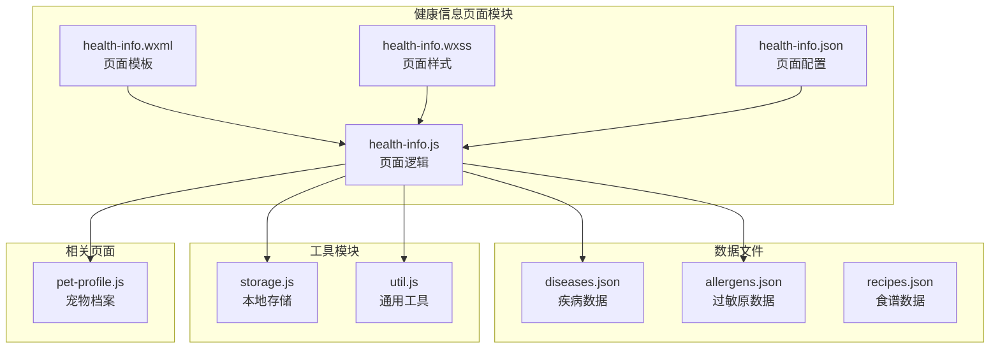
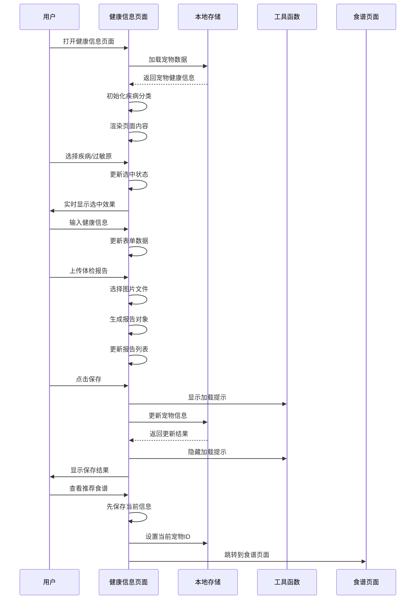
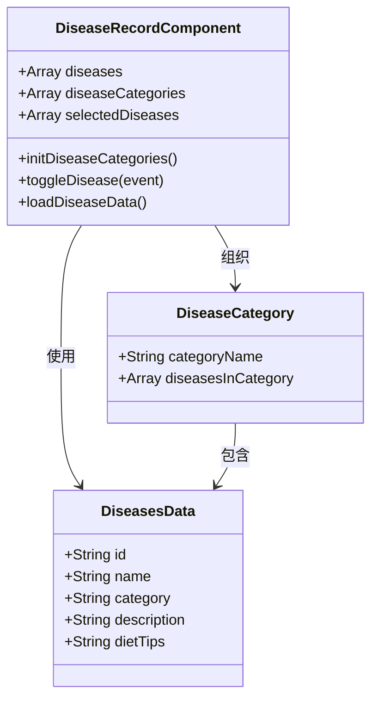
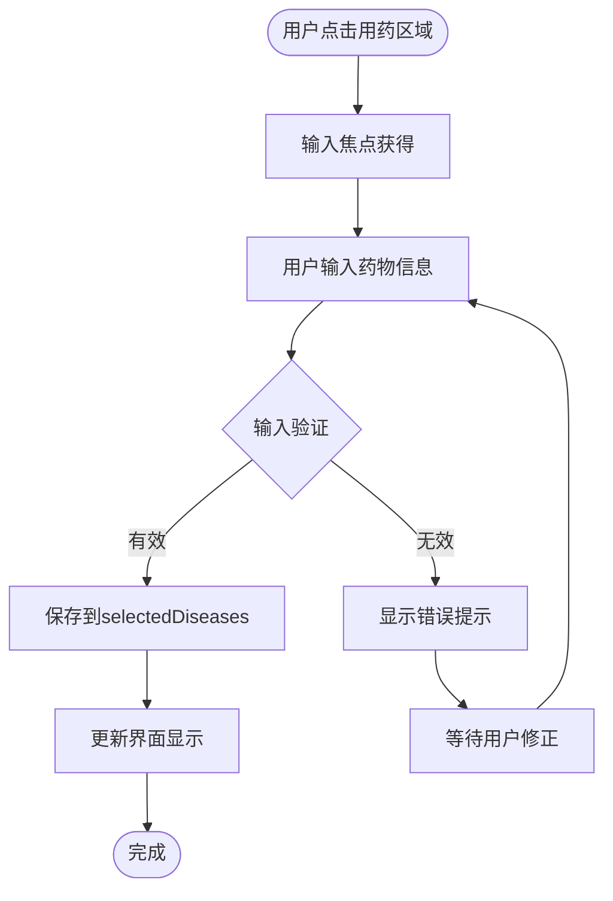
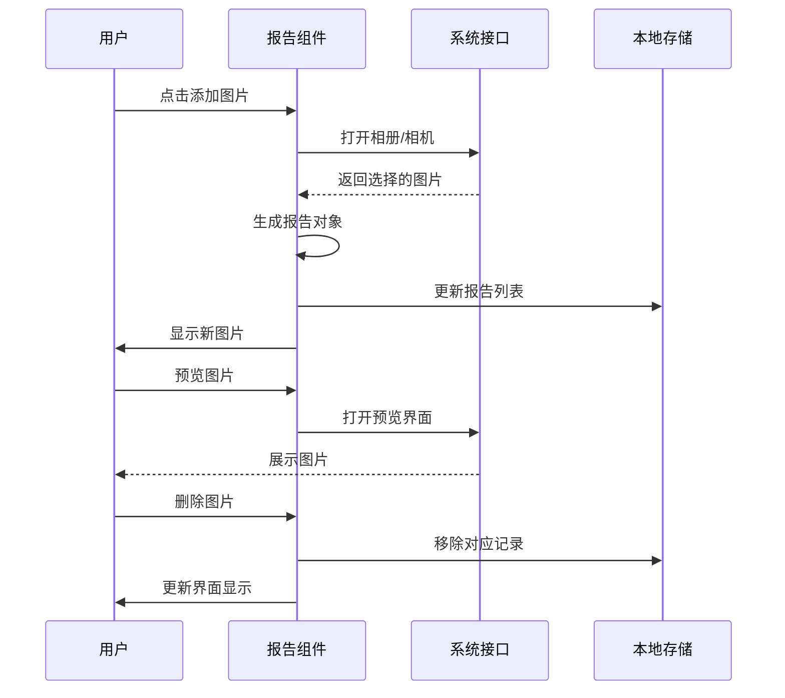
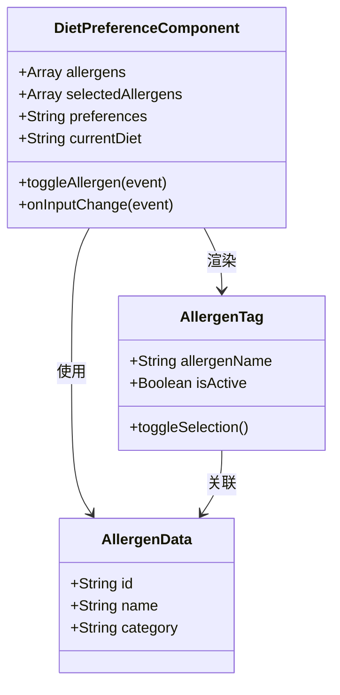
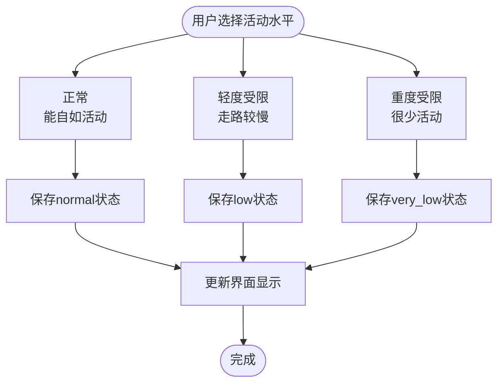
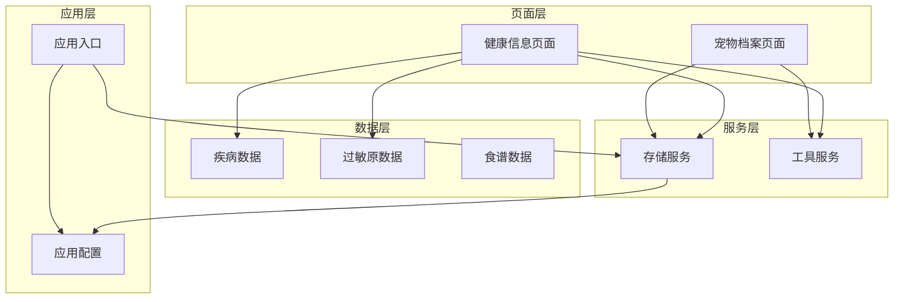

# 健康信息页面

<cite>
**本文档引用的文件**
- [pages/health-info/health-info.js](file://pages/health-info/health-info.js)
- [pages/health-info/health-info.json](file://pages/health-info/health-info.json)
- [pages/health-info/health-info.wxml](file://pages/health-info/health-info.wxml)
- [pages/health-info/health-info.wxss](file://pages/health-info/health-info.wxss)
- [data/diseases.json](file://data/diseases.json)
- [data/allergens.json](file://data/allergens.json)
- [data/recipes.json](file://data/recipes.json)
- [utils/storage.js](file://utils/storage.js)
- [utils/util.js](file://utils/util.js)
- [pages/pet-profile/pet-profile.js](file://pages/pet-profile/pet-profile.js)
- [app.js](file://app.js)
- [app.json](file://app.json)
</cite>

## 目录
1. [简介](#简介)
2. [项目结构](#项目结构)
3. [核心组件](#核心组件)
4. [架构概览](#架构概览)
5. [详细组件分析](#详细组件分析)
6. [依赖关系分析](#依赖关系分析)
7. [性能考虑](#性能考虑)
8. [故障排除指南](#故障排除指南)
9. [结论](#结论)
10. [附录](#附录)

## 简介
健康信息页面是Old-baby项目中宠物健康管理的核心功能模块，负责维护宠物的健康档案信息。该页面支持疾病记录管理、用药情况跟踪、活动能力评估、饮食偏好设置以及体检报告上传等功能。通过直观的界面设计和完善的业务逻辑，帮助用户全面记录和管理宠物的健康状况。

## 项目结构
健康信息页面采用微信小程序的标准目录结构，主要包含以下文件：
- 页面逻辑文件：health-info.js
- 页面配置文件：health-info.json
- 页面模板文件：health-info.wxml
- 页面样式文件：health-info.wxss
- 数据文件：diseases.json、allergens.json、recipes.json
- 工具函数：storage.js、util.js
- 相关页面：pet-profile.js

**图表来源**
- [pages/health-info/health-info.js](file://pages/health-info/health-info.js#L1-L190)
- [pages/health-info/health-info.json](file://pages/health-info/health-info.json#L1-L5)
- [pages/health-info/health-info.wxml](file://pages/health-info/health-info.wxml#L1-L135)
- [pages/health-info/health-info.wxss](file://pages/health-info/health-info.wxss#L1-L203)

**章节来源**
- [pages/health-info/health-info.js](file://pages/health-info/health-info.js#L1-L190)
- [pages/health-info/health-info.json](file://pages/health-info/health-info.json#L1-L5)
- [pages/health-info/health-info.wxml](file://pages/health-info/health-info.wxml#L1-L135)
- [pages/health-info/health-info.wxss](file://pages/health-info/health-info.wxss#L1-L203)

## 核心组件
健康信息页面由多个功能组件构成，每个组件都有明确的职责分工：

### 主要数据结构
页面维护以下核心数据状态：
- **宠物基本信息**：petId、petName
- **疾病管理**：diseases、diseaseCategories、selectedDiseases
- **过敏原管理**：allergens、selectedAllergens
- **健康表单**：medications、activityLevel、preferences、currentDiet
- **体检报告**：reports
- **活动选项**：activityOptions

### 功能模块
1. **疾病记录管理**：支持多选疾病分类，按类别组织展示
2. **用药情况跟踪**：文本输入框记录当前用药信息
3. **活动能力评估**：三种活动水平等级选择
4. **饮食偏好设置**：过敏原选择、口味偏好、当前饮食方式
5. **体检报告管理**：图片上传、预览、删除功能
6. **食谱推荐集成**：保存后跳转到食谱推荐页面

**章节来源**
- [pages/health-info/health-info.js](file://pages/health-info/health-info.js#L8-L31)
- [pages/health-info/health-info.wxml](file://pages/health-info/health-info.wxml#L7-L125)

## 架构概览
健康信息页面采用MVVM架构模式，通过数据绑定实现视图与逻辑的解耦。

**图表来源**
- [pages/health-info/health-info.js](file://pages/health-info/health-info.js#L33-L188)
- [utils/storage.js](file://utils/storage.js#L86-L98)
- [utils/util.js](file://utils/util.js#L72-L95)

## 详细组件分析

### 疾病记录管理组件
疾病记录组件实现了基于分类的疾病选择功能，支持多选操作。

**图表来源**
- [pages/health-info/health-info.js](file://pages/health-info/health-info.js#L12-L14)
- [pages/health-info/health-info.js](file://pages/health-info/health-info.js#L41-L44)
- [pages/health-info/health-info.js](file://pages/health-info/health-info.js#L63-L75)
- [data/diseases.json](file://data/diseases.json#L1-L108)

#### 疾病数据模型
疾病数据采用标准化的数据结构，包含以下字段：
- **id**：疾病唯一标识符
- **name**：疾病名称
- **category**：疾病分类（如骨骼、心血管、消化等）
- **description**：疾病描述
- **dietTips**：饮食建议

#### 分类管理机制
系统通过遍历所有疾病数据，提取唯一的分类名称，形成疾病分类列表。每个分类下的疾病通过条件渲染进行筛选展示。

**章节来源**
- [pages/health-info/health-info.js](file://pages/health-info/health-info.js#L41-L44)
- [pages/health-info/health-info.js](file://pages/health-info/health-info.js#L12-L14)
- [data/diseases.json](file://data/diseases.json#L1-L108)

### 用药管理组件
用药管理组件提供了灵活的文本输入功能，支持记录宠物的当前用药情况。

**图表来源**
- [pages/health-info/health-info.js](file://pages/health-info/health-info.js#L99-L105)
- [pages/health-info/health-info.js](file://pages/health-info/health-info.js#L144-L177)

#### 数据验证规则
- 支持多行文本输入
- 自动同步到medications字段
- 无强制长度限制
- 支持随时修改和删除

**章节来源**
- [pages/health-info/health-info.js](file://pages/health-info/health-info.js#L19-L22)
- [pages/health-info/health-info.js](file://pages/health-info/health-info.js#L99-L105)

### 体检报告管理组件
体检报告组件实现了完整的图片管理功能，包括上传、预览、删除等操作。

**图表来源**
- [pages/health-info/health-info.js](file://pages/health-info/health-info.js#L107-L141)
- [pages/health-info/health-info.wxml](file://pages/health-info/health-info.wxml#L105-L124)

#### 图片管理功能
- **上传限制**：最多9张图片
- **格式支持**：仅支持图片格式
- **来源选择**：相册或相机
- **预览功能**：支持图片浏览
- **删除机制**：一键删除选定图片

**章节来源**
- [pages/health-info/health-info.js](file://pages/health-info/health-info.js#L107-L141)
- [pages/health-info/health-info.wxml](file://pages/health-info/health-info.wxml#L105-L124)

### 饮食偏好管理组件
饮食偏好组件提供了三个维度的信息收集：过敏原、口味偏好、当前饮食方式。

**图表来源**
- [pages/health-info/health-info.js](file://pages/health-info/health-info.js#L16-L17)
- [pages/health-info/health-info.js](file://pages/health-info/health-info.js#L77-L90)
- [pages/health-info/health-info.js](file://pages/health-info/health-info.js#L16-L17)

#### 过敏原管理系统
系统内置了常见的宠物过敏原列表，包括肉类、蛋类、奶类、谷物等分类。用户可以通过点击标签的方式快速选择或取消选择过敏原。

**章节来源**
- [pages/health-info/health-info.js](file://pages/health-info/health-info.js#L16-L17)
- [pages/health-info/health-info.js](file://pages/health-info/health-info.js#L77-L90)
- [data/allergens.json](file://data/allergens.json#L1-L15)

### 活动能力评估组件
活动能力组件提供了三种活动水平的选择，帮助系统更好地理解宠物的运动需求。

**图表来源**
- [pages/health-info/health-info.js](file://pages/health-info/health-info.js#L26-L30)
- [pages/health-info/health-info.js](file://pages/health-info/health-info.js#L93-L97)

#### 活动水平定义
- **正常**：宠物能够正常活动，无明显运动限制
- **轻度受限**：宠物行动相对缓慢，但基本能够正常行走
- **重度受限**：宠物很少活动，需要特别注意休息

**章节来源**
- [pages/health-info/health-info.js](file://pages/health-info/health-info.js#L26-L30)
- [pages/health-info/health-info.js](file://pages/health-info/health-info.js#L93-L97)

## 依赖关系分析

**图表来源**
- [pages/health-info/health-info.js](file://pages/health-info/health-info.js#L2-L5)
- [utils/storage.js](file://utils/storage.js#L1-L155)
- [utils/util.js](file://utils/util.js#L1-L123)
- [app.js](file://app.js#L1-L21)
- [app.json](file://app.json#L1-L41)

### 数据流分析
健康信息页面的数据流遵循单向数据流原则，从数据源流向视图层：

1. **数据加载**：页面加载时从本地存储获取宠物健康信息
2. **状态管理**：通过setData方法更新页面状态
3. **用户交互**：用户操作触发相应的事件处理函数
4. **数据更新**：事件处理完成后更新本地存储
5. **界面刷新**：数据更新后自动触发界面重新渲染

**章节来源**
- [pages/health-info/health-info.js](file://pages/health-info/health-info.js#L33-L60)
- [utils/storage.js](file://utils/storage.js#L44-L98)

## 性能考虑
健康信息页面在设计时充分考虑了性能优化：

### 内存管理
- **数据懒加载**：疾病和过敏原数据在页面初始化时一次性加载
- **状态最小化**：仅维护必要的页面状态，避免冗余数据存储
- **及时清理**：页面卸载时自动清理事件监听器

### 界面渲染优化
- **条件渲染**：使用wx:if根据条件动态渲染组件
- **列表渲染**：使用wx:for高效渲染大量数据项
- **事件委托**：通过bindtap实现事件委托，减少事件绑定数量

### 存储优化
- **批量更新**：保存时一次性更新整个宠物对象
- **增量更新**：仅更新发生变化的数据字段
- **数据压缩**：存储时采用紧凑的数据结构

## 故障排除指南

### 常见问题及解决方案

#### 1. 数据加载失败
**问题现象**：页面无法显示宠物健康信息
**可能原因**：
- 宠物ID不存在
- 本地存储损坏
- 网络异常（如果涉及远程数据）

**解决步骤**：
1. 检查petId参数是否正确传递
2. 验证本地存储中是否存在对应的宠物数据
3. 重新启动应用尝试修复

#### 2. 图片上传失败
**问题现象**：体检报告图片无法上传
**可能原因**：
- 文件大小超过限制
- 格式不支持
- 权限被拒绝

**解决步骤**：
1. 检查图片格式是否为支持的图片类型
2. 确认图片大小符合要求
3. 检查应用权限设置

#### 3. 保存数据异常
**问题现象**：点击保存后无响应或报错
**可能原因**：
- 本地存储空间不足
- 数据格式不正确
- 网络连接异常

**解决步骤**：
1. 检查设备存储空间
2. 验证数据格式的正确性
3. 重启应用后重试

**章节来源**
- [pages/health-info/health-info.js](file://pages/health-info/health-info.js#L163-L177)
- [utils/util.js](file://utils/util.js#L72-L95)

## 结论
健康信息页面作为Old-baby项目的核心功能模块，通过精心设计的数据模型和用户界面，为用户提供了一个完整、便捷的宠物健康管理解决方案。页面采用了现代化的小程序开发技术，具有良好的用户体验和稳定的性能表现。

该页面的主要优势包括：
- **功能完整性**：涵盖了宠物健康管理的所有关键方面
- **用户体验优秀**：直观的界面设计和流畅的操作流程
- **数据安全可靠**：采用本地存储方案，确保用户数据隐私
- **扩展性强**：模块化的架构设计便于后续功能扩展

## 附录

### 实际应用场景
1. **日常健康监控**：记录宠物的日常健康状况变化
2. **疾病预防管理**：通过疾病记录提醒定期体检
3. **个性化食谱推荐**：基于健康信息推荐合适的食谱
4. **医疗记录保存**：完整保存宠物的医疗历史记录

### 操作指南
1. **首次使用**：进入宠物档案页面，完善基础信息后跳转到健康信息页面
2. **疾病记录**：在"健康状况"部分选择宠物患有的疾病
3. **用药管理**：在"用药情况"中详细记录当前用药信息
4. **体检报告**：定期上传体检报告图片以便医生诊断
5. **保存数据**：完成编辑后点击"保存健康信息"按钮

### 安全存储建议
1. **本地加密**：考虑对敏感健康数据进行本地加密存储
2. **访问控制**：限制对健康信息页面的访问权限
3. **数据备份**：定期备份重要的健康数据
4. **隐私保护**：避免在公共场合展示包含健康信息的屏幕