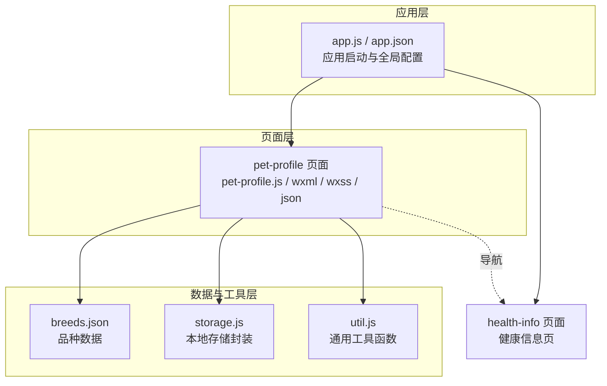
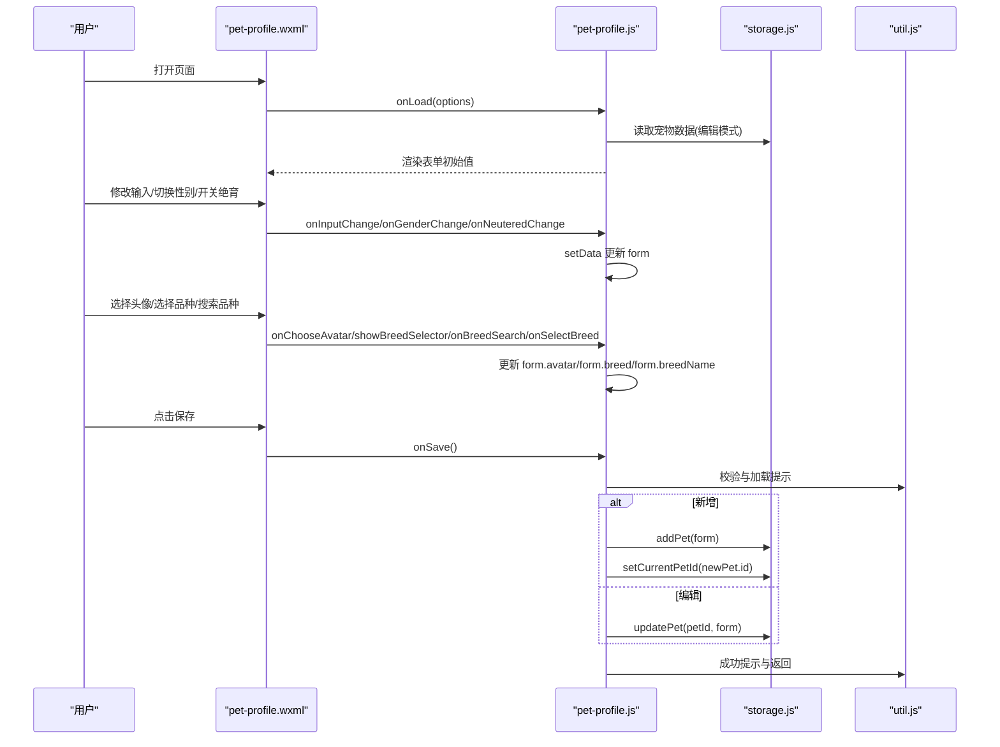
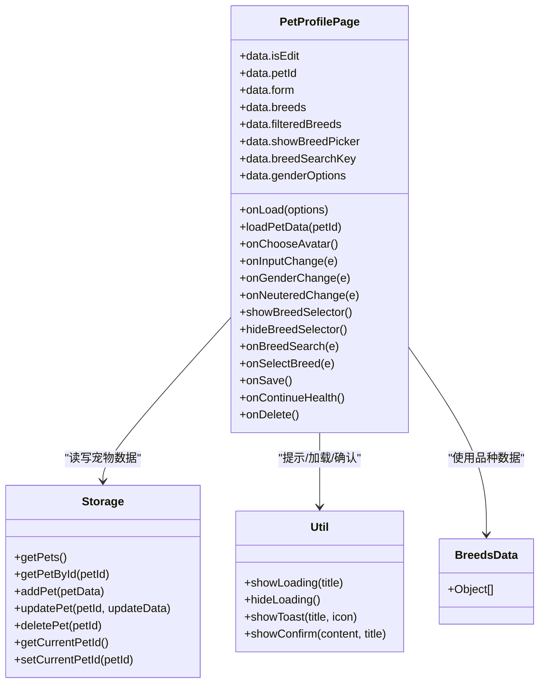

# 宠物档案页面

<cite>
**本文引用的文件**
- [pages/pet-profile/pet-profile.js](file://pages/pet-profile/pet-profile.js)
- [pages/pet-profile/pet-profile.wxml](file://pages/pet-profile/pet-profile.wxml)
- [pages/pet-profile/pet-profile.wxss](file://pages/pet-profile/pet-profile.wxss)
- [pages/pet-profile/pet-profile.json](file://pages/pet-profile/pet-profile.json)
- [data/breeds.json](file://data/breeds.json)
- [utils/storage.js](file://utils/storage.js)
- [utils/util.js](file://utils/util.js)
- [pages/health-info/health-info.js](file://pages/health-info/health-info.js)
- [app.js](file://app.js)
- [app.json](file://app.json)
</cite>

## 目录
1. [简介](#简介)
2. [项目结构](#项目结构)
3. [核心组件](#核心组件)
4. [架构总览](#架构总览)
5. [详细组件分析](#详细组件分析)
6. [依赖关系分析](#依赖关系分析)
7. [性能考虑](#性能考虑)
8. [故障排查指南](#故障排查指南)
9. [结论](#结论)
10. [附录](#附录)

## 简介
本文件面向 Old-baby 项目的“宠物档案页面”，系统性解析宠物信息录入与管理功能，涵盖：
- 宠物基本信息输入：姓名、头像、品种、年龄、体重、性别、是否绝育
- 品种选择器：带搜索与尺寸分类展示
- 头像上传：相册或相机选择
- 表单验证机制、数据提交流程与错误处理策略
- WXML 模板中的表单控件使用、JS 逻辑中的数据处理与 WXSS 样式设计
- 表单优化建议与用户体验提升方案
- 完整的代码示例路径与调试技巧

## 项目结构
宠物档案页面位于 pages/pet-profile 目录，采用经典的 WXML + JS + WXSS + JSON 的小程序页面组织方式，并通过 utils 与 data 提供数据与工具支持。

图表来源
- [pages/pet-profile/pet-profile.js](file://pages/pet-profile/pet-profile.js#L1-L216)
- [pages/pet-profile/pet-profile.wxml](file://pages/pet-profile/pet-profile.wxml#L1-L142)
- [pages/pet-profile/pet-profile.wxss](file://pages/pet-profile/pet-profile.wxss#L1-L259)
- [pages/pet-profile/pet-profile.json](file://pages/pet-profile/pet-profile.json#L1-L5)
- [data/breeds.json](file://data/breeds.json#L1-L35)
- [utils/storage.js](file://utils/storage.js#L1-L155)
- [utils/util.js](file://utils/util.js#L1-L123)
- [pages/health-info/health-info.js](file://pages/health-info/health-info.js#L1-L190)
- [app.js](file://app.js#L1-L21)
- [app.json](file://app.json#L1-L41)

章节来源
- [pages/pet-profile/pet-profile.js](file://pages/pet-profile/pet-profile.js#L1-L216)
- [pages/pet-profile/pet-profile.wxml](file://pages/pet-profile/pet-profile.wxml#L1-L142)
- [pages/pet-profile/pet-profile.wxss](file://pages/pet-profile/pet-profile.wxss#L1-L259)
- [pages/pet-profile/pet-profile.json](file://pages/pet-profile/pet-profile.json#L1-L5)
- [data/breeds.json](file://data/breeds.json#L1-L35)
- [utils/storage.js](file://utils/storage.js#L1-L155)
- [utils/util.js](file://utils/util.js#L1-L123)
- [pages/health-info/health-info.js](file://pages/health-info/health-info.js#L1-L190)
- [app.js](file://app.js#L1-L21)
- [app.json](file://app.json#L1-L41)

## 核心组件
- 页面控制器（JS）：负责表单状态管理、事件处理、数据校验、调用存储与工具函数、页面跳转
- 视图模板（WXML）：定义表单控件、交互行为绑定、条件渲染与弹窗结构
- 样式（WXSS）：统一风格、响应式布局、动画过渡、品牌色系
- 配置（JSON）：页面标题、组件注册
- 数据源（JSON）：品种列表
- 工具与存储（JS）：本地存储封装、通用工具函数

章节来源
- [pages/pet-profile/pet-profile.js](file://pages/pet-profile/pet-profile.js#L6-L32)
- [pages/pet-profile/pet-profile.wxml](file://pages/pet-profile/pet-profile.wxml#L1-L142)
- [pages/pet-profile/pet-profile.wxss](file://pages/pet-profile/pet-profile.wxss#L1-L259)
- [pages/pet-profile/pet-profile.json](file://pages/pet-profile/pet-profile.json#L1-L5)
- [data/breeds.json](file://data/breeds.json#L1-L35)
- [utils/storage.js](file://utils/storage.js#L1-L155)
- [utils/util.js](file://utils/util.js#L1-L123)

## 架构总览
宠物档案页面在小程序框架内遵循 MVVM 模式：WXML 负责视图，JS 负责模型与逻辑，WXSS 负责样式；页面通过 util 与 storage 实现业务逻辑与持久化。

图表来源
- [pages/pet-profile/pet-profile.js](file://pages/pet-profile/pet-profile.js#L34-L190)
- [utils/util.js](file://utils/util.js#L72-L110)
- [utils/storage.js](file://utils/storage.js#L52-L98)

## 详细组件分析

### 表单控件与交互
- 头像区域：点击触发媒体选择，支持相册与相机，更新 form.avatar
- 基本信息组：姓名、年龄、体重、性别、是否绝育
- 品种选择器：点击打开弹窗，支持搜索过滤，选择后写入 breed 与 breedName
- 操作按钮：保存、继续填写健康信息（新增时）、删除（编辑时）

章节来源
- [pages/pet-profile/pet-profile.wxml](file://pages/pet-profile/pet-profile.wxml#L4-L18)
- [pages/pet-profile/pet-profile.wxml](file://pages/pet-profile/pet-profile.wxml#L22-L98)
- [pages/pet-profile/pet-profile.wxml](file://pages/pet-profile/pet-profile.wxml#L111-L141)

### JS 逻辑与数据处理
- 页面状态：isEdit、petId、form、breeds、filteredBreeds、showBreedPicker、breedSearchKey、genderOptions
- 生命周期：onLoad 根据 id 决定编辑或新增模式，设置标题
- 事件处理：
  - 头像：onChooseAvatar 使用 chooseMedia 获取临时路径
  - 输入：onInputChange 动态更新 form 字段
  - 性别：onGenderChange 切换 form.gender
  - 绝育：onNeuteredChange 切换 form.neutered
  - 品种：showBreedSelector/hideBreedSelector/onBreedSearch/onSelectBreed
- 保存：onSave 前端校验（姓名非空、年龄/体重数字），转换数值类型，调用 storage.addPet 或 updatePet，成功后提示并返回；异常捕获统一提示
- 继续健康：onContinueHealth 先保存再跳转健康信息页
- 删除：onDelete 弹窗确认后删除并返回

章节来源
- [pages/pet-profile/pet-profile.js](file://pages/pet-profile/pet-profile.js#L6-L32)
- [pages/pet-profile/pet-profile.js](file://pages/pet-profile/pet-profile.js#L34-L63)
- [pages/pet-profile/pet-profile.js](file://pages/pet-profile/pet-profile.js#L66-L101)
- [pages/pet-profile/pet-profile.js](file://pages/pet-profile/pet-profile.js#L104-L139)
- [pages/pet-profile/pet-profile.js](file://pages/pet-profile/pet-profile.js#L145-L190)
- [pages/pet-profile/pet-profile.js](file://pages/pet-profile/pet-profile.js#L193-L214)

### 表单验证机制
- 必填校验：姓名非空
- 数值校验：年龄与体重必须为有效数字
- 错误提示：通过 util.showToast 展示错误信息
- 加载状态：保存时显示加载提示，避免重复提交

章节来源
- [pages/pet-profile/pet-profile.js](file://pages/pet-profile/pet-profile.js#L148-L162)
- [utils/util.js](file://utils/util.js#L72-L95)

### 数据提交流程与错误处理
- 新增：storage.addPet 返回新宠物对象，设置为当前宠物
- 编辑：storage.updatePet 更新指定 id 的记录
- 成功：util.showToast 成功提示，延时后 navigateBack
- 失败：捕获异常，隐藏加载，提示失败

章节来源
- [pages/pet-profile/pet-profile.js](file://pages/pet-profile/pet-profile.js#L172-L189)
- [utils/storage.js](file://utils/storage.js#L52-L98)
- [utils/util.js](file://utils/util.js#L72-L95)

### 品种选择器实现
- 数据源：data/breeds.json 提供 id、name、size
- 交互：点击选择器打开弹窗，输入框实时过滤，点击条目写入 form.breed 与 form.breedName
- 尺寸标签：根据 size 输出“小型/中型/大型/巨型”

章节来源
- [pages/pet-profile/pet-profile.js](file://pages/pet-profile/pet-profile.js#L22-L25)
- [pages/pet-profile/pet-profile.js](file://pages/pet-profile/pet-profile.js#L120-L139)
- [pages/pet-profile/pet-profile.wxml](file://pages/pet-profile/pet-profile.wxml#L125-L139)
- [data/breeds.json](file://data/breeds.json#L1-L35)

### 性别与单位样式
- 性别选项：公/母/未知，选中态样式高亮
- 单位样式：年龄/体重输入框右侧显示“岁/公斤”单位文本

章节来源
- [pages/pet-profile/pet-profile.js](file://pages/pet-profile/pet-profile.js#L27-L31)
- [pages/pet-profile/pet-profile.wxml](file://pages/pet-profile/pet-profile.wxml#L77-L97)
- [pages/pet-profile/pet-profile.wxss](file://pages/pet-profile/pet-profile.wxss#L119-L142)
- [pages/pet-profile/pet-profile.wxss](file://pages/pet-profile/pet-profile.wxss#L101-L116)

### 样式设计要点
- 品牌色：导航栏与选中态使用统一绿色主题
- 卡片布局：section 使用边框与阴影增强层次感
- 弹窗：底部滑出动画，遮罩透明度过渡
- 响应式：rpx 单位适配不同屏幕密度

章节来源
- [pages/pet-profile/pet-profile.wxss](file://pages/pet-profile/pet-profile.wxss#L3-L6)
- [pages/pet-profile/pet-profile.wxss](file://pages/pet-profile/pet-profile.wxss#L48-L68)
- [pages/pet-profile/pet-profile.wxss](file://pages/pet-profile/pet-profile.wxss#L162-L194)
- [app.json](file://app.json#L10-L16)

### 与健康信息页的衔接
- 新增保存成功后，若点击“继续填写健康信息”，会先执行保存，再跳转到健康信息页
- 健康信息页通过 petId 读取并更新宠物的健康与饮食信息

章节来源
- [pages/pet-profile/pet-profile.js](file://pages/pet-profile/pet-profile.js#L193-L202)
- [pages/health-info/health-info.js](file://pages/health-info/health-info.js#L33-L60)

## 依赖关系分析

图表来源
- [pages/pet-profile/pet-profile.js](file://pages/pet-profile/pet-profile.js#L6-L216)
- [utils/storage.js](file://utils/storage.js#L1-L155)
- [utils/util.js](file://utils/util.js#L1-L123)
- [data/breeds.json](file://data/breeds.json#L1-L35)

章节来源
- [pages/pet-profile/pet-profile.js](file://pages/pet-profile/pet-profile.js#L1-L216)
- [utils/storage.js](file://utils/storage.js#L1-L155)
- [utils/util.js](file://utils/util.js#L1-L123)
- [data/breeds.json](file://data/breeds.json#L1-L35)

## 性能考虑
- 数据过滤：品种搜索使用数组 filter，建议在大数据集下引入防抖（debounce）以减少频繁 setData
- 图片上传：头像选择使用 chooseMedia，建议对图片大小进行限制与压缩，避免内存压力
- 状态更新：setData 次数过多时可合并更新，减少渲染抖动
- 存储访问：本地存储为同步接口，建议在关键路径上做缓存与批量写入

## 故障排查指南
- 无法保存：检查 util.showToast 是否被调用，确认异常捕获分支是否执行
- 年龄/体重无效：确认输入类型为数字，必要时增加键盘类型与格式化
- 品种选择无结果：检查 filteredBreeds 是否为空，确认搜索关键字大小写处理
- 删除确认：确认 showConfirm 返回值逻辑，避免误删
- 页面跳转：确认 petId 是否存在，新增后是否正确设置 currentPetId

章节来源
- [pages/pet-profile/pet-profile.js](file://pages/pet-profile/pet-profile.js#L148-L190)
- [utils/util.js](file://utils/util.js#L99-L110)
- [utils/storage.js](file://utils/storage.js#L124-L131)

## 结论
宠物档案页面通过清晰的 MVVM 分层与完善的工具链，实现了从基础信息录入到健康信息衔接的完整流程。页面具备良好的可扩展性与可维护性，后续可在搜索性能、输入体验与数据一致性方面进一步优化。

## 附录

### 表单字段与校验清单
- 姓名：必填，非空字符串
- 年龄：必填，数字
- 体重：必填，数字
- 性别：枚举（公/母/未知）
- 是否绝育：布尔开关
- 品种：id 与 name 双字段，选择后清空弹窗

章节来源
- [pages/pet-profile/pet-profile.js](file://pages/pet-profile/pet-profile.js#L148-L168)
- [pages/pet-profile/pet-profile.js](file://pages/pet-profile/pet-profile.js#L132-L139)

### 用户体验优化建议
- 输入增强：为年龄/体重输入框增加键盘类型与长度限制
- 搜索优化：为 breedSearchKey 增加防抖，降低过滤频率
- 反馈优化：保存成功后提供更明确的下一步引导
- 可访问性：为性别选项与开关控件提供无障碍标签

### 调试技巧
- 在 onSave 中断点观察 form 数据结构与转换后的数值类型
- 使用 wx.setStorageSync 检查 pets 列表与 currentPetId
- 在 util.js 中拦截 showLoading/Toast/Confirm，便于测试流程

章节来源
- [pages/pet-profile/pet-profile.js](file://pages/pet-profile/pet-profile.js#L145-L190)
- [utils/util.js](file://utils/util.js#L72-L110)
- [utils/storage.js](file://utils/storage.js#L124-L131)