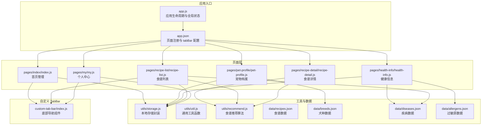
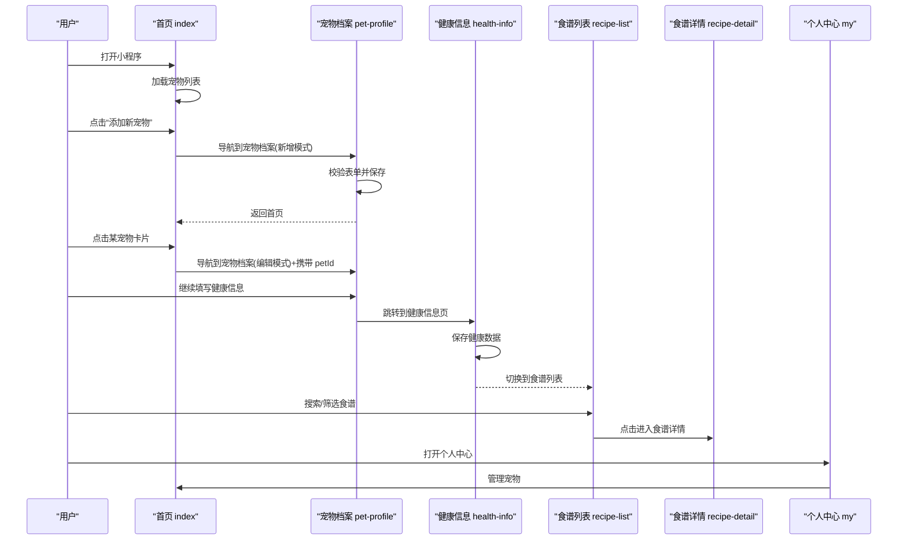
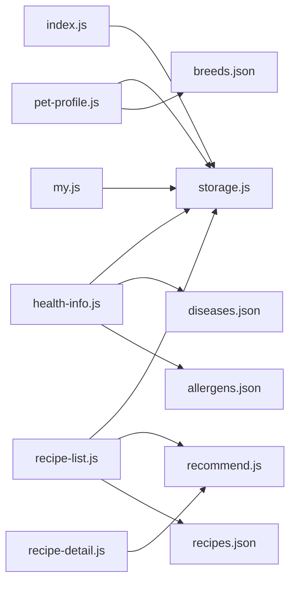

# 页面系统架构

<cite>
**本文档引用的文件**
- [app.js](file://app.js)
- [app.json](file://app.json)
- [pages/index/index.js](file://pages/index/index.js)
- [pages/pet-profile/pet-profile.js](file://pages/pet-profile/pet-profile.js)
- [pages/health-info/health-info.js](file://pages/health-info/health-info.js)
- [pages/recipe-list/recipe-list.js](file://pages/recipe-list/recipe-list.js)
- [pages/recipe-detail/recipe-detail.js](file://pages/recipe-detail/recipe-detail.js)
- [pages/my/my.js](file://pages/my/my.js)
- [utils/storage.js](file://utils/storage.js)
- [utils/util.js](file://utils/util.js)
- [utils/recommend.js](file://utils/recommend.js)
- [data/recipes.json](file://data/recipes.json)
- [data/breeds.json](file://data/breeds.json)
- [data/diseases.json](file://data/diseases.json)
- [data/allergens.json](file://data/allergens.json)
- [custom-tab-bar/index.js](file://custom-tab-bar/index.js)
</cite>

## 目录
1. [简介](#简介)
2. [项目结构](#项目结构)
3. [核心组件](#核心组件)
4. [架构总览](#架构总览)
5. [详细组件分析](#详细组件分析)
6. [依赖关系分析](#依赖关系分析)
7. [性能考虑](#性能考虑)
8. [故障排查指南](#故障排查指南)
9. [结论](#结论)
10. [附录](#附录)

## 简介
本文件面向 Old-baby 项目的页面系统，围绕 pages 目录下的核心页面进行系统化架构解析，覆盖首页管理、宠物档案、健康信息、食谱系统、个人中心等模块。文档从页面职责与设计思路出发，梳理各页面的文件组织结构（.js 逻辑、.wxml 模板、.wxss 样式、.json 配置），阐明页面间导航关系与数据传递机制，总结响应式设计与用户体验优化策略，并给出页面开发的最佳实践与扩展指导。

## 项目结构
Old-baby 采用微信小程序标准目录结构，页面通过 app.json 的 pages 字段注册，底部自定义 tabbar 由 custom-tab-bar 组件实现。数据层通过 utils 下的工具模块与本地存储交互，页面间通过路由跳转与全局存储进行数据联动。

图表来源
- [app.json](file://app.json#L1-L41)
- [pages/index/index.js](file://pages/index/index.js#L1-L80)
- [pages/pet-profile/pet-profile.js](file://pages/pet-profile/pet-profile.js#L1-L216)
- [pages/health-info/health-info.js](file://pages/health-info/health-info.js#L1-L190)
- [pages/recipe-list/recipe-list.js](file://pages/recipe-list/recipe-list.js#L1-L129)
- [pages/recipe-detail/recipe-detail.js](file://pages/recipe-detail/recipe-detail.js#L1-L43)
- [pages/my/my.js](file://pages/my/my.js#L1-L113)
- [utils/storage.js](file://utils/storage.js#L1-L155)
- [utils/util.js](file://utils/util.js#L1-L123)
- [utils/recommend.js](file://utils/recommend.js#L1-L109)
- [data/recipes.json](file://data/recipes.json#L1-L515)
- [data/breeds.json](file://data/breeds.json#L1-L35)
- [data/diseases.json](file://data/diseases.json#L1-L108)
- [data/allergens.json](file://data/allergens.json#L1-L15)
- [custom-tab-bar/index.js](file://custom-tab-bar/index.js#L1-L32)

章节来源
- [app.json](file://app.json#L1-L41)
- [custom-tab-bar/index.js](file://custom-tab-bar/index.js#L1-L32)

## 核心组件
- 应用入口与生命周期
  - 在应用启动时初始化本地存储，确保宠物数据键存在且为空数组，避免后续读写异常。
  - 全局状态包含当前选中宠物 ID，供页面间共享。
- 页面注册与导航
  - 通过 app.json 注册首页、宠物档案、健康信息、食谱列表、食谱详情、个人中心等页面。
  - 自定义 tabBar 提供“我的宝贝”“食谱”“我的”三个入口，统一切换逻辑。
- 数据与工具
  - storage 封装本地存储的增删改查与当前宠物选择，提供生成 ID、持久化等能力。
  - util 提供格式化时间、年龄描述、每日喂食量估算、防抖、加载/提示/确认弹窗等通用方法。
  - recommend 实现基于宠物健康状况的食谱推荐与过滤搜索。

章节来源
- [app.js](file://app.js#L1-L21)
- [app.json](file://app.json#L1-L41)
- [utils/storage.js](file://utils/storage.js#L1-L155)
- [utils/util.js](file://utils/util.js#L1-L123)
- [utils/recommend.js](file://utils/recommend.js#L1-L109)

## 架构总览
页面系统围绕“宠物为中心”的数据流展开：首页负责宠物列表与入口；宠物档案负责基础信息与健康信息入口；健康信息负责疾病与过敏原、活动水平、体检报告等健康数据；食谱系统根据健康数据进行智能推荐；个人中心负责用户信息与系统设置。

图表来源
- [pages/index/index.js](file://pages/index/index.js#L1-L80)
- [pages/pet-profile/pet-profile.js](file://pages/pet-profile/pet-profile.js#L1-L216)
- [pages/health-info/health-info.js](file://pages/health-info/health-info.js#L1-L190)
- [pages/recipe-list/recipe-list.js](file://pages/recipe-list/recipe-list.js#L1-L129)
- [pages/recipe-detail/recipe-detail.js](file://pages/recipe-detail/recipe-detail.js#L1-L43)
- [pages/my/my.js](file://pages/my/my.js#L1-L113)

## 详细组件分析

### 首页管理（pages/index/index）
- 功能定位
  - 展示当前用户的宠物列表，支持添加新宠物、查看宠物详情、跳转食谱、编辑健康信息、删除宠物。
- 文件组织
  - index.js：页面逻辑（加载数据、事件处理、导航）。
  - index.json：页面配置（窗口样式、标题等）。
  - index.wxml：模板结构（列表渲染、按钮事件绑定）。
  - index.wxss：样式（卡片布局、间距、颜色）。
- 处理流程
  - onShow 中刷新宠物列表并设置 tabbar 选中状态。
  - 点击宠物卡片设置当前宠物 ID 并跳转到宠物档案。
  - 查看食谱时设置当前宠物 ID 并切换到食谱列表。
  - 编辑健康信息直接跳转到健康信息页。
  - 删除宠物前二次确认，确认后更新列表并提示。
- 数据传递
  - 通过 storage.setCurrentPetId 与 storage.getCurrentPetId 在页面间传递当前宠物上下文。
- 用户体验
  - 空态展示、加载提示、确认对话框减少误操作。

章节来源
- [pages/index/index.js](file://pages/index/index.js#L1-L80)
- [utils/storage.js](file://utils/storage.js#L112-L140)

### 宠物档案（pages/pet-profile/pet-profile）
- 功能定位
  - 新增/编辑宠物资料，包含头像、姓名、品种、年龄、体重、性别、是否绝育等。
  - 支持品种搜索与选择、表单校验、保存与删除。
- 文件组织
  - pet-profile.js：页面逻辑（表单数据、事件处理、保存/删除）。
  - pet-profile.json：页面配置。
  - pet-profile.wxml：模板结构（表单字段、性别选择、绝育开关、头像选择、品种选择器）。
  - pet-profile.wxss：样式。
- 处理流程
  - onLoad 根据是否存在 id 决定新增或编辑模式，并设置导航栏标题。
  - 表单输入、性别、绝育变更通过 setData 动态更新。
  - 品种选择器支持搜索过滤，隐藏冒泡防止事件穿透。
  - 保存前校验必填项与数值有效性，调用 storage.addPet 或 storage.updatePet，完成后返回上一页。
  - 删除宠物前二次确认，成功后返回上一页。
- 数据来源
  - 品种数据来自 breeds.json。
- 用户体验
  - 头像支持相册与相机选择，输入校验即时反馈，保存过程加载提示。

章节来源
- [pages/pet-profile/pet-profile.js](file://pages/pet-profile/pet-profile.js#L1-L216)
- [data/breeds.json](file://data/breeds.json#L1-L35)

### 健康信息（pages/health-info/health-info）
- 功能定位
  - 记录宠物的疾病史、过敏原、用药情况、活动水平、偏好、当前主粮、体检报告图片等。
- 文件组织
  - health-info.js：页面逻辑（数据加载、选择切换、图片上传/预览/删除、保存）。
  - health-info.json：页面配置。
  - health-info.wxml：模板结构（疾病/过敏选择、活动水平、文本输入、体检报告上传）。
  - health-info.wxss：样式。
- 处理流程
  - onLoad 根据 petId 加载宠物健康数据，初始化疾病分类。
  - 疾病与过敏原通过 toggle 切换，活动水平通过 radio 选择，文本域通过 dataset 动态更新。
  - 体检报告支持多图上传，生成临时对象并支持预览与删除。
  - 保存时将疾病 ID 映射为名称，调用 storage.updatePet，完成后返回上一页。
  - “查看推荐食谱”保存后设置当前宠物 ID 并切换到食谱列表。
- 数据来源
  - 疾病数据来自 diseases.json，过敏原数据来自 allergens.json。
- 用户体验
  - 图片上传采用多图选择，支持预览与删除，提升编辑效率。

章节来源
- [pages/health-info/health-info.js](file://pages/health-info/health-info.js#L1-L190)
- [data/diseases.json](file://data/diseases.json#L1-L108)
- [data/allergens.json](file://data/allergens.json#L1-L15)

### 食谱系统（pages/recipe-list 与 pages/recipe-detail）
- 食谱列表（recipe-list）
  - 功能定位：根据当前选中的宠物进行智能推荐，支持搜索与按疾病筛选。
  - 处理流程：onLoad/onShow 加载数据；当存在当前宠物时调用 recommend.getRecommendedRecipes，否则显示全部食谱；支持搜索关键词与疾病筛选；点击进入详情页。
  - 数据来源：recommend.js 与 data/recipes.json。
- 食谱详情（recipe-detail）
  - 功能定位：展示食谱的食材、步骤、营养与注意事项，支持标签切换与分享。
  - 处理流程：onLoad 根据 id 获取食谱详情并设置导航标题；标签切换切换内容区域；分享返回默认路径。
  - 数据来源：recommend.js。
- 用户体验
  - 列表页支持筛选面板与清空筛选，详情页提供标签化信息展示。

章节来源
- [pages/recipe-list/recipe-list.js](file://pages/recipe-list/recipe-list.js#L1-L129)
- [pages/recipe-detail/recipe-detail.js](file://pages/recipe-detail/recipe-detail.js#L1-L43)
- [utils/recommend.js](file://utils/recommend.js#L1-L109)
- [data/recipes.json](file://data/recipes.json#L1-L515)

### 个人中心（pages/my/my）
- 功能定位：展示用户信息（头像、昵称）、宠物数量统计，提供管理宠物、关于我们、意见反馈、清除缓存、分享等入口。
- 处理流程：onLoad/onShow 加载数据；头像与昵称输入通过本地存储同步；管理宠物跳转首页；清除缓存前二次确认；分享返回首页路径。
- 用户体验：简洁的信息展示与操作入口，提供明确的确认提示。

章节来源
- [pages/my/my.js](file://pages/my/my.js#L1-L113)

### 自定义 TabBar（custom-tab-bar/index）
- 功能定位：替代默认 tabBar，提供图标与文字，统一切换逻辑。
- 处理流程：组件内部维护 list 数组与选中状态，switchTab 方法调用 wx.switchTab 实现页面切换。
- 用户体验：统一风格与交互，提升品牌一致性。

章节来源
- [custom-tab-bar/index.js](file://custom-tab-bar/index.js#L1-L32)

## 依赖关系分析
- 页面到工具模块
  - index/health-info/recipe-list/my 依赖 storage 进行数据持久化。
  - 所有页面依赖 util 提供的通用提示与确认弹窗。
  - recipe-list/recipe-detail 依赖 recommend 进行食谱推荐与查询。
- 工具模块到数据文件
  - recommend 依赖 data/recipes.json。
  - health-info 依赖 data/diseases.json 与 data/allergens.json。
  - pet-profile 依赖 data/breeds.json。
- 页面到页面
  - index → pet-profile（新增/编辑）、health-info（编辑健康）、recipe-list（查看食谱）。
  - pet-profile → health-info（继续填写）。
  - health-info → recipe-list（查看推荐）。
  - recipe-list → recipe-detail（查看详情）。
  - my → index（管理宠物）。

图表来源
- [pages/index/index.js](file://pages/index/index.js#L1-L80)
- [pages/pet-profile/pet-profile.js](file://pages/pet-profile/pet-profile.js#L1-L216)
- [pages/health-info/health-info.js](file://pages/health-info/health-info.js#L1-L190)
- [pages/recipe-list/recipe-list.js](file://pages/recipe-list/recipe-list.js#L1-L129)
- [pages/recipe-detail/recipe-detail.js](file://pages/recipe-detail/recipe-detail.js#L1-L43)
- [pages/my/my.js](file://pages/my/my.js#L1-L113)
- [utils/storage.js](file://utils/storage.js#L1-L155)
- [utils/recommend.js](file://utils/recommend.js#L1-L109)
- [data/recipes.json](file://data/recipes.json#L1-L515)
- [data/breeds.json](file://data/breeds.json#L1-L35)
- [data/diseases.json](file://data/diseases.json#L1-L108)
- [data/allergens.json](file://data/allergens.json#L1-L15)

## 性能考虑
- 数据加载与渲染
  - 首页与食谱列表在 onShow 中刷新，避免重复请求；列表渲染使用数据驱动，减少 DOM 操作。
- 存储与 IO
  - storage 使用 wx.setStorageSync/getStorageSync，批量更新后一次性写入，降低频繁 IO。
- 图片处理
  - 健康信息的体检报告支持多图上传，建议在保存前进行尺寸压缩与格式校验，减少内存占用。
- 推荐算法
  - recommend 对食谱进行评分与排序，建议在数据量增长时引入分页或缓存热门结果，避免重复计算。
- 交互反馈
  - 通过 util.showLoading 与 util.showToast 提供即时反馈，减少用户等待焦虑。

## 故障排查指南
- 无法加载宠物列表
  - 检查 app.js 初始化逻辑与 storage.getPets 是否返回数组。
- 保存失败或数据未更新
  - 检查 storage.savePets 与 storage.updatePet 的调用链，确认异常捕获与错误提示。
- 品种/疾病/过敏原为空
  - 确认 data/*.json 文件路径与内容正确，页面是否正确 require。
- 食谱推荐结果异常
  - 检查 pet 的 diseases 与 allergens 字段类型与值，确保与 recipes.json 的 id 匹配。
- 图片上传/预览失败
  - 检查 wx.chooseMedia 与 wx.previewImage 的回调参数，确认路径有效。
- 清除缓存后异常
  - 确认 wx.clearStorageSync 成功执行，页面数据重置逻辑完整。

章节来源
- [app.js](file://app.js#L1-L21)
- [utils/storage.js](file://utils/storage.js#L1-L155)
- [utils/util.js](file://utils/util.js#L1-L123)

## 结论
Old-baby 的页面系统以“宠物为中心”，通过清晰的页面职责划分与稳定的工具层封装，实现了从宠物档案到健康信息再到食谱推荐的完整闭环。自定义 tabbar 提升了用户体验的一致性，而本地存储与推荐算法则保障了数据的可用性与智能化。建议在后续迭代中进一步完善收藏与分享功能、优化推荐算法性能，并加强错误日志与埋点，持续提升稳定性与可维护性。

## 附录
- 页面文件组织规范
  - 每个页面包含 .js/.json/.wxml/.wxss 四类文件，逻辑与视图分离，便于维护与复用。
- 导航与数据传递最佳实践
  - 使用 wx.switchTab 与 wx.navigateTo 区分 tab 切换与页面跳转。
  - 通过 storage.getCurrentPetId 与 storage.setCurrentPetId 在页面间传递上下文。
- 响应式与可访问性
  - 使用 wxss 的单位与 flex 布局适配不同屏幕尺寸，确保关键交互元素的可点击区域足够大。
- 扩展指导
  - 新增页面时，遵循现有命名与目录结构，优先复用 storage 与 util，减少重复代码。
  - 食谱系统可扩展收藏、历史记录、分享统计等功能，建议引入本地缓存与服务端同步策略。