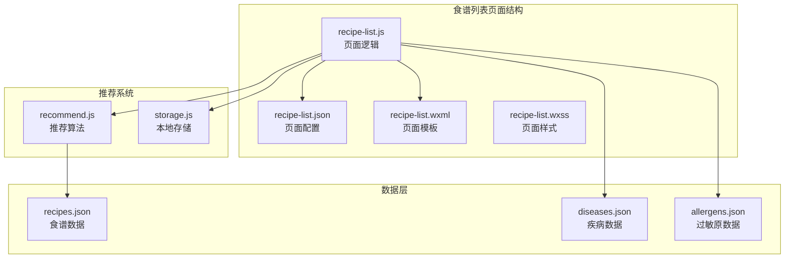
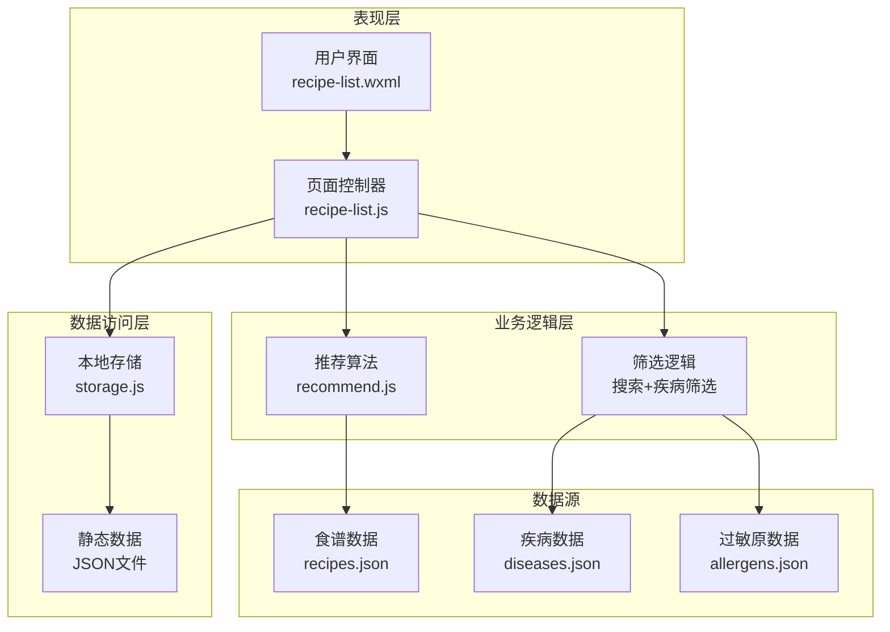
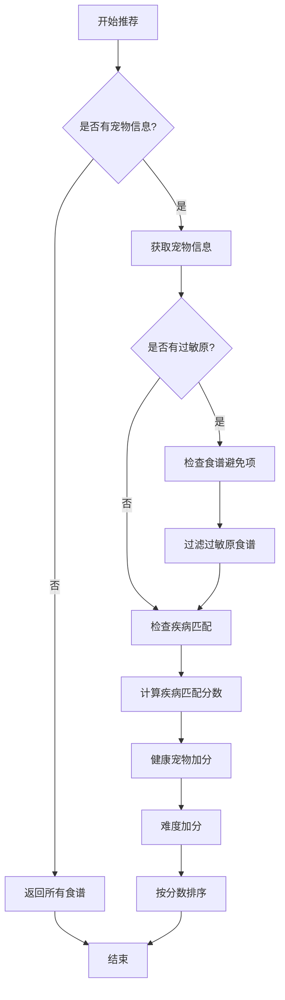
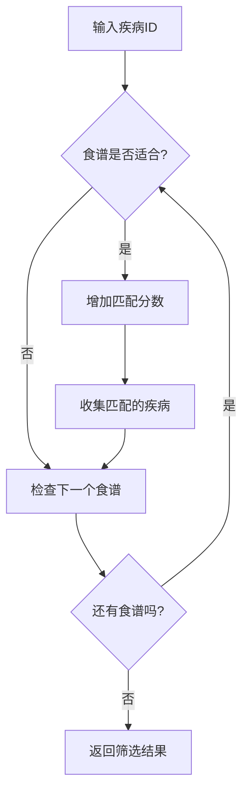
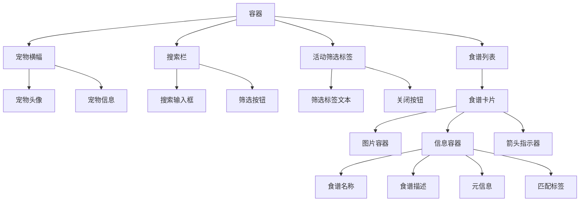
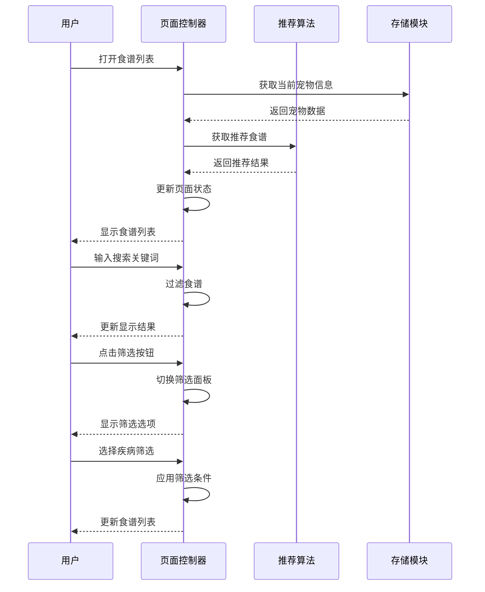
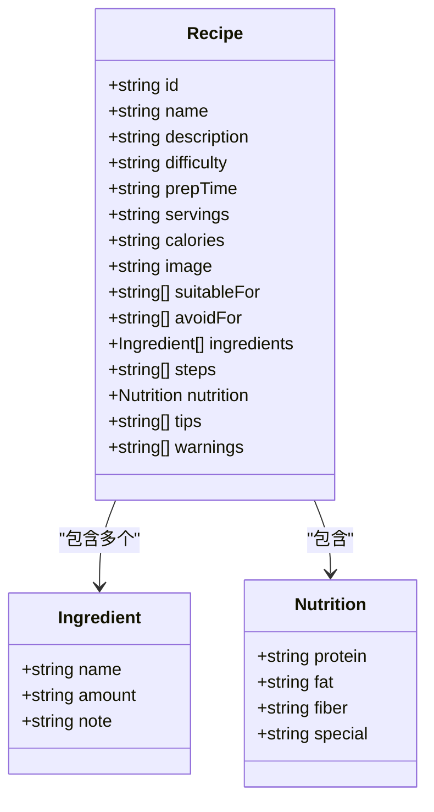
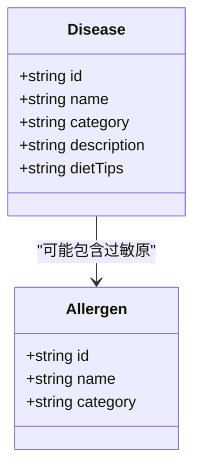
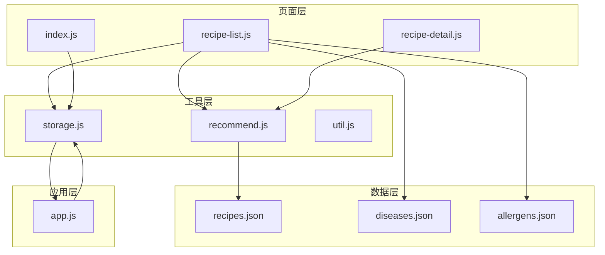
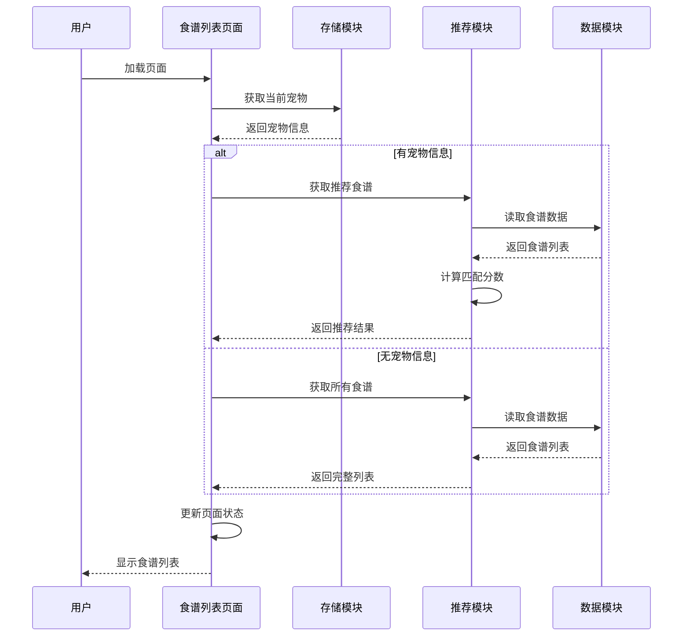

# 食谱列表页面

<cite>
**本文档引用的文件**
- [pages/recipe-list/recipe-list.js](file://pages/recipe-list/recipe-list.js)
- [pages/recipe-list/recipe-list.json](file://pages/recipe-list/recipe-list.json)
- [pages/recipe-list/recipe-list.wxml](file://pages/recipe-list/recipe-list.wxml)
- [utils/recommend.js](file://utils/recommend.js)
- [data/recipes.json](file://data/recipes.json)
- [data/diseases.json](file://data/diseases.json)
- [data/allergens.json](file://data/allergens.json)
- [utils/storage.js](file://utils/storage.js)
- [pages/recipe-detail/recipe-detail.js](file://pages/recipe-detail/recipe-detail.js)
- [pages/index/index.js](file://pages/index/index.js)
- [utils/util.js](file://utils/util.js)
- [app.js](file://app.js)
</cite>

## 目录
1. [简介](#简介)
2. [项目结构](#项目结构)
3. [核心组件](#核心组件)
4. [架构概览](#架构概览)
5. [详细组件分析](#详细组件分析)
6. [依赖关系分析](#依赖关系分析)
7. [性能考虑](#性能考虑)
8. [故障排除指南](#故障排除指南)
9. [结论](#结论)

## 简介

Old-baby项目的食谱列表页面是一个智能食谱推荐系统，专门为老年犬提供个性化的食谱推荐服务。该系统基于宠物的健康状况、过敏史和偏好，通过复杂的推荐算法为用户提供最适合的食谱选择。页面支持多种筛选功能，包括按疾病类型筛选、关键词搜索、难度排序等，为用户提供了丰富的个性化体验。

## 项目结构

食谱列表页面位于`pages/recipe-list/`目录下，采用标准的微信小程序页面结构：



**图表来源**
- [pages/recipe-list/recipe-list.js](file://pages/recipe-list/recipe-list.js#L1-L129)
- [utils/recommend.js](file://utils/recommend.js#L1-L109)
- [utils/storage.js](file://utils/storage.js#L1-L155)

**章节来源**
- [pages/recipe-list/recipe-list.js](file://pages/recipe-list/recipe-list.js#L1-L129)
- [pages/recipe-list/recipe-list.json](file://pages/recipe-list/recipe-list.json#L1-L5)

## 核心组件

### 页面控制器 (recipe-list.js)

页面控制器负责管理食谱列表的显示逻辑，包括数据加载、筛选、搜索等功能。主要功能包括：

- **数据管理**: 管理当前宠物信息、食谱列表、搜索关键词等状态
- **推荐算法**: 调用推荐模块获取个性化食谱
- **筛选功能**: 实现按疾病类型、关键词的筛选逻辑
- **导航控制**: 处理页面间的跳转和用户交互

### 推荐算法模块 (recommend.js)

推荐算法模块实现了智能食谱推荐的核心逻辑，基于以下因素进行评分：

- **疾病匹配**: 根据宠物的疾病状况匹配适合的食谱
- **过敏避免**: 过滤包含宠物过敏原的食谱
- **难度评估**: 优先推荐适合的烹饪难度
- **通用性**: 健康宠物的食谱权重调整

### 数据存储模块 (storage.js)

本地存储模块提供了完整的宠物信息管理功能：

- **宠物数据**: 存储和管理宠物的基本信息、健康状况
- **当前宠物**: 维护用户当前选中的宠物状态
- **数据持久化**: 使用微信小程序的本地存储API

**章节来源**
- [pages/recipe-list/recipe-list.js](file://pages/recipe-list/recipe-list.js#L6-L129)
- [utils/recommend.js](file://utils/recommend.js#L1-L109)
- [utils/storage.js](file://utils/storage.js#L1-L155)

## 架构概览

食谱推荐系统采用分层架构设计，各层职责明确，耦合度低：



**图表来源**
- [pages/recipe-list/recipe-list.js](file://pages/recipe-list/recipe-list.js#L1-L129)
- [utils/recommend.js](file://utils/recommend.js#L1-L109)
- [utils/storage.js](file://utils/storage.js#L1-L155)
- [data/recipes.json](file://data/recipes.json#L1-L515)

## 详细组件分析

### 推荐算法实现

推荐算法是整个系统的核心，采用多因素评分机制：

#### 算法评分规则



**图表来源**
- [utils/recommend.js](file://utils/recommend.js#L10-L66)

#### 评分权重分配

| 评分因素 | 权重 | 说明 |
|---------|------|------|
| 疾病匹配 | 10分/种 | 每匹配一种疾病增加10分 |
| 健康宠物 | +5分 | 无疾病时通用食谱优先 |
| 简单难度 | +2分 | 优先推荐简单食谱 |
| 过敏避免 | 排除 | 包含过敏原的食谱直接过滤 |

#### 疾病筛选逻辑



**图表来源**
- [utils/recommend.js](file://utils/recommend.js#L32-L45)

**章节来源**
- [utils/recommend.js](file://utils/recommend.js#L10-L66)

### 用户界面设计

#### 页面布局结构

页面采用响应式设计，适配不同屏幕尺寸：



**图表来源**
- [pages/recipe-list/recipe-list.wxml](file://pages/recipe-list/recipe-list.wxml#L1-L112)

#### 交互流程



**图表来源**
- [pages/recipe-list/recipe-list.js](file://pages/recipe-list/recipe-list.js#L50-L109)

**章节来源**
- [pages/recipe-list/recipe-list.wxml](file://pages/recipe-list/recipe-list.wxml#L1-L112)
- [pages/recipe-list/recipe-list.js](file://pages/recipe-list/recipe-list.js#L50-L129)

### 数据模型分析

#### 食谱数据结构

每个食谱包含完整的营养信息和制作指导：



**图表来源**
- [data/recipes.json](file://data/recipes.json#L1-L515)

#### 疾病数据结构



**图表来源**
- [data/diseases.json](file://data/diseases.json#L1-L108)
- [data/allergens.json](file://data/allergens.json#L1-L15)

**章节来源**
- [data/recipes.json](file://data/recipes.json#L1-L515)
- [data/diseases.json](file://data/diseases.json#L1-L108)
- [data/allergens.json](file://data/allergens.json#L1-L15)

## 依赖关系分析

### 组件间依赖关系



**图表来源**
- [pages/recipe-list/recipe-list.js](file://pages/recipe-list/recipe-list.js#L1-L5)
- [utils/recommend.js](file://utils/recommend.js#L1-L3)
- [utils/storage.js](file://utils/storage.js#L1-L7)

### 数据流分析



**图表来源**
- [pages/recipe-list/recipe-list.js](file://pages/recipe-list/recipe-list.js#L30-L48)
- [utils/recommend.js](file://utils/recommend.js#L10-L73)

**章节来源**
- [pages/recipe-list/recipe-list.js](file://pages/recipe-list/recipe-list.js#L1-L129)
- [utils/recommend.js](file://utils/recommend.js#L1-L109)
- [utils/storage.js](file://utils/storage.js#L1-L155)

## 性能考虑

### 算法优化建议

1. **缓存策略**
   - 缓存推荐结果，避免重复计算
   - 实现智能缓存失效机制
   - 对常用查询结果进行预计算

2. **数据结构优化**
   - 使用索引加速疾病匹配
   - 预构建过敏原映射表
   - 实现分页加载大列表

3. **异步处理**
   - 将耗时的计算任务放到后台线程
   - 实现防抖机制减少频繁更新
   - 使用增量更新而非全量刷新

### 用户体验优化

1. **加载状态**
   - 实现骨架屏提升感知速度
   - 提供进度指示器
   - 支持离线查看上次结果

2. **交互反馈**
   - 实现即时搜索结果
   - 提供筛选状态可视化
   - 优化触摸反馈

3. **性能监控**
   - 监控页面渲染时间
   - 跟踪用户操作延迟
   - 分析内存使用情况

## 故障排除指南

### 常见问题及解决方案

#### 推荐结果异常

**问题**: 食谱推荐不符合预期
**原因分析**:
- 疾病信息配置错误
- 过敏原数据不完整
- 推荐权重设置不当

**解决步骤**:
1. 检查宠物健康档案完整性
2. 验证疾病与食谱的匹配关系
3. 调整推荐算法权重参数

#### 页面加载缓慢

**问题**: 食谱列表加载时间过长
**可能原因**:
- 食谱数据量过大
- 推荐算法计算复杂度过高
- 网络请求阻塞

**优化方案**:
1. 实现数据分页加载
2. 优化推荐算法性能
3. 添加本地缓存机制

#### 筛选功能失效

**问题**: 疾病筛选或搜索功能异常
**排查方法**:
1. 检查事件绑定是否正确
2. 验证数据过滤逻辑
3. 确认状态更新机制

**修复步骤**:
1. 重新绑定筛选事件
2. 修正数据过滤条件
3. 重启页面状态管理

### 调试技巧

1. **日志记录**
   ```javascript
   // 在关键位置添加调试信息
   console.log('推荐算法输入:', petInfo);
   console.log('推荐结果:', recommendedRecipes);
   ```

2. **性能分析**
   - 使用微信开发者工具的性能分析器
   - 监控内存使用情况
   - 分析网络请求时间

3. **用户行为追踪**
   - 记录用户筛选偏好
   - 分析点击热力图
   - 监控页面停留时间

**章节来源**
- [pages/recipe-list/recipe-list.js](file://pages/recipe-list/recipe-list.js#L50-L129)
- [utils/recommend.js](file://utils/recommend.js#L1-L109)
- [utils/storage.js](file://utils/storage.js#L1-L155)

## 结论

Old-baby项目的食谱列表页面展现了优秀的软件架构设计，通过智能推荐算法、完善的筛选机制和友好的用户界面，为老年犬主人提供了个性化的食谱推荐服务。系统的主要优势包括：

1. **智能化推荐**: 基于宠物健康状况的精准推荐
2. **灵活筛选**: 支持多种维度的食谱筛选
3. **良好扩展性**: 模块化设计便于功能扩展
4. **用户体验**: 直观的界面设计和流畅的交互体验

未来可以进一步优化的方向包括：实现更复杂的推荐算法、添加用户反馈机制、增强个性化程度等。整体而言，这是一个设计合理、实现良好的移动端应用组件。