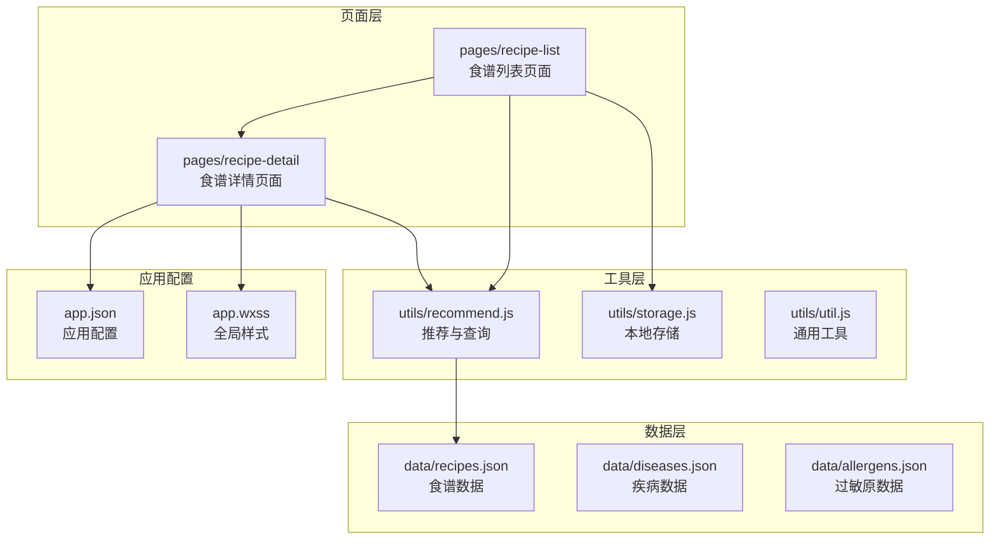
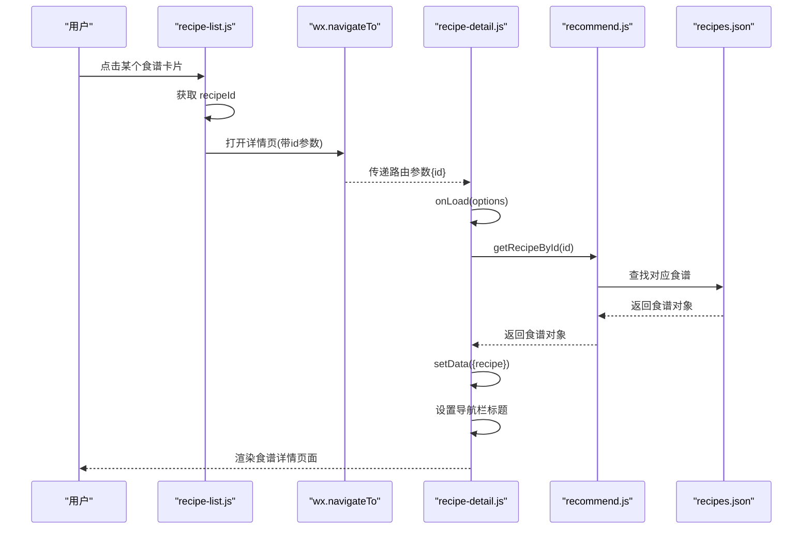
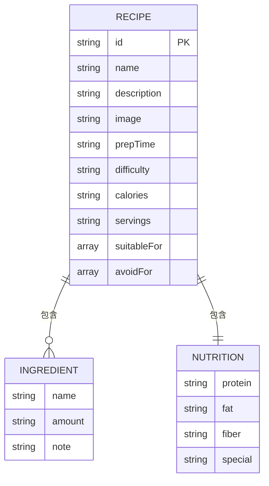
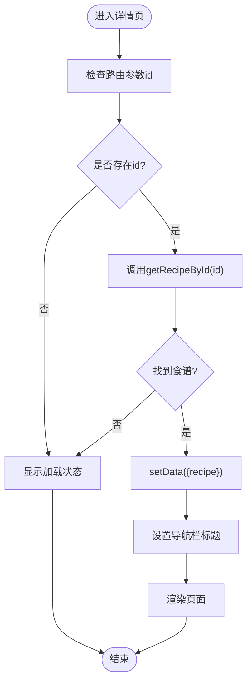
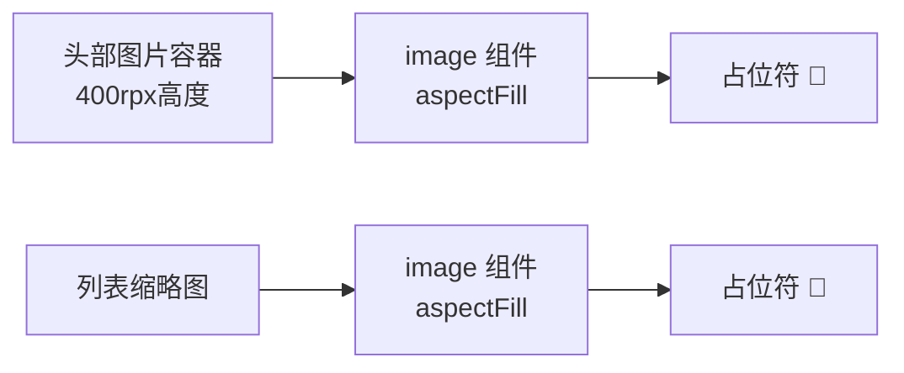
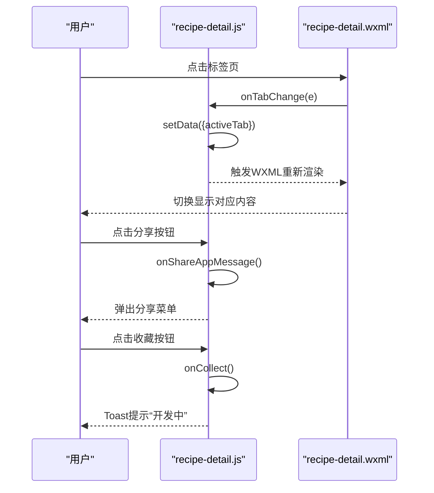
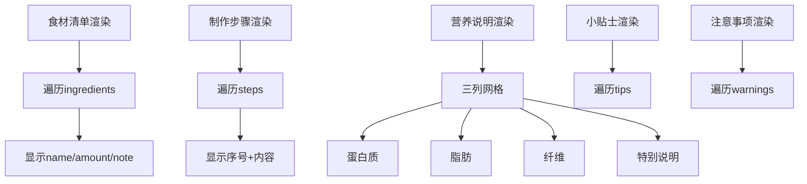
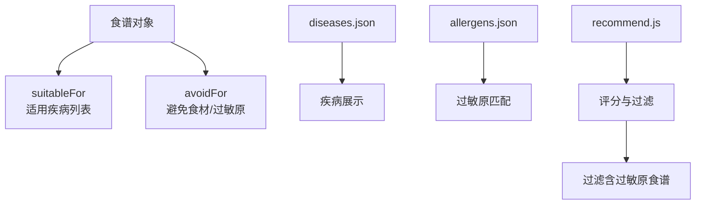
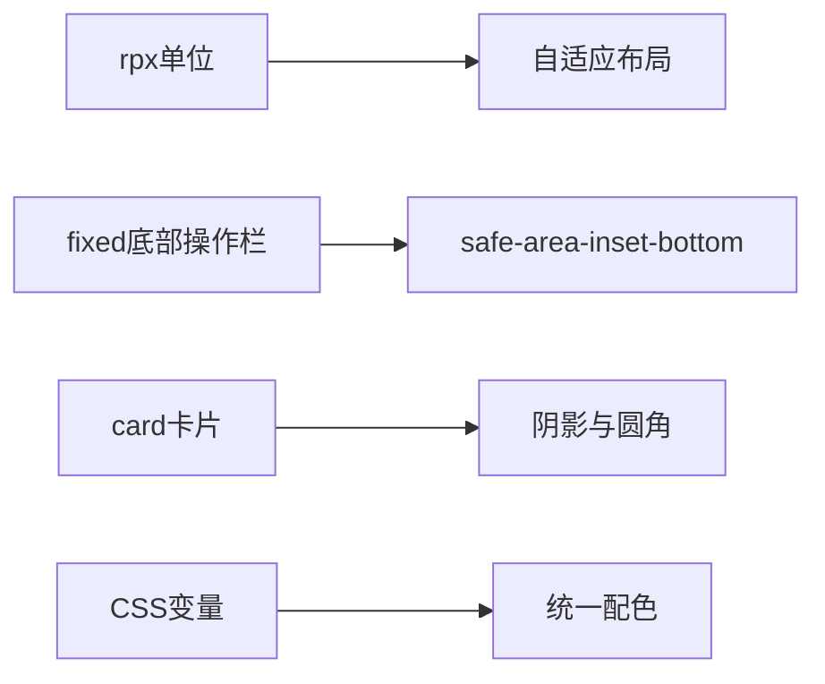
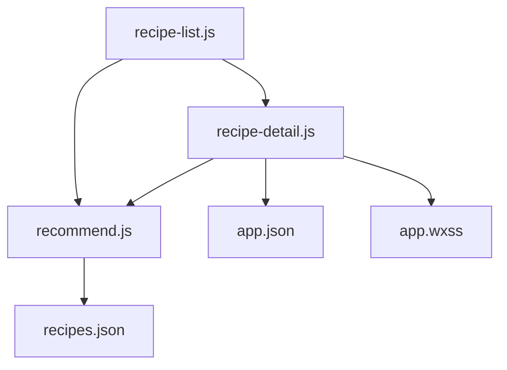

# 食谱详情页面

<cite>
**本文档引用的文件**
- [pages/recipe-detail/recipe-detail.js](file://pages/recipe-detail/recipe-detail.js)
- [pages/recipe-detail/recipe-detail.json](file://pages/recipe-detail/recipe-detail.json)
- [pages/recipe-detail/recipe-detail.wxml](file://pages/recipe-detail/recipe-detail.wxml)
- [pages/recipe-detail/recipe-detail.wxss](file://pages/recipe-detail/recipe-detail.wxss)
- [utils/recommend.js](file://utils/recommend.js)
- [data/recipes.json](file://data/recipes.json)
- [pages/recipe-list/recipe-list.js](file://pages/recipe-list/recipe-list.js)
- [app.json](file://app.json)
- [app.wxss](file://app.wxss)
- [data/diseases.json](file://data/diseases.json)
- [data/allergens.json](file://data/allergens.json)
</cite>

## 目录
1. [简介](#简介)
2. [项目结构](#项目结构)
3. [核心组件](#核心组件)
4. [架构概览](#架构概览)
5. [详细组件分析](#详细组件分析)
6. [依赖关系分析](#依赖关系分析)
7. [性能考虑](#性能考虑)
8. [故障排除指南](#故障排除指南)
9. [结论](#结论)
10. [附录](#附录)

## 简介
本文件为 Old-baby 项目中食谱详情页面的详细技术文档。重点解析食谱详情展示功能，包括：
- 食谱基本信息（名称、描述、制作时间、难度、热量）
- 制作步骤与分步说明
- 营养成分与特别说明
- 适用疾病标签与注意事项
- 数据加载机制、图片展示优化、用户交互设计
- 页面数据结构、富文本渲染与响应式布局
- 性能优化技巧与移动端适配方案
- 实际案例与开发经验分享

## 项目结构
食谱详情页面位于 pages/recipe-detail 目录，采用标准的 WXML + WXSS + JS 架构，并通过 utils/recommend.js 提供数据支持。

**图表来源**
- [pages/recipe-detail/recipe-detail.js](file://pages/recipe-detail/recipe-detail.js#L1-L43)
- [pages/recipe-list/recipe-list.js](file://pages/recipe-list/recipe-list.js#L1-L129)
- [utils/recommend.js](file://utils/recommend.js#L1-L109)
- [data/recipes.json](file://data/recipes.json#L1-L515)
- [app.json](file://app.json#L1-L41)
- [app.wxss](file://app.wxss#L1-L224)

**章节来源**
- [pages/recipe-detail/recipe-detail.js](file://pages/recipe-detail/recipe-detail.js#L1-L43)
- [pages/recipe-detail/recipe-detail.wxml](file://pages/recipe-detail/recipe-detail.wxml#L1-L154)
- [pages/recipe-detail/recipe-detail.wxss](file://pages/recipe-detail/recipe-detail.wxss#L1-L362)
- [utils/recommend.js](file://utils/recommend.js#L1-L109)
- [data/recipes.json](file://data/recipes.json#L1-L515)
- [pages/recipe-list/recipe-list.js](file://pages/recipe-list/recipe-list.js#L1-L129)
- [app.json](file://app.json#L1-L41)
- [app.wxss](file://app.wxss#L1-L224)

## 核心组件
- 页面控制器：负责接收路由参数、加载食谱详情、切换标签页、处理分享与收藏等交互。
- 视图模板：WXML 展示头部图片、基本信息卡片、适用说明、标签页内容（食材清单、制作步骤、营养说明）、小贴士与注意事项、底部操作栏。
- 样式系统：WXSS 提供卡片、标签页、步骤列表、营养网格、提示条目等样式，并使用全局 CSS 变量统一配色。
- 数据源：JSON 文件提供完整的食谱数据，包含食材、步骤、营养、小贴士、注意事项等字段。
- 推荐与查询：recommend.js 提供根据宠物健康状况筛选食谱、按 ID 查询详情、按关键词搜索等功能。

**章节来源**
- [pages/recipe-detail/recipe-detail.js](file://pages/recipe-detail/recipe-detail.js#L4-L42)
- [pages/recipe-detail/recipe-detail.wxml](file://pages/recipe-detail/recipe-detail.wxml#L2-L154)
- [pages/recipe-detail/recipe-detail.wxss](file://pages/recipe-detail/recipe-detail.wxss#L3-L362)
- [utils/recommend.js](file://utils/recommend.js#L78-L80)
- [data/recipes.json](file://data/recipes.json#L1-L515)

## 架构概览
从食谱列表到详情页的导航流程如下：

**图表来源**
- [pages/recipe-list/recipe-list.js](file://pages/recipe-list/recipe-list.js#L112-L117)
- [pages/recipe-detail/recipe-detail.js](file://pages/recipe-detail/recipe-detail.js#L10-L18)
- [utils/recommend.js](file://utils/recommend.js#L78-L80)
- [data/recipes.json](file://data/recipes.json#L1-L515)

## 详细组件分析

### 页面数据结构与字段定义
食谱详情页面的数据来源于 JSON 文件，字段覆盖基本信息、制作流程、营养信息与附加说明。关键字段包括：
- 基本信息：id、name、description、image、prepTime、difficulty、calories、servings
- 适用信息：suitableFor（适用疾病列表）、avoidFor（避免食材/过敏原）
- 成分配方：ingredients（name、amount、note）
- 制作步骤：steps（字符串数组）
- 营养说明：nutrition（protein、fat、fiber、special）
- 附加提示：tips、warnings

**图表来源**
- [data/recipes.json](file://data/recipes.json#L1-L515)

**章节来源**
- [data/recipes.json](file://data/recipes.json#L1-L515)

### 数据加载机制
- 路由参数：详情页通过 onLoad(options) 接收 id 参数。
- 查询逻辑：调用 recommend.getRecipeById(options.id) 获取食谱对象。
- 状态更新：成功获取后 setData({ recipe }) 并设置导航栏标题。
- 错误处理：若未传入 id 或未找到对应食谱，页面保持加载状态。

**图表来源**
- [pages/recipe-detail/recipe-detail.js](file://pages/recipe-detail/recipe-detail.js#L10-L18)
- [utils/recommend.js](file://utils/recommend.js#L78-L80)

**章节来源**
- [pages/recipe-detail/recipe-detail.js](file://pages/recipe-detail/recipe-detail.js#L10-L18)
- [utils/recommend.js](file://utils/recommend.js#L78-L80)

### 图片展示优化
- 头图区域：使用 aspectFill 模式填充，提供占位符（🍲）以提升加载体验。
- 列表缩略图：同样采用 aspectFill，缺失时显示占位符。
- 响应式高度：头部图片高度固定为 400rpx，适配不同屏幕尺寸。

**图表来源**
- [pages/recipe-detail/recipe-detail.wxml](file://pages/recipe-detail/recipe-detail.wxml#L4-L11)
- [pages/recipe-list/recipe-list.wxml](file://pages/recipe-list/recipe-list.wxml#L54-L62)

**章节来源**
- [pages/recipe-detail/recipe-detail.wxml](file://pages/recipe-detail/recipe-detail.wxml#L4-L11)
- [pages/recipe-detail/recipe-detail.wxss](file://pages/recipe-detail/recipe-detail.wxss#L9-L29)
- [pages/recipe-list/recipe-list.wxml](file://pages/recipe-list/recipe-list.wxml#L54-L62)

### 用户交互设计
- 标签页切换：点击“食材清单”“制作步骤”“营养说明”，切换 activeTab 控制内容显示。
- 分享功能：onShareAppMessage 返回标题与路径，支持转发到微信。
- 收藏功能：预留 onCollect，当前提示“开发中”。

**图表来源**
- [pages/recipe-detail/recipe-detail.js](file://pages/recipe-detail/recipe-detail.js#L21-L41)
- [pages/recipe-detail/recipe-detail.wxml](file://pages/recipe-detail/recipe-detail.wxml#L44-L61)

**章节来源**
- [pages/recipe-detail/recipe-detail.js](file://pages/recipe-detail/recipe-detail.js#L21-L41)
- [pages/recipe-detail/recipe-detail.wxml](file://pages/recipe-detail/recipe-detail.wxml#L44-L61)

### 内容渲染与富文本处理
- 食材清单：遍历 ingredients，显示 name、amount 与 note；底部显示 servings 说明。
- 制作步骤：遍历 steps，显示序号与内容，序号采用圆角背景与渐变色。
- 营养说明：三列网格展示蛋白质、脂肪、纤维；special 字段作为特别说明区块。
- 小贴士与注意事项：列表形式，分别使用不同图标与颜色标识。

**图表来源**
- [pages/recipe-detail/recipe-detail.wxml](file://pages/recipe-detail/recipe-detail.wxml#L63-L135)
- [pages/recipe-detail/recipe-detail.wxss](file://pages/recipe-detail/recipe-detail.wxss#L136-L313)

**章节来源**
- [pages/recipe-detail/recipe-detail.wxml](file://pages/recipe-detail/recipe-detail.wxml#L63-L135)
- [pages/recipe-detail/recipe-detail.wxss](file://pages/recipe-detail/recipe-detail.wxss#L136-L313)

### 适用疾病与过敏原关联
- 适用说明：suitableFor 与 avoidFor 字段用于表达食谱的适用与禁忌。
- 疾病数据：diseases.json 提供疾病分类与描述，便于前端展示与筛选。
- 过敏原数据：allergens.json 提供过敏原列表，与 avoidFor 对应。

**图表来源**
- [utils/recommend.js](file://utils/recommend.js#L18-L66)
- [data/diseases.json](file://data/diseases.json#L1-L108)
- [data/allergens.json](file://data/allergens.json#L1-L15)

**章节来源**
- [utils/recommend.js](file://utils/recommend.js#L18-L66)
- [data/diseases.json](file://data/diseases.json#L1-L108)
- [data/allergens.json](file://data/allergens.json#L1-L15)

### 响应式布局与移动端适配
- 使用 rpx 单位：页面整体采用 rpx，确保在不同设备上保持一致比例。
- 固定底部操作栏：使用 fixed 定位与 safe-bottom 类，适配刘海屏安全区域。
- 卡片与阴影：全局 card 类提供圆角与阴影，提升层级感。
- 导航栏与主题色：app.wxss 定义自然森系配色变量，统一风格。

**图表来源**
- [pages/recipe-detail/recipe-detail.wxss](file://pages/recipe-detail/recipe-detail.wxss#L315-L353)
- [app.wxss](file://app.wxss#L3-L23)

**章节来源**
- [pages/recipe-detail/recipe-detail.wxss](file://pages/recipe-detail/recipe-detail.wxss#L315-L353)
- [app.wxss](file://app.wxss#L3-L23)

## 依赖关系分析
- 页面依赖：recipe-detail 依赖 recommend.js 提供数据查询能力；通过路由参数与 setData 渲染视图。
- 数据依赖：recommend.js 依赖 data/recipes.json；同时在 recipe-list 中被广泛使用。
- 样式依赖：页面样式依赖 app.wxss 的全局变量与通用类名。
- 导航依赖：recipe-list.js 负责将用户引导至 recipe-detail，并传递 id 参数。

**图表来源**
- [pages/recipe-detail/recipe-detail.js](file://pages/recipe-detail/recipe-detail.js#L1-L43)
- [utils/recommend.js](file://utils/recommend.js#L1-L109)
- [data/recipes.json](file://data/recipes.json#L1-L515)
- [pages/recipe-list/recipe-list.js](file://pages/recipe-list/recipe-list.js#L1-L129)
- [app.json](file://app.json#L1-L41)
- [app.wxss](file://app.wxss#L1-L224)

**章节来源**
- [pages/recipe-detail/recipe-detail.js](file://pages/recipe-detail/recipe-detail.js#L1-L43)
- [utils/recommend.js](file://utils/recommend.js#L1-L109)
- [data/recipes.json](file://data/recipes.json#L1-L515)
- [pages/recipe-list/recipe-list.js](file://pages/recipe-list/recipe-list.js#L1-L129)
- [app.json](file://app.json#L1-L41)
- [app.wxss](file://app.wxss#L1-L224)

## 性能考虑
- 数据加载优化
  - 预加载策略：在 recipe-list 中已将推荐结果缓存到内存，详情页直接通过 ID 查询，避免重复计算。
  - 本地数据：recipes.json 作为静态资源，减少网络请求开销。
- 渲染优化
  - 条件渲染：使用 wx:if 控制内容显示，减少不必要的节点。
  - 列表渲染：使用 wx:for + wx:key，提升列表更新效率。
- 图片优化
  - 占位符：无图时显示占位符，避免空白带来的视觉跳变。
  - aspectFill：统一图片填充模式，减少重排。
- 交互优化
  - 分享与收藏：使用原生组件与事件绑定，降低自定义复杂度。
  - 底部固定栏：使用 fixed 定位，避免滚动时重复渲染。

[本节为通用性能建议，无需特定文件引用]

## 故障排除指南
- 无法显示食谱详情
  - 检查路由参数 id 是否正确传递（recipe-list.js 中的 navigateTo）。
  - 确认 recommend.getRecipeById 返回非空对象。
- 图片不显示
  - 检查 image 字段路径是否有效；无图时显示占位符。
  - 确认 mode="aspectFill" 配置正确。
- 标签页切换无效
  - 检查 activeTab 状态是否更新；确认 WXML 中的 wx:if 条件正确。
- 分享/收藏功能异常
  - 分享：确认 onShareAppMessage 返回值正确。
  - 收藏：当前仅提示“开发中”，后续可接入本地收藏或云存储。

**章节来源**
- [pages/recipe-list/recipe-list.js](file://pages/recipe-list/recipe-list.js#L112-L117)
- [utils/recommend.js](file://utils/recommend.js#L78-L80)
- [pages/recipe-detail/recipe-detail.js](file://pages/recipe-detail/recipe-detail.js#L27-L41)
- [pages/recipe-detail/recipe-detail.wxml](file://pages/recipe-detail/recipe-detail.wxml#L4-L11)

## 结论
食谱详情页面通过清晰的数据结构、简洁的视图模板与稳定的推荐查询机制，实现了对老年犬食谱的完整展示。页面采用 rpx 响应式布局与统一主题色，具备良好的移动端适配能力。未来可在收藏功能、富文本渲染与图片懒加载等方面进一步优化，以提升用户体验与性能表现。

[本节为总结性内容，无需特定文件引用]

## 附录

### 开发经验分享
- 数据驱动：将食谱数据集中管理于 JSON 文件，便于维护与扩展。
- 组件化思维：将常用 UI 结构抽象为通用类名（如 card、tag），提升复用性。
- 交互一致性：标签页切换、分享与收藏等交互尽量遵循微信小程序规范，降低学习成本。
- 可访问性：为图片提供占位符，为列表项提供键值，提升可读性与可维护性。

[本节为经验总结，无需特定文件引用]