# 首页管理页面

<cite>
**本文档引用的文件**
- [pages/index/index.js](file://pages/index/index.js)
- [pages/index/index.wxml](file://pages/index/index.wxml)
- [pages/index/index.wxss](file://pages/index/index.wxss)
- [pages/index/index.json](file://pages/index/index.json)
- [utils/storage.js](file://utils/storage.js)
- [utils/util.js](file://utils/util.js)
- [custom-tab-bar/index.js](file://custom-tab-bar/index.js)
- [app.js](file://app.js)
- [pages/pet-profile/pet-profile.js](file://pages/pet-profile/pet-profile.js)
- [pages/recipe-list/recipe-list.js](file://pages/recipe-list/recipe-list.js)
</cite>

## 目录
1. [简介](#简介)
2. [项目结构](#项目结构)
3. [核心组件](#核心组件)
4. [架构概览](#架构概览)
5. [详细组件分析](#详细组件分析)
6. [依赖关系分析](#依赖关系分析)
7. [性能考虑](#性能考虑)
8. [故障排除指南](#故障排除指南)
9. [结论](#结论)

## 简介

Old-baby项目的首页管理页面是整个应用的核心入口，负责宠物列表的展示、当前宠物状态管理以及宠物切换操作。该页面采用微信小程序的标准架构，结合自定义tabbar组件，为用户提供直观便捷的宠物管理体验。

首页页面实现了完整的CRUD操作，支持宠物信息的增删改查，并通过本地存储机制确保数据持久化。页面设计注重用户体验，提供了丰富的交互反馈和视觉提示。

## 项目结构

首页管理页面位于`pages/index/`目录下，采用标准的小程序页面结构：

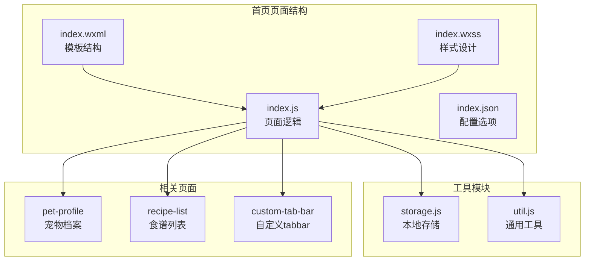

**图表来源**
- [pages/index/index.js](file://pages/index/index.js#L1-L80)
- [pages/index/index.wxml](file://pages/index/index.wxml#L1-L71)
- [pages/index/index.wxss](file://pages/index/index.wxss#L1-L215)
- [pages/index/index.json](file://pages/index/index.json#L1-L5)

**章节来源**
- [pages/index/index.js](file://pages/index/index.js#L1-L80)
- [pages/index/index.wxml](file://pages/index/index.wxml#L1-L71)
- [pages/index/index.wxss](file://pages/index/index.wxss#L1-L215)
- [pages/index/index.json](file://pages/index/index.json#L1-L5)

## 核心组件

首页管理页面由四个主要部分组成：

### 数据模型
页面维护两个核心数据状态：
- `pets`: 宠物对象数组，包含所有已添加的宠物信息
- `isEmpty`: 布尔值，用于判断宠物列表是否为空

### 事件处理器
页面实现了以下关键事件处理方法：
- `loadPets()`: 加载并更新宠物列表
- `onAddPet()`: 导航到宠物添加页面
- `onPetTap()`: 处理宠物卡片点击事件
- `onViewRecipes()`: 查看宠物食谱推荐
- `onEditHealth()`: 编辑宠物健康信息
- `onDeletePet()`: 删除指定宠物

### 用户界面元素
页面包含以下主要UI组件：
- 标题区域：显示页面标题和副标题
- 宠物列表：动态渲染宠物卡片
- 空状态：当无宠物时显示的提示界面
- 添加按钮：悬浮操作按钮

**章节来源**
- [pages/index/index.js](file://pages/index/index.js#L5-L31)
- [pages/index/index.wxml](file://pages/index/index.wxml#L10-L69)

## 架构概览

首页管理页面采用分层架构设计，清晰分离了数据层、业务逻辑层和视图层：

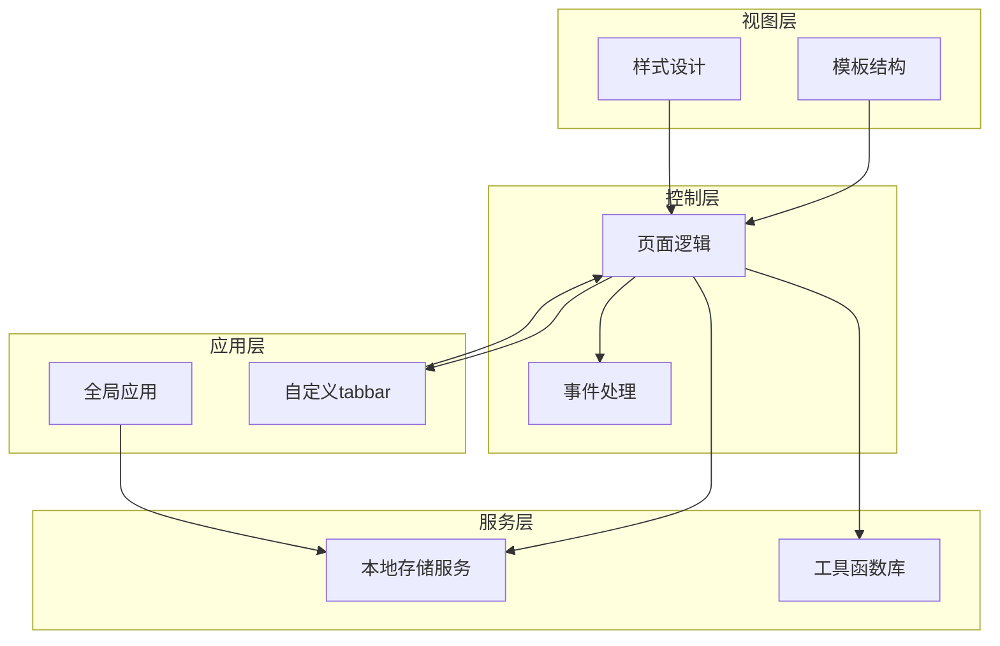

**图表来源**
- [pages/index/index.js](file://pages/index/index.js#L1-L80)
- [utils/storage.js](file://utils/storage.js#L1-L155)
- [utils/util.js](file://utils/util.js#L1-L123)
- [custom-tab-bar/index.js](file://custom-tab-bar/index.js#L1-L32)

### 数据流架构

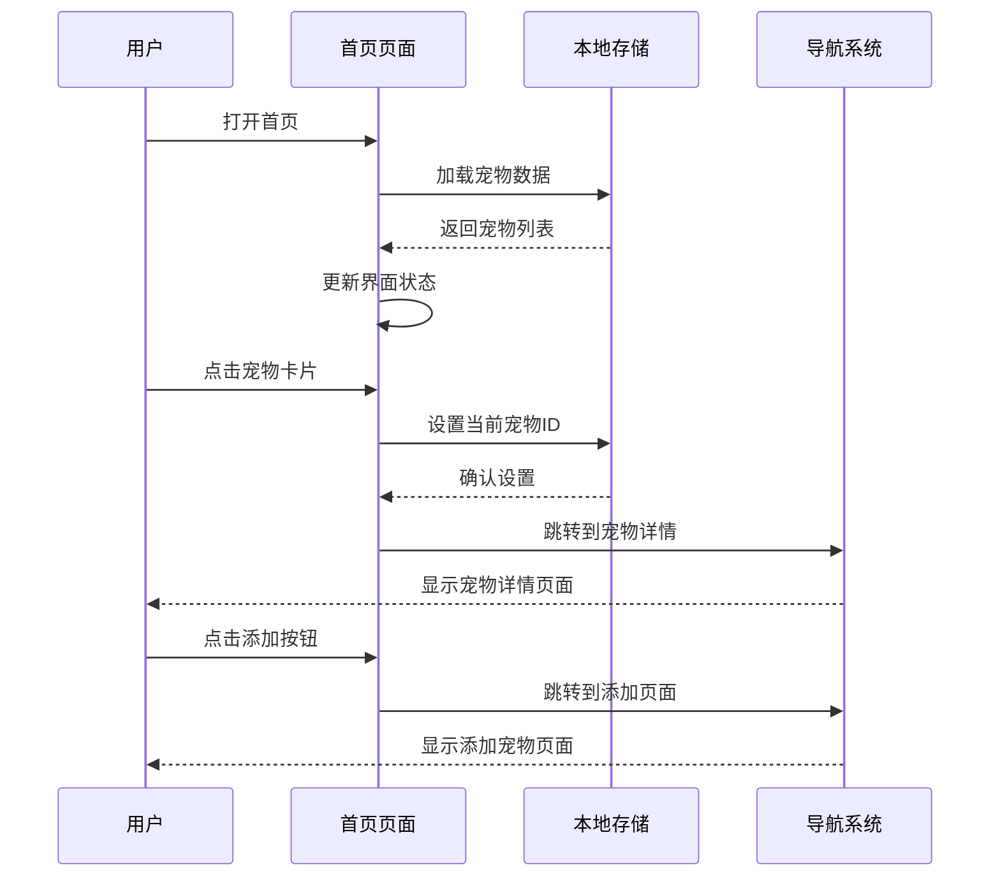

**图表来源**
- [pages/index/index.js](file://pages/index/index.js#L11-L38)
- [utils/storage.js](file://utils/storage.js#L113-L131)

## 详细组件分析

### 页面逻辑组件

首页的JavaScript逻辑实现了完整的宠物管理功能：

#### 数据绑定机制

页面通过`data`属性定义响应式数据，使用`setData`方法更新界面状态：

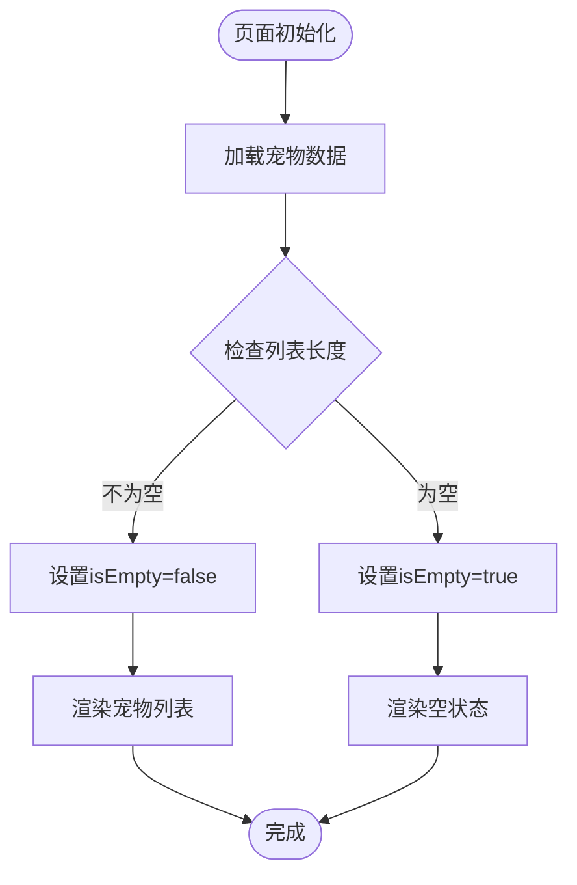

**图表来源**
- [pages/index/index.js](file://pages/index/index.js#L25-L31)

#### 事件处理流程

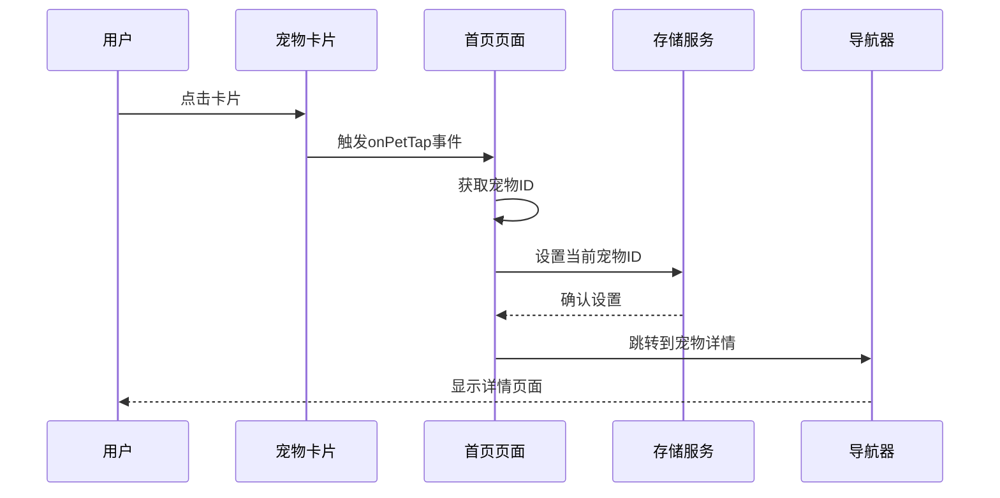

**图表来源**
- [pages/index/index.js](file://pages/index/index.js#L41-L47)

#### 删除操作流程

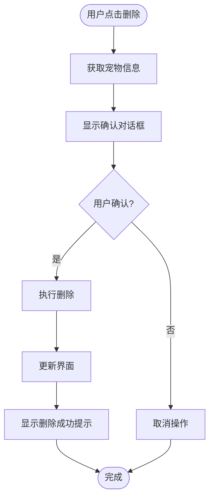

**图表来源**
- [pages/index/index.js](file://pages/index/index.js#L67-L78)

**章节来源**
- [pages/index/index.js](file://pages/index/index.js#L1-L80)

### 模板结构组件

首页的WXML模板采用了语义化的结构设计：

#### 条件渲染机制

页面使用`wx:if`指令实现条件渲染，根据数据状态动态显示不同内容：

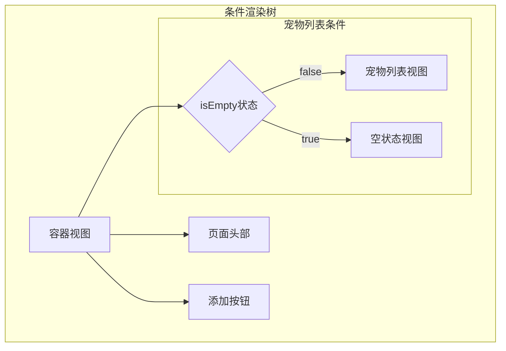

**图表来源**
- [pages/index/index.wxml](file://pages/index/index.wxml#L10-L69)

#### 动态列表渲染

宠物列表使用`wx:for`指令实现动态渲染，每个宠物卡片包含完整的交互功能：

**章节来源**
- [pages/index/index.wxml](file://pages/index/index.wxml#L1-L71)

### 样式设计组件

首页的WXSS样式采用了现代化的设计理念：

#### 响应式布局

页面使用rpx单位确保在不同设备上的适配性：

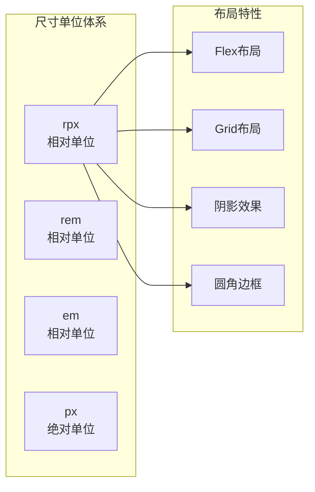

**图表来源**
- [pages/index/index.wxss](file://pages/index/index.wxss#L1-L215)

#### 主题色彩系统

页面采用统一的主题色彩方案：

**章节来源**
- [pages/index/index.wxss](file://pages/index/index.wxss#L1-L215)

### 配置选项组件

首页的JSON配置文件定义了页面的基本设置：

**章节来源**
- [pages/index/index.json](file://pages/index/index.json#L1-L5)

## 依赖关系分析

首页管理页面与多个模块存在紧密的依赖关系：

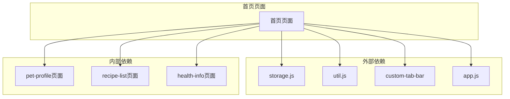

**图表来源**
- [pages/index/index.js](file://pages/index/index.js#L1-L4)
- [utils/storage.js](file://utils/storage.js#L1-L155)
- [utils/util.js](file://utils/util.js#L1-L123)
- [custom-tab-bar/index.js](file://custom-tab-bar/index.js#L1-L32)
- [app.js](file://app.js#L1-L21)

### 数据依赖链

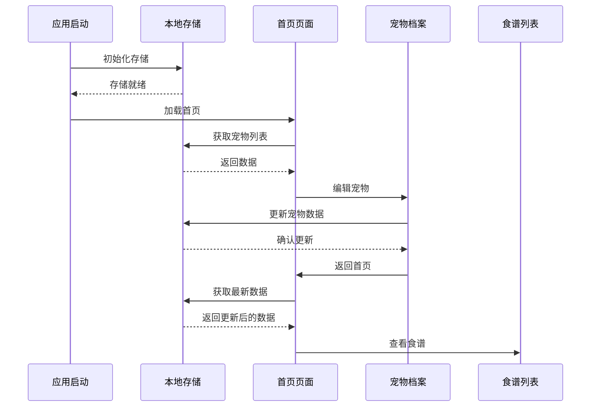

**图表来源**
- [app.js](file://app.js#L8-L14)
- [pages/index/index.js](file://pages/index/index.js#L25-L31)
- [utils/storage.js](file://utils/storage.js#L19-L26)

**章节来源**
- [pages/index/index.js](file://pages/index/index.js#L1-L80)
- [utils/storage.js](file://utils/storage.js#L1-L155)
- [utils/util.js](file://utils/util.js#L1-L123)

## 性能考虑

### 数据加载优化

首页页面在生命周期中实现了智能的数据加载策略：

1. **懒加载机制**：仅在页面显示时加载数据，避免不必要的资源消耗
2. **缓存策略**：利用小程序的页面缓存机制减少重复渲染
3. **异步处理**：删除操作使用异步模式，提升用户体验

### 内存管理

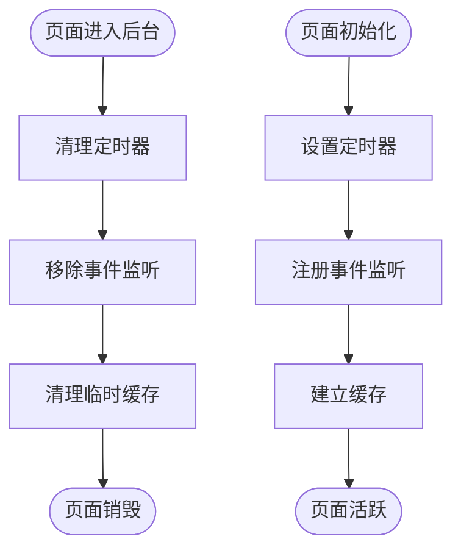

### 用户体验优化

1. **即时反馈**：所有用户操作都有相应的视觉反馈
2. **错误处理**：完善的错误捕获和用户提示机制
3. **加载状态**：复杂操作显示加载指示器

## 故障排除指南

### 常见问题及解决方案

#### 宠物列表无法显示

**问题症状**：页面空白或只显示空状态

**可能原因**：
1. 本地存储数据损坏
2. 页面初始化失败
3. 权限问题

**解决步骤**：
1. 检查本地存储状态：`wx.getStorageSync('pets')`
2. 重新初始化应用：重启小程序
3. 清除应用缓存后重试

#### 删除操作异常

**问题症状**：删除确认后宠物仍然存在

**可能原因**：
1. 异步操作未正确处理
2. 存储权限问题
3. 数据同步延迟

**解决步骤**：
1. 检查Promise链路完整性
2. 验证存储写入结果
3. 实施数据一致性检查

#### 导航跳转失败

**问题症状**：点击按钮无响应或跳转错误

**可能原因**：
1. 路径配置错误
2. 参数传递问题
3. 页面未正确注册

**解决步骤**：
1. 验证页面路径配置
2. 检查参数格式和类型
3. 确认页面注册状态

**章节来源**
- [pages/index/index.js](file://pages/index/index.js#L67-L78)
- [utils/util.js](file://utils/util.js#L97-L110)

## 结论

Old-baby项目的首页管理页面展现了优秀的前端架构设计和用户体验理念。通过合理的模块划分、清晰的数据流管理和完善的错误处理机制，实现了稳定可靠的宠物管理功能。

页面的主要优势包括：
- **模块化设计**：清晰的职责分离便于维护和扩展
- **用户体验**：直观的界面设计和流畅的交互流程
- **数据安全**：完善的本地存储和数据验证机制
- **性能优化**：智能的加载策略和内存管理

未来可以考虑的改进方向：
- 增加更多个性化定制选项
- 优化大数据量场景下的渲染性能
- 扩展更多宠物健康监测功能
- 增强与其他页面的数据联动