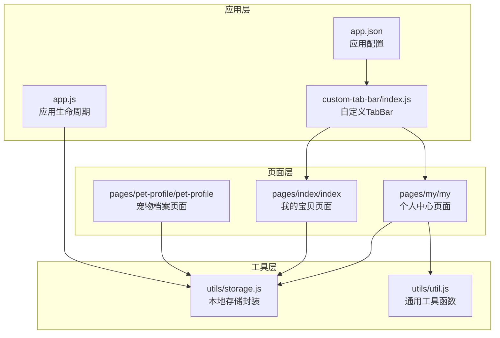
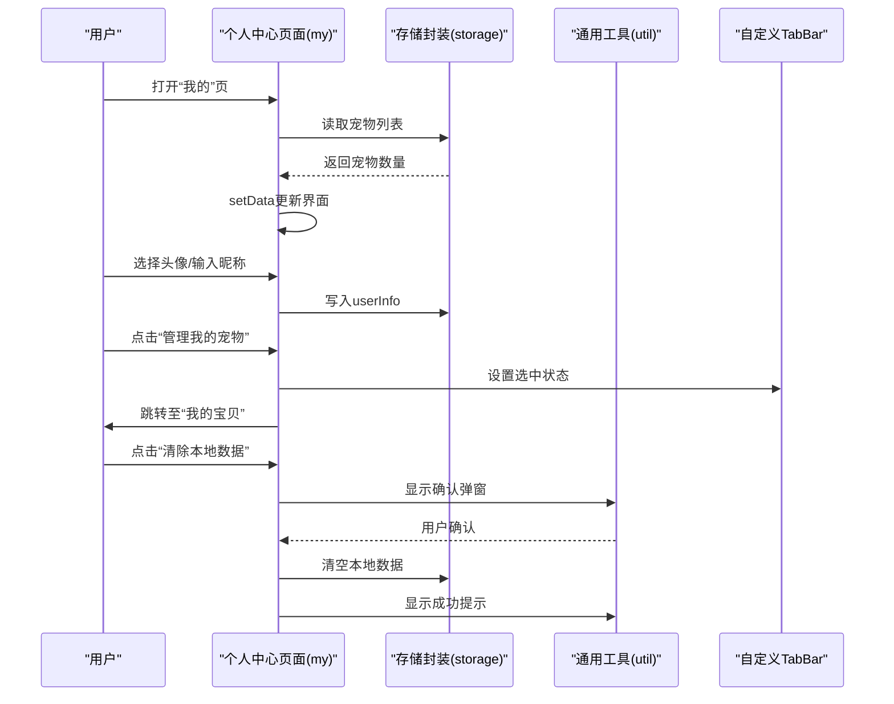
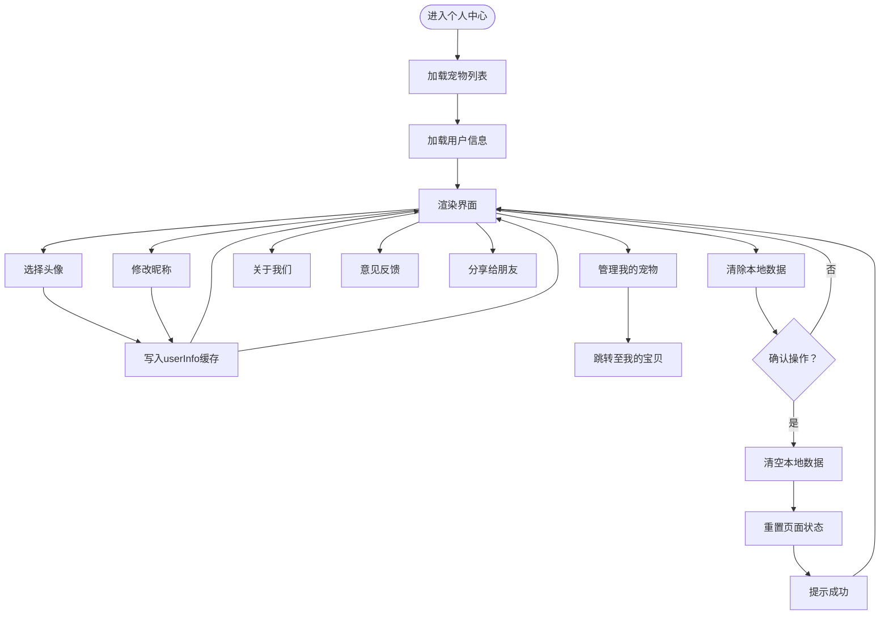
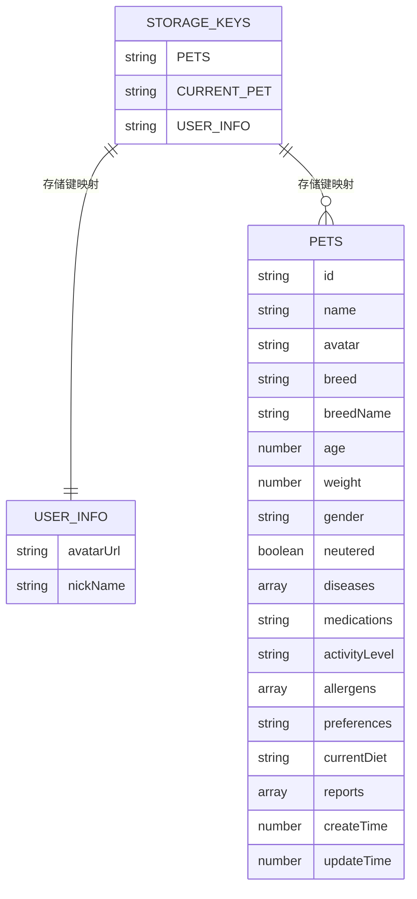
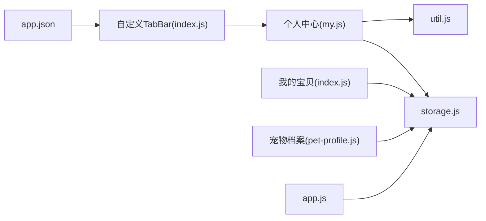

# 个人中心

<cite>
**本文引用的文件**
- [pages/my/my.js](file://pages/my/my.js)
- [pages/my/my.json](file://pages/my/my.json)
- [pages/my/my.wxml](file://pages/my/my.wxml)
- [pages/my/my.wxss](file://pages/my/my.wxss)
- [utils/storage.js](file://utils/storage.js)
- [utils/util.js](file://utils/util.js)
- [app.js](file://app.js)
- [app.json](file://app.json)
- [custom-tab-bar/index.js](file://custom-tab-bar/index.js)
- [pages/index/index.js](file://pages/index/index.js)
- [pages/pet-profile/pet-profile.js](file://pages/pet-profile/pet-profile.js)
</cite>

## 目录
1. [简介](#简介)
2. [项目结构](#项目结构)
3. [核心组件](#核心组件)
4. [架构总览](#架构总览)
5. [详细组件分析](#详细组件分析)
6. [依赖关系分析](#依赖关系分析)
7. [性能考虑](#性能考虑)
8. [故障排除指南](#故障排除指南)
9. [结论](#结论)
10. [附录](#附录)

## 简介
本文件面向“个人中心”页面，系统性梳理其在用户信息管理、应用设置、数据清理等方面的功能实现，深入解析页面的UI设计、设置项配置、数据导出导入机制与应用配置选项，并阐述页面与存储系统的交互方式及个性化设置管理策略。同时提供设计原则、功能扩展建议与用户体验优化策略，帮助开发者与产品人员高效理解与迭代该模块。

## 项目结构
个人中心页面位于 pages/my 目录下，采用标准的 WXML + WXSS + JS + JSON 的小程序页面组织方式；配合全局工具库 utils 与自定义 tabbar，形成统一的导航与交互体验。

图表来源
- [pages/my/my.js](file://pages/my/my.js#L1-L113)
- [utils/storage.js](file://utils/storage.js#L1-L155)
- [utils/util.js](file://utils/util.js#L1-L123)
- [app.js](file://app.js#L1-L21)
- [app.json](file://app.json#L1-L41)
- [custom-tab-bar/index.js](file://custom-tab-bar/index.js#L1-L32)

章节来源
- [pages/my/my.js](file://pages/my/my.js#L1-L113)
- [pages/my/my.json](file://pages/my/my.json#L1-L5)
- [pages/my/my.wxml](file://pages/my/my.wxml#L1-L70)
- [pages/my/my.wxss](file://pages/my/my.wxss#L1-L133)
- [utils/storage.js](file://utils/storage.js#L1-L155)
- [utils/util.js](file://utils/util.js#L1-L123)
- [app.js](file://app.js#L1-L21)
- [app.json](file://app.json#L1-L41)
- [custom-tab-bar/index.js](file://custom-tab-bar/index.js#L1-L32)

## 核心组件
- 页面控制器：负责加载用户信息、渲染宠物统计、处理用户头像与昵称输入、跳转到宠物管理、展示关于与反馈、执行数据清理、分享等。
- 存储封装：提供宠物列表、当前选中宠物、用户信息等键值的读写与管理。
- 通用工具：提供确认弹窗、提示消息、防抖等通用能力。
- 自定义TabBar：统一导航栏图标与选中态，确保“我的”页被正确标记为选中。
- 应用配置：定义页面路由、导航样式、tabBar 列表与图标。

章节来源
- [pages/my/my.js](file://pages/my/my.js#L5-L113)
- [utils/storage.js](file://utils/storage.js#L3-L155)
- [utils/util.js](file://utils/util.js#L98-L122)
- [custom-tab-bar/index.js](file://custom-tab-bar/index.js#L1-L32)
- [app.json](file://app.json#L17-L37)

## 架构总览
个人中心页面通过 Page 控制器与存储封装进行数据交互，使用通用工具提供一致的交互体验；自定义 TabBar 提供统一的导航入口，应用配置决定页面路由与样式。

图表来源
- [pages/my/my.js](file://pages/my/my.js#L12-L103)
- [utils/storage.js](file://utils/storage.js#L19-L39)
- [utils/util.js](file://utils/util.js#L98-L110)
- [custom-tab-bar/index.js](file://custom-tab-bar/index.js#L24-L30)

## 详细组件分析

### 页面控制器（个人中心）
- 生命周期与数据加载
  - onLoad/onShow：加载宠物数量与用户信息；在显示时同步 TabBar 选中状态。
  - loadData：从本地存储读取宠物列表长度，从缓存读取用户信息并更新视图。
- 用户信息管理
  - 头像设置：通过开放能力选择头像后，更新本地缓存并刷新视图。
  - 昵称设置：输入框失焦时更新本地缓存并刷新视图。
- 导航与功能
  - 宠物管理：跳转至“我的宝贝”首页，便于继续管理宠物。
  - 关于我们/意见反馈：展示静态信息弹窗。
  - 分享：使用开放能力触发分享。
- 数据清理
  - 清除缓存：二次确认后清空本地全部数据，重置页面状态并提示结果。

图表来源
- [pages/my/my.js](file://pages/my/my.js#L25-L103)

章节来源
- [pages/my/my.js](file://pages/my/my.js#L5-L113)

### 视图与样式（WXML/WXSS）
- 用户信息区域
  - 头像按钮：支持选择头像，若无头像则显示占位符。
  - 昵称输入框：可编辑昵称，失焦即保存。
  - 统计信息：显示已添加宠物数量。
- 功能菜单
  - 管理我的宠物：跳转至“我的宝贝”。
  - 关于我们/意见反馈：展示信息弹窗。
  - 分享给朋友：使用开放能力分享。
- 数据管理
  - 清除本地数据：危险操作项，带箭头指示。
- 样式要点
  - 卡片布局、图标与文字对齐、危险项颜色提示、底部说明文案。

章节来源
- [pages/my/my.wxml](file://pages/my/my.wxml#L1-L70)
- [pages/my/my.wxss](file://pages/my/my.wxss#L1-L133)

### 存储系统交互
- 键值管理
  - 用户信息键：用于持久化用户头像与昵称。
  - 宠物列表键：用于持久化宠物集合。
  - 当前选中宠物键：用于记录当前宠物上下文。
- 读写流程
  - 读取：从本地缓存或存储封装中获取数据。
  - 写入：更新本地缓存或存储封装中的数据。
- 一致性与错误处理
  - 包装异常捕获，避免因存储异常导致页面崩溃。
  - 初始化检查：应用启动时确保宠物列表键存在。

图表来源
- [utils/storage.js](file://utils/storage.js#L3-L155)

章节来源
- [utils/storage.js](file://utils/storage.js#L1-L155)
- [app.js](file://app.js#L8-L14)

### 通用工具与交互
- 确认弹窗：封装 Promise 化的确认对话框，用于关键操作前的二次确认。
- 提示消息：统一对话提示，包含成功/失败状态。
- 加载提示：统一加载状态管理。
- 防抖：通用防抖函数，可用于高频事件节流。

章节来源
- [utils/util.js](file://utils/util.js#L98-L122)

### 导航与TabBar集成
- 自定义TabBar：提供图标、文本与选中态切换逻辑。
- 页面切换：在“我的”页显示时设置 TabBar 选中状态，保证视觉一致性。
- 应用配置：tabBar 列表包含“我的”页路径与图标，确保导航可用。

章节来源
- [custom-tab-bar/index.js](file://custom-tab-bar/index.js#L1-L32)
- [app.json](file://app.json#L17-L37)
- [pages/my/my.js](file://pages/my/my.js#L16-L23)

## 依赖关系分析
- 页面依赖
  - 个人中心依赖存储封装与通用工具以完成数据读写与交互提示。
  - “我的宝贝”与“宠物档案”页面与存储封装紧密耦合，共同支撑宠物数据全链路。
- 外部依赖
  - 小程序开放能力：头像选择、分享、模态弹窗、提示消息等。
  - 全局配置：应用配置与自定义 TabBar 决定导航与样式。

图表来源
- [pages/my/my.js](file://pages/my/my.js#L1-L4)
- [pages/index/index.js](file://pages/index/index.js#L1-L80)
- [pages/pet-profile/pet-profile.js](file://pages/pet-profile/pet-profile.js#L1-L216)
- [custom-tab-bar/index.js](file://custom-tab-bar/index.js#L1-L32)
- [app.json](file://app.json#L1-L41)
- [app.js](file://app.js#L1-L21)

章节来源
- [pages/my/my.js](file://pages/my/my.js#L1-L4)
- [pages/index/index.js](file://pages/index/index.js#L1-L80)
- [pages/pet-profile/pet-profile.js](file://pages/pet-profile/pet-profile.js#L1-L216)
- [custom-tab-bar/index.js](file://custom-tab-bar/index.js#L1-L32)
- [app.json](file://app.json#L1-L41)
- [app.js](file://app.js#L1-L21)

## 性能考虑
- 数据读写
  - 使用本地缓存与存储封装，减少网络请求依赖，提升响应速度。
  - 对异常进行捕获，避免阻塞主线程。
- 交互提示
  - 使用统一的提示与确认弹窗，减少重复逻辑，降低维护成本。
- UI渲染
  - 仅在必要时更新数据，避免不必要的 setData 调用。
- 导航与切换
  - 在显示时设置 TabBar 选中状态，避免重复计算与无效渲染。

[本节为通用指导，无需列出具体文件来源]

## 故障排除指南
- 用户头像未更新
  - 检查头像回调是否触发，确认本地缓存写入成功。
  - 章节来源
    - [pages/my/my.js](file://pages/my/my.js#L42-L51)
- 昵称修改无效
  - 检查输入框失焦事件绑定与本地缓存写入逻辑。
  - 章节来源
    - [pages/my/my.js](file://pages/my/my.js#L54-L60)
- 宠物数量不准确
  - 检查宠物列表读取与 setData 更新流程。
  - 章节来源
    - [pages/my/my.js](file://pages/my/my.js#L25-L39)
    - [utils/storage.js](file://utils/storage.js#L19-L26)
- 清理数据后仍残留
  - 确认确认弹窗逻辑与缓存清空调用顺序。
  - 章节来源
    - [pages/my/my.js](file://pages/my/my.js#L88-L103)
- 分享功能不可用
  - 检查开放能力权限与分享回调配置。
  - 章节来源
    - [pages/my/my.js](file://pages/my/my.js#L106-L111)

## 结论
个人中心页面以简洁直观的布局承载用户信息管理、应用设置与数据清理等核心功能。通过统一的存储封装与工具函数，实现了稳定的数据读写与一致的交互体验。结合自定义 TabBar 与应用配置，确保了导航的一致性与可用性。未来可在数据导出/导入、个性化主题与多语言支持等方面进一步扩展，持续优化用户体验。

[本节为总结性内容，无需列出具体文件来源]

## 附录

### 设计原则
- 一致性：统一的图标、颜色与交互模式，保持跨页面一致体验。
- 可靠性：对存储异常进行兜底处理，保障页面稳定性。
- 明确性：关键操作（如数据清理）提供明确的确认与提示。
- 可访问性：合理使用占位符与提示文案，降低用户认知负担。

### 功能扩展建议
- 数据导出/导入
  - 增加导出为 JSON 的能力，支持用户备份本地数据；提供导入校验与恢复流程。
- 个性化设置
  - 引入主题切换、字体大小调节等个性化选项，并持久化到本地存储。
- 多语言支持
  - 将文案抽取为多语言资源，按系统语言动态切换。
- 健康提醒
  - 基于宠物档案与活动水平，提供喂食量估算与健康提醒通知。

### 用户体验优化策略
- 加载与反馈
  - 对耗时操作增加加载提示，完成后以成功/失败提示告知结果。
- 错误处理
  - 对异常场景提供明确的错误提示与重试入口。
- 无障碍
  - 为关键按钮提供可读性强的标签与语义化结构，提升可访问性。

[本节为通用指导，无需列出具体文件来源]