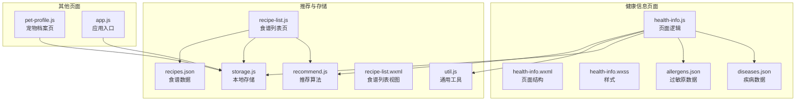
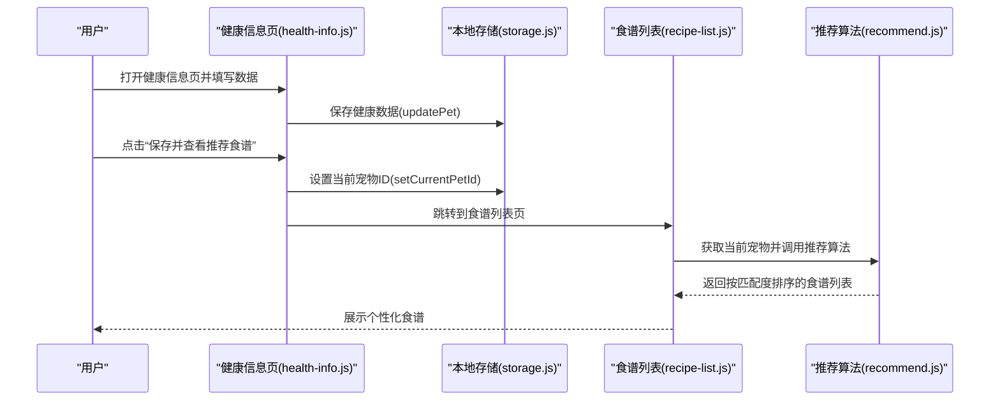
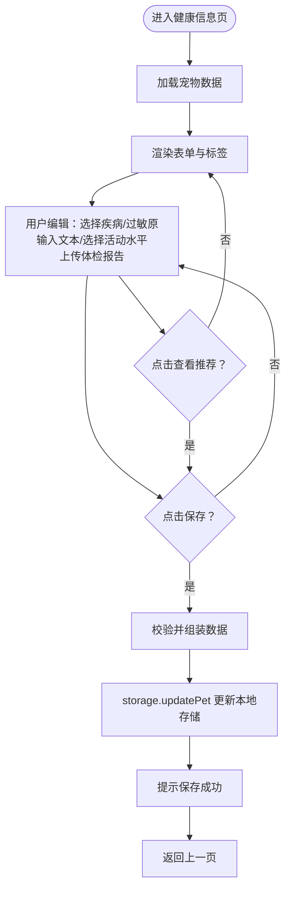
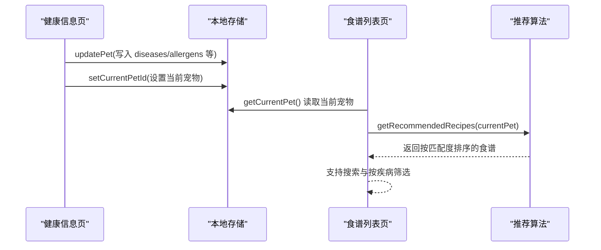
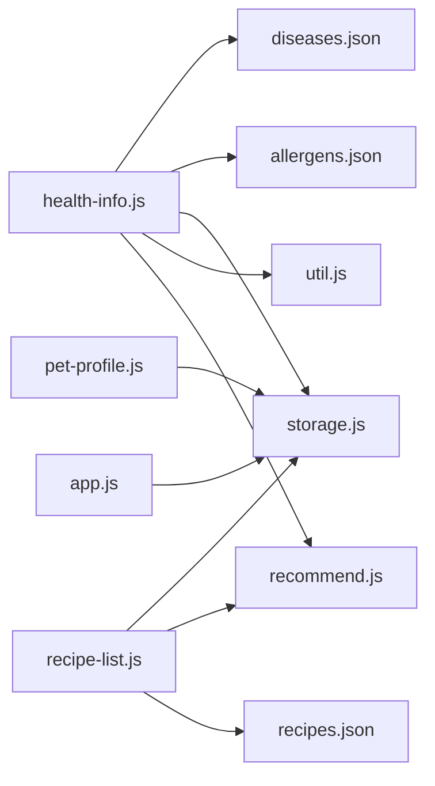

# 健康信息

<cite>
**本文引用的文件**
- [pages/health-info/health-info.js](file://pages/health-info/health-info.js)
- [pages/health-info/health-info.json](file://pages/health-info/health-info.json)
- [pages/health-info/health-info.wxml](file://pages/health-info/health-info.wxml)
- [pages/health-info/health-info.wxss](file://pages/health-info/health-info.wxss)
- [data/diseases.json](file://data/diseases.json)
- [data/allergens.json](file://data/allergens.json)
- [utils/recommend.js](file://utils/recommend.js)
- [utils/storage.js](file://utils/storage.js)
- [utils/util.js](file://utils/util.js)
- [pages/recipe-list/recipe-list.js](file://pages/recipe-list/recipe-list.js)
- [pages/recipe-list/recipe-list.wxml](file://pages/recipe-list/recipe-list.wxml)
- [pages/pet-profile/pet-profile.js](file://pages/pet-profile/pet-profile.js)
- [app.js](file://app.js)
- [data/recipes.json](file://data/recipes.json)
</cite>

## 目录
1. [简介](#简介)
2. [项目结构](#项目结构)
3. [核心组件](#核心组件)
4. [架构总览](#架构总览)
5. [详细组件分析](#详细组件分析)
6. [依赖关系分析](#依赖关系分析)
7. [性能考量](#性能考量)
8. [故障排查指南](#故障排查指南)
9. [结论](#结论)
10. [附录](#附录)

## 简介
本文件系统性地梳理“健康信息”页面的功能与实现，覆盖宠物健康档案管理（疾病记录、用药信息、活动能力、饮食偏好、过敏原、体检报告）的录入与查看；解析页面的数据结构、表单组件、交互流程与数据验证；阐述健康信息与食谱推荐系统的联动机制，并给出最佳实践、数据安全与用户体验优化建议。

## 项目结构
健康信息页面位于 pages/health-info，配套数据源在 data 目录，推荐与存储逻辑在 utils 目录，食谱列表页在 pages/recipe-list，宠物档案页在 pages/pet-profile，应用入口在 app.js。

图表来源
- [pages/health-info/health-info.js](file://pages/health-info/health-info.js#L1-L190)
- [pages/health-info/health-info.wxml](file://pages/health-info/health-info.wxml#L1-L135)
- [pages/health-info/health-info.wxss](file://pages/health-info/health-info.wxss#L1-L203)
- [data/diseases.json](file://data/diseases.json#L1-L108)
- [data/allergens.json](file://data/allergens.json#L1-L15)
- [utils/recommend.js](file://utils/recommend.js#L1-L109)
- [utils/storage.js](file://utils/storage.js#L1-L155)
- [utils/util.js](file://utils/util.js#L1-L123)
- [pages/recipe-list/recipe-list.js](file://pages/recipe-list/recipe-list.js#L1-L129)
- [pages/recipe-list/recipe-list.wxml](file://pages/recipe-list/recipe-list.wxml#L1-L112)
- [pages/pet-profile/pet-profile.js](file://pages/pet-profile/pet-profile.js#L1-L216)
- [app.js](file://app.js#L1-L21)
- [data/recipes.json](file://data/recipes.json#L1-L515)

章节来源
- [pages/health-info/health-info.js](file://pages/health-info/health-info.js#L1-L190)
- [pages/health-info/health-info.wxml](file://pages/health-info/health-info.wxml#L1-L135)
- [pages/health-info/health-info.wxss](file://pages/health-info/health-info.wxss#L1-L203)
- [data/diseases.json](file://data/diseases.json#L1-L108)
- [data/allergens.json](file://data/allergens.json#L1-L15)
- [utils/recommend.js](file://utils/recommend.js#L1-L109)
- [utils/storage.js](file://utils/storage.js#L1-L155)
- [utils/util.js](file://utils/util.js#L1-L123)
- [pages/recipe-list/recipe-list.js](file://pages/recipe-list/recipe-list.js#L1-L129)
- [pages/recipe-list/recipe-list.wxml](file://pages/recipe-list/recipe-list.wxml#L1-L112)
- [pages/pet-profile/pet-profile.js](file://pages/pet-profile/pet-profile.js#L1-L216)
- [app.js](file://app.js#L1-L21)
- [data/recipes.json](file://data/recipes.json#L1-L515)

## 核心组件
- 页面逻辑（health-info.js）：负责加载宠物数据、维护表单状态、处理用户交互（疾病/过敏原选择、活动水平、文本输入、体检报告上传/预览/删除）、保存到本地存储、触发食谱推荐跳转。
- 数据源（diseases.json、allergens.json）：提供疾病分类与过敏原枚举，支持页面渲染与保存时的名称映射。
- 本地存储（storage.js）：封装宠物数据的增删改查、当前选中宠物ID的设置与读取。
- 推荐算法（recommend.js）：根据宠物健康信息（疾病、过敏原）计算食谱匹配度，过滤并排序。
- 通用工具（util.js）：提供加载提示、Toast、防抖等通用能力。
- 食谱列表（recipe-list.js、recipe-list.wxml）：展示基于健康信息的推荐结果，支持搜索与按疾病筛选。
- 宠物档案（pet-profile.js）：创建/编辑宠物基础信息，并引导进入健康信息页。
- 应用入口（app.js）：初始化本地存储。

章节来源
- [pages/health-info/health-info.js](file://pages/health-info/health-info.js#L1-L190)
- [data/diseases.json](file://data/diseases.json#L1-L108)
- [data/allergens.json](file://data/allergens.json#L1-L15)
- [utils/storage.js](file://utils/storage.js#L1-L155)
- [utils/recommend.js](file://utils/recommend.js#L1-L109)
- [utils/util.js](file://utils/util.js#L1-L123)
- [pages/recipe-list/recipe-list.js](file://pages/recipe-list/recipe-list.js#L1-L129)
- [pages/recipe-list/recipe-list.wxml](file://pages/recipe-list/recipe-list.wxml#L1-L112)
- [pages/pet-profile/pet-profile.js](file://pages/pet-profile/pet-profile.js#L1-L216)
- [app.js](file://app.js#L1-L21)

## 架构总览
健康信息页面围绕“数据驱动 + 本地存储 + 推荐联动”的模式构建。用户在健康信息页完成健康档案录入后，系统将健康数据写入本地存储；随后在食谱列表页通过推荐算法对食谱进行匹配与排序，最终呈现给用户。

图表来源
- [pages/health-info/health-info.js](file://pages/health-info/health-info.js#L144-L188)
- [utils/storage.js](file://utils/storage.js#L86-L98)
- [utils/storage.js](file://utils/storage.js#L124-L131)
- [pages/recipe-list/recipe-list.js](file://pages/recipe-list/recipe-list.js#L30-L48)
- [utils/recommend.js](file://utils/recommend.js#L10-L66)

## 详细组件分析

### 页面数据结构与字段设计
- 健康状况（疾病）
  - 选择方式：多选标签，按类别分组展示。
  - 数据来源：diseases.json 提供 id/name/category/description/dietTips。
  - 保存策略：保存时将 id 映射为名称，便于展示；实际查询仍以 id 匹配。
- 过敏原
  - 选择方式：多选标签。
  - 数据来源：allergens.json 提供 id/name/category。
- 用药情况
  - 文本输入，支持多行。
- 活动能力
  - 单选按钮组，包含“正常/轻度受限/重度受限”，带简要说明。
- 饮食信息
  - 过敏原（多选）、口味偏好（文本）、当前饮食方式（文本）。
- 体检报告
  - 图片上传（相册/相机），最多9张；支持预览与删除。

章节来源
- [pages/health-info/health-info.js](file://pages/health-info/health-info.js#L8-L31)
- [pages/health-info/health-info.wxml](file://pages/health-info/health-info.wxml#L7-L98)
- [pages/health-info/health-info.wxml](file://pages/health-info/health-info.wxml#L100-L125)
- [data/diseases.json](file://data/diseases.json#L1-L108)
- [data/allergens.json](file://data/allergens.json#L1-L15)

### 表单组件与交互流程
- 疾病/过敏原标签切换：通过点击事件切换选中状态，更新双向绑定数据。
- 活动水平选择：通过数据集传值，切换激活态样式。
- 文本输入：统一通过 onInputChange 处理，按 data-field 写入对应字段。
- 体检报告：chooseMedia 选择图片，生成临时路径与唯一 id，支持预览与删除。
- 保存：收集表单数据，映射疾病名称，调用 storage.updatePet 并提示反馈。
- 查看推荐：先保存，再设置当前宠物 ID，延迟跳转到食谱列表页。

图表来源
- [pages/health-info/health-info.js](file://pages/health-info/health-info.js#L33-L60)
- [pages/health-info/health-info.js](file://pages/health-info/health-info.js#L62-L97)
- [pages/health-info/health-info.js](file://pages/health-info/health-info.js#L99-L105)
- [pages/health-info/health-info.js](file://pages/health-info/health-info.js#L107-L141)
- [pages/health-info/health-info.js](file://pages/health-info/health-info.js#L144-L188)

章节来源
- [pages/health-info/health-info.js](file://pages/health-info/health-info.js#L33-L188)
- [pages/health-info/health-info.wxml](file://pages/health-info/health-info.wxml#L1-L135)

### 数据验证与错误处理
- 疾病/过敏原选择：通过数组索引判断选中状态，避免重复添加/删除。
- 活动水平：通过 data-value 传递合法枚举值，避免非法状态。
- 文本输入：直接写入 data-field 对应字段，保持一致性。
- 体检报告：限制数量与类型，生成唯一 id，删除时同步更新数组。
- 保存流程：统一使用 util.showLoading 与 util.showToast，异常时捕获并提示失败。
- 推荐流程：若当前无宠物，回退到全部食谱；有宠物时按匹配度排序。

章节来源
- [pages/health-info/health-info.js](file://pages/health-info/health-info.js#L62-L97)
- [pages/health-info/health-info.js](file://pages/health-info/health-info.js#L107-L141)
- [pages/health-info/health-info.js](file://pages/health-info/health-info.js#L144-L188)
- [utils/util.js](file://utils/util.js#L72-L95)
- [utils/recommend.js](file://utils/recommend.js#L10-L66)

### 健康信息与食谱推荐的关联机制
- 推荐算法依据宠物的疾病（suitableFor）与过敏原（avoidFor）进行匹配评分：
  - 若食谱标注 avoidFor 且与宠物过敏原冲突，则直接剔除。
  - 若宠物存在疾病，匹配 suitableFor 中的疾病即加分；若宠物无疾病，通用食谱额外加分。
  - 难度为“简单”的食谱额外加分。
- 食谱列表页在 onShow 时读取当前宠物，调用推荐算法生成排序后的列表；同时支持搜索与按疾病筛选。
- 健康信息页保存后，通过 setCurrentPetId 将当前宠物 ID 写入存储，确保推荐结果与当前选中宠物一致。

图表来源
- [pages/health-info/health-info.js](file://pages/health-info/health-info.js#L144-L188)
- [utils/storage.js](file://utils/storage.js#L86-L98)
- [utils/storage.js](file://utils/storage.js#L124-L131)
- [pages/recipe-list/recipe-list.js](file://pages/recipe-list/recipe-list.js#L30-L48)
- [utils/recommend.js](file://utils/recommend.js#L10-L66)
- [data/recipes.json](file://data/recipes.json#L1-L515)

章节来源
- [utils/recommend.js](file://utils/recommend.js#L10-L66)
- [pages/recipe-list/recipe-list.js](file://pages/recipe-list/recipe-list.js#L30-L109)
- [pages/health-info/health-info.js](file://pages/health-info/health-info.js#L144-L188)
- [utils/storage.js](file://utils/storage.js#L124-L131)
- [data/recipes.json](file://data/recipes.json#L1-L515)

### 与宠物档案页的衔接
- 宠物档案页保存成功后，自动设置当前宠物 ID，并可直接跳转到健康信息页继续完善健康档案。
- 健康信息页在 onLoad 时读取 URL 参数 id，加载对应宠物的健康数据。

章节来源
- [pages/pet-profile/pet-profile.js](file://pages/pet-profile/pet-profile.js#L192-L202)
- [pages/health-info/health-info.js](file://pages/health-info/health-info.js#L33-L38)

## 依赖关系分析
- 健康信息页依赖：
  - 数据源：diseases.json、allergens.json
  - 工具：util.js（加载/提示）
  - 存储：storage.js（读写宠物数据、当前宠物 ID）
  - 推荐：recommend.js（食谱匹配）
- 食谱列表页依赖：
  - 存储：storage.js（读取当前宠物）
  - 推荐：recommend.js（获取推荐/全部食谱）
  - 数据：recipes.json（食谱清单）

图表来源
- [pages/health-info/health-info.js](file://pages/health-info/health-info.js#L1-L6)
- [pages/recipe-list/recipe-list.js](file://pages/recipe-list/recipe-list.js#L1-L5)
- [pages/pet-profile/pet-profile.js](file://pages/pet-profile/pet-profile.js#L1-L5)
- [app.js](file://app.js#L1-L21)

章节来源
- [pages/health-info/health-info.js](file://pages/health-info/health-info.js#L1-L6)
- [pages/recipe-list/recipe-list.js](file://pages/recipe-list/recipe-list.js#L1-L5)
- [pages/pet-profile/pet-profile.js](file://pages/pet-profile/pet-profile.js#L1-L5)
- [app.js](file://app.js#L1-L21)

## 性能考量
- 渲染优化
  - 疾病/过敏原标签采用分组渲染，减少 DOM 数量；活动选项使用 flex 布局，避免复杂嵌套。
  - 体检报告网格采用固定尺寸卡片，配合裁剪模式，提升滚动流畅度。
- 交互优化
  - 文本输入统一处理，避免重复绑定；图片上传限制数量与类型，降低内存压力。
- 推荐性能
  - 推荐算法对食谱进行一次遍历评分与过滤，时间复杂度 O(N)；N 为食谱总数。搜索与筛选在前端进行，建议在数据量增大时考虑服务端分页或索引优化。
- 存储性能
  - 本地存储采用一次性序列化/反序列化，建议避免频繁大对象写入；可在批量更新时合并 setData。

章节来源
- [pages/health-info/health-info.wxml](file://pages/health-info/health-info.wxml#L12-L26)
- [pages/health-info/health-info.wxml](file://pages/health-info/health-info.wxml#L142-L196)
- [utils/recommend.js](file://utils/recommend.js#L19-L66)
- [utils/storage.js](file://utils/storage.js#L31-L39)

## 故障排查指南
- 保存失败
  - 现象：点击保存后提示失败。
  - 排查：检查 storage.updatePet 是否抛出异常；确认本地存储可用；查看 util.showToast 的提示内容。
- 无法查看推荐食谱
  - 现象：点击“保存并查看推荐食谱”后未跳转或无推荐结果。
  - 排查：确认健康信息已保存；检查 setCurrentPetId 是否执行；在 recipe-list 页面确认当前宠物是否存在；检查推荐算法返回结果。
- 体检报告无法上传/删除
  - 现象：上传无响应或删除无效。
  - 排查：确认 chooseMedia 权限与回调；检查 reports 数组更新逻辑；预览时确认路径有效。
- 疾病/过敏原显示异常
  - 现象：保存后显示为 id 或未正确映射。
  - 排查：确认保存时将 id 映射为名称；推荐时使用 id 进行匹配；检查 diseases.json/allergens.json 数据完整性。

章节来源
- [pages/health-info/health-info.js](file://pages/health-info/health-info.js#L144-L188)
- [utils/util.js](file://utils/util.js#L72-L95)
- [utils/storage.js](file://utils/storage.js#L86-L98)
- [pages/recipe-list/recipe-list.js](file://pages/recipe-list/recipe-list.js#L30-L48)
- [utils/recommend.js](file://utils/recommend.js#L10-L66)

## 结论
健康信息页面通过清晰的数据结构与简洁的交互，实现了宠物健康档案的高效录入与查看；结合本地存储与推荐算法，形成了从健康数据到食谱匹配的闭环。建议在后续迭代中进一步完善数据校验、错误提示与性能优化，持续提升用户体验与系统稳定性。

## 附录

### 数据模型与字段说明
- 宠物健康档案（存储字段）
  - diseases：字符串数组（保存时为名称，查询时以 id 匹配）
  - allergens：字符串数组（过敏原 id）
  - medications：文本（用药情况）
  - activityLevel：枚举（normal/low/very_low）
  - preferences：文本（口味偏好）
  - currentDiet：文本（当前饮食方式）
  - reports：对象数组（id/path/uploadTime）
- 食谱匹配字段
  - suitableFor：适用疾病 id 数组
  - avoidFor：避免的过敏原 id 数组
  - difficulty：难度等级（简单/中等）

章节来源
- [utils/storage.js](file://utils/storage.js#L67-L77)
- [utils/storage.js](file://utils/storage.js#L86-L98)
- [data/recipes.json](file://data/recipes.json#L1-L515)
- [utils/recommend.js](file://utils/recommend.js#L10-L66)