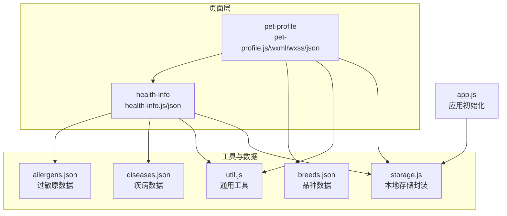
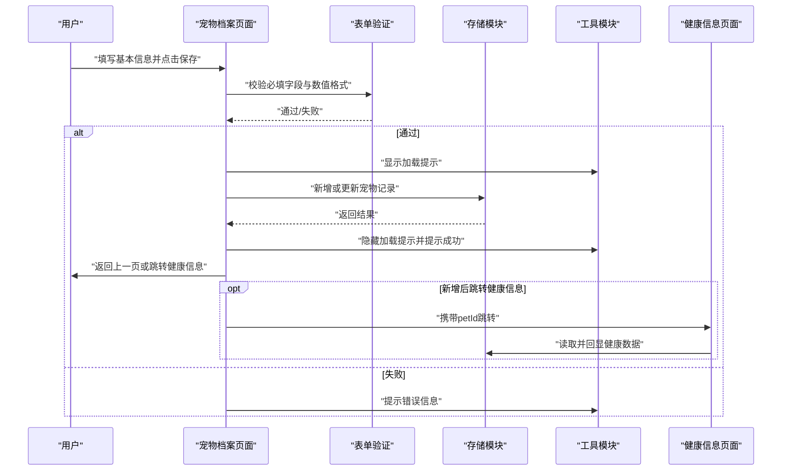
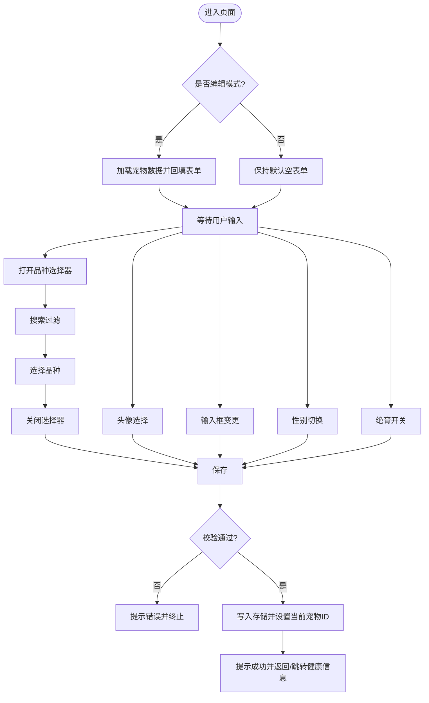
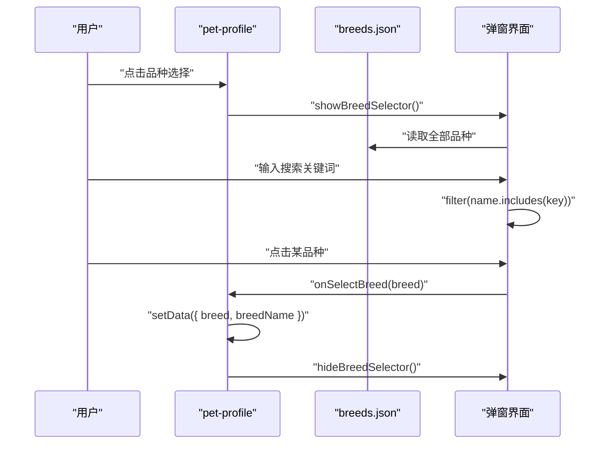
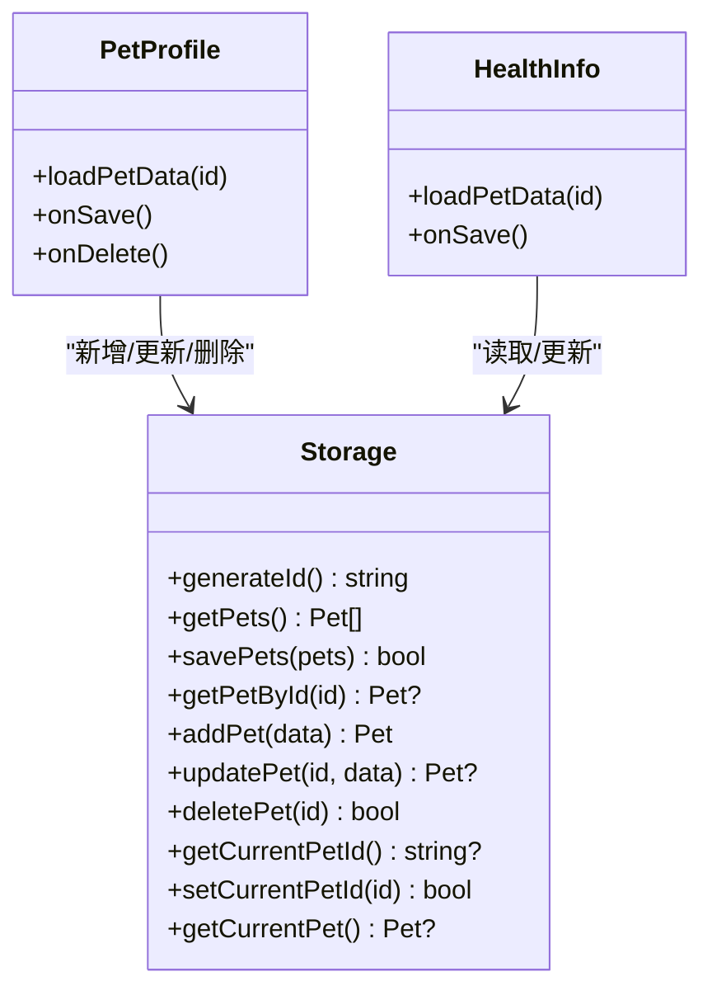
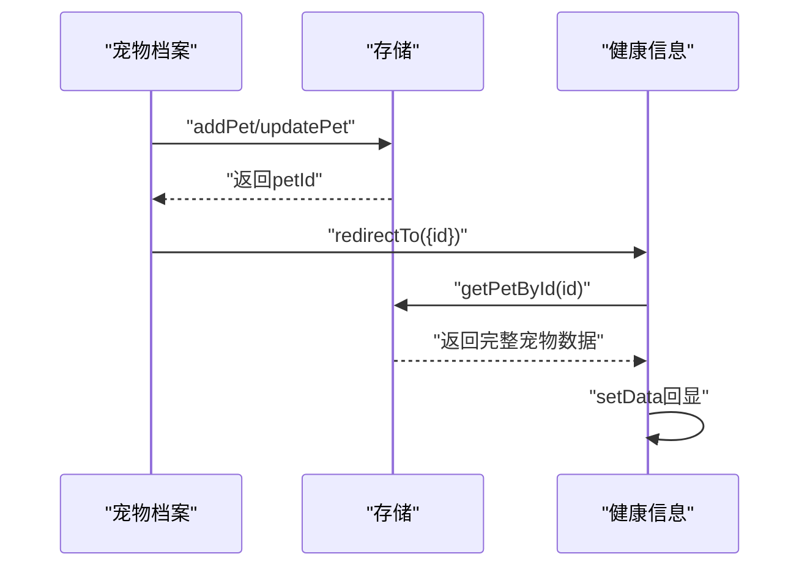
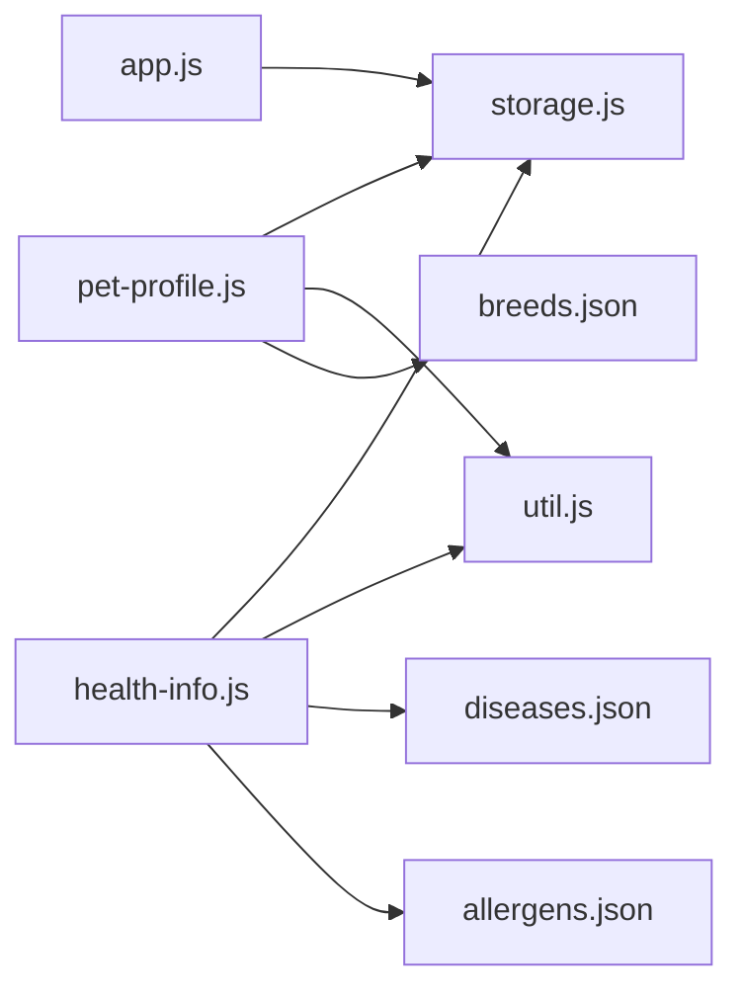

# 宠物档案

<cite>
**本文引用的文件**
- [pages/pet-profile/pet-profile.js](file://pages/pet-profile/pet-profile.js)
- [pages/pet-profile/pet-profile.json](file://pages/pet-profile/pet-profile.json)
- [pages/pet-profile/pet-profile.wxml](file://pages/pet-profile/pet-profile.wxml)
- [pages/pet-profile/pet-profile.wxss](file://pages/pet-profile/pet-profile.wxss)
- [data/breeds.json](file://data/breeds.json)
- [utils/storage.js](file://utils/storage.js)
- [utils/util.js](file://utils/util.js)
- [pages/health-info/health-info.js](file://pages/health-info/health-info.js)
- [pages/health-info/health-info.json](file://pages/health-info/health-info.json)
- [data/diseases.json](file://data/diseases.json)
- [data/allergens.json](file://data/allergens.json)
- [app.js](file://app.js)
</cite>

## 目录
1. [简介](#简介)
2. [项目结构](#项目结构)
3. [核心组件](#核心组件)
4. [架构总览](#架构总览)
5. [详细组件分析](#详细组件分析)
6. [依赖关系分析](#依赖关系分析)
7. [性能考虑](#性能考虑)
8. [故障排查指南](#故障排查指南)
9. [结论](#结论)
10. [附录](#附录)

## 简介
本文件为“宠物档案”页面的综合技术文档，覆盖宠物信息录入与管理的完整流程，包括：
- 宠物基本信息采集：姓名、品种、年龄、体重、性别、是否绝育、头像
- 品种选择器实现：搜索、筛选、尺寸标注
- 头像上传功能：相册/相机选择
- 数据绑定机制、表单验证逻辑、用户输入处理与数据持久化
- 页面与存储模块交互方式
- 与“健康信息”页面的数据关联与联动

同时提供最佳实践、用户体验优化建议与常见问题解决方案。

## 项目结构
该页面位于小程序目录 pages/pet-profile 下，配合 utils 存储与工具模块、data 数据资源，以及与健康信息页面形成完整的宠物档案闭环。

图表来源
- [pages/pet-profile/pet-profile.js](file://pages/pet-profile/pet-profile.js#L1-L216)
- [pages/health-info/health-info.js](file://pages/health-info/health-info.js#L1-L190)
- [utils/storage.js](file://utils/storage.js#L1-L155)
- [utils/util.js](file://utils/util.js#L1-L123)
- [data/breeds.json](file://data/breeds.json#L1-L35)
- [data/diseases.json](file://data/diseases.json#L1-L108)
- [data/allergens.json](file://data/allergens.json#L1-L15)
- [app.js](file://app.js#L1-L21)

章节来源
- [pages/pet-profile/pet-profile.js](file://pages/pet-profile/pet-profile.js#L1-L216)
- [pages/pet-profile/pet-profile.json](file://pages/pet-profile/pet-profile.json#L1-L5)
- [pages/pet-profile/pet-profile.wxml](file://pages/pet-profile/pet-profile.wxml#L1-L142)
- [pages/pet-profile/pet-profile.wxss](file://pages/pet-profile/pet-profile.wxss#L1-L259)
- [utils/storage.js](file://utils/storage.js#L1-L155)
- [utils/util.js](file://utils/util.js#L1-L123)
- [data/breeds.json](file://data/breeds.json#L1-L35)
- [pages/health-info/health-info.js](file://pages/health-info/health-info.js#L1-L190)
- [pages/health-info/health-info.json](file://pages/health-info/health-info.json#L1-L5)
- [data/diseases.json](file://data/diseases.json#L1-L108)
- [data/allergens.json](file://data/allergens.json#L1-L15)
- [app.js](file://app.js#L1-L21)

## 核心组件
- 宠物档案页面（pet-profile）：负责宠物基本信息录入与编辑、头像上传、品种选择、性别与绝育设置、保存与删除、跳转健康信息
- 健康信息页面（health-info）：负责疾病与过敏原选择、活动水平、用药与饮食偏好、体检报告上传与预览
- 存储模块（storage.js）：提供宠物增删改查、当前选中宠物ID管理、宠物列表持久化
- 工具模块（util.js）：提供加载/提示/确认弹窗、防抖、年龄描述、建议喂食量计算等
- 数据资源（breeds.json、diseases.json、allergens.json）：提供下拉与选择的基础数据

章节来源
- [pages/pet-profile/pet-profile.js](file://pages/pet-profile/pet-profile.js#L6-L32)
- [pages/health-info/health-info.js](file://pages/health-info/health-info.js#L7-L31)
- [utils/storage.js](file://utils/storage.js#L3-L155)
- [utils/util.js](file://utils/util.js#L1-L123)
- [data/breeds.json](file://data/breeds.json#L1-L35)
- [data/diseases.json](file://data/diseases.json#L1-L108)
- [data/allergens.json](file://data/allergens.json#L1-L15)

## 架构总览
从页面到存储的典型保存流程如下：

图表来源
- [pages/pet-profile/pet-profile.js](file://pages/pet-profile/pet-profile.js#L145-L190)
- [utils/util.js](file://utils/util.js#L72-L110)
- [utils/storage.js](file://utils/storage.js#L52-L98)
- [pages/health-info/health-info.js](file://pages/health-info/health-info.js#L33-L60)

## 详细组件分析

### 宠物档案页面（pet-profile）
- 页面状态与数据模型
  - 编辑态标识、当前宠物ID
  - 表单字段：姓名、头像、品种ID与名称、年龄、体重、性别、是否绝育
  - 品种选择器：原始列表、过滤后的列表、搜索关键字、显示/隐藏状态
  - 性别选项：公、母、未知
- 生命周期与导航
  - onLoad 根据参数判断新增/编辑，设置标题
  - 加载已有宠物数据并回填表单
- 用户交互与数据绑定
  - 头像选择：调用系统媒体选择，回填头像路径
  - 输入框变更：统一 onInputChange，按 data-field 动态更新 form 字段
  - 性别切换：onGenderChange 更新 form.gender
  - 绝育开关：onNeuteredChange 更新 form.neutered
  - 品种选择器：showBreedSelector 打开弹窗；onBreedSearch 支持模糊搜索；onSelectBreed 选定后关闭弹窗并写入 breed 与 breedName
  - 保存：onSave 执行必填与数值校验，构造最终对象，调用 storage.addPet 或 storage.updatePet，并设置当前宠物ID；成功后提示并返回或跳转健康信息
  - 删除：onDelete 弹出确认，调用 storage.deletePet 后提示并返回
- 视图结构与样式
  - 头像区域：点击更换头像；无头像时显示占位符
  - 基本信息卡片：姓名、品种、年龄、体重、性别、是否绝育
  - 操作按钮：保存、继续填写健康信息（新增时）、删除（编辑时）

图表来源
- [pages/pet-profile/pet-profile.js](file://pages/pet-profile/pet-profile.js#L34-L214)
- [pages/pet-profile/pet-profile.wxml](file://pages/pet-profile/pet-profile.wxml#L1-L142)

章节来源
- [pages/pet-profile/pet-profile.js](file://pages/pet-profile/pet-profile.js#L6-L32)
- [pages/pet-profile/pet-profile.js](file://pages/pet-profile/pet-profile.js#L34-L63)
- [pages/pet-profile/pet-profile.js](file://pages/pet-profile/pet-profile.js#L65-L101)
- [pages/pet-profile/pet-profile.js](file://pages/pet-profile/pet-profile.js#L103-L139)
- [pages/pet-profile/pet-profile.js](file://pages/pet-profile/pet-profile.js#L144-L214)
- [pages/pet-profile/pet-profile.wxml](file://pages/pet-profile/pet-profile.wxml#L1-L142)
- [pages/pet-profile/pet-profile.wxss](file://pages/pet-profile/pet-profile.wxss#L1-L259)

### 品种选择器实现
- 数据来源：data/breeds.json 提供 id、name、size
- 交互流程：
  - 打开弹窗时重置搜索关键字并展示全部品种
  - 输入框实时过滤，支持大小写不敏感匹配
  - 选择后写入 form.breed 与 form.breedName，并关闭弹窗
- 视觉反馈：选中项高亮，尺寸以中文标签展示

图表来源
- [pages/pet-profile/pet-profile.js](file://pages/pet-profile/pet-profile.js#L103-L139)
- [pages/pet-profile/pet-profile.wxml](file://pages/pet-profile/pet-profile.wxml#L110-L141)
- [data/breeds.json](file://data/breeds.json#L1-L35)

章节来源
- [pages/pet-profile/pet-profile.js](file://pages/pet-profile/pet-profile.js#L103-L139)
- [pages/pet-profile/pet-profile.wxml](file://pages/pet-profile/pet-profile.wxml#L110-L141)
- [data/breeds.json](file://data/breeds.json#L1-L35)

### 头像上传功能
- 使用系统媒体选择接口，支持相册与相机
- 成功回调后将临时文件路径写入 form.avatar
- 视图层根据是否存在头像决定显示图片或占位符

章节来源
- [pages/pet-profile/pet-profile.js](file://pages/pet-profile/pet-profile.js#L65-L78)
- [pages/pet-profile/pet-profile.wxml](file://pages/pet-profile/pet-profile.wxml#L3-L16)

### 表单验证逻辑
- 必填校验：姓名非空
- 数值校验：年龄与体重必须为有效数字
- 错误提示：通过工具模块显示 toast
- 通过后进行数据类型转换（字符串转数字），再写入存储

章节来源
- [pages/pet-profile/pet-profile.js](file://pages/pet-profile/pet-profile.js#L145-L168)
- [utils/util.js](file://utils/util.js#L89-L95)

### 数据持久化流程
- 新增：生成唯一ID，填充基础字段与健康/饮食/体检相关字段，追加至列表并保存
- 更新：按ID查找索引，合并更新字段并更新时间戳，保存列表
- 删除：过滤掉目标ID并保存
- 当前宠物ID：新增后设置当前宠物ID，便于后续健康信息页面读取

图表来源
- [utils/storage.js](file://utils/storage.js#L12-L154)
- [pages/pet-profile/pet-profile.js](file://pages/pet-profile/pet-profile.js#L47-L63)
- [pages/health-info/health-info.js](file://pages/health-info/health-info.js#L46-L60)

章节来源
- [utils/storage.js](file://utils/storage.js#L12-L154)
- [pages/pet-profile/pet-profile.js](file://pages/pet-profile/pet-profile.js#L172-L178)
- [pages/health-info/health-info.js](file://pages/health-info/health-info.js#L144-L177)

### 与健康信息页面的数据关联
- 跳转条件：仅在新增模式下提供“保存并填写健康信息”按钮
- 跳转流程：先保存宠物档案，再携带 petId 跳转健康信息页面
- 健康信息页面读取：根据 petId 从存储中读取并回显健康数据（疾病、过敏原、用药、活动水平、饮食偏好、体检报告）

图表来源
- [pages/pet-profile/pet-profile.js](file://pages/pet-profile/pet-profile.js#L192-L202)
- [pages/health-info/health-info.js](file://pages/health-info/health-info.js#L33-L60)
- [utils/storage.js](file://utils/storage.js#L44-L47)

章节来源
- [pages/pet-profile/pet-profile.js](file://pages/pet-profile/pet-profile.js#L192-L202)
- [pages/health-info/health-info.js](file://pages/health-info/health-info.js#L33-L60)
- [utils/storage.js](file://utils/storage.js#L44-L47)

## 依赖关系分析
- 页面依赖
  - pet-profile 依赖 storage、util、breeds.json
  - health-info 依赖 storage、util、diseases.json、allergens.json
- 应用初始化
  - app.js 在启动时确保 pets 列表存在，避免首次使用报错

图表来源
- [pages/pet-profile/pet-profile.js](file://pages/pet-profile/pet-profile.js#L2-L4)
- [pages/health-info/health-info.js](file://pages/health-info/health-info.js#L2-L5)
- [app.js](file://app.js#L8-L14)

章节来源
- [pages/pet-profile/pet-profile.js](file://pages/pet-profile/pet-profile.js#L2-L4)
- [pages/health-info/health-info.js](file://pages/health-info/health-info.js#L2-L5)
- [app.js](file://app.js#L8-L14)

## 性能考虑
- 数据过滤：品种搜索采用内存过滤，建议在数据量较大时引入防抖与分页
- 图片处理：头像为临时文件路径，如需上传服务器建议在保存时进行压缩与上传流程分离
- 存储策略：本地存储适合轻量数据，若宠物数量增长建议考虑分页或服务端同步
- UI渲染：性别选项与品种列表使用 wx:for 渲染，注意 key 的稳定性

## 故障排查指南
- 无法保存
  - 检查必填字段与数值格式是否满足要求
  - 查看工具模块的提示信息与异常捕获
- 品种搜索无结果
  - 确认输入关键字与品种名称大小写不敏感匹配逻辑
  - 检查 breeds.json 数据完整性
- 头像不显示
  - 确认 form.avatar 是否正确赋值
  - 检查视图层条件渲染逻辑
- 删除确认未生效
  - 确认工具模块的确认弹窗返回值
- 健康信息跳转失败
  - 确认 petId 是否存在且已设置当前宠物ID

章节来源
- [pages/pet-profile/pet-profile.js](file://pages/pet-profile/pet-profile.js#L145-L190)
- [utils/util.js](file://utils/util.js#L99-L110)
- [pages/pet-profile/pet-profile.wxml](file://pages/pet-profile/pet-profile.wxml#L3-L16)
- [pages/health-info/health-info.js](file://pages/health-info/health-info.js#L192-L202)

## 结论
宠物档案页面通过清晰的数据模型、完善的表单验证与直观的交互设计，实现了从基本信息到健康信息的完整闭环。结合本地存储与工具模块，具备良好的扩展性与维护性。建议在后续迭代中引入更健壮的错误处理、国际化与可访问性优化，以及更丰富的健康数据可视化能力。

## 附录
- 最佳实践
  - 表单字段命名与数据模型保持一致，避免深层嵌套
  - 使用统一的工具函数处理提示与确认，提升一致性
  - 对关键操作（删除、保存）增加二次确认
  - 对大数据量场景（如品种列表）引入搜索防抖与虚拟滚动
- 用户体验优化
  - 提供占位符与单位提示，减少用户理解成本
  - 保存过程中显示加载状态，避免重复提交
  - 错误提示明确具体字段，引导快速修正
- 常见问题
  - 年龄/体重为空或非数字：在前端即时校验并提示
  - 品种选择器无响应：检查事件绑定与数据源
  - 头像路径无效：确认临时文件生命周期与回显逻辑