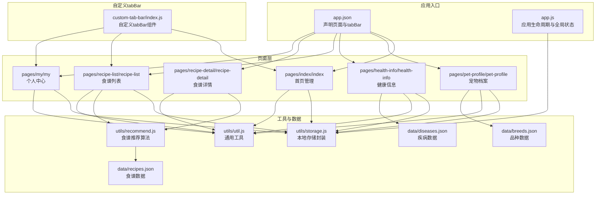
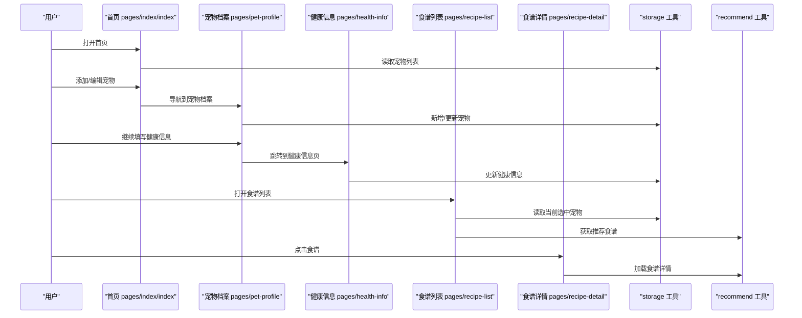
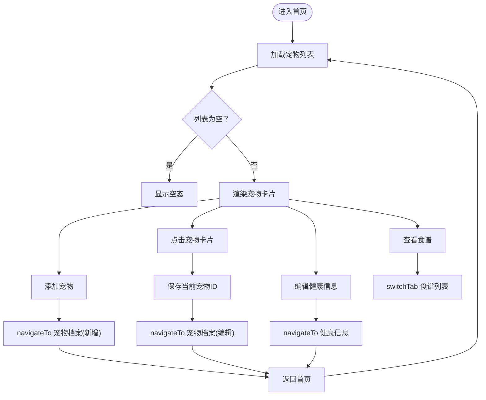
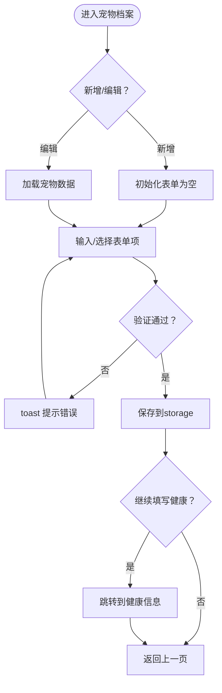
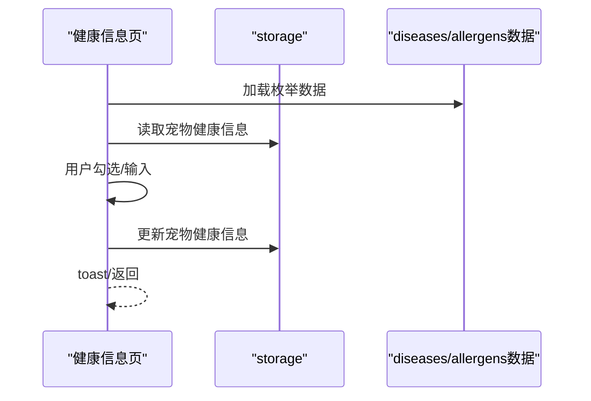
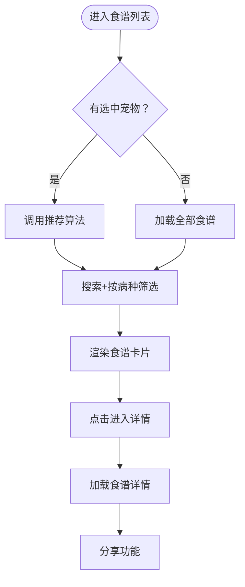
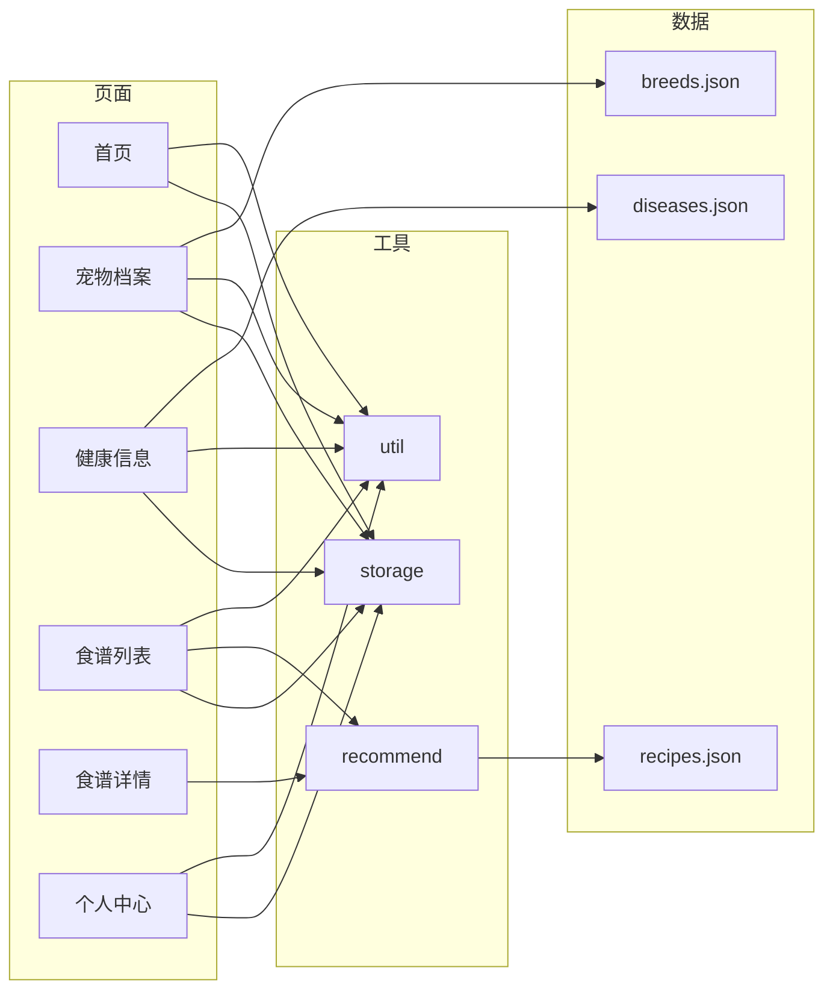

# 页面系统

<cite>
**本文引用的文件**
- [app.js](file://app.js)
- [app.json](file://app.json)
- [custom-tab-bar/index.js](file://custom-tab-bar/index.js)
- [pages/index/index.js](file://pages/index/index.js)
- [pages/my/my.js](file://pages/my/my.js)
- [pages/pet-profile/pet-profile.js](file://pages/pet-profile/pet-profile.js)
- [pages/health-info/health-info.js](file://pages/health-info/health-info.js)
- [pages/recipe-list/recipe-list.js](file://pages/recipe-list/recipe-list.js)
- [pages/recipe-detail/recipe-detail.js](file://pages/recipe-detail/recipe-detail.js)
- [utils/storage.js](file://utils/storage.js)
- [utils/util.js](file://utils/util.js)
- [utils/recommend.js](file://utils/recommend.js)
- [data/recipes.json](file://data/recipes.json)
- [data/breeds.json](file://data/breeds.json)
- [data/diseases.json](file://data/diseases.json)
</cite>

## 目录
1. [简介](#简介)
2. [项目结构](#项目结构)
3. [核心组件](#核心组件)
4. [架构总览](#架构总览)
5. [详细组件分析](#详细组件分析)
6. [依赖分析](#依赖分析)
7. [性能考虑](#性能考虑)
8. [故障排查指南](#故障排查指南)
9. [结论](#结论)
10. [附录](#附录)

## 简介
本文件系统性梳理 Old-baby 小程序的页面体系与路由机制，覆盖首页管理、宠物档案、健康信息、食谱系统、个人中心等核心页面，解释页面功能定位、业务流程、数据传递与状态管理，并给出开发最佳实践与性能优化建议。读者无需深厚的前端背景，亦可通过图示与分层说明快速理解整体架构。

## 项目结构
Old-baby 采用微信小程序标准目录组织，页面按功能分层放置于 pages 下，公共工具与数据资源位于 utils 与 data 目录，应用级配置集中在 app.json 与 app.js 中。自定义 tabBar 组件独立封装，提供跨页面的统一导航体验。

图表来源
- [app.json](file://app.json#L1-L41)
- [app.js](file://app.js#L1-L21)
- [custom-tab-bar/index.js](file://custom-tab-bar/index.js#L1-L32)
- [pages/index/index.js](file://pages/index/index.js#L1-L80)
- [pages/pet-profile/pet-profile.js](file://pages/pet-profile/pet-profile.js#L1-L216)
- [pages/health-info/health-info.js](file://pages/health-info/health-info.js#L1-L190)
- [pages/recipe-list/recipe-list.js](file://pages/recipe-list/recipe-list.js#L1-L129)
- [pages/recipe-detail/recipe-detail.js](file://pages/recipe-detail/recipe-detail.js#L1-L43)
- [pages/my/my.js](file://pages/my/my.js#L1-L113)
- [utils/storage.js](file://utils/storage.js#L1-L155)
- [utils/util.js](file://utils/util.js#L1-L123)
- [utils/recommend.js](file://utils/recommend.js#L1-L109)
- [data/recipes.json](file://data/recipes.json#L1-L515)
- [data/breeds.json](file://data/breeds.json#L1-L35)
- [data/diseases.json](file://data/diseases.json#L1-L108)

章节来源
- [app.json](file://app.json#L1-L41)
- [app.js](file://app.js#L1-L21)

## 核心组件
- 应用级配置与生命周期
  - app.json 声明页面与 tabBar，定义导航栏样式与全局样式风格。
  - app.js 在启动时初始化本地存储，确保宠物数据键存在。
- 自定义 tabBar
  - 自定义组件封装 tabBar 列表、选中态切换与跳转逻辑，提升用户体验一致性。
- 工具模块
  - storage：统一的本地存储读写、宠物增删改查、当前选中宠物 ID 管理。
  - util：通用 UI 提示、防抖、时间格式化、年龄描述与喂食量估算等。
  - recommend：基于宠物健康信息的食谱推荐与筛选算法。

章节来源
- [app.json](file://app.json#L1-L41)
- [app.js](file://app.js#L1-L21)
- [custom-tab-bar/index.js](file://custom-tab-bar/index.js#L1-L32)
- [utils/storage.js](file://utils/storage.js#L1-L155)
- [utils/util.js](file://utils/util.js#L1-L123)
- [utils/recommend.js](file://utils/recommend.js#L1-L109)

## 架构总览
页面系统围绕“宠物为中心”的数据流展开：首页负责宠物的增删改与健康入口；宠物档案完善基础与品种信息；健康信息收集疾病、过敏、活动水平等；食谱系统根据健康信息进行个性化推荐；个人中心提供用户信息与系统管理。

图表来源
- [pages/index/index.js](file://pages/index/index.js#L1-L80)
- [pages/pet-profile/pet-profile.js](file://pages/pet-profile/pet-profile.js#L1-L216)
- [pages/health-info/health-info.js](file://pages/health-info/health-info.js#L1-L190)
- [pages/recipe-list/recipe-list.js](file://pages/recipe-list/recipe-list.js#L1-L129)
- [pages/recipe-detail/recipe-detail.js](file://pages/recipe-detail/recipe-detail.js#L1-L43)
- [utils/storage.js](file://utils/storage.js#L1-L155)
- [utils/recommend.js](file://utils/recommend.js#L1-L109)

## 详细组件分析

### 首页管理（pages/index/index）
- 功能定位
  - 展示宠物列表，支持添加、查看、编辑、删除宠物；跳转到健康信息与食谱推荐。
- 数据与状态
  - 通过 storage 读取宠物列表，维护空态标识；通过 storage.setCurrentPetId 临时标记当前选中宠物。
- 导航关系
  - 添加宠物：navigateTo 宠物档案（新增模式）。
  - 选择宠物：navigateTo 宠物档案（编辑模式），并传入 id。
  - 查看食谱：switchTab 到食谱列表。
  - 编辑健康：navigateTo 健康信息页。
  - 删除宠物：二次确认后删除并刷新列表。
- 生命周期与事件
  - onLoad 加载宠物；onShow 在每次展示时刷新数据并同步 tabBar 选中态。
- 交互与提示
  - 使用 util 的 toast 与 confirm 提示与确认。

图表来源
- [pages/index/index.js](file://pages/index/index.js#L1-L80)
- [utils/storage.js](file://utils/storage.js#L1-L155)
- [utils/util.js](file://utils/util.js#L1-L123)

章节来源
- [pages/index/index.js](file://pages/index/index.js#L1-L80)
- [utils/storage.js](file://utils/storage.js#L1-L155)
- [utils/util.js](file://utils/util.js#L1-L123)

### 宠物档案（pages/pet-profile/pet-profile）
- 功能定位
  - 完善宠物基本信息（姓名、头像、品种、年龄、体重、性别、是否绝育），支持保存、继续填写健康信息、删除宠物。
- 数据与状态
  - 从 breeds.json 加载品种列表，支持搜索过滤；表单数据集中管理；支持头像选择与预览。
- 业务流程
  - 新增：校验必填项，保存后设置当前宠物 ID 并返回。
  - 编辑：加载已有数据，更新后返回。
  - 继续健康：保存后自动跳转健康信息页。
- 交互与提示
  - 使用 util 的 loading、toast、confirm；wx.chooseMedia 选择头像。

图表来源
- [pages/pet-profile/pet-profile.js](file://pages/pet-profile/pet-profile.js#L1-L216)
- [data/breeds.json](file://data/breeds.json#L1-L35)
- [utils/util.js](file://utils/util.js#L1-L123)
- [utils/storage.js](file://utils/storage.js#L1-L155)

章节来源
- [pages/pet-profile/pet-profile.js](file://pages/pet-profile/pet-profile.js#L1-L216)
- [data/breeds.json](file://data/breeds.json#L1-L35)
- [utils/util.js](file://utils/util.js#L1-L123)
- [utils/storage.js](file://utils/storage.js#L1-L155)

### 健康信息（pages/health-info/health-info）
- 功能定位
  - 收集宠物健康信息（疾病、过敏原、用药、活动水平、偏好、当前饮食、体检报告）并保存。
- 数据与状态
  - 从 diseases.json 与 allergens.json 加载枚举数据；支持多选与图片上传；支持预览与删除报告。
- 业务流程
  - 加载宠物健康数据；保存时合并为最终更新数据；保存后可直接跳转食谱列表。
- 交互与提示
  - 图片上传与预览；保存前后提示与延迟返回。

图表来源
- [pages/health-info/health-info.js](file://pages/health-info/health-info.js#L1-L190)
- [data/diseases.json](file://data/diseases.json#L1-L108)
- [utils/storage.js](file://utils/storage.js#L1-L155)

章节来源
- [pages/health-info/health-info.js](file://pages/health-info/health-info.js#L1-L190)
- [data/diseases.json](file://data/diseases.json#L1-L108)
- [utils/storage.js](file://utils/storage.js#L1-L155)

### 食谱系统（pages/recipe-list / pages/recipe-detail）
- 食谱列表（recipe-list）
  - 根据当前选中宠物进行个性化推荐；支持搜索与按疾病筛选；点击进入详情。
- 食谱详情（recipe-detail）
  - 展示食材、做法、营养与注意事项；支持标签切换与分享。
- 推荐算法（utils/recommend）
  - 结合宠物过敏原与疾病匹配度评分，过滤高风险食谱并排序；提供搜索与按病种筛选能力。

图表来源
- [pages/recipe-list/recipe-list.js](file://pages/recipe-list/recipe-list.js#L1-L129)
- [pages/recipe-detail/recipe-detail.js](file://pages/recipe-detail/recipe-detail.js#L1-L43)
- [utils/recommend.js](file://utils/recommend.js#L1-L109)
- [data/recipes.json](file://data/recipes.json#L1-L515)

章节来源
- [pages/recipe-list/recipe-list.js](file://pages/recipe-list/recipe-list.js#L1-L129)
- [pages/recipe-detail/recipe-detail.js](file://pages/recipe-detail/recipe-detail.js#L1-L43)
- [utils/recommend.js](file://utils/recommend.js#L1-L109)
- [data/recipes.json](file://data/recipes.json#L1-L515)

### 个人中心（pages/my/my）
- 功能定位
  - 展示用户信息与宠物数量；提供管理宠物、关于我们、意见反馈、清除缓存与分享能力。
- 数据与状态
  - 从本地存储读取用户信息；清除缓存时清空所有数据并重置界面状态。
- 交互与提示
  - 头像与昵称输入回调；二次确认清除缓存；分享回调。

章节来源
- [pages/my/my.js](file://pages/my/my.js#L1-L113)
- [utils/util.js](file://utils/util.js#L1-L123)
- [utils/storage.js](file://utils/storage.js#L1-L155)

## 依赖分析
- 页面到工具模块
  - 所有页面均依赖 storage 与 util；食谱列表与详情依赖 recommend；健康信息依赖疾病与过敏枚举数据；宠物档案依赖品种数据。
- 自定义组件与页面
  - 自定义 tabBar 与首页、食谱列表、个人中心联动，负责切换与选中态同步。
- 配置与入口
  - app.json 决定页面注册顺序与 tabBar 列表；app.js 负责应用启动初始化。

图表来源
- [pages/index/index.js](file://pages/index/index.js#L1-L80)
- [pages/pet-profile/pet-profile.js](file://pages/pet-profile/pet-profile.js#L1-L216)
- [pages/health-info/health-info.js](file://pages/health-info/health-info.js#L1-L190)
- [pages/recipe-list/recipe-list.js](file://pages/recipe-list/recipe-list.js#L1-L129)
- [pages/recipe-detail/recipe-detail.js](file://pages/recipe-detail/recipe-detail.js#L1-L43)
- [pages/my/my.js](file://pages/my/my.js#L1-L113)
- [utils/storage.js](file://utils/storage.js#L1-L155)
- [utils/util.js](file://utils/util.js#L1-L123)
- [utils/recommend.js](file://utils/recommend.js#L1-L109)
- [data/recipes.json](file://data/recipes.json#L1-L515)
- [data/breeds.json](file://data/breeds.json#L1-L35)
- [data/diseases.json](file://data/diseases.json#L1-L108)

章节来源
- [app.json](file://app.json#L1-L41)
- [custom-tab-bar/index.js](file://custom-tab-bar/index.js#L1-L32)

## 性能考虑
- 数据加载与渲染
  - 首页与食谱列表在 onShow 中刷新，避免长时间驻留导致数据陈旧；合理使用 setData，减少不必要的重渲染。
- 存储访问
  - storage 对外封装了增删改查与当前宠物 ID 管理，建议在高频操作中合并多次 setData，降低存储写入次数。
- 推荐算法
  - 食谱推荐在内存中进行过滤与排序，建议在数据量增长时考虑分页或懒加载策略。
- 图片处理
  - 健康报告图片上传与预览，建议限制最大数量与尺寸，避免内存压力。
- UI 提示
  - 使用 util 的 loading 与 toast，避免频繁弹窗造成阻塞；必要时使用防抖函数降低重复请求。

## 故障排查指南
- 页面无法切换到 tabBar
  - 确认 app.json 中 tabBar 列表与页面路径一致；自定义 tabBar 组件 switchTab 调用的 url 必须与 tabBar 配置一致。
- 宠物数据丢失或异常
  - 检查 storage 初始化逻辑与键名；确认增删改操作后的保存成功与列表刷新。
- 健康信息保存失败
  - 捕获异常并隐藏 loading，提示用户重试；检查网络与权限（如图片上传）。
- 食谱推荐结果异常
  - 核对宠物过敏原与疾病字段是否正确；检查 recipes.json 中 avoidFor 与 suitableFor 字段。
- 自定义 tabBar 不生效
  - 确认 custom 为 true；检查 list 中 pagePath 与实际页面路径一致；确保在页面 onShow 中设置选中态。

章节来源
- [app.json](file://app.json#L17-L37)
- [custom-tab-bar/index.js](file://custom-tab-bar/index.js#L1-L32)
- [utils/storage.js](file://utils/storage.js#L1-L155)
- [utils/util.js](file://utils/util.js#L1-L123)
- [utils/recommend.js](file://utils/recommend.js#L1-L109)

## 结论
Old-baby 页面系统以“宠物为中心”的数据流串联起首页、档案、健康、食谱与个人中心五大模块，结合自定义 tabBar 与工具模块，形成清晰的职责边界与稳定的交互体验。通过合理的数据封装与推荐算法，系统能够为老年犬主提供个性化的食谱与健康管理支持。后续可在性能与可维护性方面持续优化，例如引入分页、缓存策略与单元测试。

## 附录
- 页面生命周期与事件处理要点
  - 首页与食谱列表在 onShow 中刷新数据并同步 tabBar 选中态。
  - 宠物档案与健康信息在保存前后使用 util 提示，确保用户感知。
  - 个人中心提供清除缓存与分享回调，保障数据安全与传播。
- 最佳实践
  - 将 UI 提示与业务逻辑解耦，统一通过 util 管理。
  - 对高频存储写入进行合并与节流，避免阻塞主线程。
  - 在推荐算法中预留扩展点，支持更多维度的匹配规则。