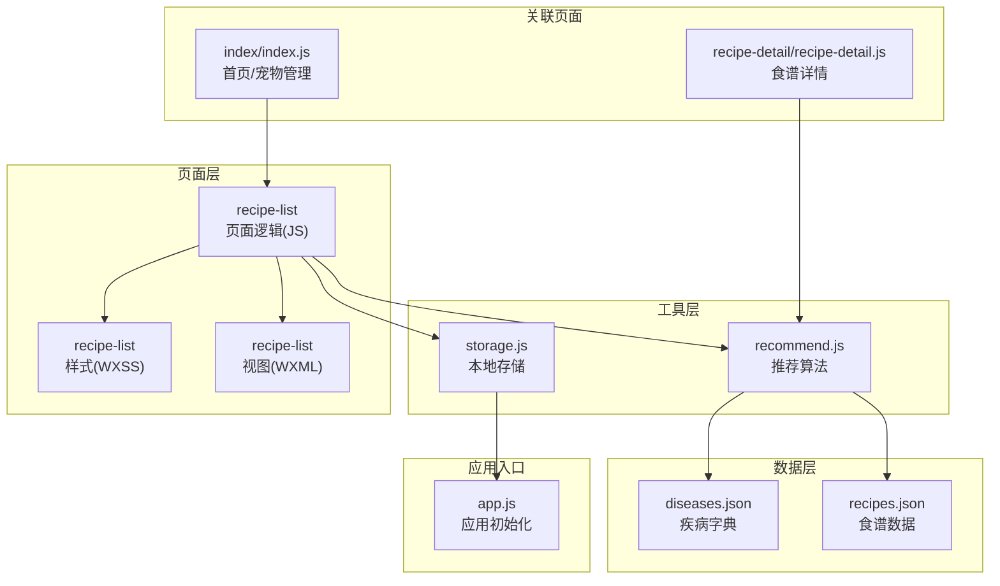
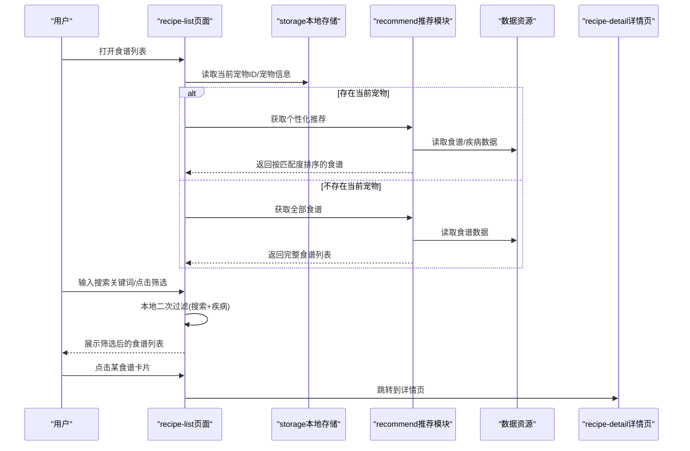
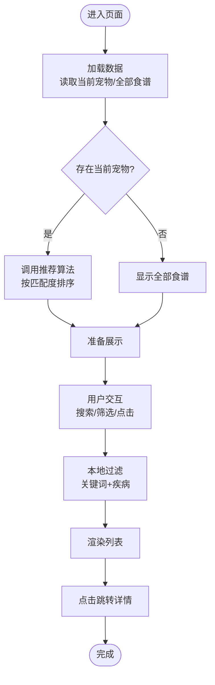
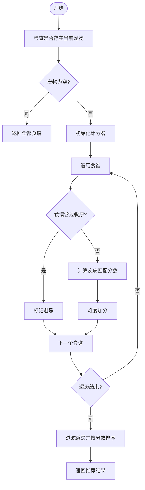
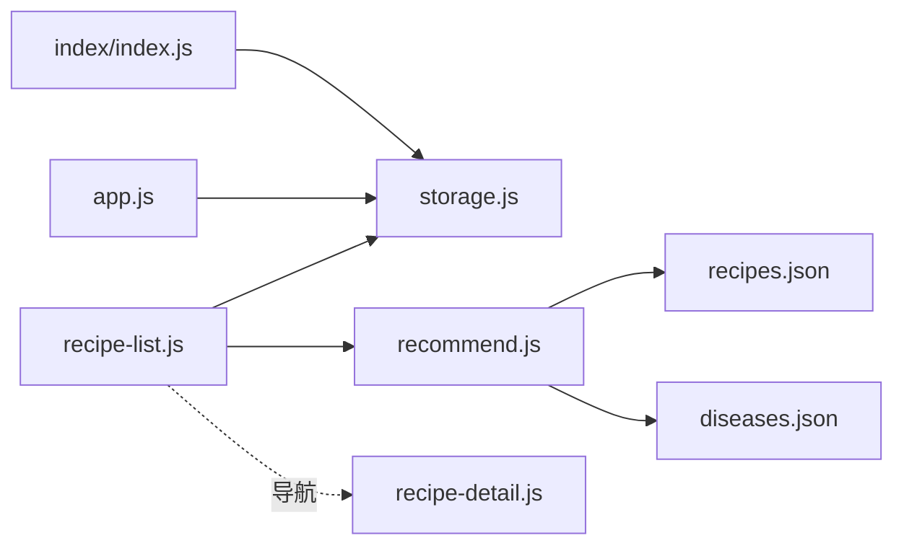

# 食谱列表

<cite>
**本文引用的文件**
- [pages/recipe-list/recipe-list.js](file://pages/recipe-list/recipe-list.js)
- [pages/recipe-list/recipe-list.json](file://pages/recipe-list/recipe-list.json)
- [pages/recipe-list/recipe-list.wxml](file://pages/recipe-list/recipe-list.wxml)
- [pages/recipe-list/recipe-list.wxss](file://pages/recipe-list/recipe-list.wxss)
- [utils/recommend.js](file://utils/recommend.js)
- [utils/storage.js](file://utils/storage.js)
- [data/recipes.json](file://data/recipes.json)
- [data/diseases.json](file://data/diseases.json)
- [pages/recipe-detail/recipe-detail.js](file://pages/recipe-detail/recipe-detail.js)
- [pages/index/index.js](file://pages/index/index.js)
- [app.js](file://app.js)
</cite>

## 目录
1. [简介](#简介)
2. [项目结构](#项目结构)
3. [核心组件](#核心组件)
4. [架构总览](#架构总览)
5. [详细组件分析](#详细组件分析)
6. [依赖关系分析](#依赖关系分析)
7. [性能考虑](#性能考虑)
8. [故障排查指南](#故障排查指南)
9. [结论](#结论)
10. [附录](#附录)

## 简介
本文件面向“食谱列表”页面，系统性梳理智能食谱推荐系统的设计与实现，覆盖推荐算法、搜索与筛选、数据获取机制、用户交互与页面性能优化，并给出扩展开发指南。该页面支持：
- 基于宠物健康档案的个性化食谱推荐
- 关键词搜索与按疾病类型筛选
- 食谱详情跳转与收藏分享能力
- 响应式布局与流畅交互体验

## 项目结构
食谱列表页面位于 pages/recipe-list，采用经典的 MVVM 架构：WXML 描述视图、WXSS 样式、JS 页面逻辑，配合工具模块与数据资源文件。

图表来源
- [pages/recipe-list/recipe-list.js](file://pages/recipe-list/recipe-list.js#L1-L129)
- [pages/recipe-list/recipe-list.wxml](file://pages/recipe-list/recipe-list.wxml#L1-L112)
- [pages/recipe-list/recipe-list.wxss](file://pages/recipe-list/recipe-list.wxss#L1-L322)
- [utils/recommend.js](file://utils/recommend.js#L1-L109)
- [utils/storage.js](file://utils/storage.js#L1-L155)
- [data/recipes.json](file://data/recipes.json#L1-L515)
- [data/diseases.json](file://data/diseases.json#L1-L108)
- [pages/index/index.js](file://pages/index/index.js#L1-L80)
- [pages/recipe-detail/recipe-detail.js](file://pages/recipe-detail/recipe-detail.js#L1-L43)
- [app.js](file://app.js#L1-L21)

章节来源
- [pages/recipe-list/recipe-list.js](file://pages/recipe-list/recipe-list.js#L1-L129)
- [pages/recipe-list/recipe-list.json](file://pages/recipe-list/recipe-list.json#L1-L5)
- [pages/recipe-list/recipe-list.wxml](file://pages/recipe-list/recipe-list.wxml#L1-L112)
- [pages/recipe-list/recipe-list.wxss](file://pages/recipe-list/recipe-list.wxss#L1-L322)
- [utils/recommend.js](file://utils/recommend.js#L1-L109)
- [utils/storage.js](file://utils/storage.js#L1-L155)
- [data/recipes.json](file://data/recipes.json#L1-L515)
- [data/diseases.json](file://data/diseases.json#L1-L108)
- [pages/index/index.js](file://pages/index/index.js#L1-L80)
- [pages/recipe-detail/recipe-detail.js](file://pages/recipe-detail/recipe-detail.js#L1-L43)
- [app.js](file://app.js#L1-L21)

## 核心组件
- 页面控制器：负责数据加载、筛选、交互事件处理与导航跳转。
- 推荐算法模块：基于宠物健康档案计算食谱匹配度，输出排序后的推荐结果。
- 本地存储模块：封装宠物信息、当前选中宠物ID等本地持久化读写。
- 数据资源：食谱清单与疾病字典，支撑推荐与筛选逻辑。
- 视图与样式：响应式卡片布局、筛选弹窗、空状态提示与交互反馈。

章节来源
- [pages/recipe-list/recipe-list.js](file://pages/recipe-list/recipe-list.js#L6-L129)
- [utils/recommend.js](file://utils/recommend.js#L10-L109)
- [utils/storage.js](file://utils/storage.js#L112-L140)
- [data/recipes.json](file://data/recipes.json#L1-L515)
- [data/diseases.json](file://data/diseases.json#L1-L108)
- [pages/recipe-list/recipe-list.wxml](file://pages/recipe-list/recipe-list.wxml#L1-L112)
- [pages/recipe-list/recipe-list.wxss](file://pages/recipe-list/recipe-list.wxss#L1-L322)

## 架构总览
页面从本地存储读取当前选中的宠物信息，决定是否启用个性化推荐；随后通过推荐模块获取食谱列表，再结合搜索与筛选进行二次过滤，最终渲染到视图层。点击食谱卡片跳转至详情页，支持分享与收藏占位。

图表来源
- [pages/recipe-list/recipe-list.js](file://pages/recipe-list/recipe-list.js#L30-L109)
- [utils/storage.js](file://utils/storage.js#L135-L140)
- [utils/recommend.js](file://utils/recommend.js#L10-L100)
- [pages/recipe-detail/recipe-detail.js](file://pages/recipe-detail/recipe-detail.js#L10-L18)

## 详细组件分析

### 页面控制器（recipe-list）
职责与流程
- 生命周期：onLoad 加载数据；onShow 在每次显示时刷新数据并同步 TabBar 选中状态。
- 数据加载：优先读取当前宠物，若存在则调用推荐算法；否则返回全部食谱。
- 交互处理：搜索输入实时过滤；切换筛选面板；按疾病筛选；清除筛选；点击食谱跳转详情；切换宠物。
- 性能优化：本地过滤，避免重复网络请求；仅在必要时重新计算推荐。

关键方法与逻辑
- loadData：根据是否存在当前宠物决定推荐策略。
- onSearch：输入框变更时更新搜索关键字并执行本地过滤。
- filterRecipes：按搜索关键词与疾病筛选条件二次过滤。
- onFilterByDisease：切换疾病筛选项并自动关闭筛选面板。
- onRecipeTap：根据食谱ID跳转详情页。
- clearFilter：清空筛选条件并回滚到初始数据状态。
- onChangePet：跳转首页选择/切换宠物。

图表来源
- [pages/recipe-list/recipe-list.js](file://pages/recipe-list/recipe-list.js#L30-L109)

章节来源
- [pages/recipe-list/recipe-list.js](file://pages/recipe-list/recipe-list.js#L6-L129)

### 推荐算法模块（recommend）
算法原理
- 输入：当前宠物的疾病列表与过敏原列表。
- 计分规则：
  - 若食谱包含宠物过敏原，则直接标记为避忌，不参与评分。
  - 若宠物有疾病，统计食谱适合的疾病数量，每匹配一项加固定分数。
  - 若宠物无疾病且食谱适合人群为“健康”，额外加分以提升通用食谱优先级。
  - 难度为“简单”的食谱额外加分，提高可操作性。
- 输出：过滤避忌后按分数降序排列的食谱列表，并附带匹配的疾病列表与避忌标记。

图表来源
- [utils/recommend.js](file://utils/recommend.js#L10-L66)

章节来源
- [utils/recommend.js](file://utils/recommend.js#L1-L109)
- [data/recipes.json](file://data/recipes.json#L1-L515)
- [data/diseases.json](file://data/diseases.json#L1-L108)

### 本地存储模块（storage）
职责
- 封装宠物列表、当前宠物ID的读写，提供生成唯一ID、增删改查等能力。
- 应用启动时确保宠物数据存在，避免空值导致的异常。

关键点
- 当前宠物ID作为个性化推荐的触发条件。
- 提供宠物信息的增删改查，支持后续扩展健康档案编辑。

章节来源
- [utils/storage.js](file://utils/storage.js#L1-L155)
- [app.js](file://app.js#L8-L14)

### 视图与交互（recipe-list.wxml/wxss）
视图结构
- 宠物横幅：显示当前宠物头像与名称，未选择宠物时引导跳转。
- 搜索栏：输入框绑定输入事件，右侧筛选按钮支持激活态样式。
- 筛选标签：显示当前筛选的疾病名称，支持一键清除。
- 食谱卡片：包含图片占位、标题、描述、准备时间与难度、匹配标签等。
- 空状态：当筛选结果为空时提示并提供清除筛选按钮。
- 筛选弹窗：右侧滑出式面板，滚动展示疾病列表，支持勾选与关闭。

样式要点
- 使用变量色值与阴影，营造卡片式布局与层次感。
- 弹窗采用透明遮罩与平滑过渡动画，提升交互体验。
- 文本截断与弹性布局适配不同屏幕尺寸。

章节来源
- [pages/recipe-list/recipe-list.wxml](file://pages/recipe-list/recipe-list.wxml#L1-L112)
- [pages/recipe-list/recipe-list.wxss](file://pages/recipe-list/recipe-list.wxss#L1-L322)

### 详情页联动（recipe-detail）
- 通过 URL 参数获取食谱ID，调用推荐模块查询详情并设置导航标题。
- 提供标签切换、分享与收藏占位功能，便于后续扩展。

章节来源
- [pages/recipe-detail/recipe-detail.js](file://pages/recipe-detail/recipe-detail.js#L1-L43)
- [utils/recommend.js](file://utils/recommend.js#L78-L80)

## 依赖关系分析
- 页面依赖本地存储模块以获取当前宠物信息，决定是否启用个性化推荐。
- 推荐模块依赖数据资源文件（食谱与疾病字典）进行评分与筛选。
- 页面与详情页通过 ID 参数建立跳转关系。
- 首页负责设置当前宠物ID并触发页面跳转。

图表来源
- [pages/recipe-list/recipe-list.js](file://pages/recipe-list/recipe-list.js#L2-L4)
- [utils/recommend.js](file://utils/recommend.js#L3)
- [utils/storage.js](file://utils/storage.js#L1-L155)
- [pages/recipe-detail/recipe-detail.js](file://pages/recipe-detail/recipe-detail.js#L2)
- [pages/index/index.js](file://pages/index/index.js#L2-L3)
- [app.js](file://app.js#L8-L14)

章节来源
- [pages/recipe-list/recipe-list.js](file://pages/recipe-list/recipe-list.js#L1-L129)
- [utils/recommend.js](file://utils/recommend.js#L1-L109)
- [utils/storage.js](file://utils/storage.js#L1-L155)
- [pages/recipe-detail/recipe-detail.js](file://pages/recipe-detail/recipe-detail.js#L1-L43)
- [pages/index/index.js](file://pages/index/index.js#L1-L80)
- [app.js](file://app.js#L1-L21)

## 性能考虑
- 本地过滤优先：搜索与筛选均在前端完成，减少网络请求与服务器压力。
- 推荐计算范围可控：仅针对当前宠物或全部食谱进行评分与排序，避免不必要的大数据集处理。
- 图片懒加载与占位符：视图层提供占位符，避免首屏闪烁与布局抖动。
- 动画与交互：弹窗滑入动画与按钮激活态使用轻量过渡，保证流畅体验。
- 可扩展优化建议：
  - 对搜索关键词做防抖处理，降低频繁过滤带来的重排成本。
  - 对长列表使用虚拟滚动或分页加载，减少一次性渲染压力。
  - 将推荐结果缓存到内存，避免重复计算；在宠物信息变更时失效缓存。
  - 对图片资源进行压缩与懒加载，提升首屏渲染速度。

[本节为通用性能建议，无需特定文件引用]

## 故障排查指南
- 无法显示个性化推荐
  - 检查当前宠物ID是否正确设置；确认本地存储中存在有效宠物数据。
  - 章节来源
    - [utils/storage.js](file://utils/storage.js#L135-L140)
    - [pages/index/index.js](file://pages/index/index.js#L49-L56)
- 筛选无效或结果异常
  - 确认筛选面板开关状态与疾病ID是否正确传递；检查 filterRecipes 的过滤逻辑。
  - 章节来源
    - [pages/recipe-list/recipe-list.js](file://pages/recipe-list/recipe-list.js#L58-L109)
- 搜索无结果
  - 检查搜索关键词大小写转换与字段匹配逻辑；确认 recipes 数据完整性。
  - 章节来源
    - [utils/recommend.js](file://utils/recommend.js#L92-L100)
- 图片不显示
  - 检查图片路径与占位符逻辑；确认资源路径正确。
  - 章节来源
    - [pages/recipe-list/recipe-list.wxml](file://pages/recipe-list/recipe-list.wxml#L54-L62)
- 切换宠物后推荐未更新
  - 确保 onShow 中重新调用 loadData；检查 TabBar 设置逻辑。
  - 章节来源
    - [pages/recipe-list/recipe-list.js](file://pages/recipe-list/recipe-list.js#L21-L28)

## 结论
食谱列表页面通过“本地存储 + 推荐算法 + 本地过滤”的组合，实现了快速、可扩展的个性化食谱推荐体验。其核心优势在于：
- 以宠物健康档案为依据的智能评分与排序
- 本地化的搜索与筛选，响应迅速
- 清晰的视图与交互设计，易于扩展与维护

未来可在缓存策略、搜索防抖、虚拟滚动等方面进一步优化，以应对更大规模数据与更复杂的交互场景。

[本节为总结性内容，无需特定文件引用]

## 附录

### 数据模型与字段说明
- 食谱字段
  - id：唯一标识
  - name：名称
  - description：描述
  - suitableFor：适合的疾病ID数组
  - avoidFor：避忌的过敏原ID数组
  - difficulty：难度等级
  - prepTime/servings/calories：制作时间、份量与热量
  - image：封面图
  - ingredients/steps/nutrition/tips/warnings：食材、步骤、营养、贴士与注意事项
- 疾病字段
  - id/name/category/description/dietTips：疾病ID、名称、分类、描述与饮食建议
- 宠物字段（来自本地存储）
  - diseases/allergens/activityLevel/gender/age/weight 等

章节来源
- [data/recipes.json](file://data/recipes.json#L1-L515)
- [data/diseases.json](file://data/diseases.json#L1-L108)
- [utils/storage.js](file://utils/storage.js#L52-L77)

### 推荐算法扩展建议
- 引入权重因子：对不同疾病的重要性赋予不同权重，提升个性化程度。
- 多维评分：结合年龄、体重、活动量等因素动态调整评分。
- 冷启动处理：对新宠物或无健康档案的用户，提供默认推荐策略。
- A/B测试：对不同评分规则进行对比实验，持续优化效果。

[本节为概念性扩展建议，无需特定文件引用]