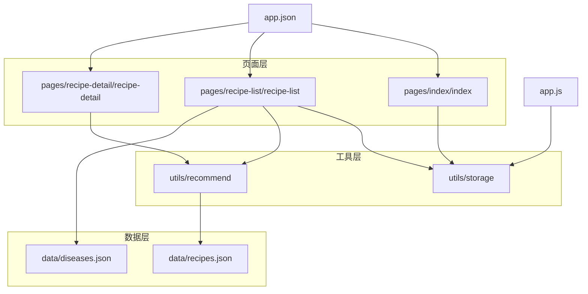
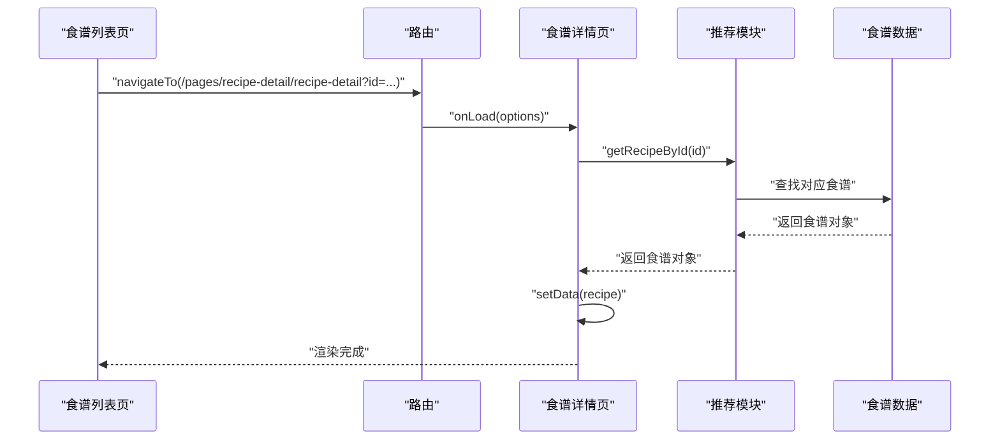
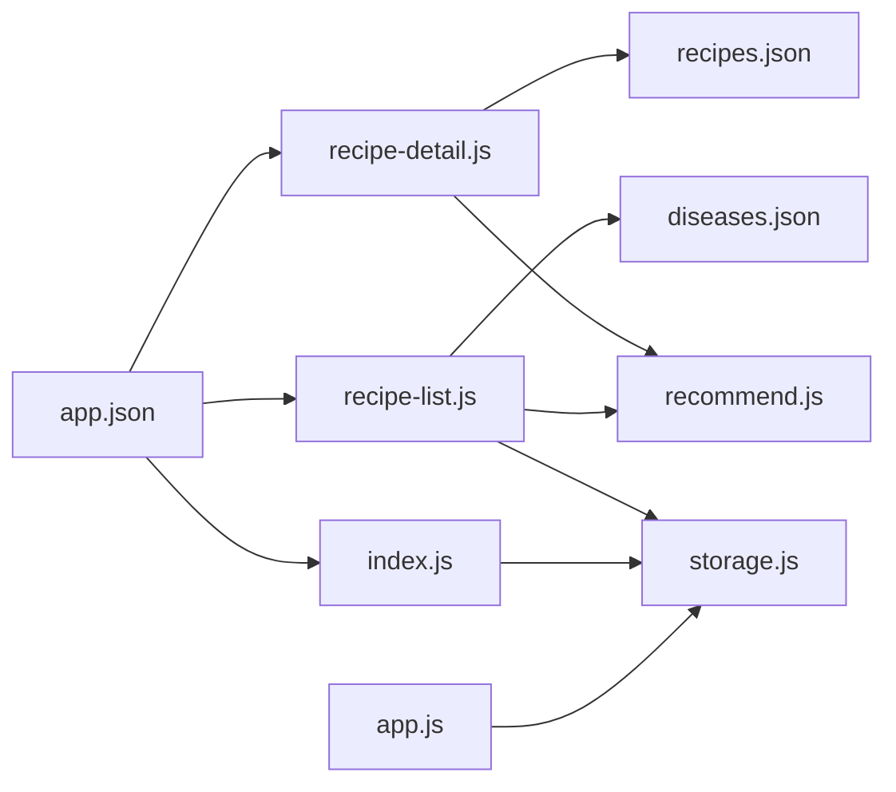

# 食谱详情

<cite>
**本文引用的文件**
- [pages/recipe-detail/recipe-detail.js](file://pages/recipe-detail/recipe-detail.js)
- [pages/recipe-detail/recipe-detail.json](file://pages/recipe-detail/recipe-detail.json)
- [pages/recipe-detail/recipe-detail.wxml](file://pages/recipe-detail/recipe-detail.wxml)
- [pages/recipe-detail/recipe-detail.wxss](file://pages/recipe-detail/recipe-detail.wxss)
- [pages/recipe-list/recipe-list.js](file://pages/recipe-list/recipe-list.js)
- [utils/recommend.js](file://utils/recommend.js)
- [data/recipes.json](file://data/recipes.json)
- [data/diseases.json](file://data/diseases.json)
- [utils/storage.js](file://utils/storage.js)
- [pages/index/index.js](file://pages/index/index.js)
- [app.js](file://app.js)
- [app.json](file://app.json)
</cite>

## 目录
1. [简介](#简介)
2. [项目结构](#项目结构)
3. [核心组件](#核心组件)
4. [架构总览](#架构总览)
5. [组件详细分析](#组件详细分析)
6. [依赖关系分析](#依赖关系分析)
7. [性能考量](#性能考量)
8. [故障排查指南](#故障排查指南)
9. [结论](#结论)
10. [附录](#附录)

## 简介
本文件面向“食谱详情”页面，系统性梳理其数据渲染机制、富文本内容处理、图片资源管理与用户交互设计，并阐述页面与推荐系统的数据关联方式及从列表页跳转到详情页的参数传递机制。同时给出技术要点、内容展示优化与用户体验提升方案，帮助开发者快速理解与扩展该页面。

## 项目结构
该应用采用小程序标准目录结构，页面位于 pages 下，业务逻辑与数据通过 utils 与 data 提供，整体围绕“我的宝贝 -> 食谱列表 -> 食谱详情”的主路径展开。

图表来源
- [app.json](file://app.json#L1-L41)
- [app.js](file://app.js#L1-L21)
- [pages/index/index.js](file://pages/index/index.js#L1-L80)
- [pages/recipe-list/recipe-list.js](file://pages/recipe-list/recipe-list.js#L1-L129)
- [pages/recipe-detail/recipe-detail.js](file://pages/recipe-detail/recipe-detail.js#L1-L43)
- [utils/recommend.js](file://utils/recommend.js#L1-L109)
- [utils/storage.js](file://utils/storage.js#L1-L155)
- [data/recipes.json](file://data/recipes.json#L1-L515)
- [data/diseases.json](file://data/diseases.json#L1-L108)

章节来源
- [app.json](file://app.json#L1-L41)
- [app.js](file://app.js#L1-L21)

## 核心组件
- 页面控制器：负责接收参数、加载食谱详情、切换标签页、分享与收藏交互。
- 视图模板：基于 WXML/WXSS 实现头部图片、基本信息卡片、标签页切换、食材清单、制作步骤、营养说明、小贴士与注意事项等模块化布局。
- 数据源：本地 JSON 文件 recipes.json 提供完整的食谱数据；diseases.json 提供疾病字典；storage.js 提供宠物与当前选中宠物的本地持久化；recommend.js 提供推荐与查询能力。

章节来源
- [pages/recipe-detail/recipe-detail.js](file://pages/recipe-detail/recipe-detail.js#L1-L43)
- [pages/recipe-detail/recipe-detail.wxml](file://pages/recipe-detail/recipe-detail.wxml#L1-L154)
- [pages/recipe-detail/recipe-detail.wxss](file://pages/recipe-detail/recipe-detail.wxss#L1-L362)
- [data/recipes.json](file://data/recipes.json#L1-L515)
- [data/diseases.json](file://data/diseases.json#L1-L108)
- [utils/storage.js](file://utils/storage.js#L1-L155)
- [utils/recommend.js](file://utils/recommend.js#L1-L109)

## 架构总览
详情页从 URL 参数中读取 recipeId，调用推荐模块的 getRecipeById 方法获取完整食谱对象，随后 setData 渲染视图。分享功能动态拼接详情页链接，收藏按钮预留扩展点。页面与推荐系统的关系体现在：列表页根据当前宠物信息调用 recommend.getRecommendedRecipes，详情页直接通过 ID 查询具体食谱。

图表来源
- [pages/recipe-list/recipe-list.js](file://pages/recipe-list/recipe-list.js#L111-L117)
- [pages/recipe-detail/recipe-detail.js](file://pages/recipe-detail/recipe-detail.js#L10-L18)
- [utils/recommend.js](file://utils/recommend.js#L78-L80)
- [data/recipes.json](file://data/recipes.json#L1-L515)

## 组件详细分析

### 页面生命周期与数据加载
- 入口参数：onLoad 接收 options，解析 id 并调用 recommend.getRecipeById 获取食谱对象。
- 成功加载：若找到食谱，设置 recipe 并动态设置导航栏标题为食谱名称。
- 未找到：页面仍会渲染，但 recipe 为空时显示“加载中”占位。

章节来源
- [pages/recipe-detail/recipe-detail.js](file://pages/recipe-detail/recipe-detail.js#L10-L18)

### 视图结构与数据绑定
- 头部图片区域：支持占位符与实际图片两种形态，叠加标题与副标题遮罩层。
- 基本信息卡片：展示制作时间、难度、热量等关键指标。
- 适用说明：根据 suitableFor 数组渲染标签。
- 标签页：支持“食材清单”“制作步骤”“营养说明”三类内容切换。
- 食材清单：遍历 ingredients，支持单位与备注字段。
- 制作步骤：按索引生成序号，逐条展示步骤文本。
- 营养说明：网格展示蛋白质、脂肪、纤维，特殊说明区域用于强调。
- 小贴士与注意事项：列表形式展示，图标与颜色区分提示类型。
- 底部操作栏：收藏与分享按钮，分享通过 onShareAppMessage 动态生成链接。

章节来源
- [pages/recipe-detail/recipe-detail.wxml](file://pages/recipe-detail/recipe-detail.wxml#L1-L154)

### 样式与交互
- 头图采用固定高度与遮罩层，标题与副标题居底显示，视觉层次清晰。
- 信息卡片采用阴影与圆角，突出关键指标。
- 标签页样式区分激活态，点击切换 activeTab 控制内容显示。
- 步骤列表序号采用渐变色圆形背景，提升可读性。
- 营养网格与特殊说明区域采用柔和背景，突出重点信息。
- 底部操作栏固定定位，避免滚动覆盖，分享按钮采用渐变色强调。

章节来源
- [pages/recipe-detail/recipe-detail.wxss](file://pages/recipe-detail/recipe-detail.wxss#L1-L362)

### 富文本与内容处理
- 文本内容均为纯文本，未见富文本编辑器或 HTML 解析逻辑。步骤与贴士/警告均以字符串数组形式展示，WXML 使用 wx:for 渲染。
- 若未来需要富文本（如带链接、粗体、换行），可在数据层引入富文本字段并在模板中使用支持富文本的组件或预处理函数。

章节来源
- [pages/recipe-detail/recipe-detail.wxml](file://pages/recipe-detail/recipe-detail.wxml#L80-L135)

### 图片资源管理
- 图片路径来自 recipe.image 字段，支持占位符与真实图片两种形态。
- 建议：
  - 在数据层统一管理图片资源，避免硬编码路径。
  - 对大图进行压缩与懒加载，减少首屏压力。
  - 提供默认占位图，提升加载体验。

章节来源
- [pages/recipe-detail/recipe-detail.wxml](file://pages/recipe-detail/recipe-detail.wxml#L4-L16)
- [data/recipes.json](file://data/recipes.json#L1-L515)

### 用户交互设计
- 标签页切换：通过 bindtap 事件设置 activeTab，实现三类内容的切换。
- 分享：onShareAppMessage 返回标题与路径，路径包含 recipeId，便于分享后直达详情。
- 收藏：预留 onCollect 事件，当前仅提示“功能开发中”。

章节来源
- [pages/recipe-detail/recipe-detail.js](file://pages/recipe-detail/recipe-detail.js#L20-L41)

### 页面与推荐系统的数据关联
- 列表页根据当前宠物信息调用 recommend.getRecommendedRecipes，计算匹配度并排序。
- 详情页通过 recommend.getRecipeById 直接按 ID 获取食谱详情。
- 疾病字典 diseases.json 为列表页筛选与推荐提供依据。

章节来源
- [pages/recipe-list/recipe-list.js](file://pages/recipe-list/recipe-list.js#L30-L48)
- [utils/recommend.js](file://utils/recommend.js#L10-L66)
- [data/diseases.json](file://data/diseases.json#L1-L108)

### 从列表页跳转到详情页的参数传递机制
- 列表页在点击食谱项时，通过 navigateTo 携带 recipeId 参数。
- 详情页 onLoad 中读取 options.id，调用 recommend.getRecipeById 获取数据并渲染。

章节来源
- [pages/recipe-list/recipe-list.js](file://pages/recipe-list/recipe-list.js#L111-L117)
- [pages/recipe-detail/recipe-detail.js](file://pages/recipe-detail/recipe-detail.js#L10-L18)

### 技术要点与优化建议
- 数据渲染
  - 使用 setData 渲染完整 recipe 对象，避免多次重复请求。
  - 对空数据场景提供 loading 占位，改善首屏体验。
- 性能优化
  - 避免在渲染循环中进行复杂计算，将计算结果缓存于 setData。
  - 图片懒加载与压缩，减少首屏渲染时间。
- 可访问性
  - 为图片提供 alt 或占位符，确保无障碍阅读。
  - 为按钮与交互元素提供明确的语义标签。
- 错误处理
  - 当 recipeId 无效或数据缺失时，应提供友好的错误提示与回退策略。
- 扩展点
  - 收藏功能：结合 storage 与云端服务实现收藏状态同步。
  - 分享：支持多平台分享文案与缩略图配置。
  - 富文本：如需富文本，建议在数据层新增字段并在模板中适配。

章节来源
- [pages/recipe-detail/recipe-detail.js](file://pages/recipe-detail/recipe-detail.js#L10-L18)
- [pages/recipe-detail/recipe-detail.wxml](file://pages/recipe-detail/recipe-detail.wxml#L150-L154)

## 依赖关系分析

图表来源
- [pages/recipe-detail/recipe-detail.js](file://pages/recipe-detail/recipe-detail.js#L1-L43)
- [pages/recipe-list/recipe-list.js](file://pages/recipe-list/recipe-list.js#L1-L129)
- [utils/recommend.js](file://utils/recommend.js#L1-L109)
- [utils/storage.js](file://utils/storage.js#L1-L155)
- [data/recipes.json](file://data/recipes.json#L1-L515)
- [data/diseases.json](file://data/diseases.json#L1-L108)
- [pages/index/index.js](file://pages/index/index.js#L1-L80)
- [app.js](file://app.js#L1-L21)
- [app.json](file://app.json#L1-L41)

## 性能考量
- 渲染性能
  - 避免在 wxml 中进行复杂表达式计算，将结果预先计算并传入 setData。
  - 对长列表（如步骤、贴士）使用 wx:for 渲染，合理设置 wx:key。
- 资源加载
  - 图片资源尽量压缩，必要时采用懒加载策略。
  - 使用占位图与骨架屏提升感知速度。
- 内存占用
  - 避免在页面生命周期中频繁 setData，合并更新以减少重排。
  - 在 onUnload 中清理定时器与事件监听（如有）。

## 故障排查指南
- 无法加载详情
  - 检查 recipeId 是否正确传递与解析。
  - 确认 recommend.getRecipeById 能否命中对应 ID。
- 图片不显示
  - 检查 recipe.image 路径是否有效，是否存在占位符。
  - 确认图片服务器可访问与跨域配置。
- 分享链接无效
  - 确认 onShareAppMessage 返回的 path 包含正确的 id 参数。
- 标签页切换异常
  - 检查 activeTab 的设置与样式类名是否正确绑定。
- 收藏功能无响应
  - 确认 onCollect 事件绑定与 toast 显示逻辑正常。

章节来源
- [pages/recipe-detail/recipe-detail.js](file://pages/recipe-detail/recipe-detail.js#L26-L41)
- [pages/recipe-detail/recipe-detail.wxml](file://pages/recipe-detail/recipe-detail.wxml#L44-L61)

## 结论
食谱详情页以简洁直观的方式呈现食谱的核心信息，结合推荐系统实现了从“我的宝贝”到“食谱列表”，再到“食谱详情”的完整路径。页面具备良好的扩展性：可通过完善收藏、富文本与图片资源管理进一步提升用户体验；通过优化渲染与资源加载策略提升性能表现。

## 附录
- 页面配置
  - 导航栏标题由页面配置与运行时动态设置共同决定。
- 数据模型要点
  - 食谱对象包含基本信息、适用/避免条件、食材清单、步骤、营养说明、贴士与注意事项等字段。
  - 疾病字典提供疾病 ID、分类与饮食建议，支撑推荐与筛选。

章节来源
- [pages/recipe-detail/recipe-detail.json](file://pages/recipe-detail/recipe-detail.json#L1-L5)
- [pages/recipe-detail/recipe-detail.js](file://pages/recipe-detail/recipe-detail.js#L10-L18)
- [data/recipes.json](file://data/recipes.json#L1-L515)
- [data/diseases.json](file://data/diseases.json#L1-L108)