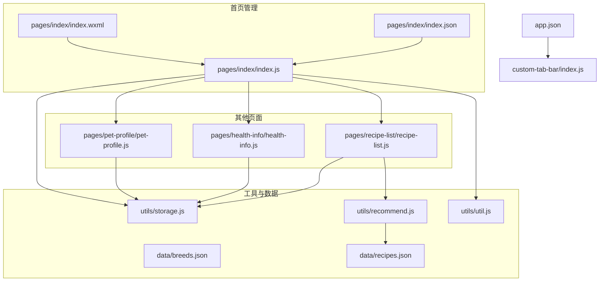
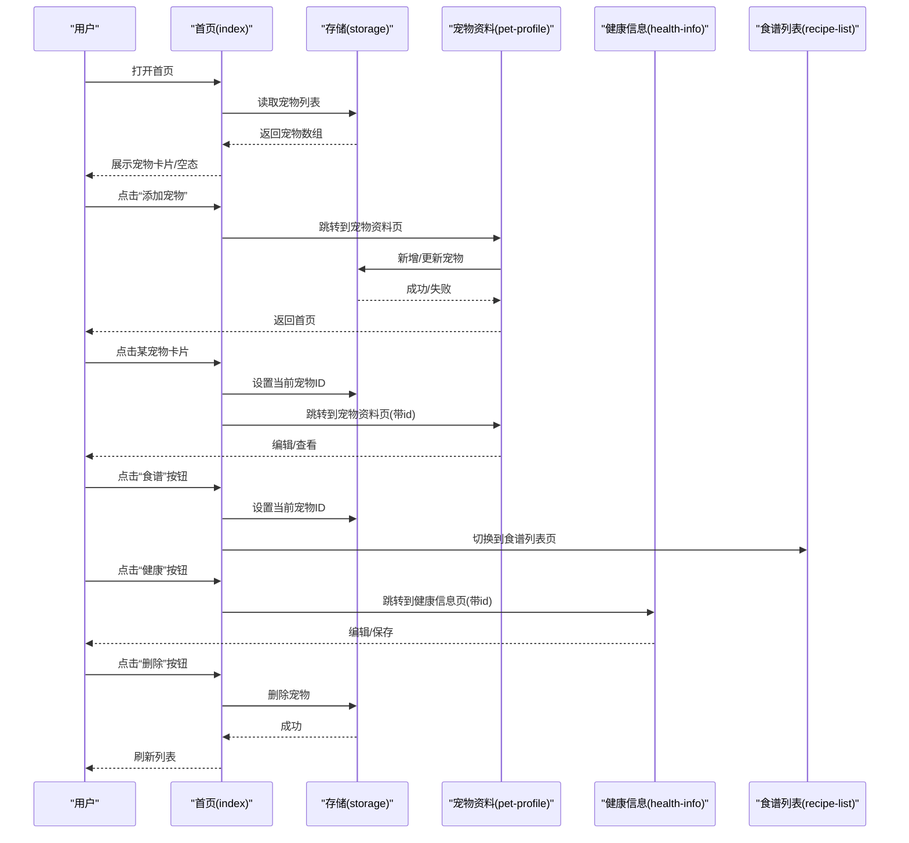
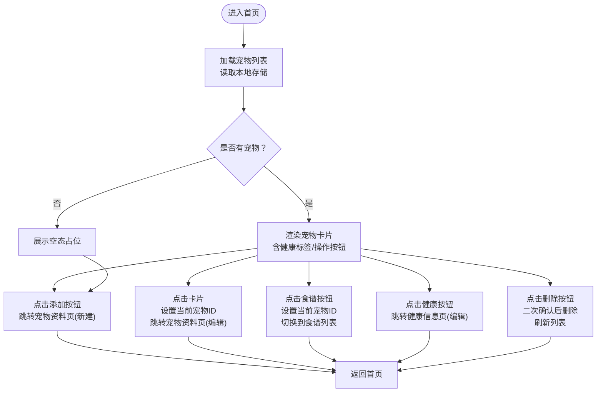
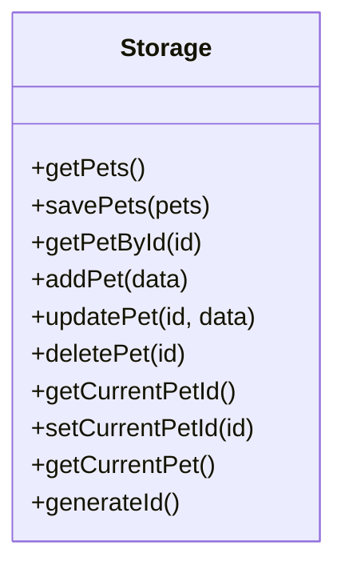
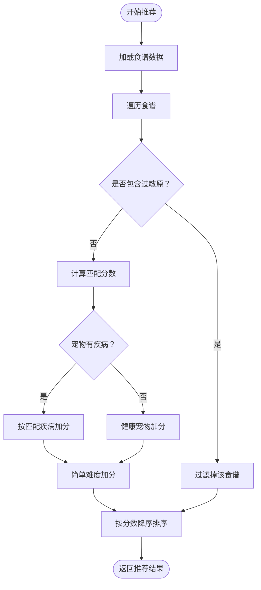
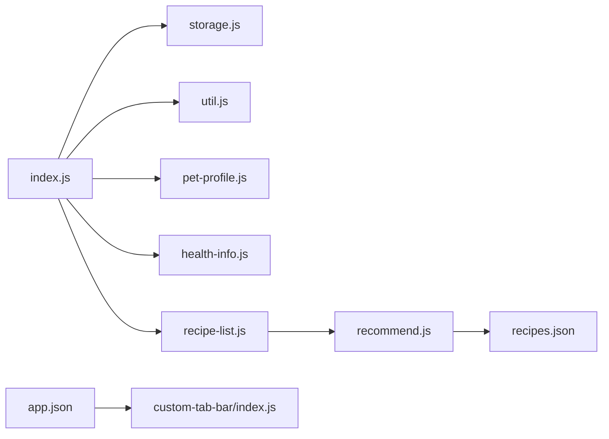

# 首页管理

<cite>
**本文引用的文件**
- [pages/index/index.js](file://pages/index/index.js)
- [pages/index/index.json](file://pages/index/index.json)
- [pages/index/index.wxml](file://pages/index/index.wxml)
- [utils/storage.js](file://utils/storage.js)
- [utils/recommend.js](file://utils/recommend.js)
- [utils/util.js](file://utils/util.js)
- [pages/pet-profile/pet-profile.js](file://pages/pet-profile/pet-profile.js)
- [pages/health-info/health-info.js](file://pages/health-info/health-info.js)
- [pages/recipe-list/recipe-list.js](file://pages/recipe-list/recipe-list.js)
- [data/recipes.json](file://data/recipes.json)
- [data/breeds.json](file://data/breeds.json)
- [app.json](file://app.json)
- [custom-tab-bar/index.js](file://custom-tab-bar/index.js)
</cite>

## 目录
1. [简介](#简介)
2. [项目结构](#项目结构)
3. [核心组件](#核心组件)
4. [架构总览](#架构总览)
5. [详细组件分析](#详细组件分析)
6. [依赖关系分析](#依赖关系分析)
7. [性能考虑](#性能考虑)
8. [故障排查指南](#故障排查指南)
9. [结论](#结论)
10. [附录](#附录)

## 简介
本文件面向“首页管理”页面，系统性解析其作为宠物管理入口的核心功能实现，包括宠物列表展示、宠物信息管理、页面生命周期与交互逻辑、与存储模块的集成方式、与其他页面的导航关系，并提供技术要点、性能优化建议与最佳实践。目标读者既包括前端开发者，也包括产品与运营人员，帮助快速理解与维护该页面。

## 项目结构
首页管理位于 pages/index，采用经典的 WXML + JS + JSON 的小程序页面组织方式；与之紧密协作的模块包括：
- 存储模块：统一读写本地数据，负责宠物列表、当前选中宠物等
- 推荐模块：根据宠物健康信息计算食谱匹配度
- 工具模块：提供通用 UI 提示、防抖、计算等能力
- 数据资源：食谱、品种等静态数据
- 导航与 TabBar：通过 app.json 与自定义 TabBar 组件实现跨页面跳转

图表来源
- [pages/index/index.js](file://pages/index/index.js#L1-L80)
- [pages/index/index.wxml](file://pages/index/index.wxml#L1-L71)
- [pages/index/index.json](file://pages/index/index.json#L1-L5)
- [utils/storage.js](file://utils/storage.js#L1-L155)
- [utils/recommend.js](file://utils/recommend.js#L1-L109)
- [utils/util.js](file://utils/util.js#L1-L123)
- [pages/pet-profile/pet-profile.js](file://pages/pet-profile/pet-profile.js#L1-L216)
- [pages/health-info/health-info.js](file://pages/health-info/health-info.js#L1-L190)
- [pages/recipe-list/recipe-list.js](file://pages/recipe-list/recipe-list.js#L1-L129)
- [data/recipes.json](file://data/recipes.json#L1-L200)
- [data/breeds.json](file://data/breeds.json#L1-L35)
- [app.json](file://app.json#L1-L41)
- [custom-tab-bar/index.js](file://custom-tab-bar/index.js#L1-L32)

章节来源
- [pages/index/index.js](file://pages/index/index.js#L1-L80)
- [pages/index/index.wxml](file://pages/index/index.wxml#L1-L71)
- [pages/index/index.json](file://pages/index/index.json#L1-L5)
- [app.json](file://app.json#L1-L41)

## 核心组件
- 首页管理页面（index）
  - 负责渲染宠物列表、空态占位、添加按钮
  - 处理添加宠物、点击卡片、查看食谱、编辑健康、删除宠物等交互
  - 生命周期：onLoad 加载宠物列表；onShow 在每次显示时刷新数据并同步 TabBar 选中状态
- 存储模块（storage）
  - 封装本地存储键名、增删改查宠物、设置/获取当前选中宠物
- 推荐模块（recommend）
  - 基于宠物健康信息与食谱属性进行匹配评分，过滤过敏原，返回排序后的食谱
- 工具模块（util）
  - 提供加载提示、Toast、确认弹窗、防抖、年龄描述、每日喂食量估算等
- 其他页面
  - 宠物资料页（pet-profile）：新增/编辑宠物信息
  - 健康信息页（health-info）：编辑疾病/过敏/活动水平/体检报告等
  - 食谱列表页（recipe-list）：基于当前宠物进行推荐或全局搜索筛选

章节来源
- [pages/index/index.js](file://pages/index/index.js#L1-L80)
- [utils/storage.js](file://utils/storage.js#L1-L155)
- [utils/recommend.js](file://utils/recommend.js#L1-L109)
- [utils/util.js](file://utils/util.js#L1-L123)

## 架构总览
首页管理作为入口，串联“宠物信息管理”“健康信息管理”“食谱推荐”三大业务闭环。数据流从本地存储读取，经推荐模块计算，再回到页面渲染；交互触发后更新存储并刷新视图。

图表来源
- [pages/index/index.js](file://pages/index/index.js#L1-L80)
- [utils/storage.js](file://utils/storage.js#L1-L155)
- [pages/pet-profile/pet-profile.js](file://pages/pet-profile/pet-profile.js#L1-L216)
- [pages/health-info/health-info.js](file://pages/health-info/health-info.js#L1-L190)
- [pages/recipe-list/recipe-list.js](file://pages/recipe-list/recipe-list.js#L1-L129)

## 详细组件分析

### 首页管理页面（index）
- 页面结构
  - 顶部标题与副标题
  - 宠物列表区域：循环渲染每只宠物卡片，包含头像、年龄标签、姓名/品种/体重/性别、健康标签（疾病数量最多展示两个，其余以“+N”形式聚合）
  - 操作区：食谱、健康两个按钮，分别进入食谱列表与健康信息页
  - 空态区域：无宠物时展示引导文案与图标
  - 底部悬浮“添加宠物”按钮
- 生命周期
  - onLoad：初始化加载宠物列表
  - onShow：每次显示时重新加载宠物列表；若为自定义 TabBar 页面，主动设置选中项
- 数据加载机制
  - 通过存储模块读取宠物数组，设置为空态标志
- 用户交互事件
  - 添加宠物：跳转到宠物资料页（新建模式）
  - 点击宠物卡片：设置当前宠物ID，跳转到宠物资料页（编辑模式）
  - 查看食谱：设置当前宠物ID，切换到食谱列表页
  - 编辑健康：跳转到健康信息页（带宠物ID）
  - 删除宠物：二次确认后删除，提示并刷新列表
- 与存储模块集成
  - 读取/写入宠物列表
  - 设置当前选中宠物ID
- 与其他页面的导航关系
  - 通过 wx.navigateTo / wx.switchTab 实现页面间跳转
  - 与自定义 TabBar 组件联动，确保 Tab 选中状态正确

图表来源
- [pages/index/index.js](file://pages/index/index.js#L1-L80)
- [utils/storage.js](file://utils/storage.js#L1-L155)

章节来源
- [pages/index/index.js](file://pages/index/index.js#L1-L80)
- [pages/index/index.wxml](file://pages/index/index.wxml#L1-L71)
- [pages/index/index.json](file://pages/index/index.json#L1-L5)

### 存储模块（storage）
- 关键职责
  - 宠物列表的增删改查
  - 当前选中宠物ID的存取
  - 生成唯一ID
- 数据结构
  - 宠物对象包含基本信息（姓名、头像、品种、年龄、体重、性别、是否绝育）、健康信息（疾病、用药、活动水平）、饮食信息（过敏原、偏好、当前饮食）、体检报告等
- 错误处理
  - 读写本地存储时捕获异常并返回默认值，避免崩溃
- 性能与一致性
  - 所有写操作均同步持久化，保证数据一致性

图表来源
- [utils/storage.js](file://utils/storage.js#L1-L155)

章节来源
- [utils/storage.js](file://utils/storage.js#L1-L155)

### 推荐模块（recommend）
- 功能概述
  - 根据宠物的疾病与过敏原，计算食谱匹配分数，过滤过敏原，按分数降序排列
  - 支持获取全部食谱、按ID查询、按疾病筛选、关键词搜索
- 匹配规则
  - 若食谱标注为“避免”且宠物存在对应过敏原，则直接过滤
  - 对匹配的疾病逐条计分，健康宠物在无适用疾病时获得额外加分
  - 简单难度食谱额外加分
- 与首页/食谱列表的协作
  - 首页在“查看食谱”时设置当前宠物，随后跳转食谱列表
  - 食谱列表在加载时根据当前宠物调用推荐算法

图表来源
- [utils/recommend.js](file://utils/recommend.js#L1-L109)
- [data/recipes.json](file://data/recipes.json#L1-L200)

章节来源
- [utils/recommend.js](file://utils/recommend.js#L1-L109)
- [data/recipes.json](file://data/recipes.json#L1-L200)

### 工具模块（util）
- 能力清单
  - 时间格式化、年龄描述、每日喂食量估算
  - 防抖函数
  - 加载提示、Toast、确认弹窗
- 使用场景
  - 删除宠物前的二次确认
  - 保存/更新时的加载与提示
  - 食谱列表页的搜索与筛选

章节来源
- [utils/util.js](file://utils/util.js#L1-L123)

### 与其他页面的导航关系
- 首页 -> 宠物资料页：新建/编辑宠物
- 首页 -> 健康信息页：编辑宠物健康档案
- 首页 -> 食谱列表页：基于当前宠物进行个性化推荐
- 食谱列表页 -> 食谱详情页：查看具体做法与营养说明
- 食谱列表页 <-> 首页：通过 TabBar 切换

章节来源
- [pages/pet-profile/pet-profile.js](file://pages/pet-profile/pet-profile.js#L1-L216)
- [pages/health-info/health-info.js](file://pages/health-info/health-info.js#L1-L190)
- [pages/recipe-list/recipe-list.js](file://pages/recipe-list/recipe-list.js#L1-L129)
- [app.json](file://app.json#L1-L41)
- [custom-tab-bar/index.js](file://custom-tab-bar/index.js#L1-L32)

## 依赖关系分析
- 首页管理对存储模块的依赖：读取宠物列表、设置当前宠物ID、删除宠物
- 首页管理对工具模块的依赖：二次确认、Toast、导航跳转
- 食谱列表对推荐模块的依赖：推荐算法、搜索与筛选
- 推荐模块对数据资源的依赖：食谱与疾病/过敏原配置
- 导航依赖：app.json 中的 TabBar 配置与自定义组件

图表来源
- [pages/index/index.js](file://pages/index/index.js#L1-L80)
- [utils/storage.js](file://utils/storage.js#L1-L155)
- [utils/util.js](file://utils/util.js#L1-L123)
- [pages/recipe-list/recipe-list.js](file://pages/recipe-list/recipe-list.js#L1-L129)
- [utils/recommend.js](file://utils/recommend.js#L1-L109)
- [data/recipes.json](file://data/recipes.json#L1-L200)
- [app.json](file://app.json#L1-L41)
- [custom-tab-bar/index.js](file://custom-tab-bar/index.js#L1-L32)

章节来源
- [pages/index/index.js](file://pages/index/index.js#L1-L80)
- [pages/recipe-list/recipe-list.js](file://pages/recipe-list/recipe-list.js#L1-L129)
- [utils/recommend.js](file://utils/recommend.js#L1-L109)
- [app.json](file://app.json#L1-L41)

## 性能考虑
- 数据读写
  - 本地存储读写为同步接口，建议在页面生命周期中仅做必要次数的读取与写入，避免频繁 setData
- 列表渲染
  - 使用 wx:for 渲染宠物卡片，合理设置 wx:key，减少重排
- 事件冒泡与拦截
  - 操作按钮区域使用 catchtap 阻止事件冒泡，避免误触父级 bindtap
- 导航与状态
  - onShow 中刷新数据，确保数据一致性；同时注意 TabBar 选中状态的设置，避免重复设置造成闪烁
- 推荐算法
  - 食谱匹配在首页“查看食谱”时触发，建议在数据量较大时考虑缓存当前宠物的推荐结果，减少重复计算
- 图片与头像
  - 头像使用 aspectFill 模式，建议提供合适尺寸的图片以减少内存占用

[本节为通用性能建议，不直接分析具体文件，故无章节来源]

## 故障排查指南
- 无法显示宠物列表
  - 检查本地存储键值是否存在或被清空
  - 确认首页 onLoad/onShow 是否调用 loadPets 并 setData
- 删除宠物无效
  - 确认删除流程中是否调用存储模块的 deletePet，并在删除成功后刷新列表
- “查看食谱”无推荐结果
  - 确认当前宠物是否已设置（首页设置当前宠物ID后再跳转）
  - 检查推荐算法是否正确过滤过敏原与疾病匹配
- TabBar 选中状态异常
  - 确认自定义 TabBar 组件与页面 onShow 中的 selected 设置逻辑
- 二次确认与提示
  - 确认 util.showConfirm 与 util.showToast 的调用时机与参数

章节来源
- [pages/index/index.js](file://pages/index/index.js#L1-L80)
- [utils/storage.js](file://utils/storage.js#L1-L155)
- [utils/util.js](file://utils/util.js#L1-L123)
- [pages/recipe-list/recipe-list.js](file://pages/recipe-list/recipe-list.js#L1-L129)

## 结论
首页管理页面以简洁直观的方式承载了宠物信息管理的入口职责，通过与存储、推荐、工具模块的协同，实现了从“添加宠物”到“查看食谱”的完整闭环。其生命周期管理与事件处理清晰，数据流可追溯，具备良好的扩展性与可维护性。建议在后续迭代中关注推荐结果缓存、列表渲染优化与错误兜底策略，持续提升用户体验。

[本节为总结性内容，不直接分析具体文件，故无章节来源]

## 附录

### 技术要点与最佳实践
- 页面生命周期
  - onLoad：完成一次性初始化（如读取静态配置）
  - onShow：刷新动态数据（如宠物列表），保持与存储一致
- 事件处理
  - 使用 catchtap 阻止事件冒泡，避免误触
  - 使用 dataset 传递关键数据（如宠物ID）
- 导航策略
  - 新建/编辑宠物使用 navigateTo
  - 切换 Tab 页面使用 switchTab
- 数据一致性
  - 写操作完成后立即刷新视图，避免异步竞态
- 错误处理
  - 本地存储读写需捕获异常，提供默认值与日志
- 可访问性
  - 为按钮与卡片提供明确的语义标签与提示文案

[本节为通用实践建议，不直接分析具体文件，故无章节来源]