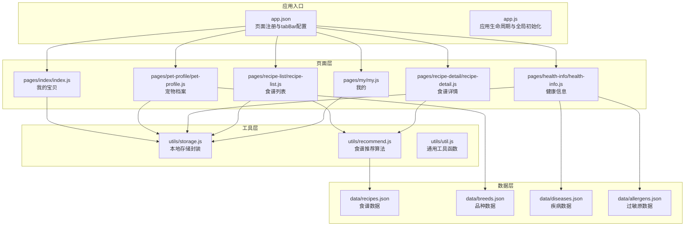
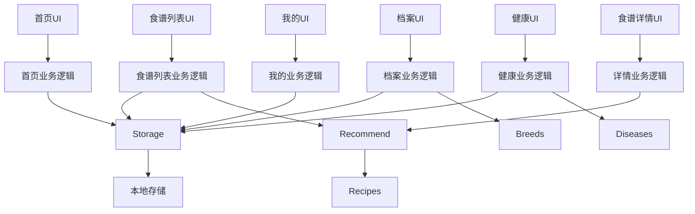
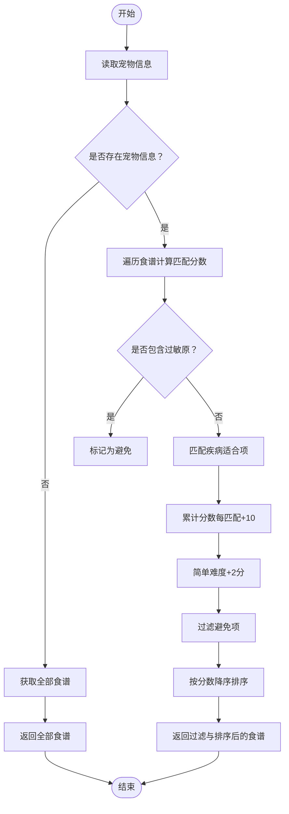
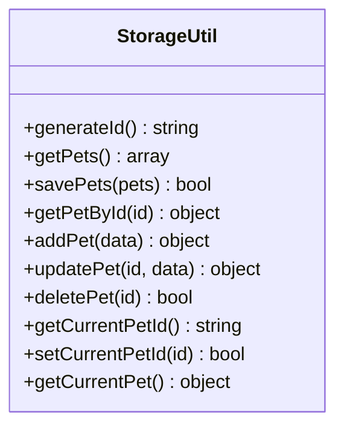
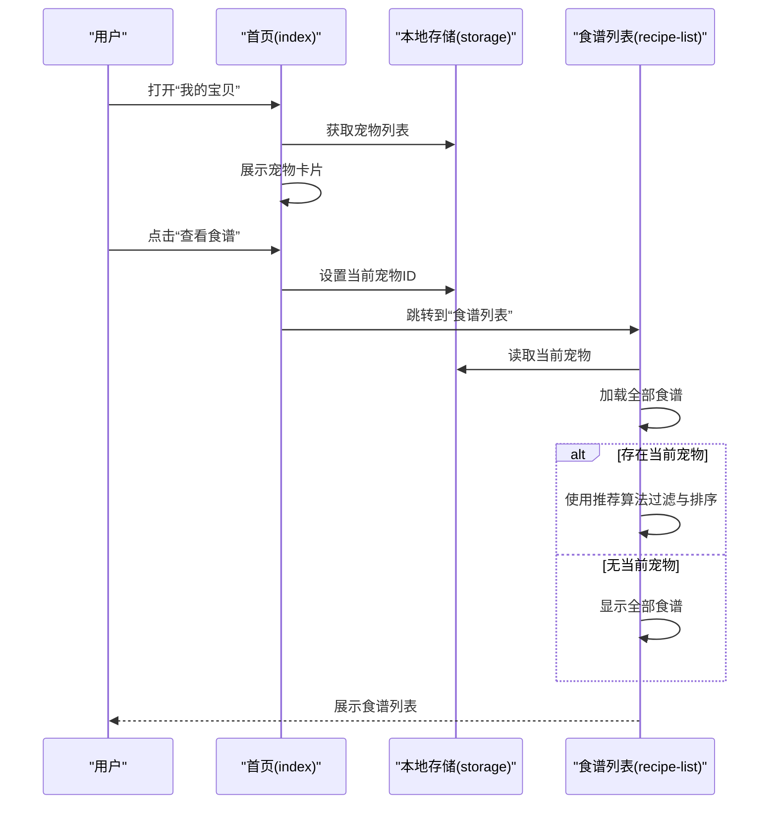
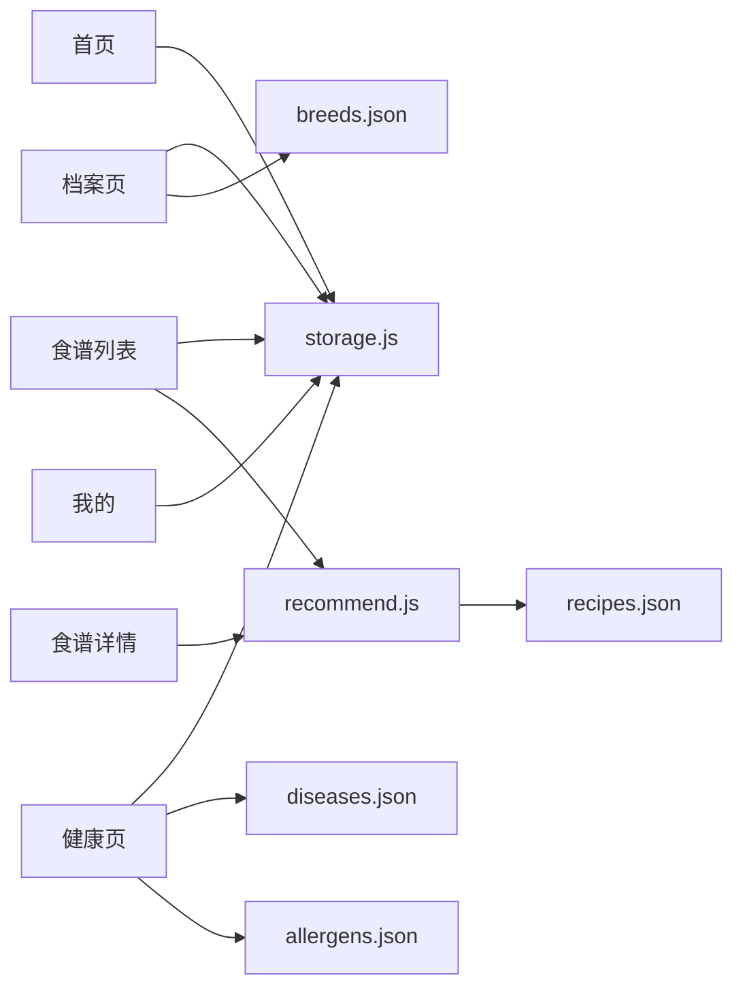

# 项目概述

<cite>
**本文档引用的文件**
- [app.js](file://app.js)
- [app.json](file://app.json)
- [project.config.json](file://project.config.json)
- [sitemap.json](file://sitemap.json)
- [pages/index/index.js](file://pages/index/index.js)
- [pages/pet-profile/pet-profile.js](file://pages/pet-profile/pet-profile.js)
- [pages/health-info/health-info.js](file://pages/health-info/health-info.js)
- [pages/recipe-list/recipe-list.js](file://pages/recipe-list/recipe-list.js)
- [pages/recipe-detail/recipe-detail.js](file://pages/recipe-detail/recipe-detail.js)
- [pages/my/my.js](file://pages/my/my.js)
- [utils/storage.js](file://utils/storage.js)
- [utils/recommend.js](file://utils/recommend.js)
- [utils/util.js](file://utils/util.js)
- [data/recipes.json](file://data/recipes.json)
- [data/breeds.json](file://data/breeds.json)
- [data/diseases.json](file://data/diseases.json)
- [data/allergens.json](file://data/allergens.json)
</cite>

## 目录
1. [引言](#引言)
2. [项目结构](#项目结构)
3. [核心组件](#核心组件)
4. [架构总览](#架构总览)
5. [详细组件分析](#详细组件分析)
6. [依赖分析](#依赖分析)
7. [性能考虑](#性能考虑)
8. [故障排查指南](#故障排查指南)
9. [结论](#结论)
10. [附录](#附录)

## 引言
Old-baby老年宠物健康管理小程序是一个基于微信小程序框架开发的应用，专注于为老年及高龄宠物提供健康档案管理与智能食谱推荐服务。项目以“用爱守护每一天”为核心理念，围绕“我的宝贝”“食谱”“我的”三大功能模块，帮助用户记录宠物基础信息、健康状况、过敏史与用药情况，并结合疾病与过敏信息为宠物提供个性化、科学的自制食谱推荐。

项目目标用户群体主要为老年犬（及高龄犬）的主人，他们关注宠物的日常营养与慢性病管理，希望通过简单易行的自制食谱改善宠物健康状况。通过本地化数据存储与简洁直观的操作流程，项目在保障隐私的同时，提供即开即用的健康管理体验。

## 项目结构
项目采用微信小程序标准目录结构，页面按功能划分为首页、宠物档案、健康信息、食谱列表、食谱详情与个人中心等模块；工具层提供本地存储封装、推荐算法与通用工具函数；数据层包含食谱、品种、疾病与过敏原等静态数据资源。

**图表来源**
- [app.json](file://app.json#L1-L41)
- [app.js](file://app.js#L1-L21)
- [pages/index/index.js](file://pages/index/index.js#L1-L80)
- [pages/pet-profile/pet-profile.js](file://pages/pet-profile/pet-profile.js#L1-L216)
- [pages/health-info/health-info.js](file://pages/health-info/health-info.js#L1-L190)
- [pages/recipe-list/recipe-list.js](file://pages/recipe-list/recipe-list.js#L1-L129)
- [pages/recipe-detail/recipe-detail.js](file://pages/recipe-detail/recipe-detail.js#L1-L43)
- [pages/my/my.js](file://pages/my/my.js#L1-L113)
- [utils/storage.js](file://utils/storage.js#L1-L155)
- [utils/recommend.js](file://utils/recommend.js#L1-L109)
- [utils/util.js](file://utils/util.js#L1-L123)
- [data/recipes.json](file://data/recipes.json#L1-L200)
- [data/breeds.json](file://data/breeds.json#L1-L35)
- [data/diseases.json](file://data/diseases.json#L1-L108)
- [data/allergens.json](file://data/allergens.json)

**章节来源**
- [app.json](file://app.json#L1-L41)
- [app.js](file://app.js#L1-L21)
- [project.config.json](file://project.config.json#L1-L47)

## 核心组件
- 应用入口与生命周期
  - 应用启动时进行本地存储初始化，确保宠物数据键存在。
  - 全局数据包含当前选中宠物ID，便于跨页面共享。
- 页面与导航
  - 首页“我的宝贝”负责宠物列表展示、新增、编辑、删除与跳转。
  - 宠物档案页支持头像选择、基础信息输入与品种选择。
  - 健康信息页收集疾病、过敏、活动水平、当前饮食与体检报告。
  - 食谱列表页根据当前选中宠物进行智能推荐，并支持搜索与按疾病筛选。
  - 食谱详情页展示配方与制作步骤，支持分享。
  - 个人中心提供用户信息维护、关于与反馈、缓存清理与分享。
- 工具与数据
  - 本地存储封装统一处理增删改查与当前宠物切换。
  - 推荐算法依据宠物疾病与过敏信息计算匹配度，过滤不适用食谱。
  - 通用工具提供日期格式化、年龄描述、喂食量估算、防抖与交互提示。

**章节来源**
- [app.js](file://app.js#L1-L21)
- [pages/index/index.js](file://pages/index/index.js#L1-L80)
- [pages/pet-profile/pet-profile.js](file://pages/pet-profile/pet-profile.js#L1-L216)
- [pages/health-info/health-info.js](file://pages/health-info/health-info.js#L1-L190)
- [pages/recipe-list/recipe-list.js](file://pages/recipe-list/recipe-list.js#L1-L129)
- [pages/recipe-detail/recipe-detail.js](file://pages/recipe-detail/recipe-detail.js#L1-L43)
- [pages/my/my.js](file://pages/my/my.js#L1-L113)
- [utils/storage.js](file://utils/storage.js#L1-L155)
- [utils/recommend.js](file://utils/recommend.js#L1-L109)
- [utils/util.js](file://utils/util.js#L1-L123)

## 架构总览
系统采用“页面层-工具层-数据层”的分层架构，页面通过工具层访问本地存储与推荐算法，数据层提供静态资源。推荐算法与存储封装作为核心服务，贯穿食谱与宠物信息管理流程。

**图表来源**
- [pages/index/index.js](file://pages/index/index.js#L1-L80)
- [pages/pet-profile/pet-profile.js](file://pages/pet-profile/pet-profile.js#L1-L216)
- [pages/health-info/health-info.js](file://pages/health-info/health-info.js#L1-L190)
- [pages/recipe-list/recipe-list.js](file://pages/recipe-list/recipe-list.js#L1-L129)
- [pages/recipe-detail/recipe-detail.js](file://pages/recipe-detail/recipe-detail.js#L1-L43)
- [pages/my/my.js](file://pages/my/my.js#L1-L113)
- [utils/storage.js](file://utils/storage.js#L1-L155)
- [utils/recommend.js](file://utils/recommend.js#L1-L109)
- [data/recipes.json](file://data/recipes.json#L1-L200)
- [data/breeds.json](file://data/breeds.json#L1-L35)
- [data/diseases.json](file://data/diseases.json#L1-L108)

## 详细组件分析

### 推荐算法组件
推荐算法根据宠物的疾病与过敏信息，计算食谱匹配度并排序，同时考虑难度与通用性因素，过滤掉包含过敏原的食谱。

**图表来源**
- [utils/recommend.js](file://utils/recommend.js#L10-L66)
- [data/recipes.json](file://data/recipes.json#L1-L200)

**章节来源**
- [utils/recommend.js](file://utils/recommend.js#L1-L109)
- [data/recipes.json](file://data/recipes.json#L1-L200)

### 本地存储组件
本地存储封装提供宠物列表的增删改查、当前宠物ID的设置与获取，以及唯一ID生成等能力，确保数据一致性与可恢复性。

**图表来源**
- [utils/storage.js](file://utils/storage.js#L1-L155)

**章节来源**
- [utils/storage.js](file://utils/storage.js#L1-L155)

### 页面交互序列（从首页到食谱列表）
该序列展示了用户从“我的宝贝”进入“食谱列表”，并根据当前选中宠物进行智能推荐的关键交互流程。

**图表来源**
- [pages/index/index.js](file://pages/index/index.js#L40-L56)
- [pages/recipe-list/recipe-list.js](file://pages/recipe-list/recipe-list.js#L30-L48)
- [utils/storage.js](file://utils/storage.js#L112-L140)
- [utils/recommend.js](file://utils/recommend.js#L10-L66)

## 依赖分析
- 页面到工具层
  - 首页、档案、健康、食谱列表、详情与个人中心均依赖本地存储与通用工具。
- 工具层到数据层
  - 推荐算法依赖食谱数据；健康信息依赖疾病与过敏原数据；档案依赖品种数据。
- 配置与环境
  - app.json定义页面注册与tabBar；project.config.json定义编译与打包设置；sitemap.json允许全页面收录。

**图表来源**
- [pages/index/index.js](file://pages/index/index.js#L1-L80)
- [pages/pet-profile/pet-profile.js](file://pages/pet-profile/pet-profile.js#L1-L216)
- [pages/health-info/health-info.js](file://pages/health-info/health-info.js#L1-L190)
- [pages/recipe-list/recipe-list.js](file://pages/recipe-list/recipe-list.js#L1-L129)
- [pages/recipe-detail/recipe-detail.js](file://pages/recipe-detail/recipe-detail.js#L1-L43)
- [pages/my/my.js](file://pages/my/my.js#L1-L113)
- [utils/storage.js](file://utils/storage.js#L1-L155)
- [utils/recommend.js](file://utils/recommend.js#L1-L109)
- [data/recipes.json](file://data/recipes.json#L1-L200)
- [data/breeds.json](file://data/breeds.json#L1-L35)
- [data/diseases.json](file://data/diseases.json#L1-L108)
- [data/allergens.json](file://data/allergens.json)

**章节来源**
- [app.json](file://app.json#L1-L41)
- [project.config.json](file://project.config.json#L1-L47)
- [sitemap.json](file://sitemap.json#L1-L8)

## 性能考虑
- 数据加载优化
  - 首页与食谱列表在显示时仅加载必要数据，避免重复请求与渲染。
  - 推荐算法在无宠物时直接返回全部食谱，减少不必要的计算。
- 本地化策略
  - 所有数据存储于本地，降低网络依赖，提升响应速度。
- 用户体验
  - 使用防抖函数优化输入类交互，减少频繁触发。
  - 提供加载与提示状态，避免用户误操作。

## 故障排查指南
- 无法打开食谱列表
  - 检查首页是否正确设置当前宠物ID；确认本地存储键是否存在。
- 食谱推荐结果异常
  - 检查宠物健康信息是否完整（疾病与过敏）；确认推荐算法输入参数。
- 保存失败
  - 检查本地存储写入权限与异常日志；确认必填字段校验。
- 图片上传/预览问题
  - 检查媒体选择接口权限与临时路径有效性；确认预览URL集合。

**章节来源**
- [utils/storage.js](file://utils/storage.js#L1-L155)
- [utils/recommend.js](file://utils/recommend.js#L1-L109)
- [utils/util.js](file://utils/util.js#L1-L123)
- [pages/health-info/health-info.js](file://pages/health-info/health-info.js#L108-L141)

## 结论
Old-baby项目以清晰的功能划分与稳健的本地化架构，实现了老年宠物健康档案与智能食谱推荐的核心目标。通过推荐算法与健康信息的结合，项目为用户提供了科学、便捷且可扩展的健康管理工具。未来可在收藏、同步与更多健康指标上持续迭代，进一步提升用户体验与应用价值。

## 附录
- 项目背景与目标
  - 针对老年犬主人的痛点，提供自制食谱指南与健康档案管理，强调实用与可操作性。
- 目标用户
  - 老年犬与高龄犬的主人，关注慢性病管理与日常营养均衡。
- 核心业务流程
  - 新增宠物 → 填写档案 → 记录健康信息 → 查看食谱推荐 → 制作与反馈。
- 系统边界
  - 本地化数据存储，不涉及云端同步；食谱与健康建议来源于内置数据与算法。